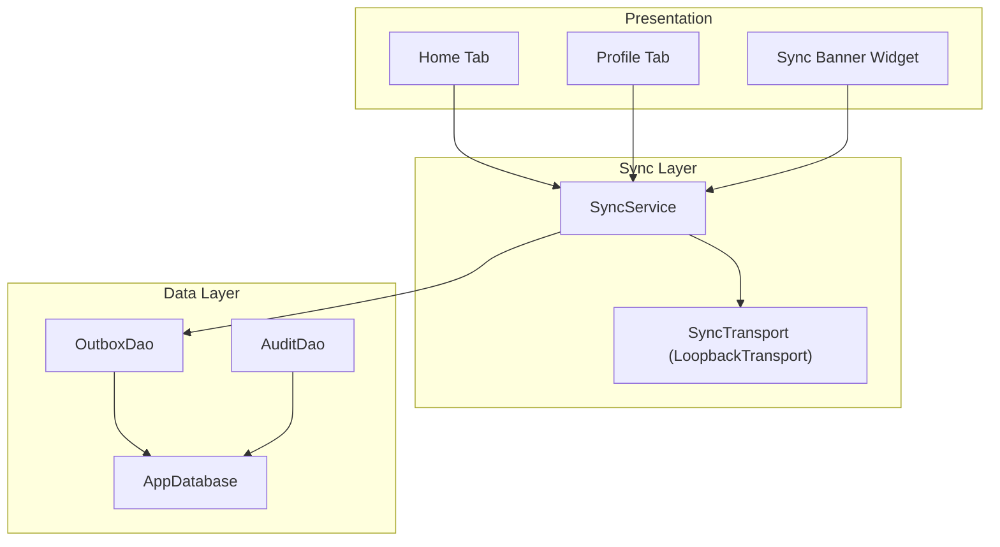
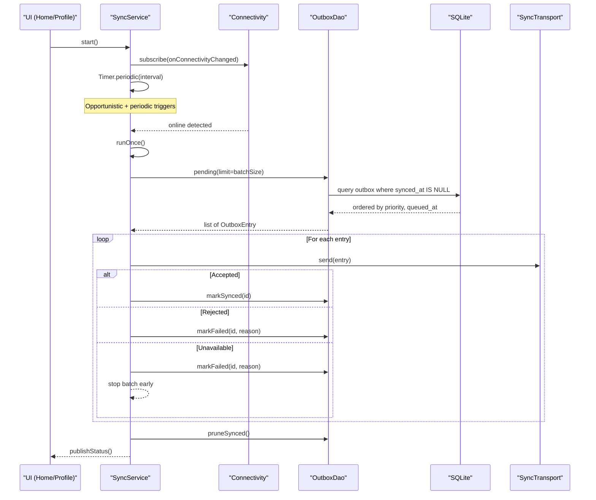
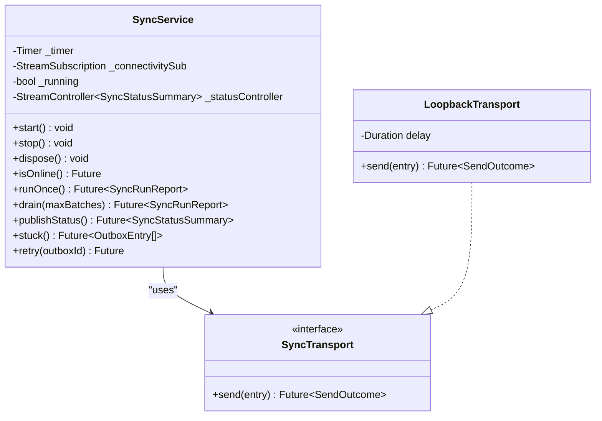
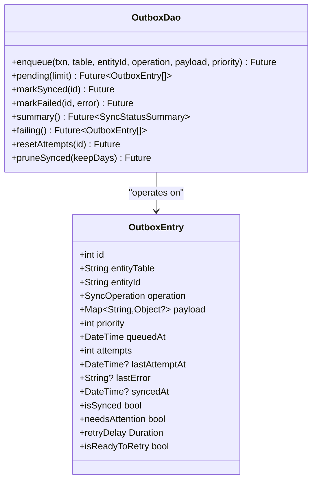
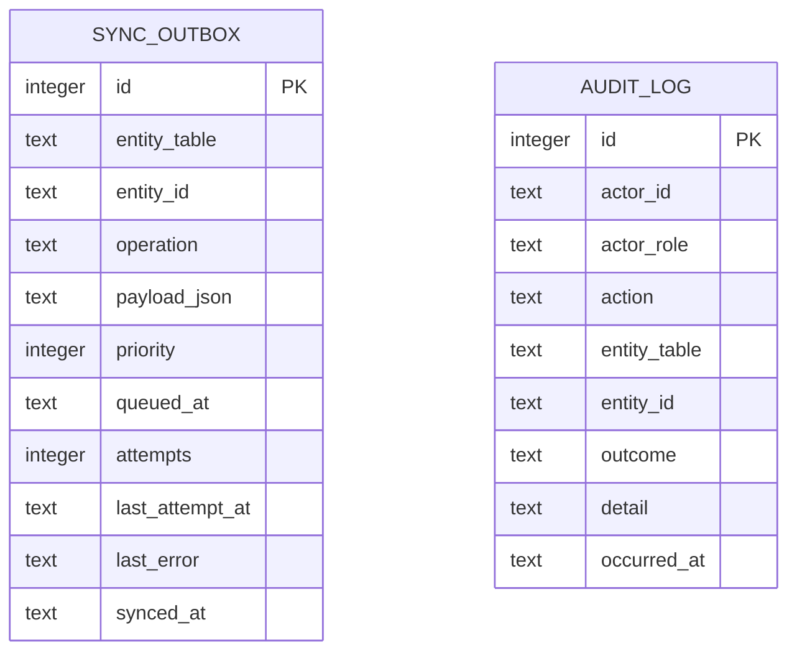
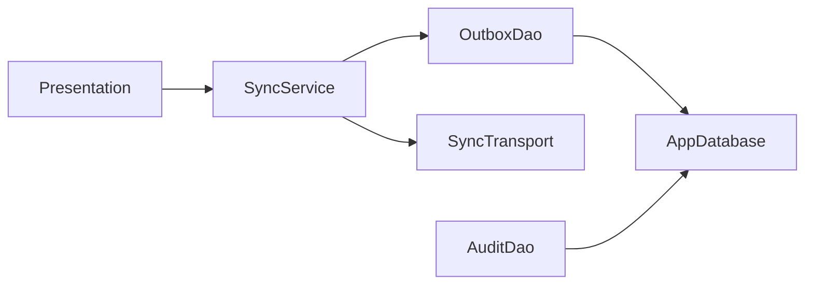

# Offline-First Sync Strategy

<cite>
**Referenced Files in This Document**
- [README.md](file://README.md)
- [pubspec.yaml](file://pubspec.yaml)
- [main.dart](file://lib/main.dart)
- [sync_service.dart](file://lib/data/sync/sync_service.dart)
- [outbox_dao.dart](file://lib/data/local/outbox_dao.dart)
- [app_database.dart](file://lib/data/local/app_database.dart)
- [user_dao.dart](file://lib/data/local/user_dao.dart)
- [ui.dart](file://lib/presentation/shared/ui.dart)
- [profile_tab.dart](file://lib/presentation/fhw/profile_tab.dart)
- [home_tab.dart](file://lib/presentation/fhw/home_tab.dart)
</cite>

## Table of Contents
1. [Introduction](#introduction)
2. [Project Structure](#project-structure)
3. [Core Components](#core-components)
4. [Architecture Overview](#architecture-overview)
5. [Detailed Component Analysis](#detailed-component-analysis)
6. [Dependency Analysis](#dependency-analysis)
7. [Performance Considerations](#performance-considerations)
8. [Troubleshooting Guide](#troubleshooting-guide)
9. [Conclusion](#conclusion)

## Introduction
This document explains CareBridge AI’s offline-first synchronization strategy. The system guarantees that all clinical and administrative data is persisted locally first, with background sync eventually delivering changes to a remote endpoint when connectivity is available. It covers the background sync service architecture, outbox pattern for reliable delivery, change tracking, incremental syncs, network monitoring, retry strategies, error recovery, scheduling, bandwidth optimization, battery efficiency, conflict resolution, merge strategies, and audit logging.

The project is a Flutter application designed for community health workers in low-connectivity environments. SQLite is the source of truth; sync is opportunistic and never blocks user workflows.

**Section sources**
- [README.md:1-18](file://README.md#L1-L18)
- [pubspec.yaml:1-67](file://pubspec.yaml#L1-L67)

## Project Structure
At a high level, the sync subsystem spans three layers:
- Data layer: SQLite schema and DAOs (including the outbox table and audit log).
- Sync layer: Background scheduler, connectivity monitoring, transport abstraction, and batch processing.
- Presentation layer: UI indicators and manual controls for users to monitor and trigger sync.

**Diagram sources**
- [sync_service.dart:96-150](file://lib/data/sync/sync_service.dart#L96-L150)
- [outbox_dao.dart:160-200](file://lib/data/local/outbox_dao.dart#L160-L200)
- [app_database.dart:180-192](file://lib/data/local/app_database.dart#L180-L192)
- [user_dao.dart:382-413](file://lib/data/local/user_dao.dart#L382-L413)
- [profile_tab.dart:38-79](file://lib/presentation/fhw/profile_tab.dart#L38-L79)
- [home_tab.dart:202-251](file://lib/presentation/fhw/home_tab.dart#L202-L251)
- [ui.dart:363-403](file://lib/presentation/shared/ui.dart#L363-L403)

**Section sources**
- [main.dart:1-35](file://lib/main.dart#L1-L35)
- [app_database.dart:180-192](file://lib/data/local/app_database.dart#L180-L192)

## Core Components
- SyncService: Orchestrates background sync, listens to connectivity changes, schedules periodic runs, batches outbox entries, and publishes status.
- OutboxDao: Implements the outbox pattern with priority-based ordering, exponential backoff, failure tracking, and pruning of synced rows.
- SyncTransport: Abstraction for sending outbox entries; includes a LoopbackTransport for testing/demo without a backend.
- AppDatabase: Defines the SQLite schema including the outbox and audit_log tables, and provides database lifecycle utilities.
- AuditDao: Records access and permission events resiliently, ensuring audit failures do not block care delivery.
- Presentation: UI components surface sync status and allow manual drain/retry actions.

Key responsibilities:
- Local persistence as the single source of truth.
- Reliable, prioritized, and incremental delivery via outbox.
- Opportunistic syncing on connectivity availability.
- Robust error handling with backoff and human escalation.
- Auditing for governance and compliance.

**Section sources**
- [sync_service.dart:96-150](file://lib/data/sync/sync_service.dart#L96-L150)
- [outbox_dao.dart:49-115](file://lib/data/local/outbox_dao.dart#L49-L115)
- [app_database.dart:511-555](file://lib/data/local/app_database.dart#L511-L555)
- [user_dao.dart:382-413](file://lib/data/local/user_dao.dart#L382-L413)
- [ui.dart:363-403](file://lib/presentation/shared/ui.dart#L363-L403)

## Architecture Overview
The sync architecture follows an outbox pattern with a clear separation between local persistence and remote delivery.

**Diagram sources**
- [sync_service.dart:122-150](file://lib/data/sync/sync_service.dart#L122-L150)
- [sync_service.dart:156-217](file://lib/data/sync/sync_service.dart#L156-L217)
- [outbox_dao.dart:187-199](file://lib/data/local/outbox_dao.dart#L187-L199)
- [app_database.dart:511-555](file://lib/data/local/app_database.dart#L511-L555)

## Detailed Component Analysis

### SyncService
Responsibilities:
- Start/stop background operations.
- Listen to connectivity changes and schedule periodic runs.
- Execute one batch at a time with re-entrancy guard.
- Publish status summaries to UI streams.
- Provide manual drain and retry capabilities.

Key behaviors:
- Connectivity-driven immediate attempts; periodic fallback.
- Small batches (default 25) to maximize progress in short windows.
- Priority ordering ensures urgent referrals are sent before routine items.
- Exponential backoff per entry prevents battery drain and respects server load.

**Diagram sources**
- [sync_service.dart:96-150](file://lib/data/sync/sync_service.dart#L96-L150)
- [sync_service.dart:156-217](file://lib/data/sync/sync_service.dart#L156-L217)
- [sync_service.dart:223-242](file://lib/data/sync/sync_service.dart#L223-L242)

**Section sources**
- [sync_service.dart:96-150](file://lib/data/sync/sync_service.dart#L96-L150)
- [sync_service.dart:156-217](file://lib/data/sync/sync_service.dart#L156-L217)
- [sync_service.dart:223-242](file://lib/data/sync/sync_service.dart#L223-L242)

### OutboxDao and Outbox Entry Model
Responsibilities:
- Enqueue changes atomically with the business transaction.
- Query pending entries ordered by priority and age.
- Track attempts, last attempt time, last error, and synced timestamp.
- Prune successfully synced rows after retention period.

Key behaviors:
- Priority constants define critical, clinical, routine, and background tiers.
- Exponential backoff capped to avoid excessive retries.
- Human escalation threshold after repeated failures.

**Diagram sources**
- [outbox_dao.dart:49-115](file://lib/data/local/outbox_dao.dart#L49-L115)
- [outbox_dao.dart:160-200](file://lib/data/local/outbox_dao.dart#L160-L200)
- [outbox_dao.dart:201-276](file://lib/data/local/outbox_dao.dart#L201-L276)

**Section sources**
- [outbox_dao.dart:49-115](file://lib/data/local/outbox_dao.dart#L49-L115)
- [outbox_dao.dart:160-200](file://lib/data/local/outbox_dao.dart#L160-L200)
- [outbox_dao.dart:201-276](file://lib/data/local/outbox_dao.dart#L201-L276)

### AppDatabase Schema and Tables
Responsibilities:
- Define and manage the SQLite schema.
- Provide open/close, in-memory test helpers, and clear-all utilities.
- Include outbox and audit_log tables essential for sync and governance.

Key tables:
- outbox: stores pending sync operations with priority, timestamps, and retry metadata.
- audit_log: records actor actions, outcomes, and details for compliance.

**Diagram sources**
- [app_database.dart:511-555](file://lib/data/local/app_database.dart#L511-L555)

**Section sources**
- [app_database.dart:180-192](file://lib/data/local/app_database.dart#L180-L192)
- [app_database.dart:511-555](file://lib/data/local/app_database.dart#L511-L555)

### Audit Logging
Responsibilities:
- Record permission denials and other security-relevant actions.
- Never throw exceptions that could block clinical workflows.
- Provide recent and denied queries for oversight.

Behavior:
- Silent failure on write errors to ensure resilience.
- Structured fields for actor, role, action, entity, outcome, and detail.

**Section sources**
- [user_dao.dart:382-413](file://lib/data/local/user_dao.dart#L382-L413)
- [user_dao.dart:415-456](file://lib/data/local/user_dao.dart#L415-L456)

### Presentation Integration
Responsibilities:
- Display sync status banner with counts and reassurance messages.
- Allow manual draining and retrying stuck entries.
- Show offline queue metrics on home dashboard.

User interactions:
- Manual “drain” button triggers multiple batches until no progress or limit reached.
- Retry resets attempts and immediately attempts to send a specific entry.

**Section sources**
- [ui.dart:363-403](file://lib/presentation/shared/ui.dart#L363-L403)
- [profile_tab.dart:38-79](file://lib/presentation/fhw/profile_tab.dart#L38-L79)
- [home_tab.dart:202-251](file://lib/presentation/fhw/home_tab.dart#L202-L251)

## Dependency Analysis
The sync subsystem has clear boundaries and minimal coupling:
- SyncService depends on OutboxDao and SyncTransport.
- OutboxDao depends on AppDatabase for SQL execution.
- AuditDao depends on AppDatabase but is isolated from sync logic.
- Presentation depends on SyncService for status and actions.

**Diagram sources**
- [sync_service.dart:96-150](file://lib/data/sync/sync_service.dart#L96-L150)
- [outbox_dao.dart:160-200](file://lib/data/local/outbox_dao.dart#L160-L200)
- [user_dao.dart:382-413](file://lib/data/local/user_dao.dart#L382-L413)

**Section sources**
- [sync_service.dart:96-150](file://lib/data/sync/sync_service.dart#L96-L150)
- [outbox_dao.dart:160-200](file://lib/data/local/outbox_dao.dart#L160-L200)
- [user_dao.dart:382-413](file://lib/data/local/user_dao.dart#L382-L413)

## Performance Considerations
- Batch size: Default 25 balances throughput and resilience in short connectivity windows.
- Backoff: Exponential backoff capped at 120 minutes prevents battery drain and reduces server pressure.
- Scheduling: Periodic interval (default 15 minutes) plus immediate connectivity-triggered runs optimize responsiveness.
- Pruning: Synced rows pruned after retention (default 14 days) to conserve storage on shared devices.
- Priority: Critical items (referrals) are sent before routine registrations to prioritize patient safety.
- Re-entrancy guard: Prevents duplicate sends and double-counting during concurrent triggers.

[No sources needed since this section provides general guidance]

## Troubleshooting Guide
Common issues and resolutions:
- No connectivity:
  - Symptom: Pending items remain unsent.
  - Action: Wait for network; app auto-syncs when connectivity returns.
- Network drops mid-batch:
  - Symptom: Some items deferred; batch stops early.
  - Action: Ensure connectivity stabilizes; next run will continue.
- Repeated failures:
  - Symptom: Items marked failing; needs attention flag set.
  - Action: Use manual retry after addressing underlying issue; check last error message.
- Storage growth:
  - Symptom: Outbox grows over time.
  - Action: Prune synced rows; verify successful uploads.
- Manual intervention:
  - Action: Use profile tab “drain” to force multiple batches; use “retry” for stuck entries.

Operational tips:
- Monitor the sync banner for pending and failing counts.
- Review audit logs for permission denials or anomalies.
- Validate connectivity using device settings and carrier coverage.

**Section sources**
- [sync_service.dart:156-217](file://lib/data/sync/sync_service.dart#L156-L217)
- [outbox_dao.dart:201-276](file://lib/data/local/outbox_dao.dart#L201-L276)
- [profile_tab.dart:38-79](file://lib/presentation/fhw/profile_tab.dart#L38-L79)
- [ui.dart:363-403](file://lib/presentation/shared/ui.dart#L363-L403)

## Conclusion
CareBridge AI’s offline-first sync strategy ensures reliable, prioritized, and efficient delivery of clinical and administrative data from local SQLite to remote systems. The outbox pattern, combined with connectivity-aware scheduling, exponential backoff, and robust auditing, provides strong consistency guarantees and operational resilience in low-connectivity environments. The design keeps the app fully functional offline while guaranteeing eventual consistency through background sync.

[No sources needed since this section summarizes without analyzing specific files]