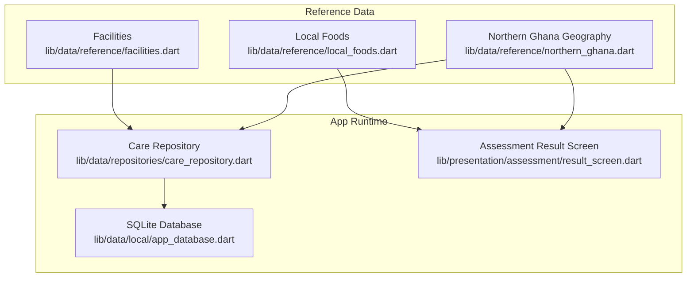
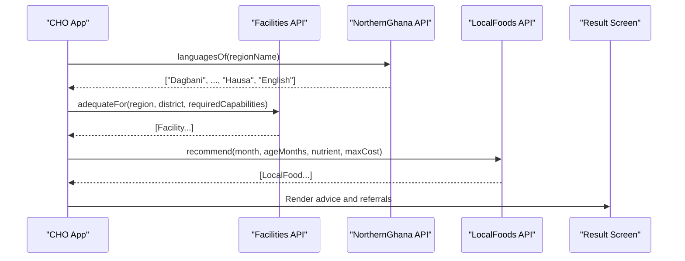
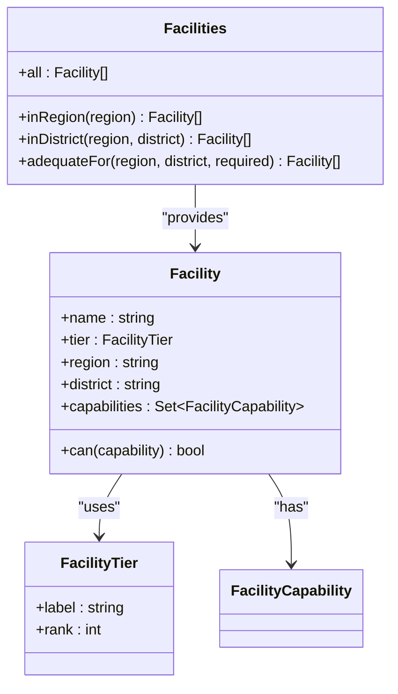
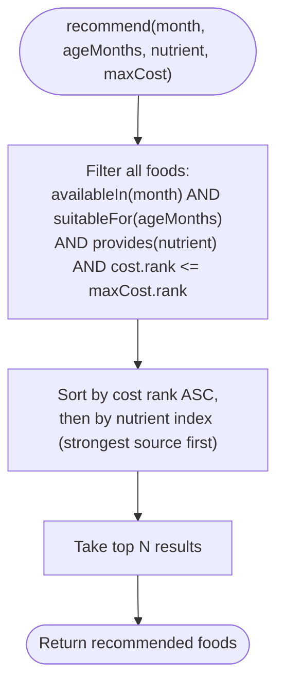
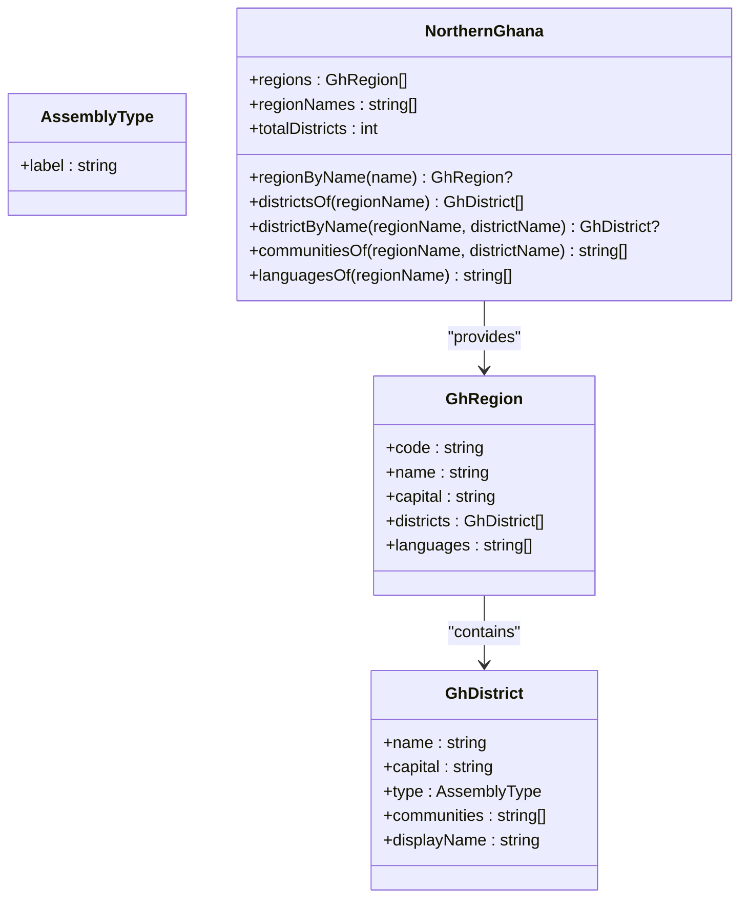
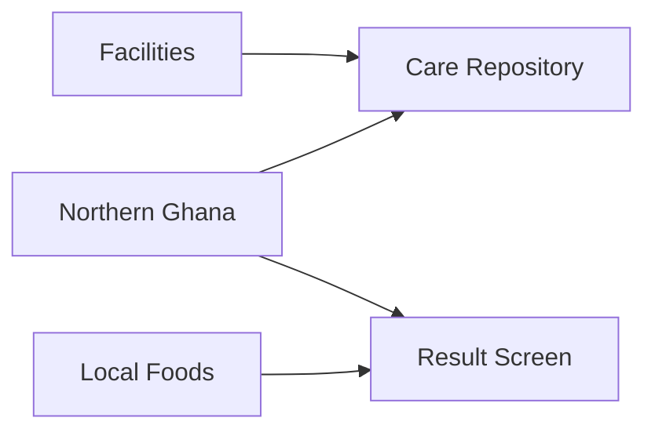

# Reference Data Management

<cite>
**Referenced Files in This Document**
- [facilities.dart](file://lib/data/reference/facilities.dart)
- [local_foods.dart](file://lib/data/reference/local_foods.dart)
- [northern_ghana.dart](file://lib/data/reference/northern_ghana.dart)
- [app_database.dart](file://lib/data/local/app_database.dart)
- [outbox_dao.dart](file://lib/data/local/outbox_dao.dart)
- [care_repository.dart](file://lib/data/repositories/care_repository.dart)
- [result_screen.dart](file://lib/presentation/assessment/result_screen.dart)
- [reference_data_test.dart](file://test/reference_data_test.dart)
- [pubspec.yaml](file://pubspec.yaml)
</cite>

## Table of Contents
1. [Introduction](#introduction)
2. [Project Structure](#project-structure)
3. [Core Components](#core-components)
4. [Architecture Overview](#architecture-overview)
5. [Detailed Component Analysis](#detailed-component-analysis)
6. [Dependency Analysis](#dependency-analysis)
7. [Performance Considerations](#performance-considerations)
8. [Troubleshooting Guide](#troubleshooting-guide)
9. [Conclusion](#conclusion)
10. [Appendices](#appendices)

## Introduction
This document explains how CareBridge AI manages static reference data for:
- Facility information databases (referral hierarchy and capabilities)
- Local food composition tables (seasonality, cost tiers, nutrients, household measures)
- Northern Ghana-specific geographic data (regions, districts, communities, languages)

It covers data loading strategies, caching mechanisms, update procedures, validation, format specifications, localization support, integration with clinical assessments and nutritional calculations, location-based features, versioning, update distribution, fallback behavior, and guidelines for extending datasets while maintaining accuracy.

## Project Structure
Reference data is implemented as immutable, in-memory datasets exposed through static APIs. These are consumed by domain logic and presentation layers without network dependencies. The app’s offline-first storage layer (SQLite) persists user-generated records; reference datasets remain embedded in the application codebase.

**Diagram sources**
- [facilities.dart:1-546](file://lib/data/reference/facilities.dart#L1-L546)
- [local_foods.dart:1-691](file://lib/data/reference/local_foods.dart#L1-L691)
- [northern_ghana.dart:1-956](file://lib/data/reference/northern_ghana.dart#L1-L956)
- [app_database.dart:1-556](file://lib/data/local/app_database.dart#L1-L556)
- [care_repository.dart:1-605](file://lib/data/repositories/care_repository.dart#L1-L605)
- [result_screen.dart:706-750](file://lib/presentation/assessment/result_screen.dart#L706-L750)

**Section sources**
- [pubspec.yaml:1-67](file://pubspec.yaml#L1-L67)

## Core Components
- Facilities dataset: Enumerates facility tiers and capabilities, and provides queries to find adequate facilities by region/district and capability requirements.
- Local foods dataset: Defines food groups, nutrients, cost tiers, and a comprehensive list of local foods with seasonality, affordability, household measures, and safety notes. Includes recommendation and gap-filling algorithms aligned with Minimum Dietary Diversity principles.
- Northern Ghana geography: Encodes regions, districts, assembly types, communities, and language lists used for localization and location-aware features.

Key responsibilities:
- Provide fast, deterministic lookups for referral decisions and nutrition counseling.
- Support localization via local names and language lists per region.
- Enable seasonal and cost-aware recommendations for caregivers.

**Section sources**
- [facilities.dart:1-546](file://lib/data/reference/facilities.dart#L1-L546)
- [local_foods.dart:1-691](file://lib/data/reference/local_foods.dart#L1-L691)
- [northern_ghana.dart:1-956](file://lib/data/reference/northern_ghana.dart#L1-L956)

## Architecture Overview
Reference data is loaded at app startup into memory as static constants. No runtime parsing or I/O is required. Consumers call static methods on the reference modules. Clinical workflows use these datasets to:
- Determine appropriate referral facilities based on required capabilities and proximity heuristics.
- Generate nutrition advice tailored to seasonality, age appropriateness, and affordability.
- Populate location pickers and localize audio guidance using regional language lists.

**Diagram sources**
- [northern_ghana.dart:84-90](file://lib/data/reference/northern_ghana.dart#L84-L90)
- [facilities.dart:524-546](file://lib/data/reference/facilities.dart#L524-L546)
- [local_foods.dart:633-660](file://lib/data/reference/local_foods.dart#L633-L660)
- [result_screen.dart:706-750](file://lib/presentation/assessment/result_screen.dart#L706-L750)

## Detailed Component Analysis

### Facilities Dataset
- Data model: Facility objects include name, tier, region, district, and capabilities. Tiers reflect Ghana’s referral ladder from CHPS compound to teaching hospital. Capabilities indicate clinical services such as caesarean delivery, blood transfusion, newborn care, therapeutic feeding, OTP, delivery, laboratory, and ambulance.
- Query surface:
  - inRegion(region): returns facilities within a region.
  - inDistrict(region, district): returns facilities within a district.
  - adequateFor(region, district, required): returns sorted options preferring lowest adequate tier and local district first.

**Diagram sources**
- [facilities.dart:12-55](file://lib/data/reference/facilities.dart#L12-L55)
- [facilities.dart:57-546](file://lib/data/reference/facilities.dart#L57-L546)

Integration points:
- Referral decision flows use adequateFor to select the nearest adequate facility, prioritizing lower-tier options to avoid over-referral.
- Capability sets are defined per tier type (e.g., CEMOC, district, health centre).

Validation and constraints:
- Tier ranking ensures consistent sorting.
- Capability checks are exact matches against predefined enums.

Localization:
- Facility names are English strings; no local names are stored here.

Versioning and updates:
- Static const list; updates require code changes and app release.

Fallbacks:
- If no adequate facility is found locally, the query falls back to the broader region.

**Section sources**
- [facilities.dart:1-546](file://lib/data/reference/facilities.dart#L1-L546)

### Local Foods Dataset
- Data model: LocalFood includes name, group, nutrients, monthsAvailable, cost, householdMeasure, minAgeMonths, localNames map, preparation notes, and caution statements.
- Enums:
  - FoodGroup aligns with WHO/UNICEF MDD categories.
  - Nutrient captures key micronutrients relevant to maternal and child survival.
  - CostTier ranks affordability from free/gathered to expensive.
- Seasonal context: NorthernGhanaSeason defines lean, harvest, rainy, and dry seasons with plain-language counselling notes.

**Diagram sources**
- [local_foods.dart:633-660](file://lib/data/reference/local_foods.dart#L633-L660)

Integration points:
- Presentation layer displays local names when available and shows household measures for actionable advice.
- Nutrition engines can use recommend and fillDiversityGaps to generate MDD-aligned suggestions.

Validation and constraints:
- Months are integers 1–12; availability is checked via set membership.
- Age suitability enforced by minAgeMonths.

Localization:
- localNames map supports multiple local languages per food.
- NorthernGhana.languagesOf ensures English and Hausa are always included.

Versioning and updates:
- Static const list; updates require code changes and app release.

Fallbacks:
- If no foods match criteria, empty list returned; callers should handle gracefully.

**Section sources**
- [local_foods.dart:1-691](file://lib/data/reference/local_foods.dart#L1-L691)
- [result_screen.dart:706-750](file://lib/presentation/assessment/result_screen.dart#L706-L750)

### Northern Ghana Geographic Data
- Data model: GhRegion and GhDistrict encode administrative boundaries, capitals, assembly types, communities, and languages.
- Query surface:
  - regionNames, regionByName, districtsOf, districtByName, communitiesOf.
  - languagesOf(regionName) returns region languages plus English and Hausa.

**Diagram sources**
- [northern_ghana.dart:17-90](file://lib/data/reference/northern_ghana.dart#L17-L90)
- [northern_ghana.dart:60-94](file://lib/data/reference/northern_ghana.dart#L60-L94)

Integration points:
- Location-based features use districts and communities to seed pickers and filter content.
- Localization uses languagesOf to present audio guidance in appropriate languages.

Validation and constraints:
- Region and district names must match exactly; queries return empty lists if not found.

Versioning and updates:
- Static const structures; updates require code changes and app release.

Fallbacks:
- Missing region/district returns empty lists; callers must handle gracefully.

**Section sources**
- [northern_ghana.dart:1-956](file://lib/data/reference/northern_ghana.dart#L1-L956)
- [reference_data_test.dart:40-58](file://test/reference_data_test.dart#L40-L58)

## Dependency Analysis
Reference modules are self-contained and do not depend on each other except through shared enums where applicable. Consumers include:
- Care repository: Uses geography for scoping and facilities for referral decisions.
- Presentation layer: Uses local foods for nutrition advice display.

**Diagram sources**
- [facilities.dart:1-546](file://lib/data/reference/facilities.dart#L1-L546)
- [northern_ghana.dart:1-956](file://lib/data/reference/northern_ghana.dart#L1-L956)
- [local_foods.dart:1-691](file://lib/data/reference/local_foods.dart#L1-L691)
- [care_repository.dart:1-605](file://lib/data/repositories/care_repository.dart#L1-L605)
- [result_screen.dart:706-750](file://lib/presentation/assessment/result_screen.dart#L706-L750)

**Section sources**
- [care_repository.dart:1-605](file://lib/data/repositories/care_repository.dart#L1-L605)

## Performance Considerations
- In-memory datasets: All reference data is loaded once as static constants, providing O(1) access to lists and O(n) filtering operations that are lightweight given dataset size.
- Sorting and filtering: adequateFor sorts by tier rank; recommend sorts by cost and nutrient strength. Complexity is linear in dataset size, acceptable for current scale.
- Memory footprint: Small constant arrays and maps; negligible impact on app memory.

[No sources needed since this section provides general guidance]

## Troubleshooting Guide
Common issues and resolutions:
- No adequate facility found: Ensure required capabilities are correctly specified; verify region and district names match dataset entries.
- Empty food recommendations: Check month, age, nutrient, and maxCost parameters; confirm availability and suitability flags.
- Language list missing expected languages: Confirm region name matches dataset; languagesOf always appends English and Hausa.

Validation tests:
- Tests assert community lists are non-empty for valid districts and empty for invalid ones.
- Tests assert languagesOf includes English and Hausa for all regions and that Dagbani leads in the Northern Region.

**Section sources**
- [reference_data_test.dart:40-58](file://test/reference_data_test.dart#L40-L58)

## Conclusion
CareBridge AI’s reference data management relies on immutable, in-memory datasets for facilities, local foods, and Northern Ghana geography. These datasets enable offline-first functionality, precise referral decisions, and culturally appropriate nutrition counseling. Updates require code-level changes and releases. Consumers integrate via simple static APIs, ensuring reliability and performance in low-connectivity environments.

[No sources needed since this section summarizes without analyzing specific files]

## Appendices

### Data Loading Strategy and Caching
- Loading strategy: Static const lists and maps are compiled into the app binary; no runtime parsing or I/O is performed.
- Caching mechanism: In-memory constants act as caches; no additional caching layer is needed.

**Section sources**
- [facilities.dart:84-514](file://lib/data/reference/facilities.dart#L84-L514)
- [local_foods.dart:175-619](file://lib/data/reference/local_foods.dart#L175-L619)
- [northern_ghana.dart:61-94](file://lib/data/reference/northern_ghana.dart#L61-L94)

### Update Procedures and Versioning
- Versioning: Application version is managed in pubspec.yaml; reference datasets are part of the codebase and updated via code changes.
- Distribution: Updates are distributed through standard app releases; no runtime update mechanism for reference data is implemented.

**Section sources**
- [pubspec.yaml:1-10](file://pubspec.yaml#L1-L10)

### Data Validation and Format Specifications
- Facilities:
  - Tier labels and ranks are enumerated.
  - Capabilities are enumerated sets.
  - Region and district fields are strings matching dataset values.
- Local foods:
  - Months are integers 1–12.
  - Nutrients are enumerated.
  - Cost tiers are enumerated with numeric ranks.
  - Household measures are human-readable strings.
- Northern Ghana geography:
  - Regions and districts have strict naming conventions.
  - Languages are lists of strings; languagesOf ensures inclusion of English and Hausa.

**Section sources**
- [facilities.dart:12-55](file://lib/data/reference/facilities.dart#L12-L55)
- [local_foods.dart:23-74](file://lib/data/reference/local_foods.dart#L23-L74)
- [northern_ghana.dart:17-42](file://lib/data/reference/northern_ghana.dart#L17-L42)

### Localization Support
- Local food names: Map of language to local name per food.
- Regional languages: languagesOf returns region-specific languages plus English and Hausa.
- Presentation: Result screen renders local names when available.

**Section sources**
- [local_foods.dart:109-111](file://lib/data/reference/local_foods.dart#L109-L111)
- [northern_ghana.dart:84-90](file://lib/data/reference/northern_ghana.dart#L84-L90)
- [result_screen.dart:712-714](file://lib/presentation/assessment/result_screen.dart#L712-L714)

### Integration with Clinical Assessments and Nutritional Calculations
- Referrals: adequateFor selects facilities based on required capabilities and tier ranking.
- Nutrition: recommend and fillDiversityGaps produce actionable, seasonally appropriate advice aligned with MDD.
- Geography: District and community lists seed location pickers and filter content.

**Section sources**
- [facilities.dart:524-546](file://lib/data/reference/facilities.dart#L524-L546)
- [local_foods.dart:633-686](file://lib/data/reference/local_foods.dart#L633-L686)
- [northern_ghana.dart:75-90](file://lib/data/reference/northern_ghana.dart#L75-L90)

### Offline-First Storage and Sync Outbox
- SQLite database persists user-generated records; reference data remains embedded.
- Sync outbox ensures offline writes are queued and synchronized when connectivity is available.

**Section sources**
- [app_database.dart:1-556](file://lib/data/local/app_database.dart#L1-L556)
- [outbox_dao.dart:1-33](file://lib/data/local/outbox_dao.dart#L1-L33)

### Guidelines for Extending Reference Datasets
- Add new facilities: Extend the all list with Facility entries, ensuring correct tier and capabilities.
- Add new foods: Extend the all list with LocalFood entries, specifying seasonality, cost, and local names.
- Add new regions/districts: Extend NorthernGhana.regions with GhRegion and GhDistrict entries.
- Maintain consistency: Use existing enums and naming conventions; ensure queries remain accurate.

**Section sources**
- [facilities.dart:84-514](file://lib/data/reference/facilities.dart#L84-L514)
- [local_foods.dart:175-619](file://lib/data/reference/local_foods.dart#L175-L619)
- [northern_ghana.dart:97-956](file://lib/data/reference/northern_ghana.dart#L97-L956)