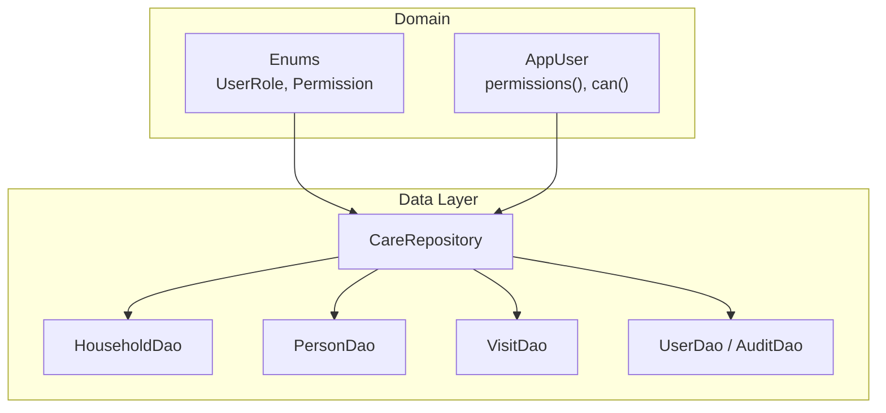
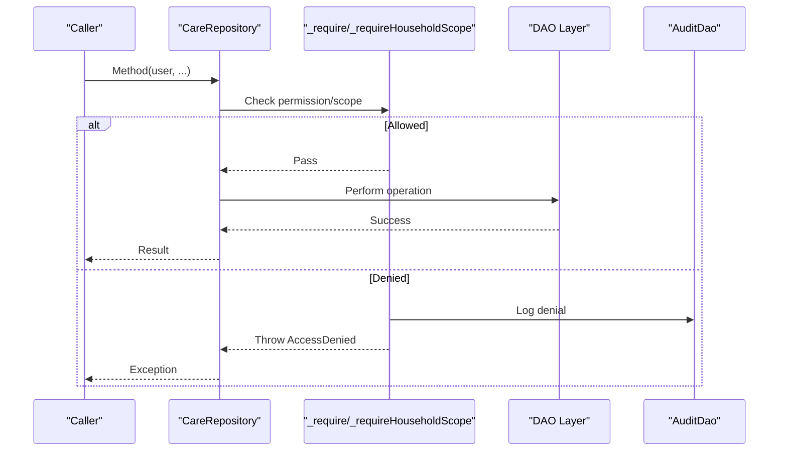
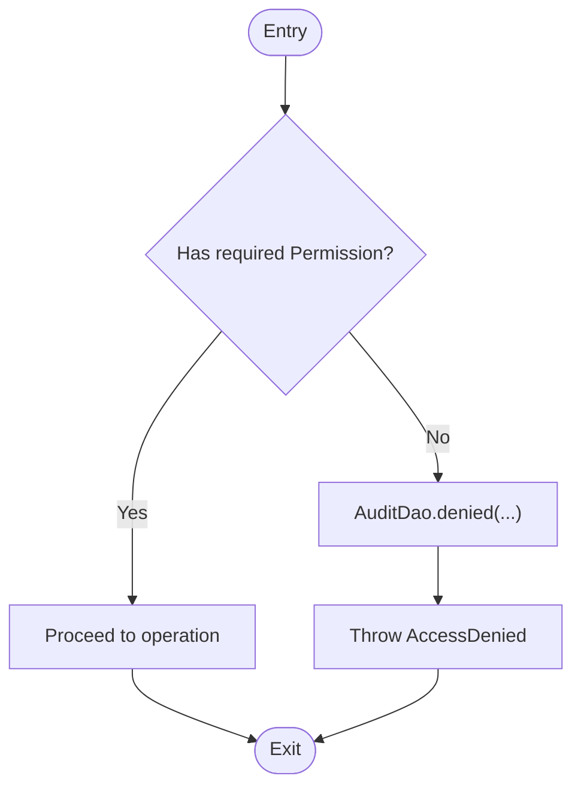
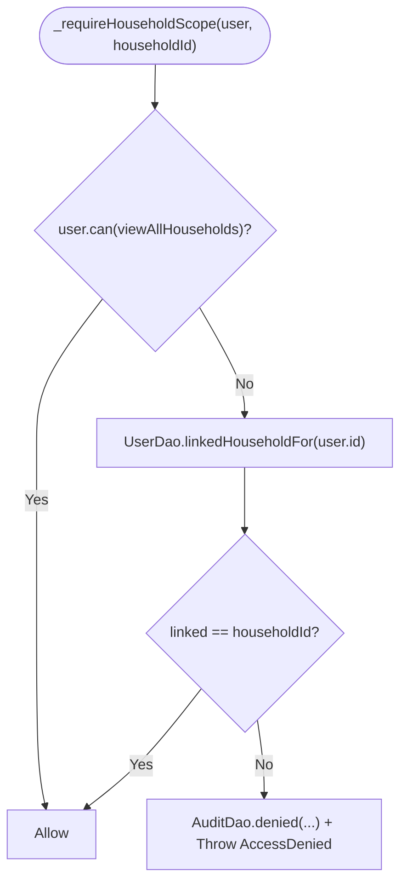
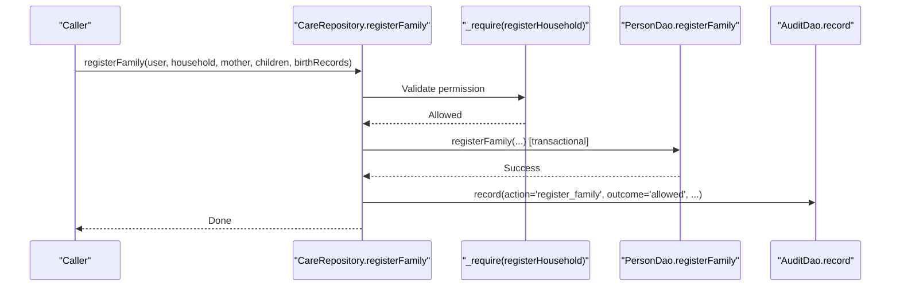
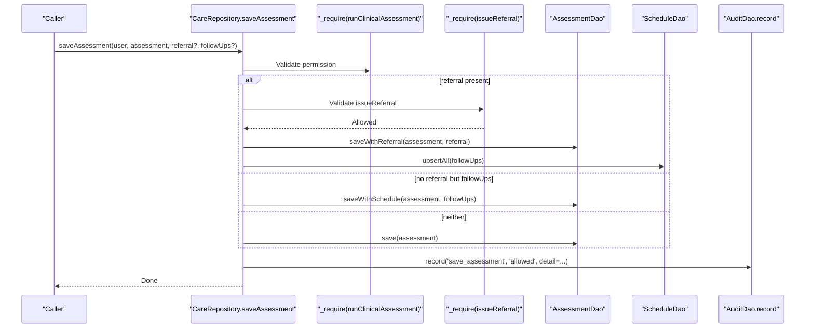
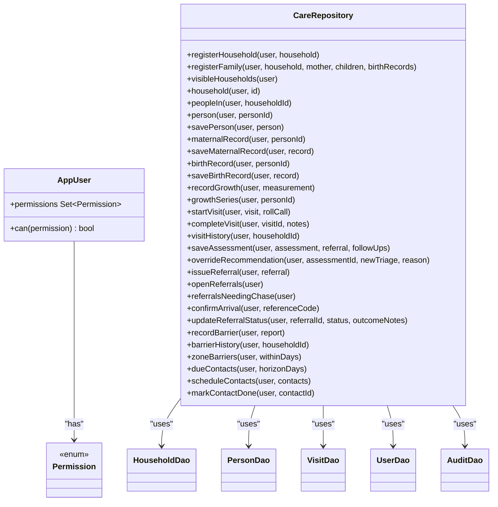

# Care Repository

<cite>
**Referenced Files in This Document**
- [care_repository.dart](file://lib/data/repositories/care_repository.dart)
- [enums.dart](file://lib/domain/enums.dart)
- [core.dart](file://lib/domain/entities/core.dart)
- [user_dao.dart](file://lib/data/local/user_dao.dart)
- [household_dao.dart](file://lib/data/local/household_dao.dart)
- [visit_dao.dart](file://lib/data/local/visit_dao.dart)
- [rbac_test.dart](file://test/rbac_test.dart)
</cite>

## Table of Contents
1. [Introduction](#introduction)
2. [Project Structure](#project-structure)
3. [Core Components](#core-components)
4. [Architecture Overview](#architecture-overview)
5. [Detailed Component Analysis](#detailed-component-analysis)
6. [Dependency Analysis](#dependency-analysis)
7. [Performance Considerations](#performance-considerations)
8. [Troubleshooting Guide](#troubleshooting-guide)
9. [Conclusion](#conclusion)

## Introduction
CareRepository is the single, role-enforced gateway to all data operations in the application. It centralizes permission checks and household scoping so that UI code cannot bypass access control. Every method accepts an AppUser as its first argument and validates permissions before performing any DAO operation. The repository enforces two key mechanisms:
- Permission-based gating via _require for explicit capabilities (e.g., registerHousehold, recordClinicalVitals).
- Household/person scoping via _requireHouseholdScope and _requirePersonScope to ensure caregivers can only access their own family’s data.

The repository also records audit events for denied attempts and successful sensitive actions, and it orchestrates atomic operations such as family registration to prevent partial writes.

**Section sources**
- [care_repository.dart:1-26](file://lib/data/repositories/care_repository.dart#L1-L26)

## Project Structure
CareRepository sits in the data layer and delegates persistence to DAOs in the local storage layer. Domain entities and enums define roles, permissions, and clinical concepts. The repository does not expose DAOs directly; instead, it exposes use-case methods that encapsulate both business rules and security checks.

**Diagram sources**
- [care_repository.dart:28-33](file://lib/data/repositories/care_repository.dart#L28-L33)
- [enums.dart:10-66](file://lib/domain/enums.dart#L10-L66)
- [core.dart:6-41](file://lib/domain/entities/core.dart#L6-L41)

**Section sources**
- [care_repository.dart:28-33](file://lib/data/repositories/care_repository.dart#L28-L33)
- [enums.dart:10-66](file://lib/domain/enums.dart#L10-L66)
- [core.dart:6-41](file://lib/domain/entities/core.dart#L6-L41)

## Core Components
- AccessDenied exception: A deliberate exception type for permission failures to avoid accidental suppression.
- Permission guards:
  - _require: Enforces a specific Permission on the acting user; logs denial and throws AccessDenied.
  - _requireHouseholdScope: Ensures a caregiver can only access their linked household; FHW bypasses this check.
  - _requirePersonScope: Resolves a person’s household and applies household scope enforcement.
- Atomic operations:
  - registerFamily: Persists mother, children, and birth records atomically to avoid partial registrations.
- Audit logging:
  - AuditDao.record and AuditDao.denied capture allowed/denied actions with actor, role, entity context, and details.

**Section sources**
- [care_repository.dart:40-53](file://lib/data/repositories/care_repository.dart#L40-L53)
- [care_repository.dart:63-79](file://lib/data/repositories/care_repository.dart#L63-L79)
- [care_repository.dart:86-110](file://lib/data/repositories/care_repository.dart#L86-L110)
- [care_repository.dart:115-126](file://lib/data/repositories/care_repository.dart#L115-L126)
- [care_repository.dart:148-174](file://lib/data/repositories/care_repository.dart#L148-L174)
- [user_dao.dart:382-433](file://lib/data/local/user_dao.dart#L382-L433)

## Architecture Overview
The repository acts as a secure facade over DAOs. It uses capability-based permissions derived from UserRole and enforces household scoping based on user linkage. Denials are always audited. Sensitive write paths are wrapped in transactions or coordinated across DAOs to maintain consistency.

**Diagram sources**
- [care_repository.dart:63-79](file://lib/data/repositories/care_repository.dart#L63-L79)
- [care_repository.dart:86-110](file://lib/data/repositories/care_repository.dart#L86-L110)
- [user_dao.dart:382-433](file://lib/data/local/user_dao.dart#L382-L433)

## Detailed Component Analysis

### Permission Guards
- _require: Validates a specific Permission against the user’s capability set. On failure, logs a denial and throws AccessDenied.
- _requireHouseholdScope: Allows FHW to pass through; otherwise resolves the caregiver’s linked household and compares it to the requested householdId.
- _requirePersonScope: Looks up the person’s household and delegates to _requireHouseholdScope.

**Diagram sources**
- [care_repository.dart:63-79](file://lib/data/repositories/care_repository.dart#L63-L79)
- [user_dao.dart:382-433](file://lib/data/local/user_dao.dart#L382-L433)

**Section sources**
- [care_repository.dart:63-79](file://lib/data/repositories/care_repository.dart#L63-L79)
- [care_repository.dart:86-110](file://lib/data/repositories/care_repository.dart#L86-L110)
- [care_repository.dart:115-126](file://lib/data/repositories/care_repository.dart#L115-L126)

### Household Scoping for Caregivers vs Health Workers
- FHW: Has viewAllHouseholds; scope checks are bypassed.
- Caregiver: Limited to one linked household at registration; any attempt to access another household results in a denial and audit log entry.

**Diagram sources**
- [care_repository.dart:86-110](file://lib/data/repositories/care_repository.dart#L86-L110)
- [user_dao.dart:242-252](file://lib/data/local/user_dao.dart#L242-L252)

**Section sources**
- [care_repository.dart:86-110](file://lib/data/repositories/care_repository.dart#L86-L110)
- [user_dao.dart:242-252](file://lib/data/local/user_dao.dart#L242-L252)

### Atomic Family Registration
registerFamily ensures that mother, children, and birth records are persisted together in a single transaction to prevent partial states (e.g., twin births where one child is missing).

**Diagram sources**
- [care_repository.dart:148-174](file://lib/data/repositories/care_repository.dart#L148-L174)
- [household_dao.dart:191-200](file://lib/data/local/household_dao.dart#L191-L200)
- [user_dao.dart:382-413](file://lib/data/local/user_dao.dart#L382-L413)

**Section sources**
- [care_repository.dart:148-174](file://lib/data/repositories/care_repository.dart#L148-L174)
- [household_dao.dart:191-200](file://lib/data/local/household_dao.dart#L191-L200)

### Clinical Assessments and Referrals
saveAssessment bundles assessment, optional referral, and follow-up scheduling into a single operation, ensuring urgent decisions persist with their downstream actions. overrideRecommendation requires a minimum reason length and is gated by a special permission reserved for health workers.

**Diagram sources**
- [care_repository.dart:350-391](file://lib/data/repositories/care_repository.dart#L350-L391)

**Section sources**
- [care_repository.dart:350-391](file://lib/data/repositories/care_repository.dart#L350-L391)

### Role-Based Examples: CHO vs Caregiver
- CHO (Frontline Health Worker):
  - Can register households and families, run clinical assessments, record vitals, issue referrals, confirm arrivals, override AI recommendations, view community insights, plan routes, export records.
  - Bypasses household scoping due to viewAllHouseholds.
- Caregiver:
  - Can view own family only, run caregiver triage, and record barriers.
  - Cannot perform clinical writes or access other households.

These behaviors are enforced by the Permission sets and scoped checks in the repository.

**Section sources**
- [enums.dart:44-66](file://lib/domain/enums.dart#L44-L66)
- [rbac_test.dart:21-53](file://test/rbac_test.dart#L21-L53)
- [rbac_test.dart:55-81](file://test/rbac_test.dart#L55-L81)

### Error Handling Patterns
- AccessDenied exceptions are thrown for all permission failures; callers must handle them explicitly.
- AuditDao.denied is invoked before throwing to ensure every denial is recorded.
- Some operations add extra validation (e.g., overrideRecommendation requires a minimum-length reason), returning AccessDenied with a contextual message.

**Section sources**
- [care_repository.dart:40-53](file://lib/data/repositories/care_repository.dart#L40-L53)
- [care_repository.dart:63-79](file://lib/data/repositories/care_repository.dart#L63-L79)
- [care_repository.dart:413-441](file://lib/data/repositories/care_repository.dart#L413-L441)
- [user_dao.dart:382-433](file://lib/data/local/user_dao.dart#L382-L433)

### Best Practices for Extending the Permission Model
- Add new Permission values in the enum and assign them to the appropriate role sets.
- Gate new repository methods with _require using the new Permission.
- For household-scoped features, use _requireHouseholdScope or _requirePersonScope consistently.
- Always audit denials via AuditDao.denied; record successes for sensitive operations via AuditDao.record.
- Keep UI logic free of permission checks; rely on the repository to enforce constraints.

**Section sources**
- [enums.dart:29-66](file://lib/domain/enums.dart#L29-L66)
- [care_repository.dart:63-79](file://lib/data/repositories/care_repository.dart#L63-L79)
- [care_repository.dart:86-110](file://lib/data/repositories/care_repository.dart#L86-L110)
- [user_dao.dart:382-433](file://lib/data/local/user_dao.dart#L382-L433)

## Dependency Analysis
CareRepository depends on domain enums and entities for roles and permissions, and on DAOs for data operations. It centralizes policy and delegates execution.

**Diagram sources**
- [care_repository.dart:55-604](file://lib/data/repositories/care_repository.dart#L55-L604)
- [enums.dart:29-66](file://lib/domain/enums.dart#L29-L66)
- [core.dart:6-41](file://lib/domain/entities/core.dart#L6-L41)

**Section sources**
- [care_repository.dart:55-604](file://lib/data/repositories/care_repository.dart#L55-L604)
- [enums.dart:29-66](file://lib/domain/enums.dart#L29-L66)
- [core.dart:6-41](file://lib/domain/entities/core.dart#L6-L41)

## Performance Considerations
- Scoped queries: Caregiver views are restricted to a single household, reducing result sets and query complexity.
- Separate queries per role: visibleHouseholds uses different DAO methods for FHW vs caregiver to avoid ad-hoc filtering.
- Transactional writes: Family registration and related updates are performed in a single transaction to minimize round-trips and ensure consistency.
- Audit logging is fire-and-forget: AuditDao.record swallows errors to avoid impacting care delivery performance.

[No sources needed since this section provides general guidance]

## Troubleshooting Guide
Common issues and how to diagnose them:
- AccessDenied exceptions: Indicates a missing permission or scope violation. Check the action and permission passed to _require or the household/person scope being accessed.
- Denied audit entries: Use AuditDao.denials to review recent denials and identify patterns or misconfigurations.
- Partial registrations: Ensure you use registerFamily rather than individual saves to avoid inconsistent state during multi-record writes.
- Overriding AI recommendations: Ensure the reason meets the minimum length requirement; otherwise, AccessDenied will be thrown.

**Section sources**
- [care_repository.dart:40-53](file://lib/data/repositories/care_repository.dart#L40-L53)
- [user_dao.dart:445-456](file://lib/data/local/user_dao.dart#L445-L456)
- [care_repository.dart:148-174](file://lib/data/repositories/care_repository.dart#L148-L174)
- [care_repository.dart:413-441](file://lib/data/repositories/care_repository.dart#L413-L441)

## Conclusion
CareRepository provides a robust, centralized enforcement point for role-based access control and household scoping. By routing all data operations through guarded methods, it prevents accidental exposure of sensitive health data. Combined with comprehensive audit logging and atomic operations, it ensures both security and reliability in real-world field conditions. Extending the system involves adding permissions, guarding new methods, and consistently applying scoping checks.

[No sources needed since this section summarizes without analyzing specific files]