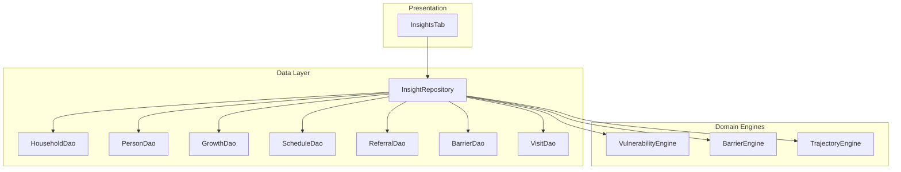
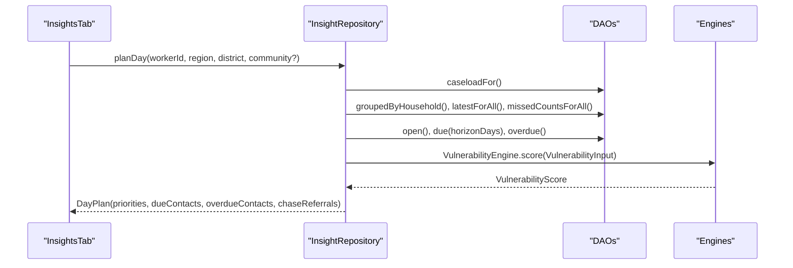
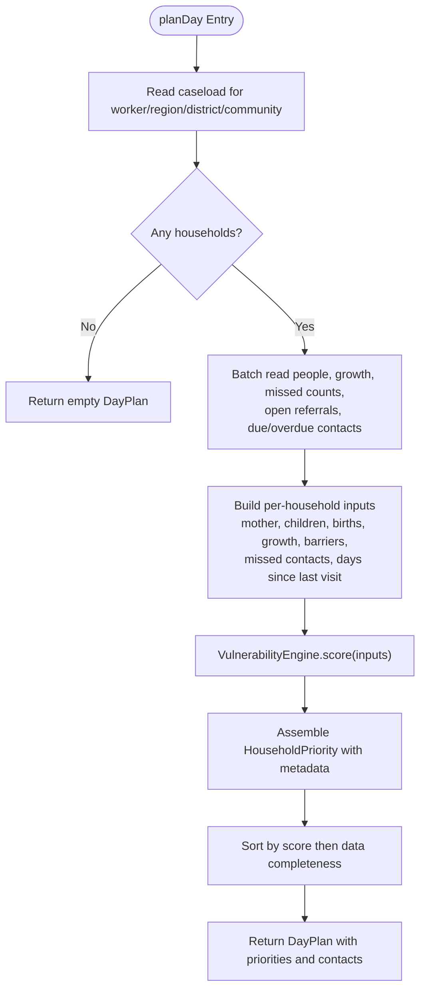
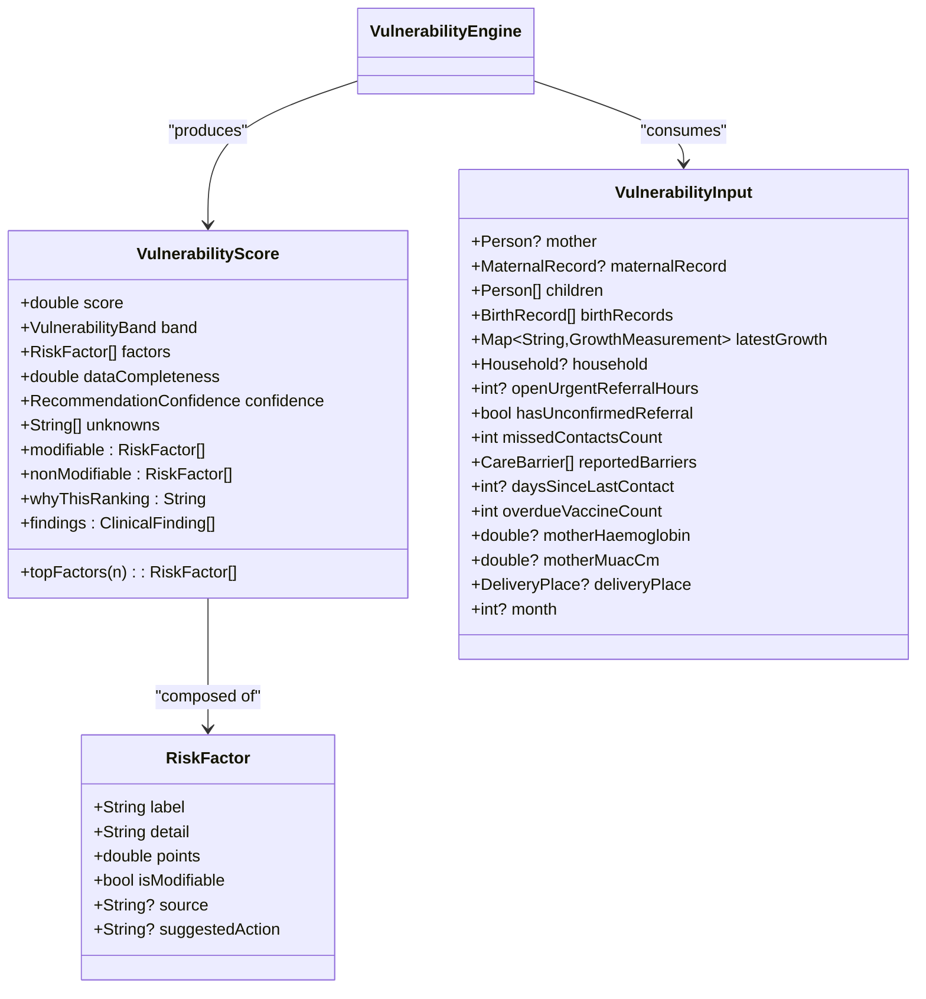
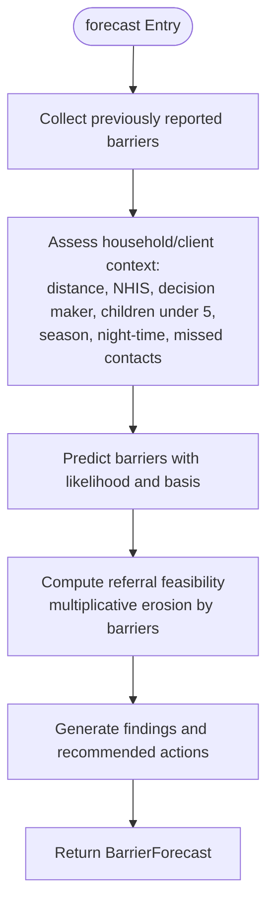
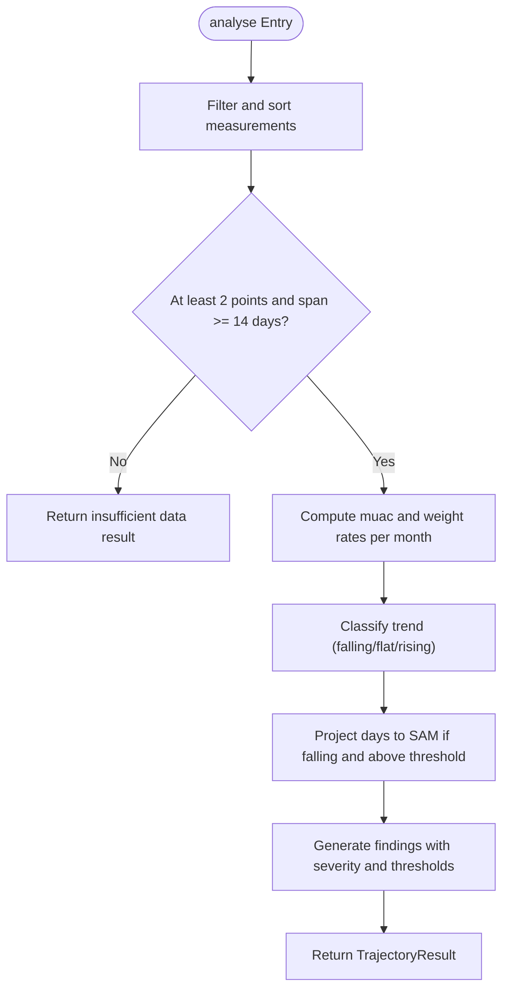
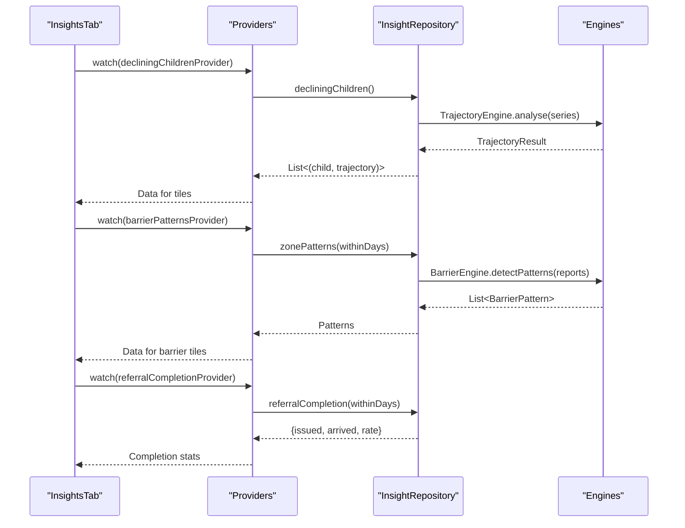
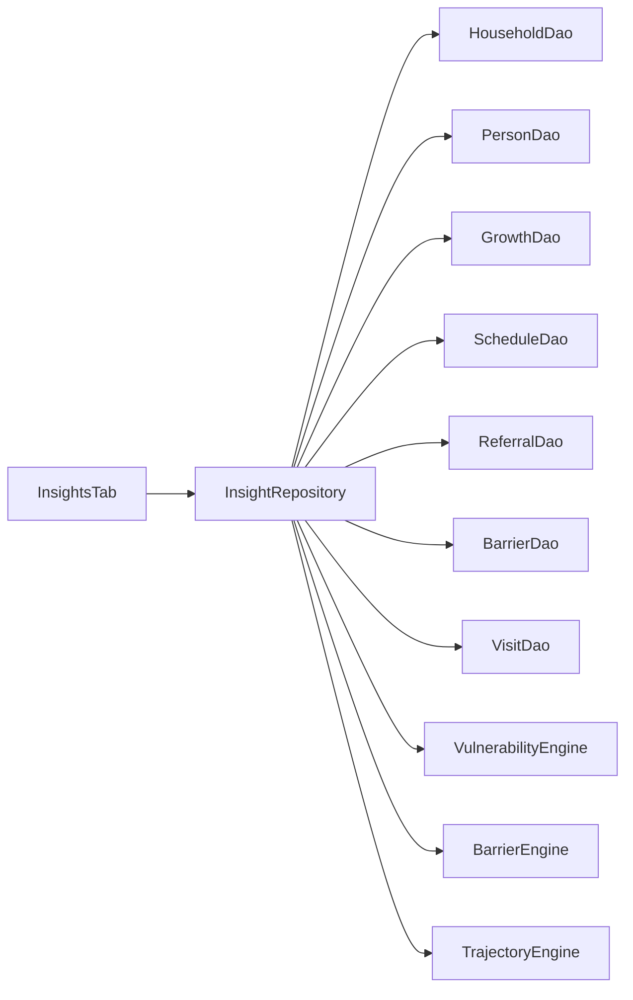

# Insight Repository

<cite>
**Referenced Files in This Document**
- [insight_repository.dart](file://lib/data/repositories/insight_repository.dart)
- [vulnerability_engine.dart](file://lib/domain/engines/vulnerability_engine.dart)
- [barrier_engine.dart](file://lib/domain/engines/barrier_engine.dart)
- [trajectory_engine.dart](file://lib/domain/engines/trajectory_engine.dart)
- [insights_tab.dart](file://lib/presentation/fhw/insights_tab.dart)
</cite>

## Table of Contents
1. [Introduction](#introduction)
2. [Project Structure](#project-structure)
3. [Core Components](#core-components)
4. [Architecture Overview](#architecture-overview)
5. [Detailed Component Analysis](#detailed-component-analysis)
6. [Dependency Analysis](#dependency-analysis)
7. [Performance Considerations](#performance-considerations)
8. [Troubleshooting Guide](#troubleshooting-guide)
9. [Conclusion](#conclusion)
10. [Appendices](#appendices)

## Introduction
This document explains the InsightRepository and its integration with AI engines to deliver analytics, scoring, and predictive analysis for community health workflows. It covers how data is aggregated from multiple sources to compute vulnerability scores, barrier predictions, and growth trajectory insights; how these insights are presented to drive decision-making; and how performance is optimized for low-end devices.

## Project Structure
The InsightRepository resides in the data layer and orchestrates reads from local DAOs while delegating analytical logic to domain engines. The presentation layer consumes these insights via providers and renders actionable views.

**Diagram sources**
- [insight_repository.dart:120-268](file://lib/data/repositories/insight_repository.dart#L120-L268)
- [insights_tab.dart:32-133](file://lib/presentation/fhw/insights_tab.dart#L32-L133)

**Section sources**
- [insight_repository.dart:1-433](file://lib/data/repositories/insight_repository.dart#L1-L433)
- [insights_tab.dart:1-407](file://lib/presentation/fhw/insights_tab.dart#L1-L407)

## Core Components
- HouseholdPriority: A scored household record enriched with members, maternal context, visit recency, open referrals, and next contact due. Used to build a ranked day plan.
- DayPlan: Aggregates priorities, due/overdue contacts, urgent chase referrals, and a human-readable headline to guide field workers.
- InsightRepository: Orchestrates batched data retrieval and computes insights using domain engines. Exposes methods for planning, scoring, trajectory analysis, barrier forecasting, zone patterns, and referral completion metrics.
- VulnerabilityEngine: Computes an additive, explainable vulnerability score with modifiable/non-modifiable factors, confidence, and top drivers.
- BarrierEngine: Predicts likely barriers to referral completion and aggregates barrier reports into interpretable patterns with escalation guidance.
- TrajectoryEngine: Analyzes growth series to detect deteriorating trends and projects time-to-SAM thresholds based on MUAC and weight rates.

Key responsibilities:
- Aggregate heterogeneous records (households, persons, growth, schedules, referrals, barriers, visits).
- Compute vulnerability scores per household with transparent reasoning.
- Forecast barriers before referrals are issued.
- Detect declining growth trajectories across children.
- Provide zone-level barrier patterns and referral completion metrics.

**Section sources**
- [insight_repository.dart:27-118](file://lib/data/repositories/insight_repository.dart#L27-L118)
- [insight_repository.dart:120-268](file://lib/data/repositories/insight_repository.dart#L120-L268)
- [vulnerability_engine.dart:33-144](file://lib/domain/engines/vulnerability_engine.dart#L33-L144)
- [barrier_engine.dart:29-108](file://lib/domain/engines/barrier_engine.dart#L29-L108)
- [trajectory_engine.dart:24-78](file://lib/domain/engines/trajectory_engine.dart#L24-L78)

## Architecture Overview
The repository follows a clear separation of concerns:
- Data orchestration: Batched DAO calls to minimize round trips.
- Engine computation: Pure functions over input objects for transparency and testability.
- Presentation consumption: Providers surface results to UI components that render actionable insights.

**Diagram sources**
- [insight_repository.dart:129-268](file://lib/data/repositories/insight_repository.dart#L129-L268)
- [vulnerability_engine.dart:201-765](file://lib/domain/engines/vulnerability_engine.dart#L201-L765)

**Section sources**
- [insight_repository.dart:120-268](file://lib/data/repositories/insight_repository.dart#L120-L268)

## Detailed Component Analysis

### InsightRepository
Responsibilities:
- Build a ranked day plan by batching five core queries and computing all scores in memory.
- Score a single household consistently with the same inputs used for ranking.
- Analyze child growth trajectories and identify declining children across the zone.
- Forecast barriers to referral completion and aggregate barrier patterns.
- Compute referral completion statistics over a configurable window.

Design highlights:
- Batched reads reduce SQLite round trips for large zones.
- In-memory ranking ensures smooth scrolling and consistent numbers between list and detail views.
- Transparent tie-breaking prioritizes households with less known data to avoid false safety assumptions.

Key methods:
- planDay: Builds DayPlan with priorities, due/overdue contacts, and urgent chase referrals.
- scoreHousehold: Returns a VulnerabilityScore for a specific household.
- trajectory: Returns a TrajectoryResult for a child’s growth series.
- decliningChildren: Lists children with deteriorating trajectories ordered by urgency.
- forecastBarriers: Predicts likely barriers and estimates referral feasibility.
- zonePatterns: Aggregates barrier reports into actionable patterns.
- referralCompletion: Computes issued vs arrived counts and completion rate.

**Diagram sources**
- [insight_repository.dart:129-268](file://lib/data/repositories/insight_repository.dart#L129-L268)

**Section sources**
- [insight_repository.dart:120-268](file://lib/data/repositories/insight_repository.dart#L120-L268)
- [insight_repository.dart:274-331](file://lib/data/repositories/insight_repository.dart#L274-L331)
- [insight_repository.dart:337-365](file://lib/data/repositories/insight_repository.dart#L337-L365)
- [insight_repository.dart:372-416](file://lib/data/repositories/insight_repository.dart#L372-L416)
- [insight_repository.dart:420-426](file://lib/data/repositories/insight_repository.dart#L420-L426)

### VulnerabilityEngine
Purpose:
- Produce an additive, inspectable vulnerability score with explicit risk factors, confidence, and top drivers.
- Separate modifiable vs non-modifiable risks to guide actionable interventions.
- Treat missing data as uncertainty rather than zero risk.

Key outputs:
- VulnerabilityScore with score, band, factors, dataCompleteness, confidence, unknowns.
- Top factors and a one-line reason for ranking.

Scoring approach:
- Active clinical signals (e.g., unconfirmed urgent referrals).
- Maternal risk (gestation, losses, anaemia, age, delivery place).
- Newborn/child risk (birth weight, prematurity, oedema, MUAC bands).
- Access/poverty/barriers (distance, NHIS status, missed contacts, seasonality).
- Total capped at 0–100; confidence derived from completeness and presence of hard signals.

**Diagram sources**
- [vulnerability_engine.dart:83-144](file://lib/domain/engines/vulnerability_engine.dart#L83-L144)
- [vulnerability_engine.dart:148-194](file://lib/domain/engines/vulnerability_engine.dart#L148-L194)
- [vulnerability_engine.dart:201-765](file://lib/domain/engines/vulnerability_engine.dart#L201-L765)

**Section sources**
- [vulnerability_engine.dart:33-144](file://lib/domain/engines/vulnerability_engine.dart#L33-L144)
- [vulnerability_engine.dart:201-765](file://lib/domain/engines/vulnerability_engine.dart#L201-L765)

### BarrierEngine
Purpose:
- Predict likely barriers to referral completion before issuing a referral.
- Aggregate barrier reports into patterns with interpretation and escalation targets.

Key outputs:
- BarrierForecast with predicted barriers, referralFeasibility, findings, and actions.
- BarrierPattern with barrier type, household count, share, interpretation, and escalation.

Prediction logic:
- Prioritize previously reported barriers.
- Factor distance/transport, cost (NHIS), decision-making dynamics, seasonal constraints, night-time urgency, and trust/experience.
- Compute multiplicative feasibility reduction and provide actionable preemptive steps.

**Diagram sources**
- [barrier_engine.dart:115-396](file://lib/domain/engines/barrier_engine.dart#L115-L396)

**Section sources**
- [barrier_engine.dart:29-108](file://lib/domain/engines/barrier_engine.dart#L29-L108)
- [barrier_engine.dart:115-396](file://lib/domain/engines/barrier_engine.dart#L115-L396)
- [barrier_engine.dart:421-456](file://lib/domain/engines/barrier_engine.dart#L421-L456)

### TrajectoryEngine
Purpose:
- Analyze growth series to determine trend direction and speed.
- Project time-to-SAM threshold based on MUAC decline rate.

Key outputs:
- TrajectoryResult with trend, pointsUsed, muacChangePerMonth, weightChangePerMonth, daysToSamThreshold, projectedSamDate, findings, explanation.

Algorithm highlights:
- Least-squares slope estimation per metric.
- Noise floor to avoid false positives from measurement variation.
- Early action flags when falling trends approach SAM thresholds within short horizons.

**Diagram sources**
- [trajectory_engine.dart:88-264](file://lib/domain/engines/trajectory_engine.dart#L88-L264)
- [trajectory_engine.dart:270-296](file://lib/domain/engines/trajectory_engine.dart#L270-L296)

**Section sources**
- [trajectory_engine.dart:24-78](file://lib/domain/engines/trajectory_engine.dart#L24-L78)
- [trajectory_engine.dart:88-264](file://lib/domain/engines/trajectory_engine.dart#L88-L264)

### Presentation Integration (InsightsTab)
How insights drive decisions:
- Declining children: Displays children with falling MUAC trends and projected days to SAM threshold, enabling early intervention.
- Barrier patterns: Shows aggregated barriers with interpretation and escalation guidance, turning individual reports into systemic evidence.
- Referral completion: Visualizes issued vs arrived counts and completion rate, highlighting last-mile follow-up gaps.

**Diagram sources**
- [insights_tab.dart:36-133](file://lib/presentation/fhw/insights_tab.dart#L36-L133)
- [insight_repository.dart:347-365](file://lib/data/repositories/insight_repository.dart#L347-L365)
- [insight_repository.dart:413-416](file://lib/data/repositories/insight_repository.dart#L413-L416)
- [insight_repository.dart:420-426](file://lib/data/repositories/insight_repository.dart#L420-L426)

**Section sources**
- [insights_tab.dart:32-133](file://lib/presentation/fhw/insights_tab.dart#L32-L133)
- [insights_tab.dart:156-246](file://lib/presentation/fhw/insights_tab.dart#L156-L246)
- [insights_tab.dart:249-333](file://lib/presentation/fhw/insights_tab.dart#L249-L333)
- [insights_tab.dart:335-406](file://lib/presentation/fhw/insights_tab.dart#L335-L406)

## Dependency Analysis
Component relationships:
- InsightRepository depends on multiple DAOs for data access and three engines for analytics.
- VulnerabilityEngine consumes structured inputs and produces scores with explanatory factors.
- BarrierEngine predicts barriers and aggregates patterns from reports.
- TrajectoryEngine analyzes growth series and projects thresholds.
- InsightsTab consumes repository outputs via providers to render actionable UI.

**Diagram sources**
- [insight_repository.dart:120-268](file://lib/data/repositories/insight_repository.dart#L120-L268)
- [insights_tab.dart:32-133](file://lib/presentation/fhw/insights_tab.dart#L32-L133)

**Section sources**
- [insight_repository.dart:120-268](file://lib/data/repositories/insight_repository.dart#L120-L268)
- [insights_tab.dart:32-133](file://lib/presentation/fhw/insights_tab.dart#L32-L133)

## Performance Considerations
- Batched reads: The repository performs five primary batched queries for the entire zone instead of per-household queries, minimizing SQLite round trips.
- In-memory ranking: All scoring and sorting occur in Dart over loaded data, ensuring responsive scrolling and consistent numbers across views.
- Minimal recomputation: Inputs are assembled once per call and reused for scoring and aggregation.
- Deterministic month parameter: Engines accept month to avoid clock-dependent variability in tests and demos.

Optimization techniques:
- Grouped lookups: People grouped by household, referrals by person, contacts by household reduce repeated scans.
- Early returns: Empty caseload returns immediately without further processing.
- Tie-breaking strategy: Prioritizes households with less known data to avoid false safety assumptions.

[No sources needed since this section provides general guidance]

## Troubleshooting Guide
Common issues and resolutions:
- Empty day plan: Occurs when no households match filters; verify workerId, region, district, and community parameters.
- Missing growth data: Trajectory analysis requires at least two measurements spaced apart; ensure regular MUAC/weight recording.
- Low referral completion: Investigate open referrals and barrier patterns; use forecastBarriers to preempt failures.
- Inconsistent scores: Ensure scoreHousehold uses identical inputs as planDay to maintain consistency between list and detail views.

Debugging tips:
- Inspect VulnerabilityScore.unknowns to identify missing data affecting confidence.
- Review BarrierForecast.predicted to understand likely obstacles and take preemptive actions.
- Use TrajectoryResult.explanation to validate trend calculations against recorded measurements.

**Section sources**
- [insight_repository.dart:129-150](file://lib/data/repositories/insight_repository.dart#L129-L150)
- [vulnerability_engine.dart:757-779](file://lib/domain/engines/vulnerability_engine.dart#L757-L779)
- [barrier_engine.dart:388-414](file://lib/domain/engines/barrier_engine.dart#L388-L414)
- [trajectory_engine.dart:94-129](file://lib/domain/engines/trajectory_engine.dart#L94-L129)

## Conclusion
The InsightRepository integrates multiple data sources and domain engines to deliver actionable insights for community health workflows. Its design emphasizes transparency, performance, and practicality in resource-constrained environments. By combining vulnerability scoring, barrier prediction, and trajectory analysis, it enables proactive decision-making and improves care outcomes.

[No sources needed since this section summarizes without analyzing specific files]

## Appendices

### Example Queries and Usage
- Plan a day’s work: Call planDay with worker identifiers and optional filters to receive a ranked list of households and contact summaries.
- Score a household: Use scoreHousehold to obtain a detailed VulnerabilityScore for a specific household.
- Analyze growth trajectory: Call trajectory with a child’s personId to get trend analysis and projections.
- Forecast barriers: Invoke forecastBarriers with household and client context to predict likely obstacles and estimate referral feasibility.
- Identify declining children: Use decliningChildren to find children with deteriorating growth trends ordered by urgency.
- Aggregate barrier patterns: Call zonePatterns to summarize barrier reports into actionable insights.
- Measure referral completion: Use referralCompletion to assess whether referrals are landing and calculate completion rates.

[No sources needed since this section provides general guidance]