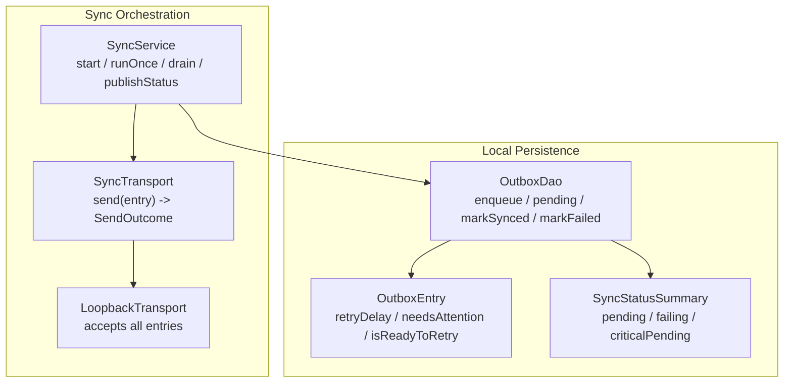
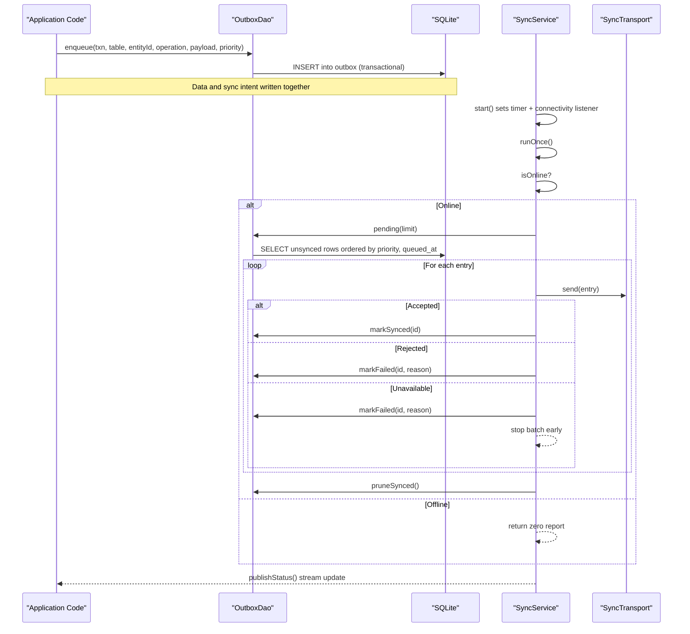
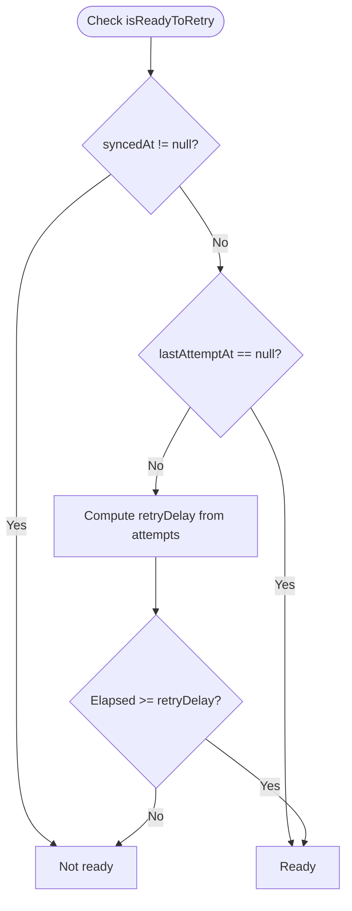
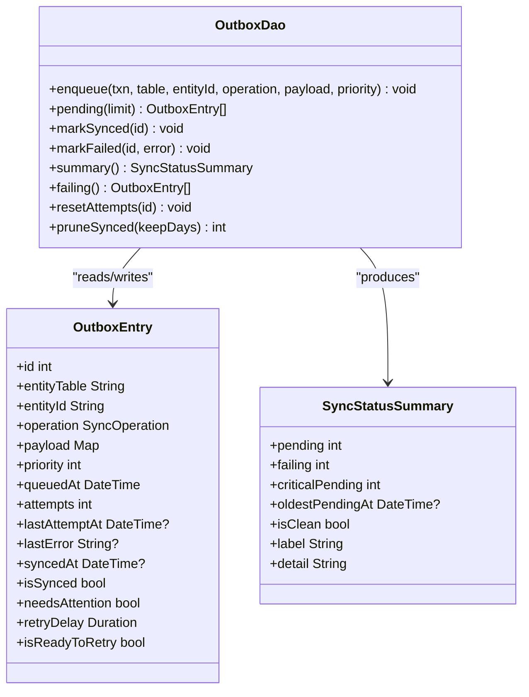
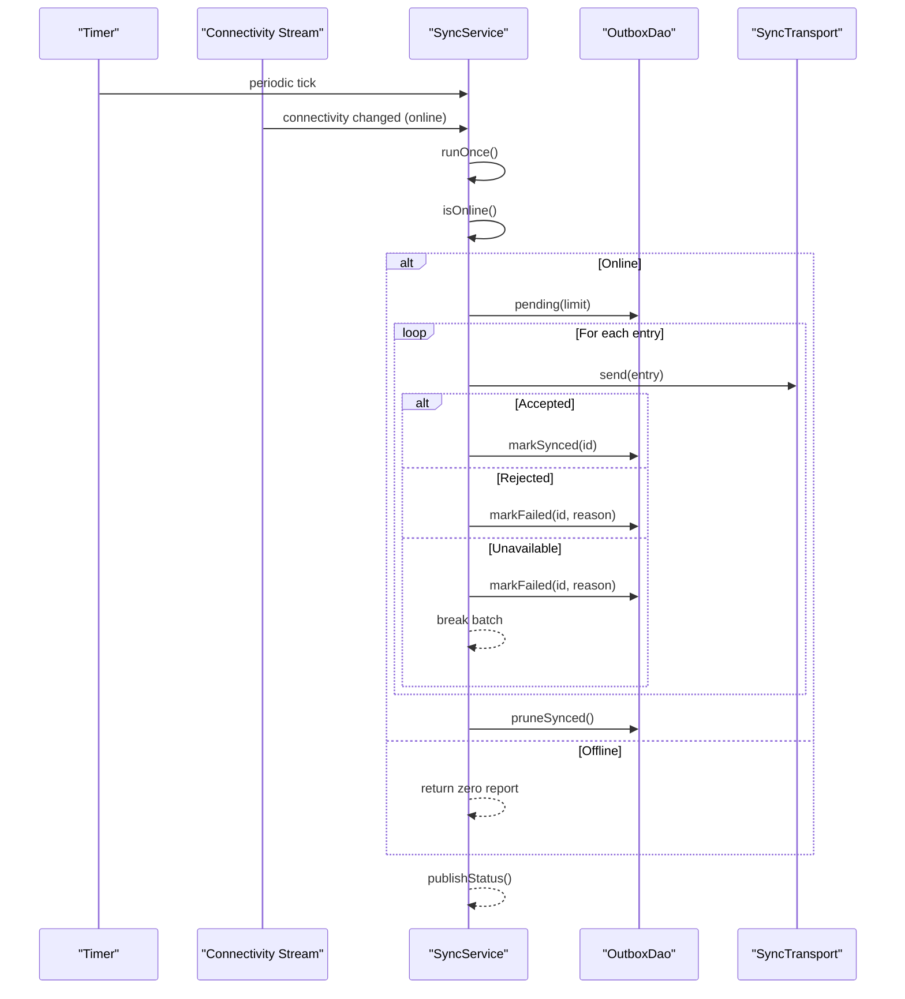
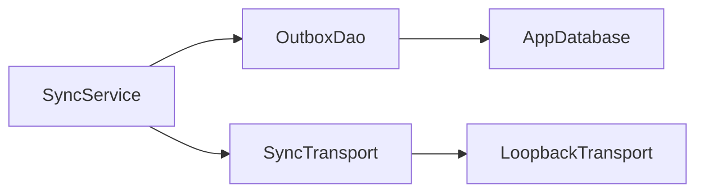

# Outbox Repository

<cite>
**Referenced Files in This Document**
- [outbox_dao.dart](file://lib/data/local/outbox_dao.dart)
- [sync_service.dart](file://lib/data/sync/sync_service.dart)
</cite>

## Table of Contents
1. [Introduction](#introduction)
2. [Project Structure](#project-structure)
3. [Core Components](#core-components)
4. [Architecture Overview](#architecture-overview)
5. [Detailed Component Analysis](#detailed-component-analysis)
6. [Dependency Analysis](#dependency-analysis)
7. [Performance Considerations](#performance-considerations)
8. [Troubleshooting Guide](#troubleshooting-guide)
9. [Conclusion](#conclusion)
10. [Appendices](#appendices)

## Introduction
This document explains the offline-first synchronization system implemented via an outbox pattern. It focuses on how local changes are persisted reliably, queued for later upload, and synchronized with a remote endpoint when connectivity is available. The design emphasizes priority-based ordering, robust retry with exponential backoff, clear error surfacing, and consistent data guarantees through transactional enqueueing.

## Project Structure
The outbox implementation spans two primary modules:
- Local persistence and queue management (DAO layer)
- Background sync orchestration (service layer)

**Diagram sources**
- [outbox_dao.dart:49-115](file://lib/data/local/outbox_dao.dart#L49-L115)
- [outbox_dao.dart:160-276](file://lib/data/local/outbox_dao.dart#L160-L276)
- [sync_service.dart:56-73](file://lib/data/sync/sync_service.dart#L56-L73)
- [sync_service.dart:96-146](file://lib/data/sync/sync_service.dart#L96-L146)

**Section sources**
- [outbox_dao.dart:1-276](file://lib/data/local/outbox_dao.dart#L1-L276)
- [sync_service.dart:1-258](file://lib/data/sync/sync_service.dart#L1-L258)

## Core Components
- OutboxEntry: Represents a single change to be synced, including operation type, payload, priority, timestamps, and retry metadata.
- SyncStatusSummary: Aggregated counts and oldest pending time used to inform users about sync state.
- OutboxDao: Static methods to enqueue operations within a transaction, query pending items by priority and age, mark success or failure, summarize status, list stuck rows, reset attempts, and prune old synced rows.
- SyncService: Orchestrates background sync, listens for connectivity changes, runs periodic batches, and exposes a stream of sync status summaries.
- SyncTransport and LoopbackTransport: Abstraction for sending entries; LoopbackTransport accepts everything for demonstration/testing.

Key responsibilities:
- Enqueueing must occur in the same transaction as the data write to ensure consistency.
- Pending queue is ordered by priority then creation time.
- Retry uses exponential backoff capped to avoid battery drain.
- Failed rows after threshold are surfaced for human review.
- Status is published via a broadcast stream for UI updates.

**Section sources**
- [outbox_dao.dart:49-115](file://lib/data/local/outbox_dao.dart#L49-L115)
- [outbox_dao.dart:160-276](file://lib/data/local/outbox_dao.dart#L160-L276)
- [sync_service.dart:56-73](file://lib/data/sync/sync_service.dart#L56-L73)
- [sync_service.dart:96-146](file://lib/data/sync/sync_service.dart#L96-L146)

## Architecture Overview
The outbox pattern ensures that every local write has a corresponding intent to sync, persisted atomically with the data. A background service opportunistically sends small batches when online, marking each row individually to maximize progress even on unstable networks.

**Diagram sources**
- [outbox_dao.dart:164-181](file://lib/data/local/outbox_dao.dart#L164-L181)
- [outbox_dao.dart:187-199](file://lib/data/local/outbox_dao.dart#L187-L199)
- [outbox_dao.dart:201-218](file://lib/data/local/outbox_dao.dart#L201-L218)
- [sync_service.dart:122-146](file://lib/data/sync/sync_service.dart#L122-L146)
- [sync_service.dart:156-217](file://lib/data/sync/sync_service.dart#L156-L217)

## Detailed Component Analysis

### OutboxEntry and Priority/Backoff Logic
OutboxEntry encapsulates metadata required for reliable retries:
- Operation and payload define what to send.
- Priority determines order (critical first).
- Attempts, lastAttemptAt, and lastError track retry history.
- syncedAt indicates successful completion.

Retry behavior:
- Exponential backoff based on attempts, clamped to prevent excessive waits.
- isReadyToRetry enforces minimum delay since last attempt.
- needsAttention flags rows needing human intervention after repeated failures.

**Diagram sources**
- [outbox_dao.dart:85-95](file://lib/data/local/outbox_dao.dart#L85-L95)

**Section sources**
- [outbox_dao.dart:49-115](file://lib/data/local/outbox_dao.dart#L49-L115)

### OutboxDao: Queue Management and Persistence
Responsibilities:
- enqueue: Insert a sync intent inside the same transaction as the data write.
- pending: Fetch unsynced rows ordered by priority and age, filtered by retry readiness.
- markSynced: Mark row as successfully synced and clear last_error.
- markFailed: Increment attempts, record last_attempt_at and last_error.
- summary: Aggregate counts for pending, failing, critical pending, and oldest pending timestamp.
- failing: List rows requiring attention (attempts >= 5 and not synced).
- resetAttempts: Reset counters for manual retry flows.
- pruneSynced: Remove old synced rows to manage storage.

**Diagram sources**
- [outbox_dao.dart:160-276](file://lib/data/local/outbox_dao.dart#L160-L276)
- [outbox_dao.dart:49-115](file://lib/data/local/outbox_dao.dart#L49-L115)

**Section sources**
- [outbox_dao.dart:160-276](file://lib/data/local/outbox_dao.dart#L160-L276)

### SyncService: Background Sync Orchestration
Responsibilities:
- start(): Set up periodic timer and connectivity listener; publish initial status.
- runOnce(): Guard against reentrancy, check online, fetch batch, send via transport, update status per outcome, prune synced rows, publish status.
- drain(): Repeat runOnce until no progress or max batches reached.
- publishStatus(): Emit current summary via broadcast stream.
- stuck(): Return failing rows for user inspection.
- retry(outboxId): Reset attempts and trigger a sync pass.

**Diagram sources**
- [sync_service.dart:122-146](file://lib/data/sync/sync_service.dart#L122-L146)
- [sync_service.dart:156-217](file://lib/data/sync/sync_service.dart#L156-L217)

**Section sources**
- [sync_service.dart:96-146](file://lib/data/sync/sync_service.dart#L96-L146)
- [sync_service.dart:156-242](file://lib/data/sync/sync_service.dart#L156-L242)

### Conflict Resolution Strategy
- Server applies last-write-wins using updated_at timestamps.
- Clients do not perform merge conflicts locally; they rely on server resolution.
- Rejected outcomes indicate persistent issues that require human attention.

**Section sources**
- [outbox_dao.dart:29-32](file://lib/data/local/outbox_dao.dart#L29-L32)
- [sync_service.dart:41-52](file://lib/data/sync/sync_service.dart#L41-L52)

### Examples of Usage Patterns
- Enqueueing operations: Call OutboxDao.enqueue within the same transaction as the data write to guarantee atomicity.
- Processing sync queues: Use SyncService.runOnce for a single batch or SyncService.drain for multiple passes until progress stalls.
- Monitoring sync status: Subscribe to SyncService.status stream to receive SyncStatusSummary updates.
- Handling stuck rows: Use SyncService.stuck to retrieve failing entries and SyncService.retry to reset attempts and resync.

**Section sources**
- [outbox_dao.dart:164-181](file://lib/data/local/outbox_dao.dart#L164-L181)
- [sync_service.dart:156-217](file://lib/data/sync/sync_service.dart#L156-L217)
- [sync_service.dart:244-257](file://lib/data/sync/sync_service.dart#L244-L257)

## Dependency Analysis
- SyncService depends on OutboxDao for queue operations and status aggregation.
- OutboxDao depends on SQLite via AppDatabase instance.
- SyncTransport abstracts network calls; LoopbackTransport provides a testable implementation.

**Diagram sources**
- [sync_service.dart:96-146](file://lib/data/sync/sync_service.dart#L96-L146)
- [outbox_dao.dart:187-199](file://lib/data/local/outbox_dao.dart#L187-L199)
- [sync_service.dart:56-73](file://lib/data/sync/sync_service.dart#L56-L73)

**Section sources**
- [sync_service.dart:96-146](file://lib/data/sync/sync_service.dart#L96-L146)
- [outbox_dao.dart:187-199](file://lib/data/local/outbox_dao.dart#L187-L199)

## Performance Considerations
- Small batch sizes reduce rollback impact during brief connectivity windows.
- Priority ordering ensures urgent items transmit before routine ones.
- Exponential backoff prevents battery drain while maintaining eventual delivery.
- Pruning synced rows keeps storage bounded over time.

[No sources needed since this section provides general guidance]

## Troubleshooting Guide
Common scenarios:
- No progress due to offline state: Check isOnline and connectivity listener activation.
- Entries marked failed repeatedly: Inspect stuck rows via SyncService.stuck and use SyncService.retry after addressing underlying issues.
- Excessive retries draining battery: Verify retryDelay logic and ensure attempts are reset appropriately.
- UI not updating: Ensure SyncService.status stream is subscribed and not closed.

Operational tips:
- Use SyncService.publishStatus to refresh UI immediately after operations.
- Monitor SyncRunReport metrics to understand accepted, rejected, deferred, and attempted counts.

**Section sources**
- [sync_service.dart:147-150](file://lib/data/sync/sync_service.dart#L147-L150)
- [sync_service.dart:244-257](file://lib/data/sync/sync_service.dart#L244-L257)
- [outbox_dao.dart:241-261](file://lib/data/local/outbox_dao.dart#L241-L261)

## Conclusion
The outbox pattern implemented here delivers reliable offline-first synchronization through transactional enqueueing, priority-driven queuing, robust retry with backoff, and clear error surfacing. SyncService orchestrates opportunistic uploads while keeping the app responsive and informative. Together, these components ensure data consistency and resilience in challenging network conditions.

[No sources needed since this section summarizes without analyzing specific files]

## Appendices
- Key classes and their roles:
  - OutboxEntry: Sync intent with retry metadata.
  - SyncStatusSummary: User-facing sync state summary.
  - OutboxDao: Queue persistence and queries.
  - SyncService: Background sync orchestration and status broadcasting.
  - SyncTransport/LoopbackTransport: Network abstraction and test implementation.

[No sources needed since this section provides general guidance]