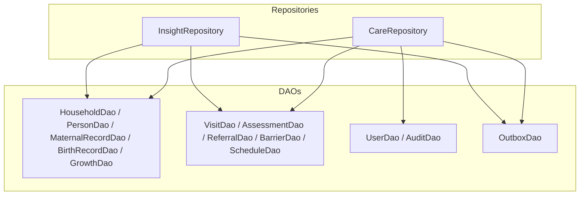
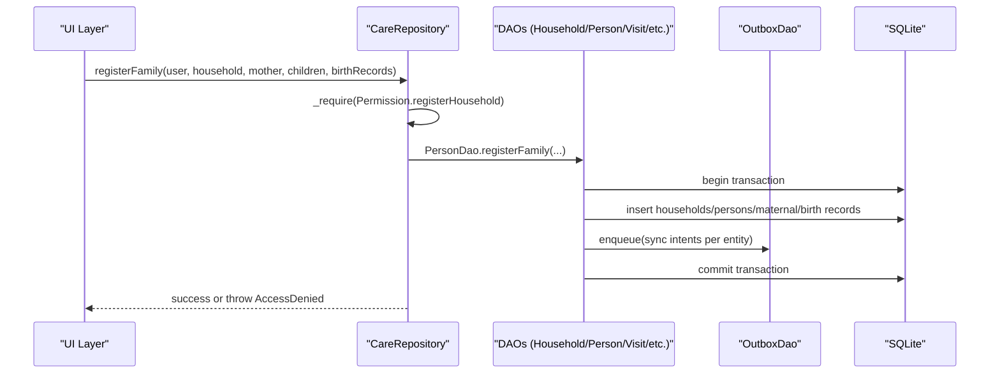
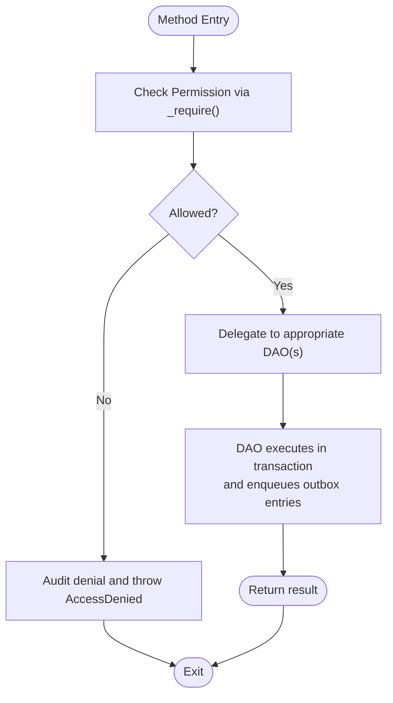
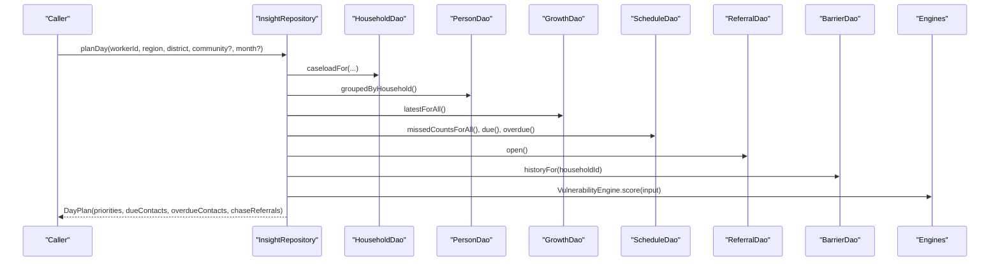
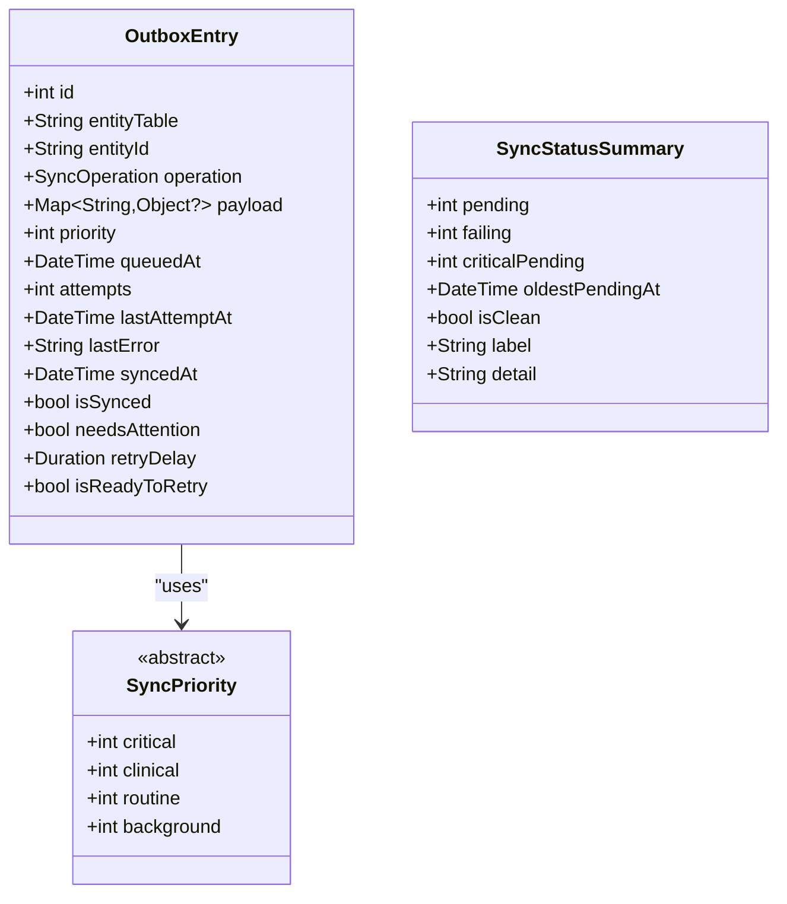
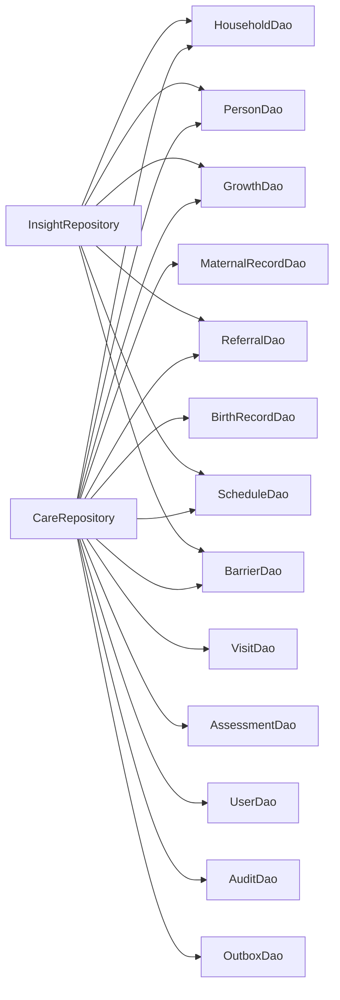

# Repository Pattern Implementation

<cite>
**Referenced Files in This Document**
- [care_repository.dart](file://lib/data/repositories/care_repository.dart)
- [insight_repository.dart](file://lib/data/repositories/insight_repository.dart)
- [outbox_dao.dart](file://lib/data/local/outbox_dao.dart)
- [household_dao.dart](file://lib/data/local/household_dao.dart)
- [user_dao.dart](file://lib/data/local/user_dao.dart)
- [visit_dao.dart](file://lib/data/local/visit_dao.dart)
</cite>

## Table of Contents
1. [Introduction](#introduction)
2. [Project Structure](#project-structure)
3. [Core Components](#core-components)
4. [Architecture Overview](#architecture-overview)
5. [Detailed Component Analysis](#detailed-component-analysis)
6. [Dependency Analysis](#dependency-analysis)
7. [Performance Considerations](#performance-considerations)
8. [Troubleshooting Guide](#troubleshooting-guide)
9. [Conclusion](#conclusion)

## Introduction
This document explains the repository pattern implementation in CareBridge AI’s data abstraction layer. It focuses on how repositories encapsulate data access logic, provide clean interfaces to the domain layer, and implement robust caching strategies. The documentation covers:
- CareRepository for patient and household data management with role-based access control and transactional consistency.
- InsightRepository for analytics and scoring that orchestrates batched reads and in-memory ranking.
- OutboxDao for sync operations ensuring offline-first reliability with priority-based queuing and exponential backoff.

It also documents error handling patterns, transaction management, data consistency approaches, and performance optimization techniques suitable for low-end devices and intermittent connectivity.

## Project Structure
The repository layer sits above DAOs (data access objects) and orchestrates business rules, permissions, and cross-entity transactions. Key responsibilities:
- CareRepository enforces permissions and scopes before delegating to DAOs.
- InsightRepository composes multiple DAO queries into efficient batches and performs in-memory scoring.
- OutboxDao guarantees that every local write is paired with a sync intent within a single transaction.

**Diagram sources**
- [care_repository.dart](file://lib/data/repositories/care_repository.dart)
- [insight_repository.dart](file://lib/data/repositories/insight_repository.dart)
- [household_dao.dart](file://lib/data/local/household_dao.dart)
- [visit_dao.dart](file://lib/data/local/visit_dao.dart)
- [user_dao.dart](file://lib/data/local/user_dao.dart)
- [outbox_dao.dart](file://lib/data/local/outbox_dao.dart)

**Section sources**
- [care_repository.dart](file://lib/data/repositories/care_repository.dart)
- [insight_repository.dart](file://lib/data/repositories/insight_repository.dart)
- [household_dao.dart](file://lib/data/local/household_dao.dart)
- [visit_dao.dart](file://lib/data/local/visit_dao.dart)
- [user_dao.dart](file://lib/data/local/user_dao.dart)
- [outbox_dao.dart](file://lib/data/local/outbox_dao.dart)

## Core Components
- CareRepository: Centralized access control and scope enforcement for households, people, clinical records, visits, assessments, referrals, barriers, and scheduled contacts. Uses permission checks and audit logging; throws AccessDenied on violations.
- InsightRepository: Orchestrates batched reads across multiple DAOs to compute vulnerability scores, growth trajectories, barrier forecasts, and daily plans. Optimizes for low-end devices by minimizing round trips and performing ranking in memory.
- OutboxDao: Implements an outbox pattern with priority queues, retry policies, and failure visibility. Ensures data integrity by pairing writes with sync intents in a single transaction.

**Section sources**
- [care_repository.dart](file://lib/data/repositories/care_repository.dart)
- [insight_repository.dart](file://lib/data/repositories/insight_repository.dart)
- [outbox_dao.dart](file://lib/data/local/outbox_dao.dart)

## Architecture Overview
The architecture follows a layered approach:
- Presentation calls repositories.
- Repositories enforce permissions, orchestrate transactions, and delegate to DAOs.
- DAOs perform SQLite operations and enqueue sync intents via OutboxDao.
- Sync engine consumes outbox entries and updates server state.

**Diagram sources**
- [care_repository.dart](file://lib/data/repositories/care_repository.dart)
- [household_dao.dart](file://lib/data/local/household_dao.dart)
- [visit_dao.dart](file://lib/data/local/visit_dao.dart)
- [outbox_dao.dart](file://lib/data/local/outbox_dao.dart)

## Detailed Component Analysis

### CareRepository Analysis
Responsibilities:
- Permission gating for all read/write operations using a centralized guard method.
- Household scoping for caregivers bound to a specific household.
- Atomic multi-entity writes (e.g., family registration, assessment with referral).
- Audit logging for denials and critical actions.

Key methods and behaviors:
- registerHousehold, registerFamily: Enforce permissions and perform atomic writes with audit logs.
- visibleHouseholds, household, searchHouseholds: Role-aware queries returning scoped results.
- visitQueue, person, savePerson, childrenOf: Scoped person-level operations.
- maternalRecord, birthRecord, recordGrowth, growthSeries: Clinical data access gated by permissions.
- startVisit, completeVisit, rollCall, visitHistory: Visit lifecycle management.
- saveAssessment, overrideRecommendation: Atomic assessment persistence with optional referral/scheduling and override audit trail.
- issueReferral, openReferrals, confirmArrival, updateReferralStatus: Referral lifecycle with role-scoped visibility.
- recordBarrier, barrierHistory, zoneBarriers: Barrier reporting and aggregation.
- dueContacts, scheduleContacts, markContactDone: Scheduled contact management.

Error handling:
- Throws AccessDenied with contextual messages when permissions are insufficient.
- Audits denied attempts with actor, permission, and entity details.

Transaction management:
- Delegates to DAOs which wrap writes in transactions and enqueue sync intents atomically.

**Diagram sources**
- [care_repository.dart](file://lib/data/repositories/care_repository.dart)
- [user_dao.dart](file://lib/data/local/user_dao.dart)
- [outbox_dao.dart](file://lib/data/local/outbox_dao.dart)

**Section sources**
- [care_repository.dart](file://lib/data/repositories/care_repository.dart)
- [user_dao.dart](file://lib/data/local/user_dao.dart)

### InsightRepository Analysis
Responsibilities:
- Build DayPlan by batching reads across multiple DAOs and computing vulnerability scores in memory.
- Score individual households consistently with the day plan inputs.
- Analyze growth trajectories and identify declining children.
- Forecast barriers and detect zone-wide patterns.
- Compute referral completion metrics.

Optimization strategy:
- Batch queries for entire caseload instead of per-household round trips.
- In-memory ranking and tie-breaking based on data completeness.
- Eagerly assemble dashboard card fields to avoid lazy loading during scrolling.

Key methods and behaviors:
- planDay(workerId, region, district, community?, month?): Produces prioritized list, due/overdue contacts, and chase referrals.
- scoreHousehold(householdId): Returns vulnerability score with consistent inputs.
- trajectory(personId): Computes growth trajectory from stored series.
- decliningChildren(): Identifies children with deteriorating growth trends ordered by urgency.
- forecastBarriers(householdId, personId?, urgency, decisionMakerPresent?, isNightTime?): Predicts barriers pre-referral.
- zonePatterns(withinDays?): Detects patterns across barrier reports.
- referralCompletion(withinDays?): Calculates issued vs arrived counts and rate.

**Diagram sources**
- [insight_repository.dart](file://lib/data/repositories/insight_repository.dart)
- [household_dao.dart](file://lib/data/local/household_dao.dart)
- [visit_dao.dart](file://lib/data/local/visit_dao.dart)
- [outbox_dao.dart](file://lib/data/local/outbox_dao.dart)

**Section sources**
- [insight_repository.dart](file://lib/data/repositories/insight_repository.dart)

### OutboxDao Analysis
Responsibilities:
- Queue sync operations with priority ordering and exponential backoff.
- Track failures and expose items needing attention.
- Provide summary statistics for UI banners and user reassurance.
- Prune synced entries older than a retention window.

Key features:
- Priority levels: critical (urgent referrals), clinical (assessments/growth/barriers), routine (registrations/visits/schedules), background (housekeeping).
- Retry policy: Exponential backoff capped at 120 minutes; marks entries needing human attention after repeated failures.
- Transactional enqueue: Every DAO write pairs with an outbox entry inside the same transaction.

**Diagram sources**
- [outbox_dao.dart](file://lib/data/local/outbox_dao.dart)

**Section sources**
- [outbox_dao.dart](file://lib/data/local/outbox_dao.dart)

### DAO Layer Integration
DAOs encapsulate SQLite operations and ensure each write enqueues a corresponding outbox entry within a transaction. Examples:
- HouseholdDao.upsert: Inserts household and enqueues update with routine priority.
- PersonDao.registerFamily: Atomic multi-entity registration including maternal and birth records, with clinical priorities where appropriate.
- VisitDao.start: Creates visit and participants, enqueuing a comprehensive payload.
- AssessmentDao.saveWithReferral: Persists assessment and referral together, marking urgent referrals as critical priority.
- BarrierDao.save: Records barriers and enqueues them for sync.

Consistency approach:
- All writes use transactions to guarantee atomicity.
- Outbox entries mirror the exact payload needed for server reconciliation.
- Audit entries are written locally for compliance and debugging.

**Section sources**
- [household_dao.dart](file://lib/data/local/household_dao.dart)
- [visit_dao.dart](file://lib/data/local/visit_dao.dart)
- [outbox_dao.dart](file://lib/data/local/outbox_dao.dart)

## Dependency Analysis
Repositories depend on DAOs for data access and OutboxDao for sync coordination. DAOs depend on SQLite through AppDatabase instance.

**Diagram sources**
- [care_repository.dart](file://lib/data/repositories/care_repository.dart)
- [insight_repository.dart](file://lib/data/repositories/insight_repository.dart)
- [household_dao.dart](file://lib/data/local/household_dao.dart)
- [visit_dao.dart](file://lib/data/local/visit_dao.dart)
- [user_dao.dart](file://lib/data/local/user_dao.dart)
- [outbox_dao.dart](file://lib/data/local/outbox_dao.dart)

**Section sources**
- [care_repository.dart](file://lib/data/repositories/care_repository.dart)
- [insight_repository.dart](file://lib/data/repositories/insight_repository.dart)
- [household_dao.dart](file://lib/data/local/household_dao.dart)
- [visit_dao.dart](file://lib/data/local/visit_dao.dart)
- [user_dao.dart](file://lib/data/local/user_dao.dart)
- [outbox_dao.dart](file://lib/data/local/outbox_dao.dart)

## Performance Considerations
- Batched reads: InsightRepository aggregates data across multiple DAOs in minimal queries to avoid N+1 problems.
- In-memory ranking: Sorting and scoring occur in Dart over loaded datasets to reduce database load.
- Efficient queries: DAOs use indexed lookups and optimized SQL (e.g., correlated subqueries for latest measurements).
- Priority-based sync: Critical items leave the device first, improving responsiveness under poor connectivity.
- Memory management: Results are constructed as immutable lists/maps to prevent accidental mutations and reduce GC pressure.
- Caching strategy: While explicit cache layers are not present, repositories leverage in-memory composition and batched reads to minimize redundant queries. For future enhancements, consider adding a lightweight LRU cache for frequently accessed entities like households and persons.

[No sources needed since this section provides general guidance]

## Troubleshooting Guide
Common issues and resolutions:
- AccessDenied exceptions: Occur when users lack required permissions. Check role assignments and permission mappings.
- Sync failures: Outbox entries may show high attempt counts. Use failing() to surface stuck entries and resetAttempts after resolving network issues.
- Data inconsistency: Ensure all writes go through DAOs with transactional outbox enqueueing. Verify that audit logs capture denied attempts and critical actions.
- Performance bottlenecks: Monitor query patterns in InsightRepository. Prefer batched operations and avoid per-entity round trips.

**Section sources**
- [user_dao.dart](file://lib/data/local/user_dao.dart)
- [outbox_dao.dart](file://lib/data/local/outbox_dao.dart)

## Conclusion
CareBridge AI’s repository pattern implementation provides a robust, secure, and performant data abstraction layer. CareRepository enforces role-based access control and ensures transactional consistency. InsightRepository optimizes analytics through batched reads and in-memory processing. OutboxDao guarantees reliable sync operations with priority-based queuing and exponential backoff. Together, these components deliver a scalable foundation for offline-first healthcare applications in resource-constrained environments.

[No sources needed since this section summarizes without analyzing specific files]