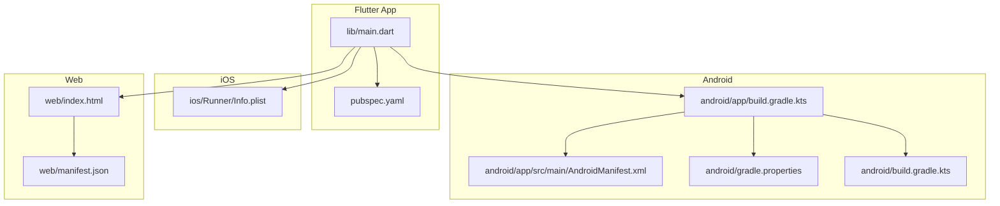
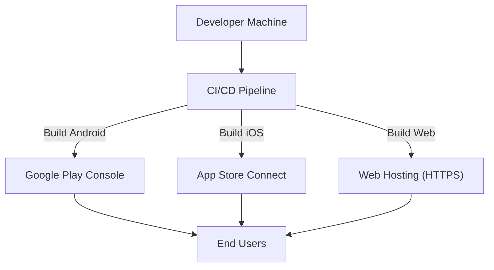
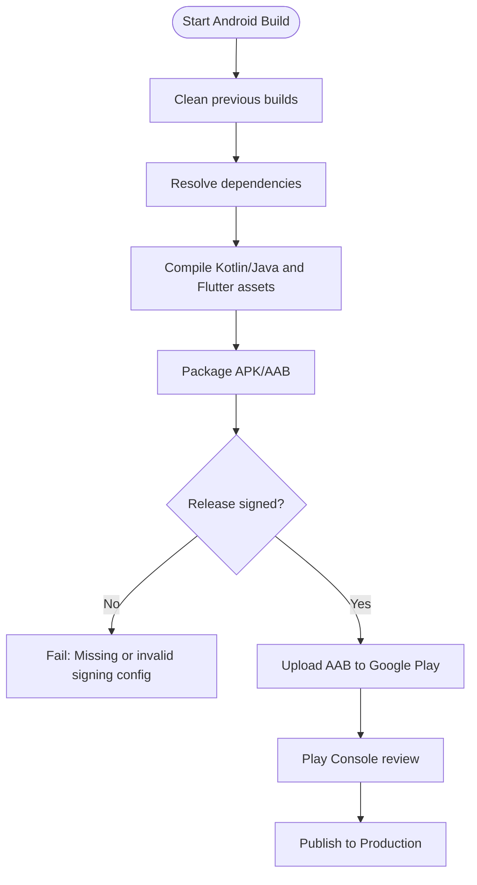
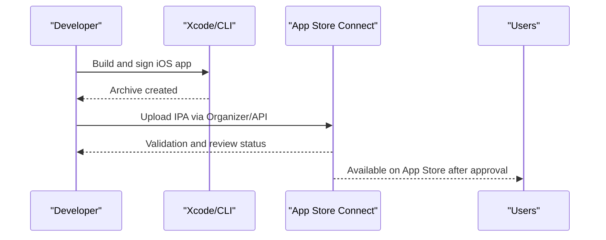
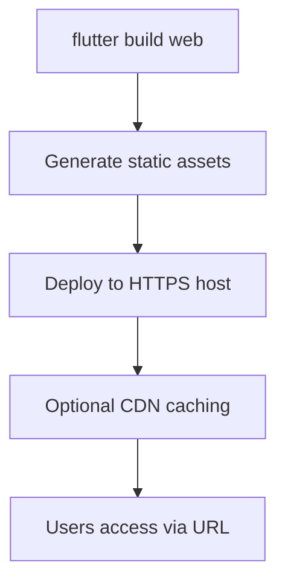
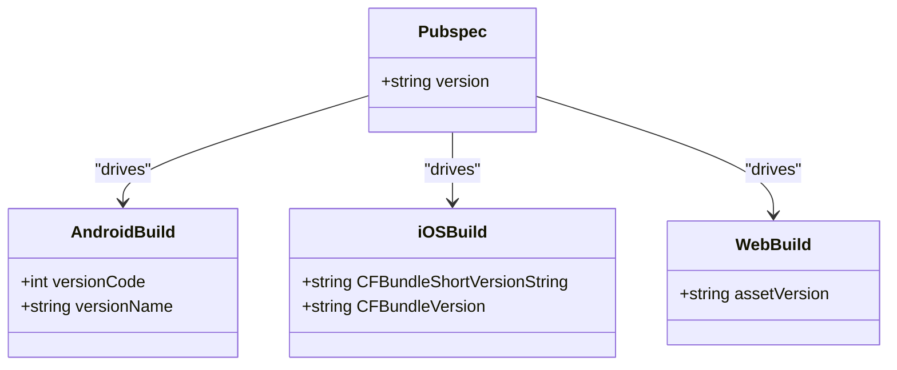
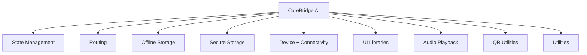

# Deployment & Distribution

<cite>
**Referenced Files in This Document**
- [pubspec.yaml](file://pubspec.yaml)
- [README.md](file://README.md)
- [android/app/build.gradle.kts](file://android/app/build.gradle.kts)
- [android/build.gradle.kts](file://android/build.gradle.kts)
- [android/gradle.properties](file://android/gradle.properties)
- [android/app/src/main/AndroidManifest.xml](file://android/app/src/main/AndroidManifest.xml)
- [ios/Runner/Info.plist](file://ios/Runner/Info.plist)
- [web/index.html](file://web/index.html)
- [web/manifest.json](file://web/manifest.json)
- [lib/main.dart](file://lib/main.dart)
- [.gitignore](file://.gitignore)
</cite>

## Table of Contents
1. [Introduction](#introduction)
2. [Project Structure](#project-structure)
3. [Core Components](#core-components)
4. [Architecture Overview](#architecture-overview)
5. [Detailed Component Analysis](#detailed-component-analysis)
6. [Dependency Analysis](#dependency-analysis)
7. [Performance Considerations](#performance-considerations)
8. [Troubleshooting Guide](#troubleshooting-guide)
9. [Conclusion](#conclusion)
10. [Appendices](#appendices)

## Introduction
This document provides comprehensive deployment and distribution guidance for CareBridge AI across Android, iOS, and Web platforms. It covers build processes, signing and provisioning, app store submission procedures, version management strategies, web hosting requirements, browser compatibility, update mechanisms, rollback strategies, distribution channels, compliance with healthcare-related app store guidelines, security scanning, and release automation for production deployments.

## Project Structure
CareBridge AI is a Flutter application with platform-specific configurations for Android, iOS, and Web. The key configuration files that drive builds and packaging are:
- pubspec.yaml: Dart/Flutter package metadata, dependencies, and asset declarations
- android/app/build.gradle.kts: Android application Gradle configuration (signing, versions, compile options)
- ios/Runner/Info.plist: iOS app metadata and capabilities
- web/index.html and web/manifest.json: Web entry point and PWA manifest
- lib/main.dart: Application entry point

**Diagram sources**
- [lib/main.dart:16-18](file://lib/main.dart#L16-L18)
- [pubspec.yaml:1-67](file://pubspec.yaml#L1-L67)
- [android/app/build.gradle.kts:1-46](file://android/app/build.gradle.kts#L1-L46)
- [android/app/src/main/AndroidManifest.xml:1-46](file://android/app/src/main/AndroidManifest.xml#L1-L46)
- [android/gradle.properties:1-7](file://android/gradle.properties#L1-L7)
- [android/build.gradle.kts:1-25](file://android/build.gradle.kts#L1-L25)
- [ios/Runner/Info.plist:1-71](file://ios/Runner/Info.plist#L1-L71)
- [web/index.html:1-47](file://web/index.html#L1-L47)
- [web/manifest.json:1-36](file://web/manifest.json#L1-L36)

**Section sources**
- [pubspec.yaml:1-67](file://pubspec.yaml#L1-L67)
- [android/app/build.gradle.kts:1-46](file://android/app/build.gradle.kts#L1-L46)
- [android/app/src/main/AndroidManifest.xml:1-46](file://android/app/src/main/AndroidManifest.xml#L1-L46)
- [ios/Runner/Info.plist:1-71](file://ios/Runner/Info.plist#L1-L71)
- [web/index.html:1-47](file://web/index.html#L1-L47)
- [web/manifest.json:1-36](file://web/manifest.json#L1-L36)
- [lib/main.dart:16-18](file://lib/main.dart#L16-L18)

## Core Components
- Versioning and metadata:
  - pubspec.yaml defines the application name, description, and version string used by Flutter tooling to generate platform artifacts.
- Android build configuration:
  - android/app/build.gradle.kts sets namespace, compile/target SDKs, Java/Kotlin targets, and defaultConfig values including applicationId, minSdk, targetSdk, versionCode, and versionName.
  - Signing is currently configured to use debug keys for release builds; this must be updated for production.
- iOS app metadata:
  - ios/Runner/Info.plist contains bundle identifiers, display names, supported orientations, and version strings sourced from Flutter build variables.
- Web assets:
  - web/index.html includes base href placeholder replaced by flutter build, meta tags, icons, and PWA manifest link.
  - web/manifest.json defines PWA behavior, theme colors, and icon assets.

**Section sources**
- [pubspec.yaml:1-67](file://pubspec.yaml#L1-L67)
- [android/app/build.gradle.kts:1-46](file://android/app/build.gradle.kts#L1-L46)
- [android/app/src/main/AndroidManifest.xml:1-46](file://android/app/src/main/AndroidManifest.xml#L1-L46)
- [ios/Runner/Info.plist:1-71](file://ios/Runner/Info.plist#L1-L71)
- [web/index.html:1-47](file://web/index.html#L1-L47)
- [web/manifest.json:1-36](file://web/manifest.json#L1-L36)

## Architecture Overview
The deployment architecture spans three platforms with shared Flutter code and platform-specific packaging:
- Android: Gradle-based build producing APK/AAB; signing required for release.
- iOS: Xcode workspace and Info.plist-driven metadata; code signing and provisioning profiles required.
- Web: Static site generation via flutter build web; served over HTTPS with optional PWA features.

[No sources needed since this diagram shows conceptual workflow, not actual code structure]

## Detailed Component Analysis

### Android Build and Distribution
- Build process:
  - Use Flutter’s Gradle plugin integrated into android/app/build.gradle.kts.
  - Compile options set to Java 17 and Kotlin JVM_17.
  - DefaultConfig uses Flutter-provided versionCode and versionName.
- Signing:
  - Release build currently references debug signing config; replace with a production keystore and alias.
  - Configure secure storage of keystore credentials in CI secrets.
- Submission:
  - Generate an Android App Bundle (AAB) for Google Play.
  - Ensure minSdk and targetSdk align with organizational policy and device coverage.
- Permissions and manifest:
  - AndroidManifest.xml declares the main activity and Flutter embedding metadata.
  - Add only necessary permissions for healthcare functionality; justify each permission per Google Play policies.

**Diagram sources**
- [android/app/build.gradle.kts:1-46](file://android/app/build.gradle.kts#L1-L46)
- [android/app/src/main/AndroidManifest.xml:1-46](file://android/app/src/main/AndroidManifest.xml#L1-L46)

**Section sources**
- [android/app/build.gradle.kts:1-46](file://android/app/build.gradle.kts#L1-L46)
- [android/app/src/main/AndroidManifest.xml:1-46](file://android/app/src/main/AndroidManifest.xml#L1-L46)
- [android/gradle.properties:1-7](file://android/gradle.properties#L1-L7)

### iOS Build and Distribution
- Build process:
  - iOS metadata defined in ios/Runner/Info.plist, including bundle identifier, display name, and version strings sourced from Flutter build variables.
  - Supported interface orientations are declared for iPhone and iPad.
- Signing and provisioning:
  - Requires valid Apple Developer account, provisioning profile, and code signing identity.
  - Use Xcode or fastlane to automate signing and archive creation.
- Submission:
  - Archive IPA and upload via Xcode Organizer or Transporter/App Store Connect API.
  - Ensure privacy manifests and data usage descriptions comply with App Store guidelines.

**Diagram sources**
- [ios/Runner/Info.plist:1-71](file://ios/Runner/Info.plist#L1-L71)

**Section sources**
- [ios/Runner/Info.plist:1-71](file://ios/Runner/Info.plist#L1-L71)

### Web Deployment and Hosting
- Build output:
  - flutter build web generates static assets; index.html uses a base href placeholder replaced at build time.
  - PWA manifest.json defines app behavior, icons, and theme colors.
- Hosting requirements:
  - Serve over HTTPS with proper caching headers.
  - Configure CDN if needed for global performance.
- Browser compatibility:
  - Ensure modern browsers support ES modules, service workers, and PWA features.
  - Test on Chrome, Safari, Firefox, and Edge.

**Diagram sources**
- [web/index.html:1-47](file://web/index.html#L1-L47)
- [web/manifest.json:1-36](file://web/manifest.json#L1-L36)

**Section sources**
- [web/index.html:1-47](file://web/index.html#L1-L47)
- [web/manifest.json:1-36](file://web/manifest.json#L1-L36)

### Version Management Strategy
- Single source of truth:
  - pubspec.yaml defines version string used across platforms.
- Android:
  - versionCode and versionName are pulled from Flutter variables; ensure monotonic increments for updates.
- iOS:
  - CFBundleShortVersionString and CFBundleVersion map to Flutter build name and number.
- Web:
  - Cache busting via versioned assets and HTTP cache-control headers.

**Diagram sources**
- [pubspec.yaml:1-67](file://pubspec.yaml#L1-L67)
- [android/app/build.gradle.kts:1-46](file://android/app/build.gradle.kts#L1-L46)
- [ios/Runner/Info.plist:1-71](file://ios/Runner/Info.plist#L1-L71)

**Section sources**
- [pubspec.yaml:1-67](file://pubspec.yaml#L1-L67)
- [android/app/build.gradle.kts:1-46](file://android/app/build.gradle.kts#L1-L46)
- [ios/Runner/Info.plist:1-71](file://ios/Runner/Info.plist#L1-L71)

### Update Mechanisms and Rollback Strategies
- Mobile apps:
  - Updates distributed through app stores; users install new versions via official channels.
  - Implement in-app update checks against backend endpoints to notify users of available updates.
- Web apps:
  - Use service worker caching strategies and versioned assets to force refresh when needed.
  - Provide fallback pages and graceful degradation during rollouts.
- Rollbacks:
  - Android/iOS: Revert to previous published versions via app store consoles; maintain artifact archives.
  - Web: Maintain multiple deployment slots; switch traffic back to stable slot upon failure detection.

[No sources needed since this section provides general guidance]

### Distribution Channels for Healthcare Applications
- Android:
  - Google Play Store for public distribution; consider internal testing tracks for early releases.
- iOS:
  - App Store for public distribution; TestFlight for beta testing.
- Web:
  - Secure hosting with HTTPS; restrict access via authentication if required.
  - Consider private domains for institutional deployments.

[No sources needed since this section provides general guidance]

### Compliance with App Store Guidelines and Security Scanning
- Android:
  - Follow Google Play Data Safety and security practices; declare permissions and data usage accurately.
  - Run static analysis and dependency vulnerability scans before release.
- iOS:
  - Adhere to App Store Review Guidelines; include privacy manifests and data usage descriptions.
  - Perform code signing validation and binary analysis.
- Web:
  - Enforce HTTPS, CSP headers, and secure cookie settings.
  - Conduct security audits and penetration testing for sensitive endpoints.

[No sources needed since this section provides general guidance]

### Release Automation for Production Deployments
- CI/CD pipeline steps:
  - Install Flutter and platform SDKs.
  - Run tests and linting.
  - Build artifacts (AAB, IPA, web).
  - Sign and notarize (iOS) where applicable.
  - Upload to app stores and hosting providers.
  - Notify stakeholders and track release metrics.

[No sources needed since this section provides general guidance]

## Dependency Analysis
Flutter dependencies and dev dependencies are declared in pubspec.yaml. These influence build size, runtime capabilities, and potential security considerations. Key categories include state management, routing, offline storage, secure storage, connectivity, UI components, audio, QR utilities, and utilities.

**Diagram sources**
- [pubspec.yaml:12-55](file://pubspec.yaml#L12-L55)

**Section sources**
- [pubspec.yaml:12-55](file://pubspec.yaml#L12-L55)

## Performance Considerations
- Android:
  - Optimize minSdk and targetSdk to balance compatibility and performance.
  - Enable ProGuard/R8 for code shrinking and obfuscation in release builds.
- iOS:
  - Use bitcode and strip symbols for release builds.
  - Validate memory usage and frame rates on target devices.
- Web:
  - Minimize bundle size; enable gzip/brotli compression.
  - Leverage CDN caching and lazy loading for assets.

[No sources needed since this section provides general guidance]

## Troubleshooting Guide
- Common issues:
  - Android signing failures: Verify keystore path, alias, and password; ensure release signing config replaces debug config.
  - iOS code signing errors: Check provisioning profiles and certificate validity; ensure correct bundle identifier.
  - Web base href misconfiguration: Confirm --base-href argument matches hosting path.
- Debugging tips:
  - Use flutter analyze and platform-specific logs.
  - Inspect .gitignore entries to avoid committing sensitive artifacts.

**Section sources**
- [android/app/build.gradle.kts:28-34](file://android/app/build.gradle.kts#L28-L34)
- [web/index.html:14-17](file://web/index.html#L14-L17)
- [.gitignore:1-45](file://.gitignore#L1-L45)

## Conclusion
CareBridge AI leverages Flutter’s cross-platform capabilities with platform-specific configurations for Android, iOS, and Web. Production deployments require robust signing, compliance with app store guidelines, and automated CI/CD pipelines. Version management should remain centralized in pubspec.yaml, while update and rollback strategies ensure reliability and safety for healthcare applications.

[No sources needed since this section summarizes without analyzing specific files]

## Appendices
- Entry point reference:
  - lib/main.dart initializes the application scope and router.
- README:
  - General Flutter getting started resources.

**Section sources**
- [lib/main.dart:16-18](file://lib/main.dart#L16-L18)
- [README.md:1-18](file://README.md#L1-L18)