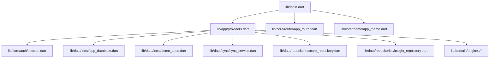
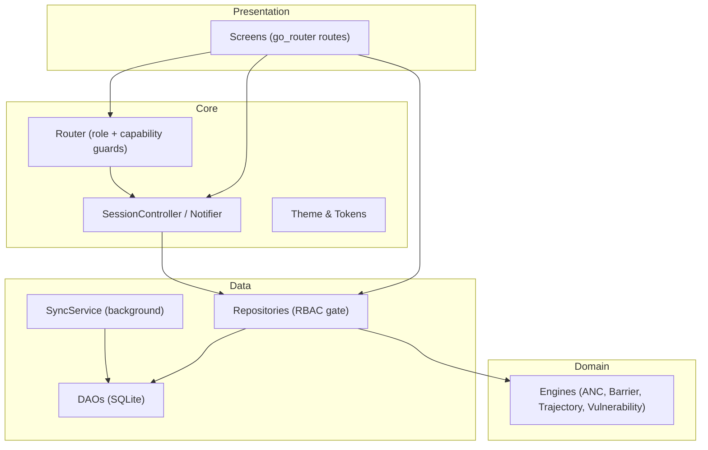
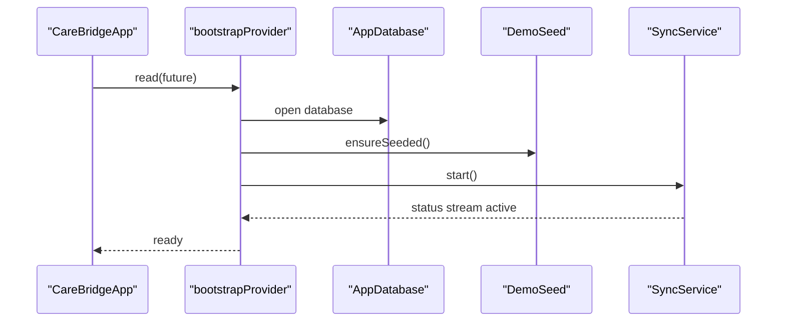
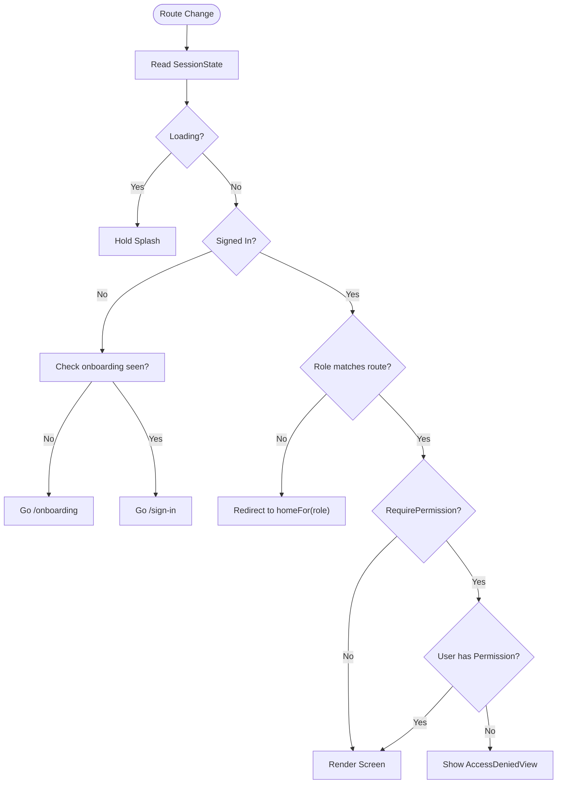
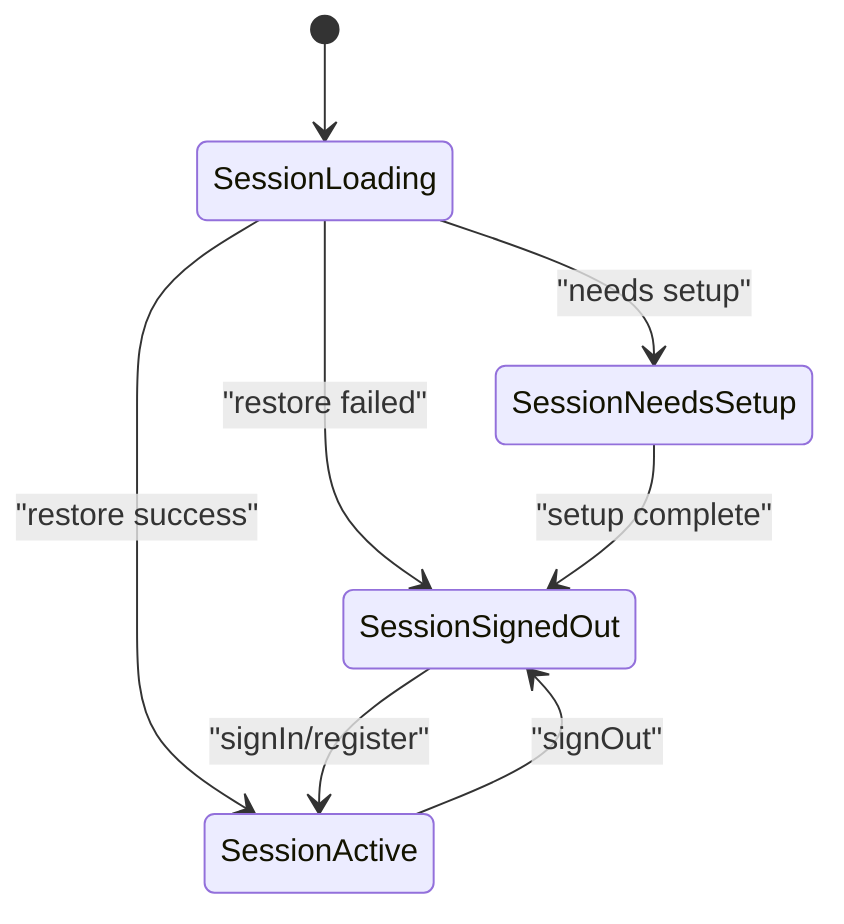
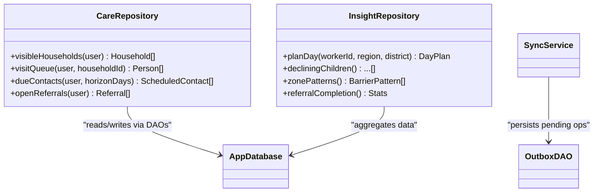
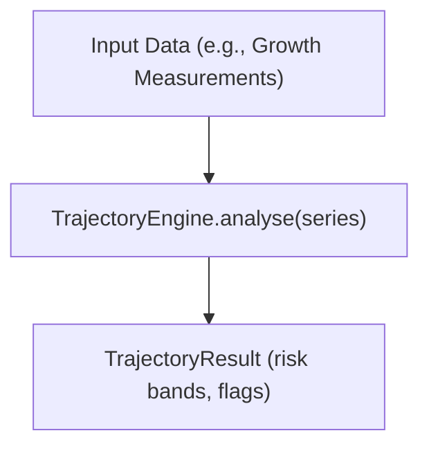
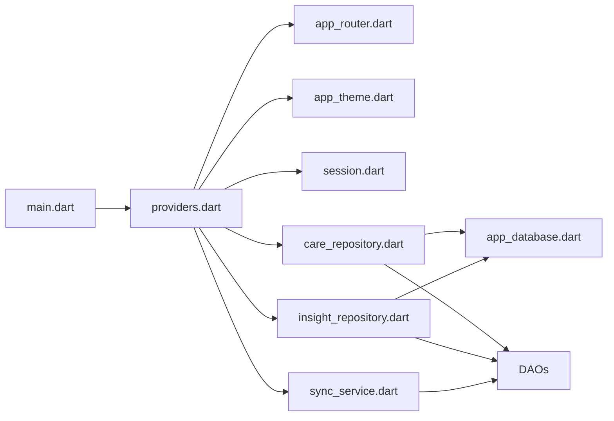

# Developer Guide

<cite>
**Referenced Files in This Document**
- [README.md](file://README.md)
- [pubspec.yaml](file://pubspec.yaml)
- [analysis_options.yaml](file://analysis_options.yaml)
- [main.dart](file://lib/main.dart)
- [providers.dart](file://lib/app/providers.dart)
- [app_router.dart](file://lib/core/router/app_router.dart)
- [app_theme.dart](file://lib/core/theme/app_theme.dart)
- [session.dart](file://lib/core/auth/session.dart)
- [app_database.dart](file://lib/data/local/app_database.dart)
- [demo_seed.dart](file://lib/data/local/demo_seed.dart)
- [sync_service.dart](file://lib/data/sync/sync_service.dart)
- [care_repository.dart](file://lib/data/repositories/care_repository.dart)
- [insight_repository.dart](file://lib/data/repositories/insight_repository.dart)
- [anc_engine.dart](file://lib/domain/engines/anc_engine.dart)
- [barrier_engine.dart](file://lib/domain/engines/barrier_engine.dart)
- [trajectory_engine.dart](file://lib/domain/engines/trajectory_engine.dart)
- [vulnerability_engine.dart](file://lib/domain/engines/vulnerability_engine.dart)
</cite>

## Table of Contents
1. Introduction
2. Project Structure
3. Core Components
4. Architecture Overview
5. Detailed Component Analysis
6. Dependency Analysis
7. Performance Considerations
8. Troubleshooting Guide
9. Conclusion
10. Appendices

## Introduction
This guide explains how to contribute and develop CareBridge AI, an offline-first Flutter application designed for community health workers and caregivers. It covers code organization, naming conventions, architectural patterns, development workflow, testing, quality assurance, debugging techniques, demo data seeding, and collaborative best practices. The goal is to make it easy for new contributors to understand the system and add features safely and consistently.

## Project Structure
CareBridge AI follows a layered architecture with clear separation between presentation, domain logic, data access, and core infrastructure:
- lib/main.dart: Application entry point; initializes Riverpod scope and configures routing and theme.
- lib/app/providers.dart: Centralized dependency wiring using Riverpod providers; bootstraps database, demo seed, sync service, and exposes feature-scoped providers.
- lib/core: Cross-cutting concerns such as authentication session, routing with role guards, and theming.
- lib/data: Local storage (SQLite via sqflite), repositories that enforce RBAC, reference data, and background sync.
- lib/domain: Business engines and entities used by insight and planning features.
- test: Unit tests for engines and other components.

**Diagram sources**
- [main.dart:1-35](file://lib/main.dart#L1-L35)
- [providers.dart:1-60](file://lib/app/providers.dart#L1-L60)
- [app_router.dart:1-60](file://lib/core/router/app_router.dart#L1-L60)
- [app_theme.dart:1-40](file://lib/core/theme/app_theme.dart#L1-L40)

**Section sources**
- [README.md:1-18](file://README.md#L1-L18)
- [pubspec.yaml:1-67](file://pubspec.yaml#L1-L67)
- [main.dart:1-35](file://lib/main.dart#L1-L35)

## Core Components
- Application bootstrap and state management:
  - Providers centralize all dependencies and expose feature-specific FutureProviders and StreamProviders.
  - Bootstrap provider opens the database, seeds demo data idempotently, and starts the sync service.
- Routing and authorization:
  - go_router-based router enforces coarse role separation and uses capability-based RequirePermission wrappers.
  - Session states drive redirects and ensure consistent navigation across onboarding, setup, sign-in, and role-specific homes.
- Theme and UI consistency:
  - AppTheme defines colors aligned with IMCI triage semantics, spacing scale optimized for field use, and Material 3 configuration.

Key responsibilities:
- lib/app/providers.dart: Dependency injection, session wiring, and feature data providers with permission checks.
- lib/core/router/app_router.dart: Route definitions, redirect logic, and capability-based route guards.
- lib/core/theme/app_theme.dart: Design tokens and Material theme tailored for field conditions.

**Section sources**
- [providers.dart:31-75](file://lib/app/providers.dart#L31-L75)
- [app_router.dart:34-159](file://lib/core/router/app_router.dart#L34-L159)
- [app_theme.dart:11-54](file://lib/core/theme/app_theme.dart#L11-L54)

## Architecture Overview
The app uses a layered architecture with Riverpod for state and dependency management, SQLite for offline storage, and go_router for navigation with role-aware guards. Repositories enforce RBAC before any DAO access, ensuring security at the data boundary. Domain engines encapsulate business rules for insights and planning.

**Diagram sources**
- [app_router.dart:63-159](file://lib/core/router/app_router.dart#L63-L159)
- [providers.dart:15-30](file://lib/app/providers.dart#L15-L30)
- [care_repository.dart:1-50](file://lib/data/repositories/care_repository.dart#L1-L50)
- [insight_repository.dart:1-50](file://lib/data/repositories/insight_repository.dart#L1-L50)
- [sync_service.dart:1-50](file://lib/data/sync/sync_service.dart#L1-L50)

## Detailed Component Analysis

### Bootstrapping and Dependency Wiring
- Bootstrap flow:
  - Database instance is opened.
  - Demo seed runs idempotently to ensure initial data without overwriting real records.
  - Sync service starts and publishes status streams.
- Provider design:
  - Feature providers depend on current user and enforce permissions before calling repositories.
  - Family providers parameterize queries by IDs (e.g., householdId, personId).

**Diagram sources**
- [providers.dart:38-42](file://lib/app/providers.dart#L38-L42)
- [app_database.dart:1-50](file://lib/data/local/app_database.dart#L1-L50)
- [demo_seed.dart:1-50](file://lib/data/local/demo_seed.dart#L1-L50)
- [sync_service.dart:1-50](file://lib/data/sync/sync_service.dart#L1-L50)

**Section sources**
- [providers.dart:31-75](file://lib/app/providers.dart#L31-L75)

### Routing and Authorization
- Role-based redirects:
  - Splash holds until session resolves.
  - Onboarding vs sign-in determined by preferences.
  - FHW vs caregiver home enforced by route prefix checks.
- Capability-based guards:
  - RequirePermission wraps screens with Permission checks.
  - AccessDenied view guides users back to their home route.

**Diagram sources**
- [app_router.dart:63-159](file://lib/core/router/app_router.dart#L63-L159)
- [app_router.dart:167-196](file://lib/core/router/app_router.dart#L167-L196)

**Section sources**
- [app_router.dart:34-159](file://lib/core/router/app_router.dart#L34-L159)

### Session Management
- States:
  - SessionLoading during bootstrap.
  - SessionNeedsSetup for first-run or reset.
  - SessionSignedOut for unauthenticated.
  - SessionActive(user, linkedHouseholdId?) for authenticated flows.
- Operations:
  - restore(), signIn(), registerAndSignIn(), signOut().
  - markNeedsSetup() for demo resets.

**Diagram sources**
- [providers.dart:73-122](file://lib/app/providers.dart#L73-L122)
- [session.dart:1-120](file://lib/core/auth/session.dart#L1-L120)

**Section sources**
- [providers.dart:66-122](file://lib/app/providers.dart#L66-L122)

### Data Layer and Repositories
- Storage:
  - SQLite via sqflite with FFI for desktop/web support.
  - DAOs abstract table operations.
- Repositories:
  - Enforce RBAC before DAO calls.
  - Expose feature methods like visibleHouseholds, visitQueue, dueContacts, openReferrals.
- Sync:
  - Background sync service publishes status summaries and persists outbox entries.

**Diagram sources**
- [care_repository.dart:1-120](file://lib/data/repositories/care_repository.dart#L1-L120)
- [insight_repository.dart:1-120](file://lib/data/repositories/insight_repository.dart#L1-L120)
- [app_database.dart:1-120](file://lib/data/local/app_database.dart#L1-L120)
- [outbox_dao.dart:1-120](file://lib/data/local/outbox_dao.dart#L1-L120)
- [sync_service.dart:1-120](file://lib/data/sync/sync_service.dart#L1-L120)

**Section sources**
- [care_repository.dart:1-120](file://lib/data/repositories/care_repository.dart#L1-L120)
- [insight_repository.dart:1-120](file://lib/data/repositories/insight_repository.dart#L1-L120)

### Domain Engines
- Purpose: Encapsulate business logic for insights and planning.
- Examples:
  - ANC engine for antenatal care guidance.
  - Barrier engine for analyzing reported barriers.
  - Trajectory engine for growth analysis.
  - Vulnerability engine for risk scoring.

**Diagram sources**
- [trajectory_engine.dart:1-120](file://lib/domain/engines/trajectory_engine.dart#L1-L120)

**Section sources**
- [anc_engine.dart:1-120](file://lib/domain/engines/anc_engine.dart#L1-L120)
- [barrier_engine.dart:1-120](file://lib/domain/engines/barrier_engine.dart#L1-L120)
- [trajectory_engine.dart:1-120](file://lib/domain/engines/trajectory_engine.dart#L1-L120)
- [vulnerability_engine.dart:1-120](file://lib/domain/engines/vulnerability_engine.dart#L1-L120)

## Dependency Analysis
- Centralized dependency graph:
  - All providers are defined in one file to keep relationships visible and avoid scattered wiring.
- Coupling:
  - Presentation depends on repositories and session state.
  - Repositories depend on DAOs and domain engines.
  - Sync service depends on DAOs and connectivity awareness.
- External packages:
  - flutter_riverpod for state and DI.
  - go_router for navigation.
  - sqflite and sqflite_common_ffi for local storage.
  - flutter_secure_storage for secure PIN storage.
  - connectivity_plus and device_info_plus for environment awareness.
  - intl, google_fonts, fl_chart, audioplayers, qr_flutter, uuid, collection, shared_preferences, url_launcher for utilities.

**Diagram sources**
- [providers.dart:15-30](file://lib/app/providers.dart#L15-L30)
- [app_router.dart:1-33](file://lib/core/router/app_router.dart#L1-L33)
- [app_theme.dart:1-40](file://lib/core/theme/app_theme.dart#L1-L40)
- [session.dart:1-120](file://lib/core/auth/session.dart#L1-L120)
- [care_repository.dart:1-120](file://lib/data/repositories/care_repository.dart#L1-L120)
- [insight_repository.dart:1-120](file://lib/data/repositories/insight_repository.dart#L1-L120)
- [app_database.dart:1-120](file://lib/data/local/app_database.dart#L1-L120)
- [sync_service.dart:1-120](file://lib/data/sync/sync_service.dart#L1-L120)

**Section sources**
- [pubspec.yaml:12-55](file://pubspec.yaml#L12-L55)
- [providers.dart:1-30](file://lib/app/providers.dart#L1-L30)

## Performance Considerations
- Use FutureProvider.family for parameterized queries to avoid redundant work and enable caching.
- Keep heavy computations inside domain engines; offload from UI threads.
- Prefer repository-level permission checks to minimize repeated validation.
- Use StreamProvider for reactive UI updates (e.g., sync status).
- Avoid direct DAO imports in widgets to maintain single responsibility and reduce coupling.

[No sources needed since this section provides general guidance]

## Troubleshooting Guide
Common issues and resolutions:
- Navigation loops or unexpected redirects:
  - Verify session state transitions and Ensure splash waits for bootstrap.
  - Confirm RequirePermission usage aligns with intended capabilities.
- Data not appearing:
  - Check bootstrapProvider completion and ensure demo seed ran only once.
  - Validate repository permission checks and user scope.
- Offline behavior:
  - Inspect SyncService status stream and outbox persistence.
  - Confirm connectivity_plus integration and retry policies.
- Secure storage errors:
  - Ensure PIN handling uses flutter_secure_storage correctly and keys are consistent.

Debugging tips:
- Use Flutter DevTools to inspect widget trees, performance profiles, and network requests.
- Log session state changes and provider rebuilds sparingly to avoid noise.
- Add unit tests for engines and repositories to catch regressions early.

**Section sources**
- [app_router.dart:63-159](file://lib/core/router/app_router.dart#L63-L159)
- [providers.dart:38-42](file://lib/app/providers.dart#L38-L42)
- [sync_service.dart:1-120](file://lib/data/sync/sync_service.dart#L1-L120)

## Conclusion
CareBridge AI’s architecture emphasizes clarity, security, and offline resilience. By centralizing dependency wiring, enforcing RBAC at repositories, and encapsulating business logic in domain engines, the codebase remains maintainable and extensible. Follow the guidelines here to contribute effectively, test thoroughly, and debug efficiently.

[No sources needed since this section summarizes without analyzing specific files]

## Appendices

### Development Workflow
- Setup:
  - Install Flutter SDK and configure Android/iOS environments.
  - Run flutter pub get to fetch dependencies.
  - Launch the app on emulator or device.
- Running:
  - Use flutter run for development builds.
  - Enable hot reload for rapid iteration.
- Building:
  - Generate platform-specific builds using flutter build commands.
- Testing:
  - Execute unit tests with flutter test.
  - Focus on engine tests and repository contracts.

**Section sources**
- [pubspec.yaml:1-67](file://pubspec.yaml#L1-L67)

### Code Organization Principles and Naming Conventions
- Layered structure:
  - lib/core: cross-cutting concerns (auth, router, theme).
  - lib/data: storage, repositories, reference data, sync.
  - lib/domain: business engines and entities.
  - lib/presentation: screens and UI components.
- Naming:
  - Providers: descriptive names indicating purpose (e.g., dayPlanProvider, visibleHouseholdsProvider).
  - Repositories: verb-noun pairs describing actions (e.g., CareRepository, InsightRepository).
  - Engines: noun-engine pattern (e.g., TrajectoryEngine, BarrierEngine).
  - DAOs: entity_dao.dart (e.g., household_dao.dart, user_dao.dart).

**Section sources**
- [providers.dart:1-30](file://lib/app/providers.dart#L1-L30)
- [app_router.dart:34-48](file://lib/core/router/app_router.dart#L34-L48)

### Contributing Guidelines and Code Review Process
- Contribution steps:
  - Fork the repository and create a feature branch.
  - Implement changes following layered architecture and naming conventions.
  - Add or update tests for new functionality.
  - Submit a pull request with a clear description and rationale.
- Code review checklist:
  - Does the change respect RBAC boundaries?
  - Are providers centralized and dependencies explicit?
  - Is there adequate test coverage?
  - Are error paths handled gracefully?

**Section sources**
- [providers.dart:1-13](file://lib/app/providers.dart#L1-L13)
- [app_router.dart:1-12](file://lib/core/router/app_router.dart#L1-L12)

### Debugging Techniques for Flutter Mobile Development
- Use print statements sparingly and prefer logging frameworks for structured logs.
- Leverage Flutter DevTools for profiling memory, CPU, and widget rebuilds.
- Simulate offline scenarios to validate sync behavior and fallback UI.
- Test on low-end devices to ensure performance and accessibility.

[No sources needed since this section provides general guidance]

### Extension Points for Adding New Features
- Add new providers in lib/app/providers.dart to wire dependencies and expose feature data.
- Implement domain logic in lib/domain/engines with dedicated classes.
- Extend repositories in lib/data/repositories with RBAC checks and DAO interactions.
- Define new routes in lib/core/router/app_router.dart with appropriate guards.
- Update theme tokens in lib/core/theme/app_theme.dart if new UI elements require custom styling.

**Section sources**
- [providers.dart:1-30](file://lib/app/providers.dart#L1-L30)
- [app_router.dart:115-159](file://lib/core/router/app_router.dart#L115-L159)
- [app_theme.dart:56-177](file://lib/core/theme/app_theme.dart#L56-L177)

### Demo Data Seeding
- Idempotent seeding ensures demo data is added only when necessary.
- Demo seed avoids interfering with existing real records.
- Use bootstrapProvider to trigger seeding during app startup.

**Section sources**
- [providers.dart:38-42](file://lib/app/providers.dart#L38-L42)
- [demo_seed.dart:1-120](file://lib/data/local/demo_seed.dart#L1-L120)

### Development Tools Setup
- Required tools:
  - Flutter SDK configured for Android and iOS development.
  - IDE with Dart and Flutter plugins enabled.
  - Emulators or physical devices for testing.
- Analyzer and linters:
  - Configure analysis_options.yaml for consistent linting.
  - Run flutter analyze to catch issues early.

**Section sources**
- [analysis_options.yaml:1-29](file://analysis_options.yaml#L1-L29)
- [pubspec.yaml:56-67](file://pubspec.yaml#L56-L67)

### Collaborative Development Best Practices
- Commit messages should be descriptive and reference issue numbers.
- Keep branches small and focused on single features.
- Communicate changes affecting shared providers or repositories early.
- Document API changes and update tests accordingly.

[No sources needed since this section provides general guidance]