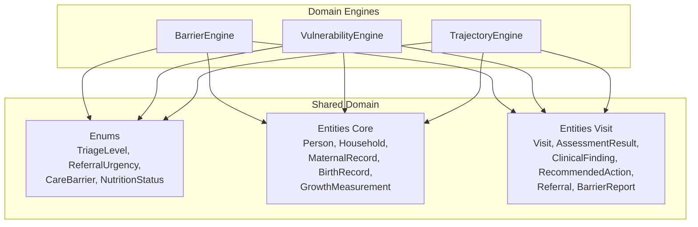
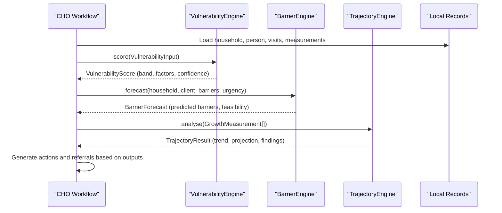
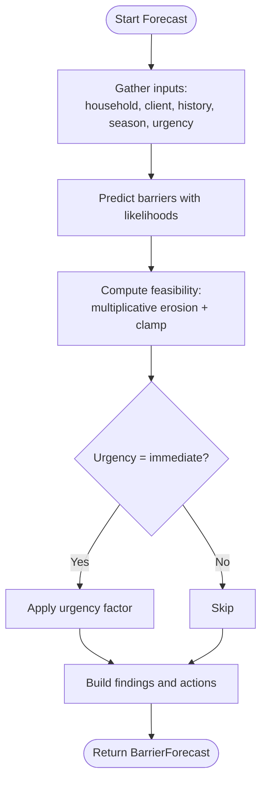
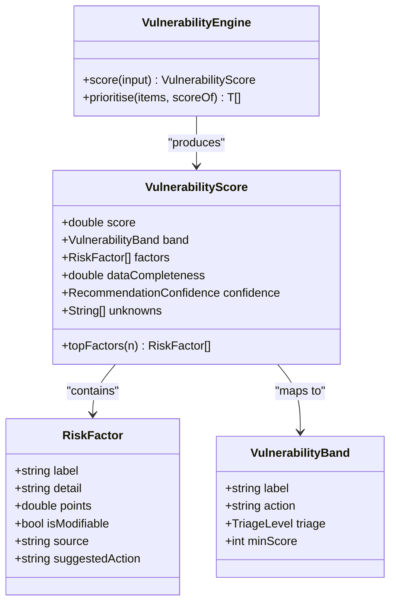
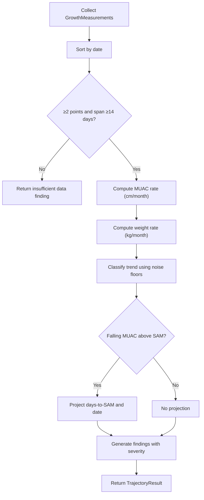
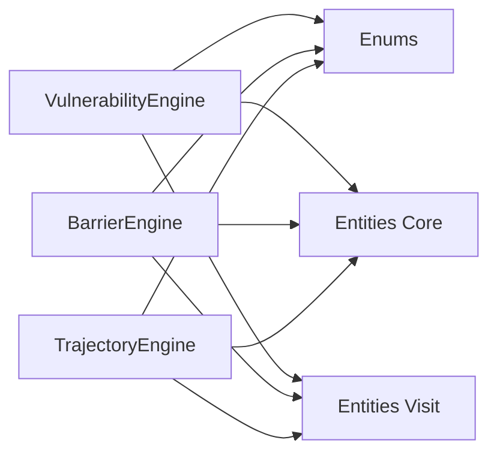

# AI-Powered Analysis Engines

<cite>
**Referenced Files in This Document**
- [barrier_engine.dart](file://lib/domain/engines/barrier_engine.dart)
- [vulnerability_engine.dart](file://lib/domain/engines/vulnerability_engine.dart)
- [trajectory_engine.dart](file://lib/domain/engines/trajectory_engine.dart)
- [enums.dart](file://lib/domain/enums.dart)
- [core.dart](file://lib/domain/entities/core.dart)
- [visit.dart](file://lib/domain/entities/visit.dart)
- [barrier_engine_test.dart](file://test/engines/barrier_engine_test.dart)
- [vulnerability_engine_test.dart](file://test/engines/vulnerability_engine_test.dart)
- [trajectory_engine_test.dart](file://test/engines/trajectory_engine_test.dart)
</cite>

## Table of Contents
1. [Introduction](#introduction)
2. [Project Structure](#project-structure)
3. [Core Components](#core-components)
4. [Architecture Overview](#architecture-overview)
5. [Detailed Component Analysis](#detailed-component-analysis)
6. [Dependency Analysis](#dependency-analysis)
7. [Performance Considerations](#performance-considerations)
8. [Troubleshooting Guide](#troubleshooting-guide)
9. [Conclusion](#conclusion)
10. [Appendices](#appendices)

## Introduction
This document explains CareBridge AI’s analysis engines that power:
- Barrier prediction for referrals (why a family may not complete care)
- Vulnerability scoring (household-level risk ranking with actionable factors)
- Trajectory analysis (growth trend detection and early warning for malnutrition)

The engines are designed to be transparent, auditable, and grounded in published clinical thresholds and local epidemiology. They produce explainable findings, confidence levels, and recommended actions that integrate with referral workflows and community health operations.

## Project Structure
The analysis engines live under the domain layer and rely on shared enumerations and entities for consistent data modeling and triage semantics. Tests validate behavior and guardrails such as score capping, pattern detection thresholds, and trend classification.

**Diagram sources**
- [barrier_engine.dart](file://lib/domain/engines/barrier_engine.dart)
- [vulnerability_engine.dart](file://lib/domain/engines/vulnerability_engine.dart)
- [trajectory_engine.dart](file://lib/domain/engines/trajectory_engine.dart)
- [enums.dart](file://lib/domain/enums.dart)
- [core.dart](file://lib/domain/entities/core.dart)
- [visit.dart](file://lib/domain/entities/visit.dart)

**Section sources**
- [barrier_engine.dart](file://lib/domain/engines/barrier_engine.dart)
- [vulnerability_engine.dart](file://lib/domain/engines/vulnerability_engine.dart)
- [trajectory_engine.dart](file://lib/domain/engines/trajectory_engine.dart)
- [enums.dart](file://lib/domain/enums.dart)
- [core.dart](file://lib/domain/entities/core.dart)
- [visit.dart](file://lib/domain/entities/visit.dart)

## Core Components
- Barrier Engine: Predicts barriers to completing a referral and estimates feasibility; aggregates barrier reports into systemic patterns for escalation.
- Vulnerability Engine: Computes an additive, inspectable household vulnerability score from multiple clinical, access, and behavioral factors; outputs bands, modifiable factors, and confidence.
- Trajectory Engine: Analyzes growth measurements over time to detect falling or static trends, projects when MUAC would reach SAM threshold, and generates early-action findings.

Key output types include ClinicalFinding, RecommendedAction, and engine-specific results (BarrierForecast, VulnerabilityScore, TrajectoryResult). Confidence is expressed via RecommendationConfidence.

**Section sources**
- [barrier_engine.dart](file://lib/domain/engines/barrier_engine.dart)
- [vulnerability_engine.dart](file://lib/domain/engines/vulnerability_engine.dart)
- [trajectory_engine.dart](file://lib/domain/engines/trajectory_engine.dart)
- [visit.dart](file://lib/domain/entities/visit.dart)
- [enums.dart](file://lib/domain/enums.dart)

## Architecture Overview
The three engines share common inputs and outputs through well-defined domain models. The flow below shows how a visit produces assessments that feed into referral planning and follow-up scheduling.

**Diagram sources**
- [vulnerability_engine.dart](file://lib/domain/engines/vulnerability_engine.dart)
- [barrier_engine.dart](file://lib/domain/engines/barrier_engine.dart)
- [trajectory_engine.dart](file://lib/domain/engines/trajectory_engine.dart)
- [visit.dart](file://lib/domain/entities/visit.dart)
- [core.dart](file://lib/domain/entities/core.dart)

## Detailed Component Analysis

### Barrier Prediction Engine
Purpose:
- Predict likely barriers preventing a referral completion before it is issued.
- Estimate referral feasibility by combining predicted barriers and urgency.
- Aggregate reported barriers across households to identify systemic issues and propose targeted escalations.

Inputs:
- Household context (walking time, NHIS status, family size)
- Client context (age, decision-maker presence)
- History (previously reported barriers, missed contacts)
- Contextual signals (month/season, night-time, urgency)

Algorithm highlights:
- Previously reported barriers receive high likelihood and a specific preemptive action.
- Distance and transport rules assign likelihoods based on walking time thresholds.
- Cost and insurance status influence likelihood of cost-related barriers.
- Seasonal and temporal factors adjust likelihoods for road/farm/work constraints.
- Feasibility is computed multiplicatively from predicted barriers and clamped within bounds; urgency applies a small additional reduction.

Outputs:
- Predicted barriers with likelihood labels (Possible/Likely/Very likely), basis, and preemptive action.
- Referral feasibility score and note.
- Findings and recommended actions prioritized by urgency.

Pattern detection:
- Aggregates BarrierReport entries across households.
- Filters by minimum household count to avoid noise.
- Produces interpretation and escalation guidance per barrier type.

Risk classification and thresholds:
- Likelihood labels derived from numeric thresholds.
- Feasibility below a defined threshold triggers higher severity findings and immediate actions.

Integration with referrals:
- Actions align with ReferralUrgency and TriageLevel conventions.
- Systemic patterns map to concrete escalation steps (e.g., facility staffing, transport fund, outreach hours).

**Diagram sources**
- [barrier_engine.dart](file://lib/domain/engines/barrier_engine.dart)

**Section sources**
- [barrier_engine.dart](file://lib/domain/engines/barrier_engine.dart)
- [barrier_engine_test.dart](file://test/engines/barrier_engine_test.dart)
- [enums.dart](file://lib/domain/enums.dart)
- [visit.dart](file://lib/domain/entities/visit.dart)

### Vulnerability Scoring Engine
Purpose:
- Produce an additive, auditable vulnerability score for a household.
- Separate modifiable vs non-modifiable factors to guide actionable next steps.
- Provide confidence reflecting data completeness and signal strength.

Inputs:
- Maternal record (gestation, losses, caesarean history, ANC contacts, postpartum days)
- Mother vitals (haemoglobin, MUAC, age)
- Birth records (birth weight, preterm, resuscitation need, plurality)
- Children and latest growth (MUAC, oedema, weight)
- Household context (distance, NHIS, family size)
- Behavioral/access signals (missed contacts, reported barriers, days since last contact, overdue vaccines, month/season)

Scoring methodology:
- Each factor contributes points according to established thresholds and literature.
- Total score is capped at 100 to reflect operational limits (“go now” beyond a point).
- Data completeness is calculated as available inputs divided by desired inputs.
- Confidence is assigned based on completeness and presence of hard signals.

Bands and triage mapping:
- Bands (critical/high/moderate/low) map to TriageLevel and action cadence.
- Band selection uses minimum score thresholds.

Modifiable factors:
- Separated list of factors the CHO can change in the near term, each with suggested actions.

Prioritization:
- Houses with unknown data are prioritized above genuinely low-risk ones to reduce “silent” danger.

**Diagram sources**
- [vulnerability_engine.dart](file://lib/domain/engines/vulnerability_engine.dart)
- [enums.dart](file://lib/domain/enums.dart)

Mathematical model summary:
- Score = sum(points_i) clamped to [0, 100]
- Completeness = available_inputs / desired_inputs
- Confidence function depends on completeness and presence of hard signals (e.g., points >= 25)

Interpretation guidelines:
- Critical/High bands require same-day or this-week action.
- Modifiable factors drive the “what to do” list.
- Unknowns highlight where quick data collection raises confidence.

**Section sources**
- [vulnerability_engine.dart](file://lib/domain/engines/vulnerability_engine.dart)
- [vulnerability_engine_test.dart](file://test/engines/vulnerability_engine_test.dart)
- [enums.dart](file://lib/domain/enums.dart)
- [core.dart](file://lib/domain/entities/core.dart)
- [visit.dart](file://lib/domain/entities/visit.dart)

### Trajectory Analysis Engine
Purpose:
- Detect whether a child’s growth is falling or static even when individual readings appear acceptable.
- Project when MUAC would reach the severe acute malnutrition (SAM) threshold if current rates continue.
- Generate early-action findings to intervene before crossing cut-offs.

Inputs:
- Ordered GrowthMeasurement series (MUAC, weight, oedema flags, timestamps)

Algorithm highlights:
- Sort measurements chronologically; require at least two points separated by ≥14 days.
- Compute slopes using least-squares regression per metric (MUAC cm/month, weight kg/month).
- Classify trend based on normalized rates relative to noise floors.
- If MUAC is falling and above SAM threshold, project days-to-SAM and date.

Outputs:
- Trend classification (falling/flat/rising/insufficient data)
- Rates per month for MUAC and weight
- Days-to-SAM and projected date (when applicable)
- Findings with severity mapped to TriageLevel and explanatory text

Thresholds and constants:
- SAM MUAC threshold used for projection
- Noise floor for MUAC to avoid false trends due to measurement variability
- Weight loss thresholds trigger priority findings

**Diagram sources**
- [trajectory_engine.dart](file://lib/domain/engines/trajectory_engine.dart)
- [core.dart](file://lib/domain/entities/core.dart)

**Section sources**
- [trajectory_engine.dart](file://lib/domain/engines/trajectory_engine.dart)
- [trajectory_engine_test.dart](file://test/engines/trajectory_engine_test.dart)
- [core.dart](file://lib/domain/entities/core.dart)

## Dependency Analysis
Engines depend on shared enums and entities for consistent semantics:
- Enums define triage levels, referral urgency, nutrition pathways, and barrier categories.
- Entities define persons, households, maternal/birth records, growth measurements, and assessment/referral structures.

**Diagram sources**
- [vulnerability_engine.dart](file://lib/domain/engines/vulnerability_engine.dart)
- [barrier_engine.dart](file://lib/domain/engines/barrier_engine.dart)
- [trajectory_engine.dart](file://lib/domain/engines/trajectory_engine.dart)
- [enums.dart](file://lib/domain/enums.dart)
- [core.dart](file://lib/domain/entities/core.dart)
- [visit.dart](file://lib/domain/entities/visit.dart)

**Section sources**
- [enums.dart](file://lib/domain/enums.dart)
- [core.dart](file://lib/domain/entities/core.dart)
- [visit.dart](file://lib/domain/entities/visit.dart)

## Performance Considerations
- All engines operate locally with minimal dependencies, suitable for offline use in field settings.
- Complexity is linear in the number of inputs (factors, measurements, reports), keeping computations fast on mobile devices.
- Least-squares slope computation is O(n) per metric and only invoked when sufficient data exists.
- Score capping and clamping ensure stable outputs without overflow or extreme values.

[No sources needed since this section provides general guidance]

## Troubleshooting Guide
Common issues and resolutions:
- Insufficient data:
  - Trajectory engine requires at least two measurements separated by ≥14 days. Ensure regular growth monitoring.
  - Vulnerability engine lowers confidence when many inputs are missing; collect key measurements to raise confidence.
- Unexpected low feasibility:
  - Barrier engine reduces feasibility when multiple barriers are predicted; address top barriers proactively before issuing referrals.
- Pattern detection not triggering:
  - Barrier pattern detection requires a minimum number of distinct households reporting the same barrier; verify data aggregation scope.
- Score capping:
  - Vulnerability scores are capped at 100; focus on reducing modifiable factors rather than chasing higher numbers.

Operational checks:
- Validate that BarrierReports are recorded with correct household IDs and barrier types.
- Confirm that GrowthMeasurements include timestamps and MUAC/weight fields.
- Ensure referral urgency and triage levels are set consistently with engine outputs.

**Section sources**
- [barrier_engine_test.dart](file://test/engines/barrier_engine_test.dart)
- [vulnerability_engine_test.dart](file://test/engines/vulnerability_engine_test.dart)
- [trajectory_engine_test.dart](file://test/engines/trajectory_engine_test.dart)

## Conclusion
CareBridge AI’s engines provide transparent, evidence-based tools for:
- Anticipating and mitigating barriers to care completion
- Ranking household vulnerability with clear, actionable factors
- Detecting early deterioration in child growth trajectories

They integrate seamlessly with referral workflows, emphasize confidence and uncertainty, and produce findings and actions that frontline health workers can understand and act on immediately.

[No sources needed since this section summarizes without analyzing specific files]

## Appendices

### Input Data Requirements Summary
- Barrier Engine:
  - Household walking time, NHIS status, family size
  - Client age, decision-maker presence
  - Previously reported barriers, missed contacts
  - Month/season, night-time flag, referral urgency
- Vulnerability Engine:
  - Maternal record (gestation, losses, ANC, postpartum days)
  - Mother haemoglobin, MUAC, age
  - Birth records (weight, preterm, resuscitation, plurality)
  - Child growth (MUAC, weight, oedema), overdue vaccines
  - Household distance, NHIS, family size
  - Missed contacts, days since last contact, month/season
- Trajectory Engine:
  - Chronological GrowthMeasurements with MUAC/weight and timestamps

**Section sources**
- [barrier_engine.dart](file://lib/domain/engines/barrier_engine.dart)
- [vulnerability_engine.dart](file://lib/domain/engines/vulnerability_engine.dart)
- [trajectory_engine.dart](file://lib/domain/engines/trajectory_engine.dart)
- [core.dart](file://lib/domain/entities/core.dart)
- [visit.dart](file://lib/domain/entities/visit.dart)

### Scoring Methodologies and Thresholds
- Vulnerability score: additive points per factor, capped at 100; bands determined by minimum score thresholds; confidence based on completeness and hard signals.
- Barrier feasibility: multiplicative erosion from predicted barriers, clamped; urgency adjustment applied.
- Trajectory rates: least-squares slopes per 30 days; SAM projection uses MUAC threshold and noise floor.

**Section sources**
- [vulnerability_engine.dart](file://lib/domain/engines/vulnerability_engine.dart)
- [barrier_engine.dart](file://lib/domain/engines/barrier_engine.dart)
- [trajectory_engine.dart](file://lib/domain/engines/trajectory_engine.dart)

### Integration with Referral Systems
- Outputs map to TriageLevel and ReferralUrgency for consistent downstream handling.
- Barrier predictions inform preemptive actions and escalation paths.
- Vulnerability bands drive visit prioritization and follow-up cadence.
- Trajectory findings generate early-action recommendations aligned with IMCI and WHO protocols.

**Section sources**
- [enums.dart](file://lib/domain/enums.dart)
- [visit.dart](file://lib/domain/entities/visit.dart)
- [barrier_engine.dart](file://lib/domain/engines/barrier_engine.dart)
- [vulnerability_engine.dart](file://lib/domain/engines/vulnerability_engine.dart)
- [trajectory_engine.dart](file://lib/domain/engines/trajectory_engine.dart)