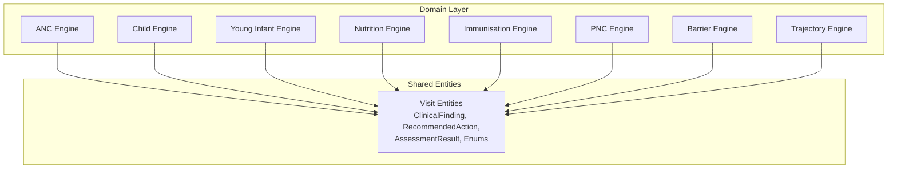
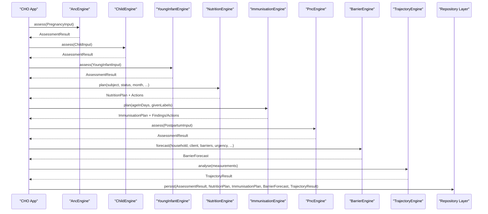

# Clinical Assessment Engines

<cite>
**Referenced Files in This Document**
- [anc_engine.dart](file://lib/domain/engines/anc_engine.dart)
- [child_engine.dart](file://lib/domain/engines/child_engine.dart)
- [young_infant_engine.dart](file://lib/domain/engines/young_infant_engine.dart)
- [nutrition_engine.dart](file://lib/domain/engines/nutrition_engine.dart)
- [immunisation_engine.dart](file://lib/domain/engines/immunisation_engine.dart)
- [pnc_engine.dart](file://lib/domain/engines/pnc_engine.dart)
- [barrier_engine.dart](file://lib/domain/engines/barrier_engine.dart)
- [trajectory_engine.dart](file://lib/domain/engines/trajectory_engine.dart)
- [visit.dart](file://lib/domain/entities/visit.dart)
- [pubspec.yaml](file://pubspec.yaml)
</cite>

## Table of Contents
1. [Introduction](#introduction)
2. [Project Structure](#project-structure)
3. [Core Components](#core-components)
4. [Architecture Overview](#architecture-overview)
5. [Detailed Component Analysis](#detailed-component-analysis)
6. [Dependency Analysis](#dependency-analysis)
7. [Performance Considerations](#performance-considerations)
8. [Troubleshooting Guide](#troubleshooting-guide)
9. [Conclusion](#conclusion)
10. [Appendices](#appendices)

## Introduction
This document provides comprehensive documentation for CareBridge AI’s clinical assessment engines implemented in the domain layer. It covers Antenatal Care (ANC), Child Health Assessment, Nutrition Screening, Immunization Tracking, Postnatal Care (PNC), and Young Infant Assessment engines. For each engine, we detail input parameters, validation rules, scoring algorithms, output formats, clinical protocols followed, decision trees used, integration with the overall care workflow, examples of inputs and expected outputs, error handling patterns, and how results integrate with the repository layer via shared entities.

The engines are designed for community health workers (CHOs) operating offline-first, using standardized protocols such as WHO ANC 2016, IMCI for sick child and young infant, Ghana EPI schedule, and Ghana PNC schedule. They produce structured findings, recommended actions, triage levels, and referral capabilities to guide CHO decisions and close the loop between community and facility care.

## Project Structure
The assessment engines reside under lib/domain/engines and share common types defined in lib/domain/entities/visit.dart. The project is a Flutter application configured via pubspec.yaml.



**Diagram sources**
- [anc_engine.dart:158-188](file://lib/domain/engines/anc_engine.dart#L158-L188)
- [child_engine.dart:196-226](file://lib/domain/engines/child_engine.dart#L196-L226)
- [young_infant_engine.dart:131-156](file://lib/domain/engines/young_infant_engine.dart#L131-L156)
- [nutrition_engine.dart:116-131](file://lib/domain/engines/nutrition_engine.dart#L116-L131)
- [immunisation_engine.dart:275-301](file://lib/domain/engines/immunisation_engine.dart#L275-L301)
- [pnc_engine.dart:164-194](file://lib/domain/engines/pnc_engine.dart#L164-L194)
- [barrier_engine.dart:110-141](file://lib/domain/engines/barrier_engine.dart#L110-L141)
- [trajectory_engine.dart:80-115](file://lib/domain/engines/trajectory_engine.dart#L80-L115)
- [visit.dart:123-147](file://lib/domain/entities/visit.dart#L123-L147)

**Section sources**
- [pubspec.yaml:1-67](file://pubspec.yaml#L1-L67)

## Core Components
Each engine follows a consistent pattern:
- Input model class encapsulating all measurable fields and contextual flags.
- Static assess or plan method that computes findings, actions, triage level, classifications, missing data, and capability needs.
- Output integrates into shared entities: ClinicalFinding, RecommendedAction, and AssessmentResult.

Key shared entities:
- ClinicalFinding: label, detail, severity, protocolSource, measuredValue, threshold, weight.
- RecommendedAction: instruction, urgency, rationale, protocolSource, flags (isReferral, isTreatment, isCounselling).
- AssessmentResult: clientType, triage, classification, findings, actions, confidence, protocolSource, nutritionStatus/pathway, dangerSignsPresent, missingData, referralCapabilitiesNeeded, followUpInDays, caregiverMessage.

These ensure interoperability across engines and downstream UI, reporting, and repository persistence.

**Section sources**
- [visit.dart:123-147](file://lib/domain/entities/visit.dart#L123-L147)
- [visit.dart:150-172](file://lib/domain/entities/visit.dart#L150-L172)
- [visit.dart:240-272](file://lib/domain/entities/visit.dart#L240-L272)

## Architecture Overview
Engines operate independently but converge on a unified result format. Some engines also feed into others (e.g., nutrition status from ANC/PNC feeds into NutritionEngine; growth measurements feed TrajectoryEngine). BarrierEngine and VulnerabilityEngine provide risk context and predictive insights for visit prioritization and referral feasibility.



**Diagram sources**
- [anc_engine.dart:158-188](file://lib/domain/engines/anc_engine.dart#L158-L188)
- [child_engine.dart:196-226](file://lib/domain/engines/child_engine.dart#L196-L226)
- [young_infant_engine.dart:131-156](file://lib/domain/engines/young_infant_engine.dart#L131-L156)
- [nutrition_engine.dart:116-131](file://lib/domain/engines/nutrition_engine.dart#L116-L131)
- [immunisation_engine.dart:275-301](file://lib/domain/engines/immunisation_engine.dart#L275-L301)
- [pnc_engine.dart:164-194](file://lib/domain/engines/pnc_engine.dart#L164-L194)
- [barrier_engine.dart:110-141](file://lib/domain/engines/barrier_engine.dart#L110-L141)
- [trajectory_engine.dart:80-115](file://lib/domain/engines/trajectory_engine.dart#L80-L115)

## Detailed Component Analysis

### Antenatal Care (ANC) Engine
- Protocol: WHO ANC 2016 (eight contacts) and Ghana Safe Motherhood.
- Inputs: gestationalWeeks, maternalAgeYears, gravida, parity, previousLosses, previousCaesarean, previousStillbirth, previousPostpartumHaemorrhage, plurality, BP (systolic/diastolic), haemoglobin, weightKg, heightCm, muacCm, fundalHeightCm, foetalHeartRate, proteinuria, danger signs (vaginal bleeding, severe headache, blurred vision, convulsions, severe abdominal pain, reduced/no foetal movement, leaking fluid, fever, swelling of face/hands, difficulty breathing, painful urination, persistent vomiting), ancContactsCompleted, iptpDoses, tdDoses, iron/folate use, net use, HIV/syphilis testing, birth plan, planned delivery place, NHIS status, walkingMinutesToFacility, skilled support at home.
- Validation rules:
  - Hypertension thresholds: >= 140/90; severe >= 160/110.
  - Anaemia thresholds: < 11 g/dL (mild), 7–9.9 (moderate), < 7 (severe).
  - IPTp-SP starts at 16 weeks, monthly, minimum 3 doses.
  - Expected contacts by gestational week computed against [12,20,26,30,34,36,38,40].
- Scoring algorithm:
  - Adds weighted ClinicalFindings per protocol sections (obstetric emergencies, anaemia, nutrition, standing risk, coverage gaps, birth preparedness).
  - Urgent findings populate dangerSigns and drive immediate referral actions.
  - Missing measurements flagged explicitly.
- Outputs:
  - AssessmentResult with triage, classification, findings, actions, confidence, protocolSource, nutritionStatus/pathway, dangerSignsPresent, missingData, referralCapabilitiesNeeded, followUpInDays, caregiverMessage.
- Decision tree highlights:
  - Obstetric emergencies first (eclampsia, severe pre-eclampsia, antepartum haemorrhage, severe abdominal pain, abnormal foetal heart rate, preterm rupture of membranes).
  - Anaemia stratification drives severity and referral capability needs.
  - Coverage gaps (contacts, IPTp, tetanus, nets, iron/folate, HIV/syphilis tests) generate counselling actions.
  - Birth preparedness checks influence urgency and referral planning.

Example inputs and outputs:
- Input example path: [anc_engine.dart:25-78](file://lib/domain/engines/anc_engine.dart#L25-L78)
- Output assembly path: [anc_engine.dart:158-188](file://lib/domain/engines/anc_engine.dart#L158-L188)

Error handling patterns:
- Missing critical measurements (BP, fundal height, foetal heart) recorded in missing list.
- Severe conditions trigger urgent triage and explicit referral actions.

Integration points:
- Feeds nutrition status/pathway into NutritionEngine when MUAC available.
- Produces capabilities needed for referral (caesarean, blood transfusion, laboratory, delivery, newborn care).

**Section sources**
- [anc_engine.dart:158-188](file://lib/domain/engines/anc_engine.dart#L158-L188)
- [anc_engine.dart:192-268](file://lib/domain/engines/anc_engine.dart#L192-L268)
- [anc_engine.dart:396-440](file://lib/domain/engines/anc_engine.dart#L396-L440)
- [anc_engine.dart:591-651](file://lib/domain/engines/anc_engine.dart#L591-L651)
- [anc_engine.dart:710-777](file://lib/domain/engines/anc_engine.dart#L710-L777)
- [anc_engine.dart:782-800](file://lib/domain/engines/anc_engine.dart#L782-L800)

### Child Health Assessment Engine (IMCI 2–59 months)
- Protocol: WHO IMCI Sick Child (2–59 months).
- Inputs: ageInMonths, respiratoryRate, temperatureCelsius, weightKg, heightCm, muacCm, bilateral oedema, general danger signs (unable to drink/breastfeed, vomits everything, convulsions, lethargic/unconscious, convulsing now), cough/difficult breathing indicators, diarrhoea/dehydration signs, fever/malaria RDT, ear problems, anaemia indicators, feeding practices (still breastfeeding, meals/day, food groups eaten yesterday, appetite test), immunisation/up-to-date status, vitamin A/deworming, NHIS/walking distance.
- Validation rules:
  - Fast-breathing thresholds: >= 50/min (2–11 months), >= 40/min (12–59 months).
  - Fever: >= 37.5°C or reported.
  - MUAC bands: SAM < 11.5 cm, MAM 11.5–12.4 cm.
  - Bilateral pitting oedema = SAM regardless of MUAC.
- Scoring algorithm:
  - General danger signs override subsequent sections and classify as very severe disease.
  - Cough/difficult breathing classified into severe pneumonia/pneumonia/cough-cold based on chest indrawing/stridor/fast breathing.
  - Diarrhoea dehydration assessed via Plan A/B/C criteria.
  - Fever pathway includes malaria RDT interpretation and measles complications.
  - Ear infection severity determined by duration and complications.
  - Nutrition pathway determines SAM/MAM/at-risk/normal and therapeutic vs supplementary vs preventive counselling.
- Outputs:
  - AssessmentResult with triage, classification, findings, actions, confidence, protocolSource, nutritionStatus/pathway, dangerSignsPresent, missingData, referralCapabilitiesNeeded, followUpInDays, caregiverMessage.
- Decision tree highlights:
  - Danger signs first, then respiratory, diarrhoea, fever, ear, nutrition, immunisation.
  - SAM complicated vs uncomplicated decides inpatient vs OTP pathway.

Example inputs and outputs:
- Input example path: [child_engine.dart:26-101](file://lib/domain/engines/child_engine.dart#L26-L101)
- Output assembly path: [child_engine.dart:196-226](file://lib/domain/engines/child_engine.dart#L196-L226)

Error handling patterns:
- Missing respiratory rate prevents pneumonia exclusion; flagged in missing.
- Malaria RDT not done triggers action to test before treatment.

Integration points:
- Feeds nutrition status/pathway into NutritionEngine.
- Generates specific treatment actions (ORS/zinc, amoxicillin, artemether-lumefantrine, vitamin A).

**Section sources**
- [child_engine.dart:196-226](file://lib/domain/engines/child_engine.dart#L196-L226)
- [child_engine.dart:275-331](file://lib/domain/engines/child_engine.dart#L275-L331)
- [child_engine.dart:366-469](file://lib/domain/engines/child_engine.dart#L366-L469)
- [child_engine.dart:474-614](file://lib/domain/engines/child_engine.dart#L474-L614)
- [child_engine.dart:655-763](file://lib/domain/engines/child_engine.dart#L655-L763)

### Young Infant Assessment Engine (IMCI 0–59 days)
- Protocol: WHO IMCI Sick Young Infant (0–59 days).
- Inputs: ageInDays, respiratoryRate, temperatureCelsius, weightKg, birthWeightKg, gestationWeeksAtBirth, multiple birth flag, deliveryPlace, requiredResuscitation, danger signs (not feeding well/unable to feed, convulsions, reduced movement/no movement, severe chest indrawing, bulging fontanelle), local infections (umbilical redness/draining, skin pustules count), jaundice indicators, diarrhoea/dehydration signs, feeding assessment (breastfeeds/day, attachment, suckling effectiveness, other foods/drinks, oral thrush, early initiation).
- Validation rules:
  - Fast breathing >= 60/min; fever >= 37.5°C; hypothermia < 35.5°C.
  - Severe jaundice criteria: onset within 24 hours, yellow palms/soles, or >14 days.
- Scoring algorithm:
  - Pink row signs (feeding issues, movement, respiration, temperature, bulging fontanelle, umbilical spread, many pustules) classified as severe infection/very severe disease requiring urgent referral.
  - Jaundice severity determines urgent referral vs priority follow-up.
  - Dehydration assessed via IMCI Plan C for severe; any dehydration in young infants escalates to urgent.
  - Pneumonia in young infant always classified as severe and referred after first antibiotic dose.
  - Local bacterial infections treated with oral amoxicillin and review.
  - Feeding problems addressed with positioning/attachment counseling.
  - Birth-related vulnerability flags (low birth weight, preterm, multiple birth, unattended delivery, resuscitation need) add priority findings and capabilities.
- Outputs:
  - AssessmentResult with triage, classification, findings, actions, confidence, protocolSource, dangerSignsPresent, missingData, referralCapabilitiesNeeded, followUpInDays, caregiverMessage.
- Decision tree highlights:
  - Referral-biased design: missing data escalates rather than reassures.
  - First-week-of-life fast breathing classified as severe disease.

Example inputs and outputs:
- Input example path: [young_infant_engine.dart:28-74](file://lib/domain/engines/young_infant_engine.dart#L28-L74)
- Output assembly path: [young_infant_engine.dart:131-156](file://lib/domain/engines/young_infant_engine.dart#L131-L156)

Error handling patterns:
- Missing temperature/respiratory rate reduces confidence to low/moderate.
- Any severe sign inserts immediate referral action at top of actions list.

Integration points:
- Adds capabilities like newbornCare/laboratory for urgent referrals.
- Provides caregiver message emphasizing return-immediately signs.

**Section sources**
- [young_infant_engine.dart:131-156](file://lib/domain/engines/young_infant_engine.dart#L131-L156)
- [young_infant_engine.dart:157-255](file://lib/domain/engines/young_infant_engine.dart#L157-L255)
- [young_infant_engine.dart:260-301](file://lib/domain/engines/young_infant_engine.dart#L260-L301)
- [young_infant_engine.dart:365-401](file://lib/domain/engines/young_infant_engine.dart#L365-L401)
- [young_infant_engine.dart:437-488](file://lib/domain/engines/young_infant_engine.dart#L437-L488)
- [young_infant_engine.dart:493-596](file://lib/domain/engines/young_infant_engine.dart#L493-L596)
- [young_infant_engine.dart:615-631](file://lib/domain/engines/young_infant_engine.dart#L615-L631)
- [young_infant_engine.dart:635-705](file://lib/domain/engines/young_infant_engine.dart#L635-L705)

### Nutrition Screening Engine
- Purpose: Converts nutrition classification into actionable plans tailored to season, cost, and age.
- Inputs: subject (child/pregnantWoman/breastfeedingWoman), status (severeAcute/moderateAcute/atRisk/normal), month, ageMonths, stillBreastfeeding, groupsEatenYesterday, maxCostTier, hasBilateralOedema, appetiteTestPassed, hasAnyDangerSign, isAnaemic.
- Scoring algorithm:
  - Pathway determination: SAM complicated -> inpatient therapeutic; SAM uncomplicated -> outpatient therapeutic; MAM/atRisk -> supplementary feeding; normal -> preventive counselling.
  - Suggestions built from local foods filtered by nutrient focus (energy/protein/iron/vitaminA), seasonality, and cost constraints.
  - Diversity gaps filled for complementary feeding window (6–23 months).
  - Meal targets derived from age and breastfeeding status.
- Outputs:
  - NutritionPlan with status, pathway, headline, seasonNote, suggestions, feedingRules, mealsPerDayTarget, diversityGapsFilled, therapeuticFoodRequired, reviewInDays.
  - asActions() converts plan into RecommendedAction entries for integration into AssessmentResult.
- Decision tree highlights:
  - SAM requires therapeutic food; home-diet advice withheld as treatment.
  - Seasonal lean/harvest notes shape recommendations.

Example inputs and outputs:
- Input example path: [nutrition_engine.dart:116-131](file://lib/domain/engines/nutrition_engine.dart#L116-L131)
- Output assembly path: [nutrition_engine.dart:146-187](file://lib/domain/engines/nutrition_engine.dart#L146-L187)
- Action conversion path: [nutrition_engine.dart:493-518](file://lib/domain/engines/nutrition_engine.dart#L493-L518)

Error handling patterns:
- Explicitly avoids inappropriate advice for SAM (no porridge-only guidance).
- Flags therapeuticFoodRequired to prevent misclassification of treatment.

Integration points:
- Used by ANC/PNC engines to derive nutrition status/pathway from MUAC.
- Supplies RecommendedAction items merged into assessments.

**Section sources**
- [nutrition_engine.dart:116-131](file://lib/domain/engines/nutrition_engine.dart#L116-L131)
- [nutrition_engine.dart:146-187](file://lib/domain/engines/nutrition_engine.dart#L146-L187)
- [nutrition_engine.dart:329-358](file://lib/domain/engines/nutrition_engine.dart#L329-L358)
- [nutrition_engine.dart:360-384](file://lib/domain/engines/nutrition_engine.dart#L360-L384)
- [nutrition_engine.dart:493-518](file://lib/domain/engines/nutrition_engine.dart#L493-L518)

### Immunization Tracking Engine (Ghana EPI)
- Protocol: Ghana Expanded Programme on Immunisation schedule.
- Inputs: ageInDays, givenLabels (set of vaccine labels already received).
- Scoring algorithm:
  - Iterates through schedule defining dueAtWeeks, minIntervalWeeks, maxAgeWeeks per antigen.
  - Determines status: given, dueToday, overdue, notYetDue, ageBarred.
  - Enforces minimum intervals and age limits (e.g., rotavirus cannot start after 15 weeks).
  - Computes giveToday list and overdue list with weeksOverdue.
  - Summarizes next due date and whether fully up-to-date.
- Outputs:
  - ImmunisationPlan with items, giveToday, overdue, summary, isFullyUpToDate, nextDueInDays, nextDueLabel.
  - asAssessmentParts() converts to ClinicalFinding and RecommendedAction lists for integration.
- Decision tree highlights:
  - Age-barred antigens excluded with counseling alternatives.
  - Overdue doses grouped with grace period logic.

Example inputs and outputs:
- Input example path: [immunisation_engine.dart:275-301](file://lib/domain/engines/immunisation_engine.dart#L275-L301)
- Output assembly path: [immunisation_engine.dart:390-401](file://lib/domain/engines/immunisation_engine.dart#L390-L401)
- Assessment parts path: [immunisation_engine.dart:434-488](file://lib/domain/engines/immunisation_engine.dart#L434-L488)

Error handling patterns:
- Grace period prevents premature labeling of overdue.
- Age restrictions enforced to avoid unsafe late administration.

Integration points:
- Findings/actions merged into assessments to prompt vaccination during sick visits.

**Section sources**
- [immunisation_engine.dart:275-301](file://lib/domain/engines/immunisation_engine.dart#L275-L301)
- [immunisation_engine.dart:390-401](file://lib/domain/engines/immunisation_engine.dart#L390-L401)
- [immunisation_engine.dart:434-488](file://lib/domain/engines/immunisation_engine.dart#L434-L488)

### Postnatal Care (PNC) Engine
- Protocol: Ghana PNC schedule (day 1, day 3, day 7, week 6) plus WHO postnatal recommendations.
- Inputs: daysSinceDelivery, maternalAgeYears, deliveryPlace/mode, plurality, hadPostpartumHaemorrhage, babyAlive, BP, temperatureCelsius, haemoglobin, muacCm, pulse, danger signs (heavy bleeding, foul-smelling discharge, fever, severe headache/blurred vision, convulsions, severe abdominal pain, painful swollen leg, difficulty breathing, breast pain/lump, cracked nipples, painful urination, perineal pain/pus, caesarean wound red/draining, faecal/urinary leakage, dizziness/fainting), presentingComplaint, mental health screening, breastfeeding establishment, family planning discussion/acceptance, iron/folate/vitamin A, NHIS/walking distance, pncContactsCompleted.
- Validation rules:
  - Fever threshold >= 38.0°C or reported.
  - Hypertension >= 140/90; severe >= 160/110.
  - Tachycardia > 110 bpm.
  - Time windows: first day, first week, within puerperium (<=42 days).
- Scoring algorithm:
  - Postpartum haemorrhage and sepsis signs evaluated first; urgent triage and immediate referral actions.
  - Pre-eclampsia/eclampsia pathways with magnesium sulphate guidance.
  - Thrombosis and other serious causes (leg clot, breathlessness, fistula) escalate urgency.
  - Anaemia stratification and breastfeeding issues addressed.
  - Mental health screening integrated with referral actions.
  - Delivery circumstances and coverage gaps generate findings and actions.
- Outputs:
  - AssessmentResult with triage, classification, findings, actions, confidence, protocolSource, nutritionStatus/pathway, dangerSignsPresent, missingData, referralCapabilitiesNeeded, followUpInDays, caregiverMessage.
- Decision tree highlights:
  - Immediate referral for hemorrhage/sepsis/eclampsia.
  - Bereaved mother handling adjusted to prioritize psychosocial support.

Example inputs and outputs:
- Input example path: [pnc_engine.dart:24-83](file://lib/domain/engines/pnc_engine.dart#L24-L83)
- Output assembly path: [pnc_engine.dart:164-194](file://lib/domain/engines/pnc_engine.dart#L164-L194)

Error handling patterns:
- Missing BP/temperature flagged as critical for sepsis/pre-eclampsia detection.
- Urgent triage inserts immediate referral action at top of list.

Integration points:
- Feeds nutrition status/pathway from MUAC.
- Adds capabilities like bloodTransfusion/laboratory/newbornCare.

**Section sources**
- [pnc_engine.dart:164-194](file://lib/domain/engines/pnc_engine.dart#L164-L194)
- [pnc_engine.dart:198-292](file://lib/domain/engines/pnc_engine.dart#L198-L292)
- [pnc_engine.dart:318-362](file://lib/domain/engines/pnc_engine.dart#L318-L362)
- [pnc_engine.dart:406-434](file://lib/domain/engines/pnc_engine.dart#L406-L434)
- [pnc_engine.dart:439-506](file://lib/domain/engines/pnc_engine.dart#L439-L506)
- [pnc_engine.dart:511-544](file://lib/domain/engines/pnc_engine.dart#L511-L544)
- [pnc_engine.dart:620-680](file://lib/domain/engines/pnc_engine.dart#L620-L680)
- [pnc_engine.dart:685-693](file://lib/domain/engines/pnc_engine.dart#L685-L693)
- [pnc_engine.dart:698-788](file://lib/domain/engines/pnc_engine.dart#L698-L788)

### Barrier Engine
- Purpose: Predicts likely barriers to completing referrals and aggregates patterns across households.
- Inputs: Household, Person, previouslyReported barriers, missedContactsCount, urgency, month, isNightTime, childrenUnderFiveInHousehold, decisionMakerPresent.
- Scoring algorithm:
  - Predicts barriers based on distance, cost (NHIS), decision-making, household structure, seasonality, prior experience, and missed contacts.
  - Computes referralFeasibility score multiplicatively eroded by predicted barriers.
  - Generates findings and preemptive actions for top barriers.
  - Aggregates barrier reports into patterns with escalation guidance.
- Outputs:
  - BarrierForecast with predicted barriers, referralFeasibility, feasibilityNote, findings, actions.
  - detectPatterns returns BarrierPattern list for systemic issues.
- Decision tree highlights:
  - Previously reported barriers have highest likelihood.
  - Nighttime urgent referrals increase distance barrier probability.

Example inputs and outputs:
- Input example path: [barrier_engine.dart:110-141](file://lib/domain/engines/barrier_engine.dart#L110-L141)
- Output assembly path: [barrier_engine.dart:388-396](file://lib/domain/engines/barrier_engine.dart#L388-L396)
- Pattern detection path: [barrier_engine.dart:421-456](file://lib/domain/engines/barrier_engine.dart#L421-L456)

Error handling patterns:
- Feasibility clamped to realistic range; urgency adjusts feasibility slightly.
- Systemic patterns identified for escalation beyond individual interventions.

Integration points:
- Findings/actions merge into assessments to proactively address barriers before referral issuance.

**Section sources**
- [barrier_engine.dart:110-141](file://lib/domain/engines/barrier_engine.dart#L110-L141)
- [barrier_engine.dart:338-396](file://lib/domain/engines/barrier_engine.dart#L338-L396)
- [barrier_engine.dart:421-456](file://lib/domain/engines/barrier_engine.dart#L421-L456)

### Trajectory Engine
- Purpose: Analyzes growth trajectory using MUAC and weight measurements to detect deterioration and project time to SAM threshold.
- Inputs: List of GrowthMeasurement with muacCm/weightKg and takenAt timestamps.
- Scoring algorithm:
  - Sorts measurements chronologically; requires at least two points separated by >= 14 days.
  - Computes rates per month using least-squares regression for robustness.
  - Classifies trend as falling/flat/rising/insufficientData.
  - Projects days to SAM threshold if MUAC falling above 11.5 cm.
  - Flags new oedema appearance as urgent regardless of slope.
- Outputs:
  - TrajectoryResult with trend, pointsUsed, muacChangePerMonth, weightChangePerMonth, daysToSamThreshold, projectedSamDate, findings, explanation.
- Decision tree highlights:
  - Noise floor prevents overreacting to small measurement variations.
  - Already-in-SAM falling cases escalated to urgent.

Example inputs and outputs:
- Input example path: [trajectory_engine.dart:80-115](file://lib/domain/engines/trajectory_engine.dart#L80-L115)
- Output assembly path: [trajectory_engine.dart:248-264](file://lib/domain/engines/trajectory_engine.dart#L248-L264)

Error handling patterns:
- Insufficient data returns clear explanation and prompts for future measurements.
- Oedema appearance overrides slope-based analysis.

Integration points:
- Findings contribute to vulnerability scoring and early action justification.

**Section sources**
- [trajectory_engine.dart:80-115](file://lib/domain/engines/trajectory_engine.dart#L80-L115)
- [trajectory_engine.dart:131-151](file://lib/domain/engines/trajectory_engine.dart#L131-L151)
- [trajectory_engine.dart:248-264](file://lib/domain/engines/trajectory_engine.dart#L248-L264)

## Dependency Analysis
Engines depend on shared entities for consistent output formatting and cross-engine integration. Some engines reference enums and constants defined elsewhere (e.g., TriageLevel, ClientType, NutritionStatus, NutritionPathway, ReferralUrgency).

```mermaid
classDiagram
class AncEngine {
+assess(PregnancyInput) AssessmentResult
}
class ChildEngine {
+assess(ChildInput) AssessmentResult
}
class YoungInfantEngine {
+assess(YoungInfantInput) AssessmentResult
}
class NutritionEngine {
+plan(...) NutritionPlan
+asActions(NutritionPlan) RecommendedAction[]
}
class ImmunisationEngine {
+plan(...) ImmunisationPlan
+asAssessmentParts(...) ({ClinicalFinding[], RecommendedAction[]})
}
class PncEngine {
+assess(PostpartumInput) AssessmentResult
}
class BarrierEngine {
+forecast(...) BarrierForecast
+detectPatterns(...) BarrierPattern[]
}
class TrajectoryEngine {
+analyse(GrowthMeasurement[]) TrajectoryResult
}
class VisitEntities {
<<shared>>
+ClinicalFinding
+RecommendedAction
+AssessmentResult
+Enums
}
AncEngine --> VisitEntities : "uses"
ChildEngine --> VisitEntities : "uses"
YoungInfantEngine --> VisitEntities : "uses"
NutritionEngine --> VisitEntities : "uses"
ImmunisationEngine --> VisitEntities : "uses"
PncEngine --> VisitEntities : "uses"
BarrierEngine --> VisitEntities : "uses"
TrajectoryEngine --> VisitEntities : "uses"
```

**Diagram sources**
- [anc_engine.dart:158-188](file://lib/domain/engines/anc_engine.dart#L158-L188)
- [child_engine.dart:196-226](file://lib/domain/engines/child_engine.dart#L196-L226)
- [young_infant_engine.dart:131-156](file://lib/domain/engines/young_infant_engine.dart#L131-L156)
- [nutrition_engine.dart:116-131](file://lib/domain/engines/nutrition_engine.dart#L116-L131)
- [immunisation_engine.dart:275-301](file://lib/domain/engines/immunisation_engine.dart#L275-L301)
- [pnc_engine.dart:164-194](file://lib/domain/engines/pnc_engine.dart#L164-L194)
- [barrier_engine.dart:110-141](file://lib/domain/engines/barrier_engine.dart#L110-L141)
- [trajectory_engine.dart:80-115](file://lib/domain/engines/trajectory_engine.dart#L80-L115)
- [visit.dart:123-147](file://lib/domain/entities/visit.dart#L123-L147)

**Section sources**
- [visit.dart:123-147](file://lib/domain/entities/visit.dart#L123-L147)

## Performance Considerations
- All engines perform deterministic computations with minimal overhead; complexity is linear in number of inputs/findings.
- TrajectoryEngine uses least-squares regression over measurement points; efficient for typical visit histories.
- ImmunisationEngine iterates fixed schedule; constant-time operations per dose.
- BarrierEngine computes feasibility multiplicatively; lightweight arithmetic.
- No heavy I/O or network calls within engines; suitable for offline execution.

[No sources needed since this section provides general guidance]

## Troubleshooting Guide
Common issues and resolutions:
- Missing critical measurements (BP, temperature, respiratory rate): engines flag missing data and reduce confidence; ensure proper measurement collection.
- Incorrect fast-breathing thresholds: engines compute thresholds based on age bands; avoid manual overrides.
- Misclassification of SAM: bilateral oedema overrides MUAC; ensure oedema assessment is performed.
- Under-immunisation: use ImmunisationEngine.plan to identify overdue doses and give today; do not send families away without vaccinating during sick visits.
- Referral failure: use BarrierEngine.forecast to predict and address barriers before issuing referral; confirm transport and decision-maker presence.

**Section sources**
- [anc_engine.dart:782-800](file://lib/domain/engines/anc_engine.dart#L782-L800)
- [child_engine.dart:333-337](file://lib/domain/engines/child_engine.dart#L333-L337)
- [young_infant_engine.dart:615-631](file://lib/domain/engines/young_infant_engine.dart#L615-L631)
- [immunisation_engine.dart:434-488](file://lib/domain/engines/immunisation_engine.dart#L434-L488)
- [barrier_engine.dart:338-396](file://lib/domain/engines/barrier_engine.dart#L338-L396)

## Conclusion
CareBridge AI’s clinical assessment engines implement standardized protocols with robust validation, scoring, and output formatting. They integrate seamlessly via shared entities, enabling consistent findings, actions, and triage decisions across ANC, child health, young infant, nutrition, immunization, and PNC domains. The engines support offline-first operation, proactive barrier prediction, and growth trajectory analysis to empower CHOs with actionable insights and improve care outcomes.

[No sources needed since this section summarizes without analyzing specific files]

## Appendices
- Example input/output paths referenced throughout each engine section provide concrete locations for implementation details.
- Shared entities ensure interoperability and simplify repository layer integration for persistence and reporting.

[No sources needed since this section provides general guidance]