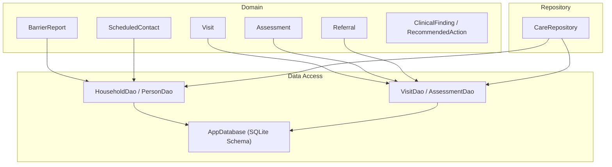
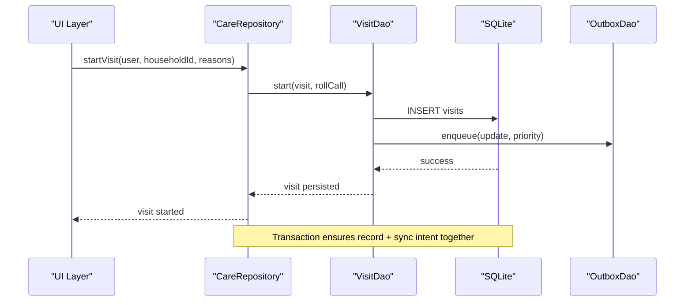
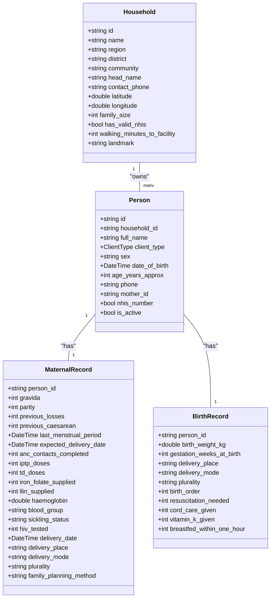
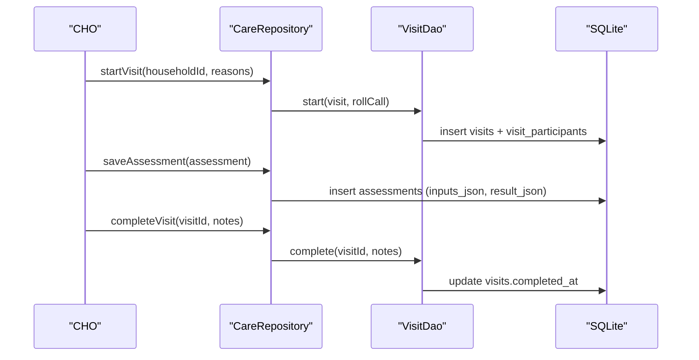
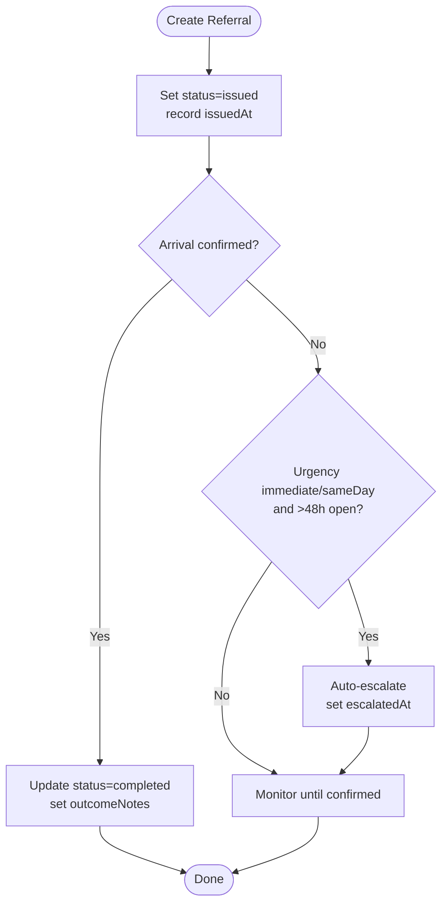
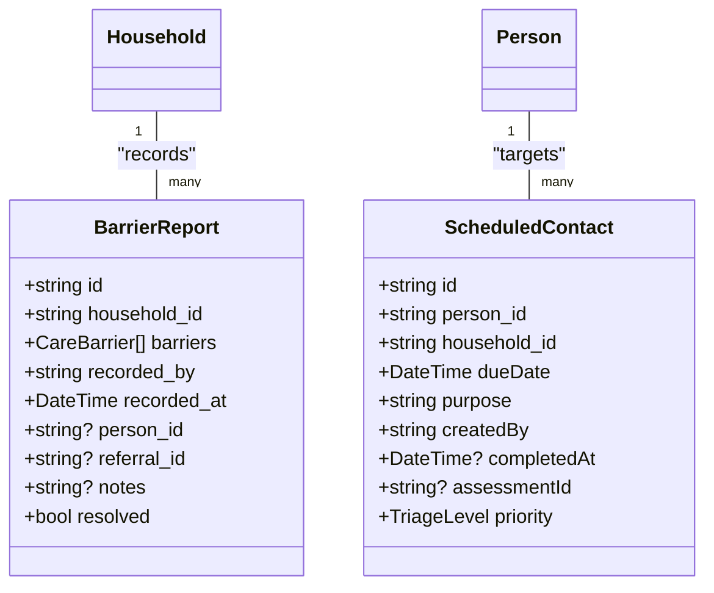
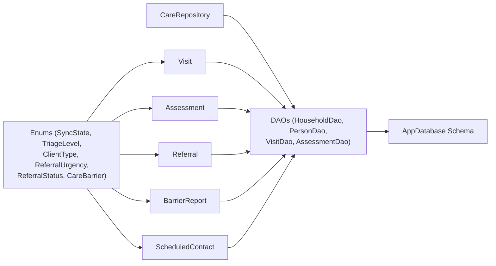

# Domain Entities & Models

<cite>
**Referenced Files in This Document**
- [visit.dart](file://lib/domain/entities/visit.dart)
- [household_dao.dart](file://lib/data/local/household_dao.dart)
- [visit_dao.dart](file://lib/data/local/visit_dao.dart)
- [app_database.dart](file://lib/data/local/app_database.dart)
- [care_repository.dart](file://lib/data/repositories/care_repository.dart)
</cite>

## Table of Contents
1. Introduction
2. Project Structure
3. Core Components
4. Architecture Overview
5. Detailed Component Analysis
6. Dependency Analysis
7. Performance Considerations
8. Troubleshooting Guide
9. Conclusion

## Introduction
This document provides a comprehensive overview of CareBridge AI’s domain entities and data models. It focuses on the core business objects: Household, Person, Visit, Assessment, Referral, and related supporting entities such as BarrierReport and ScheduledContact. The documentation explains entity structures, relationships, lifecycle management, validation rules, enum definitions, status codes, state transitions, and how these entities flow through application layers (domain, data access, repository). It also includes diagrams to visualize architecture, class relationships, and key workflows.

## Project Structure
The project follows a layered Flutter architecture with clear separation between domain, data, presentation, and core modules. For domain entities and data models:
- Domain layer defines immutable or value-like entities and their JSON mapping utilities.
- Data layer implements DAOs for SQLite persistence and repositories that orchestrate operations across DAOs and outbox sync.
- Database schema is defined centrally and enforced via foreign keys and indexes.

**Diagram sources**
- [app_database.dart:177-192](file://lib/data/local/app_database.dart#L177-L192)
- [household_dao.dart:22-162](file://lib/data/local/household_dao.dart#L22-L162)
- [visit_dao.dart:31-271](file://lib/data/local/visit_dao.dart#L31-L271)
- [visit.dart:9-91](file://lib/domain/entities/visit.dart#L9-L91)

**Section sources**
- [app_database.dart:168-173](file://lib/data/local/app_database.dart#L168-L173)
- [household_dao.dart:1-20](file://lib/data/local/household_dao.dart#L1-L20)

## Core Components
This section summarizes the primary domain entities and their responsibilities:
- Household: Represents a family unit with geographic context and basic attributes.
- Person: A flat record for women, newborns, and under-fives; supports soft deletion and relationships (mother-child).
- Visit: An encounter tied to a household, capturing who was present and when.
- Assessment: Stores raw inputs and engine-generated results, including triage and actions.
- Referral: Tracks referral issuance, urgency, arrival confirmation, and outcomes.
- BarrierReport: Captures reasons care did not happen, enabling pattern detection.
- ScheduledContact: Follow-up tasks generated by engines with due dates and priorities.

Key enums and statuses referenced across entities include:
- SyncState: Tracks local-first sync intent (e.g., pending, synced).
- TriageLevel: Clinical severity levels used in assessments and follow-ups.
- ClientType: Categories like pregnantWoman, postpartumWoman, newborn, childUnderFive, womanOfReproductiveAge.
- ReferralUrgency: Urgency levels for referrals (e.g., immediate, sameDay).
- ReferralStatus: Lifecycle states for referrals (e.g., issued, confirmed, completed).
- CareBarrier: Enumerated barriers preventing care.

Validation and integrity constraints are enforced at both the database level (foreign keys, unique indexes) and within entity mappings (JSON parsing defaults, safe fallbacks).

**Section sources**
- [visit.dart:9-91](file://lib/domain/entities/visit.dart#L9-L91)
- [visit.dart:308-411](file://lib/domain/entities/visit.dart#L308-L411)
- [visit.dart:418-545](file://lib/domain/entities/visit.dart#L418-L545)
- [visit.dart:548-614](file://lib/domain/entities/visit.dart#L548-L614)
- [visit.dart:619-685](file://lib/domain/entities/visit.dart#L619-L685)
- [app_database.dart:227-246](file://lib/data/local/app_database.dart#L227-L246)
- [app_database.dart:256-280](file://lib/data/local/app_database.dart#L256-L280)
- [app_database.dart:362-377](file://lib/data/local/app_database.dart#L362-L377)
- [app_database.dart:404-427](file://lib/data/local/app_database.dart#L404-L427)
- [app_database.dart:434-458](file://lib/data/local/app_database.dart#L434-L458)
- [app_database.dart:465-483](file://lib/data/local/app_database.dart#L465-L483)
- [app_database.dart:489-506](file://lib/data/local/app_database.dart#L489-L506)

## Architecture Overview
The system is offline-first with SQLite as the source of truth. All writes commit locally and enqueue an outbox row in the same transaction, ensuring no record exists without its sync intent. DAOs encapsulate SQL queries and map rows to domain entities. Repositories coordinate multi-step operations and enforce permissions.

**Diagram sources**
- [care_repository.dart:315-327](file://lib/data/repositories/care_repository.dart#L315-L327)
- [visit_dao.dart:31-70](file://lib/data/local/visit_dao.dart#L31-L70)
- [app_database.dart:515-533](file://lib/data/local/app_database.dart#L515-L533)

**Section sources**
- [app_database.dart:1-22](file://lib/data/local/app_database.dart#L1-L22)
- [care_repository.dart:315-327](file://lib/data/repositories/care_repository.dart#L315-L327)

## Detailed Component Analysis

### Household and Person
- Household stores location and contact details; supports search by name/head/community/landmark and lookup by derived family code.
- Person is a flat table with client_type, sex, DOB, NHIS number, and mother_id; supports soft delete via is_active flag.
- MaternalRecord and BirthRecord provide specialized clinical history per person.
- GrowthMeasurement is append-only to preserve series for trajectory analysis.

Key behaviors:
- Atomic registration of mother and children with birth records using transactions.
- Efficient queries for caseload, zone-based lists, and multi-client visit queues.
- Indexes optimize common queries (household community, persons by household/mother/type).

**Diagram sources**
- [app_database.dart:227-246](file://lib/data/local/app_database.dart#L227-L246)
- [app_database.dart:256-280](file://lib/data/local/app_database.dart#L256-L280)
- [app_database.dart:287-311](file://lib/data/local/app_database.dart#L287-L311)
- [app_database.dart:320-335](file://lib/data/local/app_database.dart#L320-L335)

**Section sources**
- [household_dao.dart:22-162](file://lib/data/local/household_dao.dart#L22-L162)
- [household_dao.dart:164-413](file://lib/data/local/household_dao.dart#L164-L413)
- [household_dao.dart:415-476](file://lib/data/local/household_dao.dart#L415-L476)
- [household_dao.dart:478-528](file://lib/data/local/household_dao.dart#L478-L528)
- [household_dao.dart:530-615](file://lib/data/local/household_dao.dart#L530-L615)

### Visit, Participants, and Assessments
- Visit captures encounter metadata, reasons, geolocation, and timestamps; supports completion and notes.
- VisitParticipant tracks presence, absence notes, queue order, and assessment status per person.
- Assessment stores raw inputs and engine result, including triage, findings, actions, and optional human override.

Lifecycle:
- Start visit -> create participants -> run assessments -> complete visit.
- Assessment result includes classification, confidence, danger signs, missing data, and referral capability needs.
- Human overrides are recorded for auditability and model training signals.

**Diagram sources**
- [care_repository.dart:315-327](file://lib/data/repositories/care_repository.dart#L315-L327)
- [visit_dao.dart:31-70](file://lib/data/local/visit_dao.dart#L31-L70)
- [app_database.dart:362-377](file://lib/data/local/app_database.dart#L362-L377)
- [app_database.dart:404-427](file://lib/data/local/app_database.dart#L404-L427)

**Section sources**
- [visit.dart:9-91](file://lib/domain/entities/visit.dart#L9-L91)
- [visit.dart:308-411](file://lib/domain/entities/visit.dart#L308-L411)
- [visit_dao.dart:31-70](file://lib/data/local/visit_dao.dart#L31-L70)
- [visit_dao.dart:234-271](file://lib/data/local/visit_dao.dart#L234-L271)

### Referrals and Escalation Logic
- Referral includes short reference code, urgency, facility, reason, issuer, timestamps, status, and outcome notes.
- Status transitions capture issued, arrival confirmation, and completion; escalation triggers for unconfirmed urgent referrals after 48 hours.
- QR payload encodes compact referral info for reliable scanning.

**Diagram sources**
- [visit.dart:418-545](file://lib/domain/entities/visit.dart#L418-L545)
- [app_database.dart:434-458](file://lib/data/local/app_database.dart#L434-L458)

**Section sources**
- [visit.dart:418-545](file://lib/domain/entities/visit.dart#L418-L545)

### Barrier Reports and Scheduled Contacts
- BarrierReport captures enumerated barriers, optional person/referral linkage, and resolution status.
- ScheduledContact represents follow-up tasks with due dates, purpose, priority, and completion tracking.

**Diagram sources**
- [visit.dart:548-614](file://lib/domain/entities/visit.dart#L548-L614)
- [visit.dart:619-685](file://lib/domain/entities/visit.dart#L619-L685)
- [app_database.dart:465-483](file://lib/data/local/app_database.dart#L465-L483)
- [app_database.dart:489-506](file://lib/data/local/app_database.dart#L489-L506)

**Section sources**
- [visit.dart:548-614](file://lib/domain/entities/visit.dart#L548-L614)
- [visit.dart:619-685](file://lib/domain/entities/visit.dart#L619-L685)

## Dependency Analysis
Entities depend on enums and shared types for consistent representation. DAOs depend on AppDatabase schema constants and enforce foreign key constraints. Repositories orchestrate cross-entity operations and integrate with outbox for sync.

**Diagram sources**
- [visit.dart:9-91](file://lib/domain/entities/visit.dart#L9-L91)
- [visit.dart:308-411](file://lib/domain/entities/visit.dart#L308-L411)
- [visit.dart:418-545](file://lib/domain/entities/visit.dart#L418-L545)
- [visit.dart:548-614](file://lib/domain/entities/visit.dart#L548-L614)
- [visit.dart:619-685](file://lib/domain/entities/visit.dart#L619-L685)
- [app_database.dart:177-192](file://lib/data/local/app_database.dart#L177-L192)
- [household_dao.dart:22-162](file://lib/data/local/household_dao.dart#L22-L162)
- [visit_dao.dart:31-70](file://lib/data/local/visit_dao.dart#L31-L70)
- [care_repository.dart:315-327](file://lib/data/repositories/care_repository.dart#L315-L327)

**Section sources**
- [app_database.dart:177-192](file://lib/data/local/app_database.dart#L177-L192)
- [household_dao.dart:22-162](file://lib/data/local/household_dao.dart#L22-L162)
- [visit_dao.dart:31-70](file://lib/data/local/visit_dao.dart#L31-L70)
- [care_repository.dart:315-327](file://lib/data/repositories/care_repository.dart#L315-L327)

## Performance Considerations
- Append-only growth measurements ensure historical series integrity and support trajectory analysis.
- Indexed columns optimize frequent queries (household community, persons by household/mother/type, visits by household/date, assessments by person/date, referrals by status/person, barrier reports by household/date, scheduled contacts by due/completed).
- Soft deletes maintain historical continuity while filtering active records efficiently.
- Transactions combine writes with outbox enqueues to avoid orphaned sync intents.

[No sources needed since this section provides general guidance]

## Troubleshooting Guide
Common issues and resolutions:
- Missing sync intent: Ensure every write enqueues an outbox row in the same transaction; verify outbox indices and retry logic.
- Foreign key violations: Validate referential integrity before inserts; check cascade behaviors on delete.
- Inconsistent client_type ordering: Use effective client type calculations for visit queues rather than stored labels.
- Escalation not triggered: Verify referral urgency, hoursOpen calculation, and status checks.

Operational tips:
- Use search methods with trimmed queries and limits to avoid large result sets.
- Prefer grouped queries (e.g., latestForAll) to reduce round trips on low-end devices.
- Audit logs capture permission denials and overrides for traceability.

**Section sources**
- [app_database.dart:515-533](file://lib/data/local/app_database.dart#L515-L533)
- [app_database.dart:540-555](file://lib/data/local/app_database.dart#L540-L555)
- [household_dao.dart:314-336](file://lib/data/local/household_dao.dart#L314-L336)
- [visit_dao.dart:234-271](file://lib/data/local/visit_dao.dart#L234-L271)

## Conclusion
CareBridge AI’s domain model emphasizes offline-first reliability, clinical safety, and operational efficiency. Entities are designed with clear relationships, robust validation, and explicit lifecycle states. DAOs and repositories enforce integrity and performance through indexing, transactions, and append-only patterns. This foundation supports accurate assessments, timely referrals, and actionable insights for community health workers.

[No sources needed since this section summarizes without analyzing specific files]