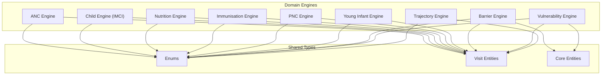
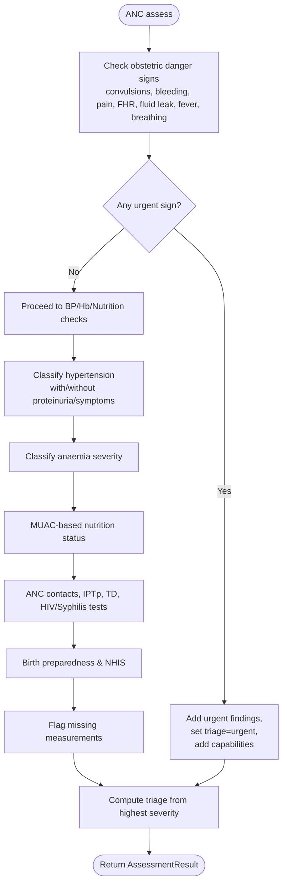
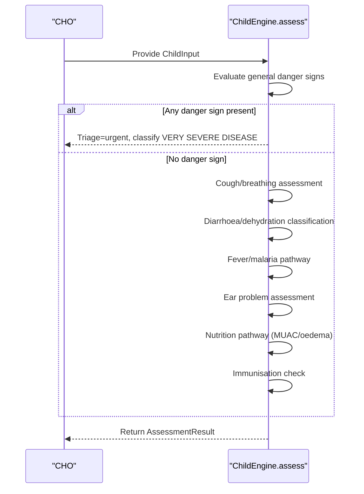
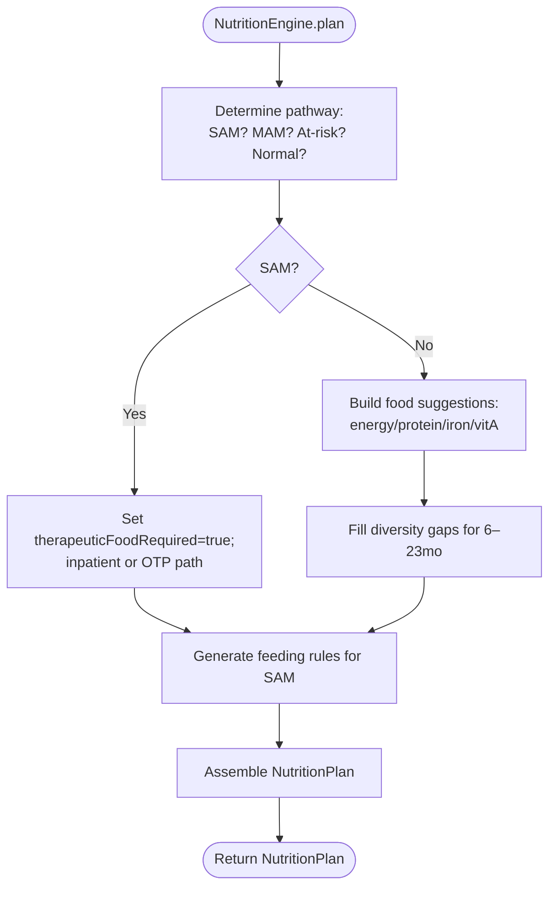
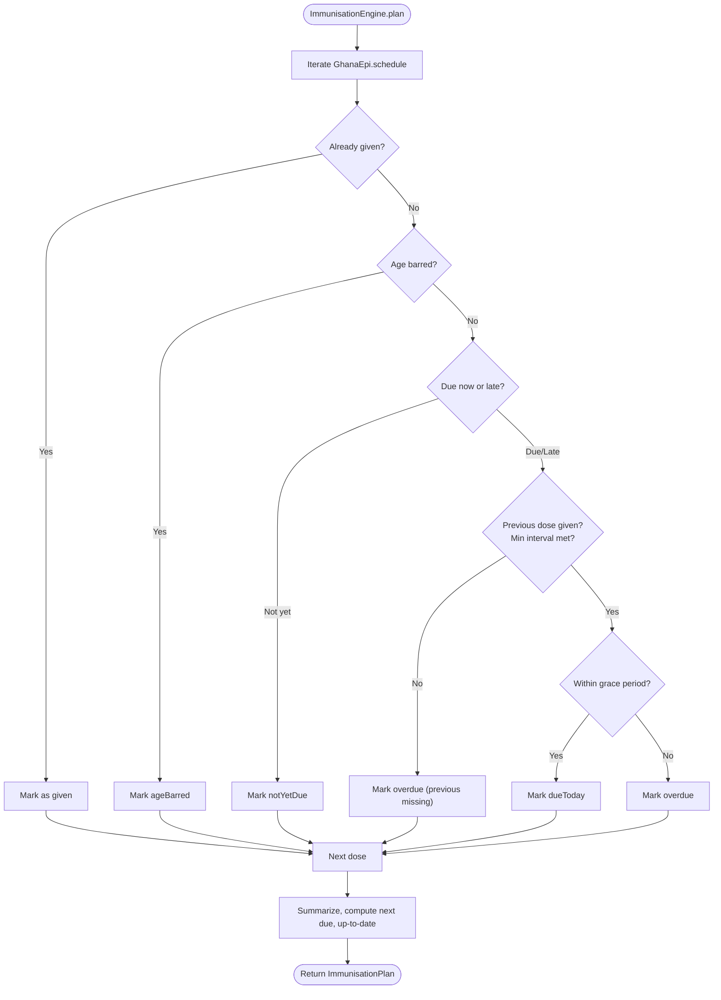
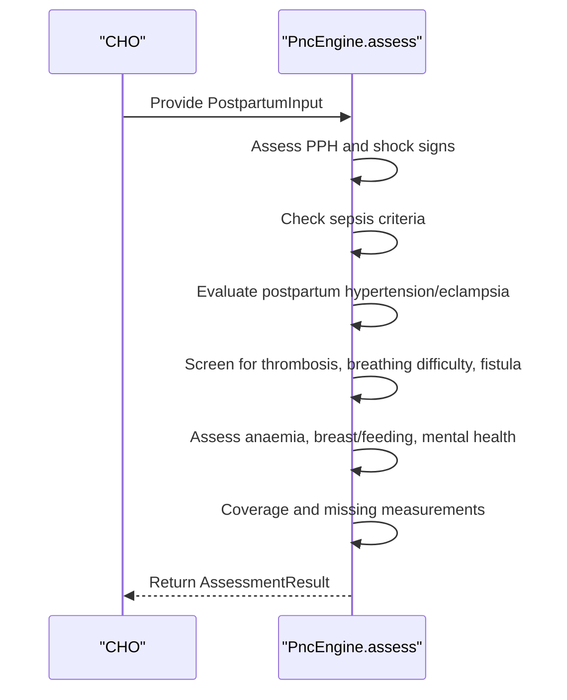
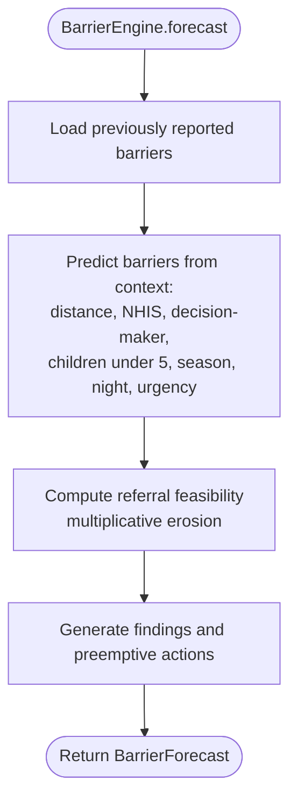
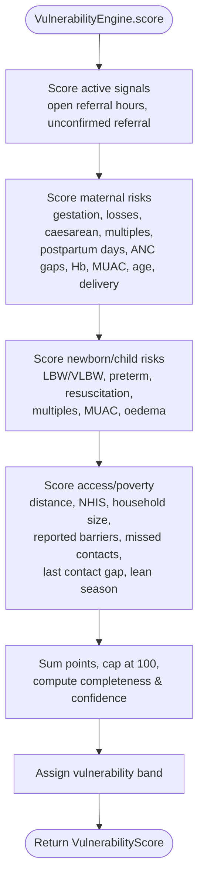
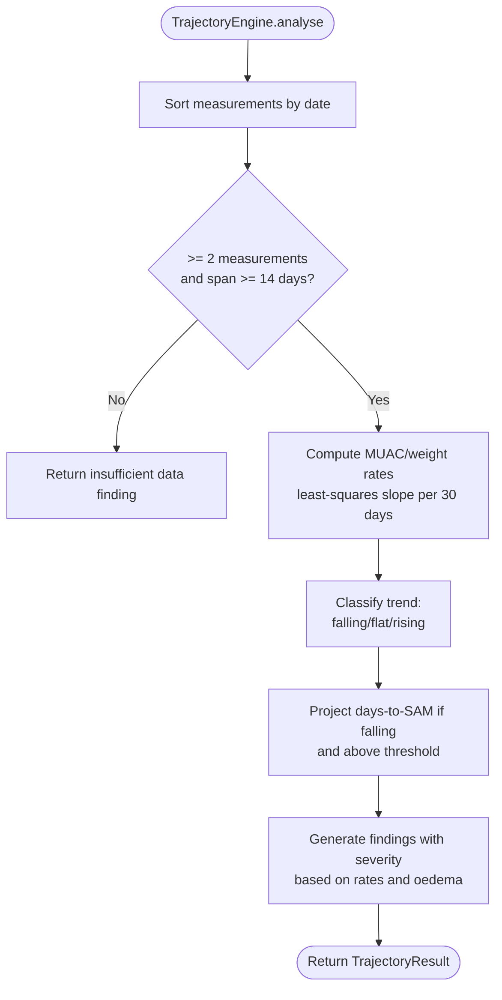
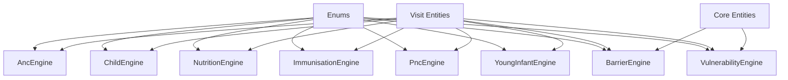

# Domain Layer

<cite>
**Referenced Files in This Document**
- [anc_engine.dart](file://lib/domain/engines/anc_engine.dart)
- [child_engine.dart](file://lib/domain/engines/child_engine.dart)
- [nutrition_engine.dart](file://lib/domain/engines/nutrition_engine.dart)
- [immunisation_engine.dart](file://lib/domain/engines/immunisation_engine.dart)
- [pnc_engine.dart](file://lib/domain/engines/pnc_engine.dart)
- [young_infant_engine.dart](file://lib/domain/engines/young_infant_engine.dart)
- [barrier_engine.dart](file://lib/domain/engines/barrier_engine.dart)
- [vulnerability_engine.dart](file://lib/domain/engines/vulnerability_engine.dart)
- [trajectory_engine.dart](file://lib/domain/engines/trajectory_engine.dart)
- [enums.dart](file://lib/domain/enums.dart)
- [visit.dart](file://lib/domain/entities/visit.dart)
- [core.dart](file://lib/domain/entities/core.dart)
</cite>

## Table of Contents
1. Introduction
2. Project Structure
3. Core Components
4. Architecture Overview
5. Detailed Component Analysis
6. Dependency Analysis
7. Performance Considerations
8. Troubleshooting Guide
9. Conclusion

## Introduction
This document describes the domain layer that implements CareBridge AI’s clinical assessment engines and AI-powered analysis systems. It covers:
- Clinical assessment engines for ANC, child health (IMCI), nutrition, immunization, postnatal care (PNC), and young infant/neonatal assessments.
- AI-powered analysis systems for barrier prediction, vulnerability scoring, and growth trajectory analysis.
- Entity relationships, business rules, algorithm implementations, engine interfaces, input/output specifications, and calculation methodologies.
- Validation rules, scoring algorithms, and decision-making processes used in clinical assessments and risk evaluations.

The engines are designed to be transparent, auditable, and field-ready, with explicit protocol sources, weighted findings, and actionable recommendations.

## Project Structure
The domain layer is organized by feature (engines) and shared types (entities and enums). Each engine encapsulates a specific clinical or analytical workflow, exposing a static assess or plan method that returns standardized results composed of findings, actions, triage levels, and metadata.



**Diagram sources**
- [anc_engine.dart](file://lib/domain/engines/anc_engine.dart)
- [child_engine.dart](file://lib/domain/engines/child_engine.dart)
- [nutrition_engine.dart](file://lib/domain/engines/nutrition_engine.dart)
- [immunisation_engine.dart](file://lib/domain/engines/immunisation_engine.dart)
- [pnc_engine.dart](file://lib/domain/engines/pnc_engine.dart)
- [young_infant_engine.dart](file://lib/domain/engines/young_infant_engine.dart)
- [barrier_engine.dart](file://lib/domain/engines/barrier_engine.dart)
- [vulnerability_engine.dart](file://lib/domain/engines/vulnerability_engine.dart)
- [trajectory_engine.dart](file://lib/domain/engines/trajectory_engine.dart)
- [enums.dart](file://lib/domain/enums.dart)
- [visit.dart](file://lib/domain/entities/visit.dart)
- [core.dart](file://lib/domain/entities/core.dart)

**Section sources**
- [anc_engine.dart](file://lib/domain/engines/anc_engine.dart)
- [child_engine.dart](file://lib/domain/engines/child_engine.dart)
- [nutrition_engine.dart](file://lib/domain/engines/nutrition_engine.dart)
- [immunisation_engine.dart](file://lib/domain/engines/immunisation_engine.dart)
- [pnc_engine.dart](file://lib/domain/engines/pnc_engine.dart)
- [young_infant_engine.dart](file://lib/domain/engines/young_infant_engine.dart)
- [barrier_engine.dart](file://lib/domain/engines/barrier_engine.dart)
- [vulnerability_engine.dart](file://lib/domain/engines/vulnerability_engine.dart)
- [trajectory_engine.dart](file://lib/domain/engines/trajectory_engine.dart)
- [enums.dart](file://lib/domain/enums.dart)
- [visit.dart](file://lib/domain/entities/visit.dart)
- [core.dart](file://lib/domain/entities/core.dart)

## Core Components
- AncEngine: WHO ANC 2016 + Ghana Safe Motherhood protocol; detects obstetric emergencies, anaemia, nutrition gaps, IPTp/TD coverage, birth preparedness, and missing measurements. Returns AssessmentResult with triage, classifications, findings, actions, capabilities, and confidence.
- ChildEngine (IMCI): Sick child assessment (2–59 months); prioritizes general danger signs, respiratory, diarrhoea, fever/malaria, ear, nutrition, and immunisation; outputs triage, classifications, and targeted actions.
- NutritionEngine: Builds seasonally appropriate, cost-aware feeding plans; distinguishes SAM/MAM/at-risk/normal pathways; provides therapeutic food flags and counselling guidance.
- ImmunisationEngine: Ghana EPI schedule with catch-up planning; determines due/overdue doses, minimum intervals, age bars, and generates findings/actions for integration into assessments.
- PncEngine: Postnatal care (days 1, 3, 7, week 6); identifies postpartum haemorrhage, sepsis, pre-eclampsia/eclampsia, thrombosis, anaemia, breastfeeding issues, mental health, and coverage gaps.
- YoungInfantEngine: Neonatal/young infant assessment (first weeks); severe infection/very severe disease classification, danger signs, feeding, temperature, weight/gestation flags.
- BarrierEngine: Predicts barriers to completing referrals using household context, history, seasonality, urgency, and time-of-day; estimates referral feasibility and suggests preemptive actions.
- VulnerabilityEngine: Additive, inspectable household risk scoring across maternal, newborn/child, access/poverty, and service factors; produces bands, modifiable/non-modifiable factors, and confidence.
- TrajectoryEngine: Growth trend analysis using least-squares slopes for MUAC/weight; projects days-to-SAM threshold and flags early deterioration.

**Section sources**
- [anc_engine.dart](file://lib/domain/engines/anc_engine.dart)
- [child_engine.dart](file://lib/domain/engines/child_engine.dart)
- [nutrition_engine.dart](file://lib/domain/engines/nutrition_engine.dart)
- [immunisation_engine.dart](file://lib/domain/engines/immunisation_engine.dart)
- [pnc_engine.dart](file://lib/domain/engines/pnc_engine.dart)
- [young_infant_engine.dart](file://lib/domain/engines/young_infant_engine.dart)
- [barrier_engine.dart](file://lib/domain/engines/barrier_engine.dart)
- [vulnerability_engine.dart](file://lib/domain/engines/vulnerability_engine.dart)
- [trajectory_engine.dart](file://lib/domain/engines/trajectory_engine.dart)

## Architecture Overview
Each engine follows a consistent pattern:
- Input model: strongly typed data capturing all relevant clinical and contextual fields.
- Assessment/plan function: deterministic logic implementing protocol rules, thresholds, and local adaptations.
- Output model: standardized result containing triage level, classifications, findings, recommended actions, capability needs, confidence, and protocol source.

```mermaid
classDiagram
class AncEngine {
+assess(PregnancyInput) AssessmentResult
}
class ChildEngine {
+assess(ChildInput) AssessmentResult
}
class NutritionEngine {
+plan(...) NutritionPlan
+asActions(NutritionPlan) RecommendedAction[]
}
class ImmunisationEngine {
+plan(ageInDays, givenLabels) ImmunisationPlan
+asAssessmentParts(ImmunisationPlan) ({findings, actions})
}
class PncEngine {
+assess(PostpartumInput) AssessmentResult
}
class YoungInfantEngine {
+assess(YoungInfantInput) AssessmentResult
}
class BarrierEngine {
+forecast(...) BarrierForecast
+detectPatterns(BarrierReport[], minHouseholds) BarrierPattern[]
}
class VulnerabilityEngine {
+score(VulnerabilityInput) VulnerabilityScore
+prioritise(items, scoreOf) List
}
class TrajectoryEngine {
+analyse(GrowthMeasurement[]) TrajectoryResult
}
```

**Diagram sources**
- [anc_engine.dart](file://lib/domain/engines/anc_engine.dart)
- [child_engine.dart](file://lib/domain/engines/child_engine.dart)
- [nutrition_engine.dart](file://lib/domain/engines/nutrition_engine.dart)
- [immunisation_engine.dart](file://lib/domain/engines/immunisation_engine.dart)
- [pnc_engine.dart](file://lib/domain/engines/pnc_engine.dart)
- [young_infant_engine.dart](file://lib/domain/engines/young_infant_engine.dart)
- [barrier_engine.dart](file://lib/domain/engines/barrier_engine.dart)
- [vulnerability_engine.dart](file://lib/domain/engines/vulnerability_engine.dart)
- [trajectory_engine.dart](file://lib/domain/engines/trajectory_engine.dart)

## Detailed Component Analysis

### ANC Engine
- Purpose: Antenatal risk detection and management aligned with WHO ANC 2016 and Ghana Safe Motherhood.
- Key inputs: gestational age, maternal demographics, obstetric history, vital signs (BP, Hb, MUAC, fundal height, FHR), danger signs, coverage (ANC contacts, IPTp, TD), and context (NHIS, distance, skilled support).
- Business rules:
  - Hypertension thresholds: >= 140/90 (gestational hypertension/pre-eclampsia), >= 160/110 (severe).
  - Anaemia: < 11 g/dL mild, 7–9.9 moderate, < 7 severe.
  - IPTp-SP from 16 weeks monthly; expected doses computed per gestation.
  - ANC contact schedule: 8 contacts at specified weeks.
  - Danger signs trigger urgent referral and capability requirements (e.g., caesarean, blood transfusion, laboratory).
- Outputs: AssessmentResult with triage, classifications (e.g., eclampsia, pre-eclampsia, antepartum haemorrhage), findings, actions, capabilities, missing data, and confidence.
- Validation: Missing BP/Hb/FHR/fundal height flagged; proteinuria required to differentiate gestational hypertension vs pre-eclampsia.



**Diagram sources**
- [anc_engine.dart](file://lib/domain/engines/anc_engine.dart)

**Section sources**
- [anc_engine.dart](file://lib/domain/engines/anc_engine.dart)

### Child Engine (IMCI)
- Purpose: IMCI sick child assessment (2–59 months) with emphasis on general danger signs, respiratory, diarrhoea, fever/malaria, ear, nutrition, and immunisation.
- Key inputs: age, RR, temp, MUAC, oedema, cough/breathing, diarrhoea signs, fever/RDT, ear symptoms, pallor/Hb, feeding practices, immunisation status, and context.
- Business rules:
  - Fast-breathing thresholds: >= 50/min (2–11 mo), >= 40/min (12–59 mo).
  - Fever: >= 37.5°C or reported.
  - MUAC: SAM < 11.5 cm, MAM 11.5–12.4 cm; bilateral oedema = SAM regardless of MUAC.
  - General danger signs override other sections and classify as very severe disease.
  - Malaria RDT-driven decisions; pre-referral artesunate for suspected severe malaria.
- Outputs: AssessmentResult with triage, classifications (e.g., pneumonia, severe dehydration, malaria), findings, actions, capabilities, and missing data.



**Diagram sources**
- [child_engine.dart](file://lib/domain/engines/child_engine.dart)

**Section sources**
- [child_engine.dart](file://lib/domain/engines/child_engine.dart)

### Nutrition Engine
- Purpose: Generate actionable, seasonal, and cost-aware nutrition plans for children, pregnant, and breastfeeding women.
- Inputs: subject type, nutrition status, month, age, breastfeeding status, food groups eaten, cost tier, oedema, appetite test, danger signs, anaemia.
- Business rules:
  - SAM requires therapeutic food (RUTF/F-75); home-diet advice withheld as treatment.
  - Pathway selection: inpatient vs outpatient therapeutic based on complications, oedema, appetite, age.
  - For MAM/at-risk/prevention: recommend energy-dense, protein-rich, iron/vitamin A foods available this month and affordable.
  - Diversity gaps filled for complementary feeding window (6–23 months).
- Outputs: NutritionPlan with headline, season note, suggestions, feeding rules, meal targets, diversity gaps, therapeutic food flag, review interval; can be converted to RecommendedActions.



**Diagram sources**
- [nutrition_engine.dart](file://lib/domain/engines/nutrition_engine.dart)

**Section sources**
- [nutrition_engine.dart](file://lib/domain/engines/nutrition_engine.dart)

### Immunisation Engine
- Purpose: Ghana EPI schedule with catch-up planner; determine what is due today, overdue, not yet due, or age-barred.
- Inputs: child age in days, set of given dose labels.
- Business rules:
  - Minimum intervals enforced between doses of same antigen.
  - Age bars applied (e.g., rotavirus start limit).
  - Grace period for overdue classification; overdue beyond grace treated as overdue and scheduled for today if eligible.
- Outputs: ImmunisationPlan with items, giveToday list, overdue list, summary, up-to-date flag, next due info; convertible to findings/actions for assessments.



**Diagram sources**
- [immunisation_engine.dart](file://lib/domain/engines/immunisation_engine.dart)

**Section sources**
- [immunisation_engine.dart](file://lib/domain/engines/immunisation_engine.dart)

### PNC Engine
- Purpose: Postnatal care assessment (day 1, 3, 7, week 6) focusing on postpartum haemorrhage, sepsis, pre-eclampsia/eclampsia, thrombosis, anaemia, breastfeeding, mental health, and coverage.
- Inputs: days since delivery, maternal vitals, danger signs, delivery details, feeding status, mental health indicators, services, context.
- Business rules:
  - Heavy bleeding triggers immediate referral and uterine massage/uterotonic guidance.
  - Sepsis criteria: multiple signs (fever, foul discharge, abdominal pain, perineal wound, CS wound).
  - Postpartum hypertension/eclampsia thresholds similar to ANC.
  - Breastfeeding establishment and exclusive breastfeeding guidance; multi-birth considerations.
  - Mental health screening: self-harm thoughts require urgent action.
- Outputs: AssessmentResult with triage, classifications, findings, actions, capabilities, missing data, confidence, follow-up, caregiver message.



**Diagram sources**
- [pnc_engine.dart](file://lib/domain/engines/pnc_engine.dart)

**Section sources**
- [pnc_engine.dart](file://lib/domain/engines/pnc_engine.dart)

### Young Infant Engine
- Purpose: Neonatal/young infant assessment focusing on severe infection/very severe disease, danger signs, temperature, feeding, and risk flags (low birth weight, preterm).
- Inputs: age in days, respiratory rate, temperature, birth weight, gestation, feeding indicators, danger signs.
- Business rules:
  - First week carries highest mortality risk; stricter thresholds applied.
  - Severe infection/very severe disease classification drives urgent referral.
  - Temperature thresholds: fever >= 37.5°C, hypothermia < 35.5°C.
  - Low birth weight (< 2.5 kg) and preterm (< 37 weeks) increase risk.
- Outputs: AssessmentResult with triage, classifications, findings, actions, capabilities, and missing data.

**Section sources**
- [young_infant_engine.dart](file://lib/domain/engines/young_infant_engine.dart)

### Barrier Engine
- Purpose: Predict barriers preventing completion of referrals and aggregate patterns across households to identify systemic issues.
- Inputs: household, client, previously reported barriers, missed contacts count, referral urgency, month, night-time flag, children under five, decision-maker presence.
- Business rules:
  - Previously reported barriers have high likelihood (0.8).
  - Distance > 60–120 minutes increases transport/cost barriers.
  - Lack of NHIS card raises cost barrier; adolescent mothers face permission barriers.
  - Seasonal factors (rainy/harvest/planting) affect travel and workload.
  - Night-time + immediate urgency increases distance barrier likelihood.
  - Missed contacts suggest seriousness perception or past bad experiences.
  - Referral feasibility computed multiplicatively from predicted barriers.
- Outputs: BarrierForecast with predicted barriers, feasibility estimate, findings, actions; detectPatterns aggregates zone-level barriers.



**Diagram sources**
- [barrier_engine.dart](file://lib/domain/engines/barrier_engine.dart)

**Section sources**
- [barrier_engine.dart](file://lib/domain/engines/barrier_engine.dart)

### Vulnerability Engine
- Purpose: Household vulnerability scoring combining active clinical signals, maternal risk, newborn/child risk, access/poverty, and service factors; produces priority bands and modifiable/non-modifiable factors.
- Inputs: mother/maternal record, children, birth records, latest growth, household, open urgent referral hours, unconfirmed referral, missed contacts, reported barriers, days since last contact, overdue vaccines, maternal Hb/MUAC, delivery place, month.
- Business rules:
  - Active emergency signals (open urgent referral hours) carry high points.
  - Maternal risks: term pregnancy, previous losses, caesarean, multiples, postpartum days, ANC gaps, anaemia, MUAC, age, delivery place.
  - Newborn/child risks: LBW/VLBW, preterm, resuscitation needed, multiples, MUAC trends, oedema.
  - Access/poverty: distance, NHIS, large household size, reported barriers, missed contacts, long gaps since last contact, lean season.
  - Score capped at 100; completeness affects confidence band.
- Outputs: VulnerabilityScore with score, band, factors, data completeness, confidence, unknowns; prioritise sorts households by score then ignorance.



**Diagram sources**
- [vulnerability_engine.dart](file://lib/domain/engines/vulnerability_engine.dart)

**Section sources**
- [vulnerability_engine.dart](file://lib/domain/engines/vulnerability_engine.dart)

### Trajectory Engine
- Purpose: Growth trajectory analysis using least-squares slopes for MUAC and weight over time; projects days-to-SAM threshold and flags early deterioration.
- Inputs: ordered growth measurements (MUAC/weight, timestamps).
- Business rules:
  - Requires at least two measurements >= 14 days apart.
  - Noise floor for MUAC prevents false trends; weight loss thresholds trigger priority findings.
  - Oedema appearing between visits escalates to urgent regardless of MUAC.
  - Projection uses linear extrapolation to estimate when MUAC reaches 11.5 cm.
- Outputs: TrajectoryResult with trend, points used, rates, projection, findings, explanation.



**Diagram sources**
- [trajectory_engine.dart](file://lib/domain/engines/trajectory_engine.dart)

**Section sources**
- [trajectory_engine.dart](file://lib/domain/engines/trajectory_engine.dart)

## Dependency Analysis
Engines depend on shared enums and entities for consistent typing and interoperability:
- Enums define triage levels, referral urgency, nutrition status/pathway, birth plurality, delivery place/mode, and care barriers.
- Visit entities provide structured representations of visits, growth measurements, and related clinical data.
- Core entities include household, person, and barrier reports used by barrier and vulnerability engines.



**Diagram sources**
- [enums.dart](file://lib/domain/enums.dart)
- [visit.dart](file://lib/domain/entities/visit.dart)
- [core.dart](file://lib/domain/entities/core.dart)
- [anc_engine.dart](file://lib/domain/engines/anc_engine.dart)
- [child_engine.dart](file://lib/domain/engines/child_engine.dart)
- [nutrition_engine.dart](file://lib/domain/engines/nutrition_engine.dart)
- [immunisation_engine.dart](file://lib/domain/engines/immunisation_engine.dart)
- [pnc_engine.dart](file://lib/domain/engines/pnc_engine.dart)
- [young_infant_engine.dart](file://lib/domain/engines/young_infant_engine.dart)
- [barrier_engine.dart](file://lib/domain/engines/barrier_engine.dart)
- [vulnerability_engine.dart](file://lib/domain/engines/vulnerability_engine.dart)

**Section sources**
- [enums.dart](file://lib/domain/enums.dart)
- [visit.dart](file://lib/domain/entities/visit.dart)
- [core.dart](file://lib/domain/entities/core.dart)

## Performance Considerations
- Deterministic algorithms: All engines use explicit thresholds and arithmetic rather than opaque models, ensuring fast execution and auditability.
- Minimal I/O: Engines operate on in-memory inputs; no network calls within domain logic.
- Complexity: Linear scans over schedules (immunisation), lists of measurements (trajectory), and factor accumulation (vulnerability) are efficient for typical field datasets.
- Early exits: Danger sign checks short-circuit further processing where urgent triage is determined.

[No sources needed since this section provides general guidance]

## Troubleshooting Guide
Common validation and data issues:
- Missing measurements: Engines explicitly flag absent BP, Hb, FHR, MUAC, temperature, and other critical values; ensure these are captured before finalizing assessments.
- Inconsistent units: Ensure ages are in correct units (months vs days), temperatures in Celsius, weights in kg, lengths in cm.
- Schedule conflicts: Immunisation catch-up respects minimum intervals and age bars; verify givenLabels and age conversions.
- Trend reliability: Trajectory analysis requires sufficient temporal separation; avoid interpreting single readings as trends.
- Barrier prediction: Record previously reported barriers and context accurately to improve forecast accuracy.

**Section sources**
- [anc_engine.dart](file://lib/domain/engines/anc_engine.dart)
- [child_engine.dart](file://lib/domain/engines/child_engine.dart)
- [immunisation_engine.dart](file://lib/domain/engines/immunisation_engine.dart)
- [pnc_engine.dart](file://lib/domain/engines/pnc_engine.dart)
- [trajectory_engine.dart](file://lib/domain/engines/trajectory_engine.dart)
- [barrier_engine.dart](file://lib/domain/engines/barrier_engine.dart)

## Conclusion
CareBridge AI’s domain layer delivers transparent, protocol-aligned clinical assessments and AI-powered analyses tailored for community health contexts. The engines standardize inputs/outputs, enforce validated thresholds, and produce actionable findings and recommendations. Barrier prediction, vulnerability scoring, and trajectory analysis complement clinical assessments to prioritize interventions and prevent crises before they occur.

[No sources needed since this section summarizes without analyzing specific files]