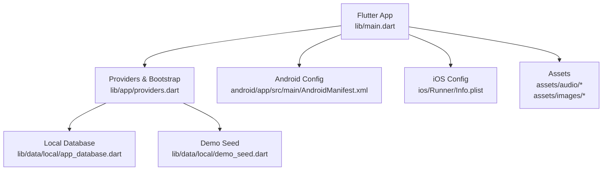
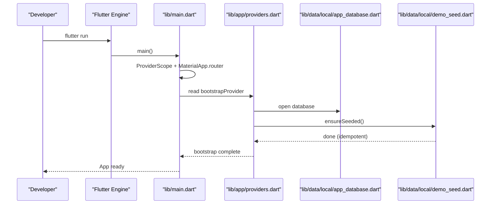
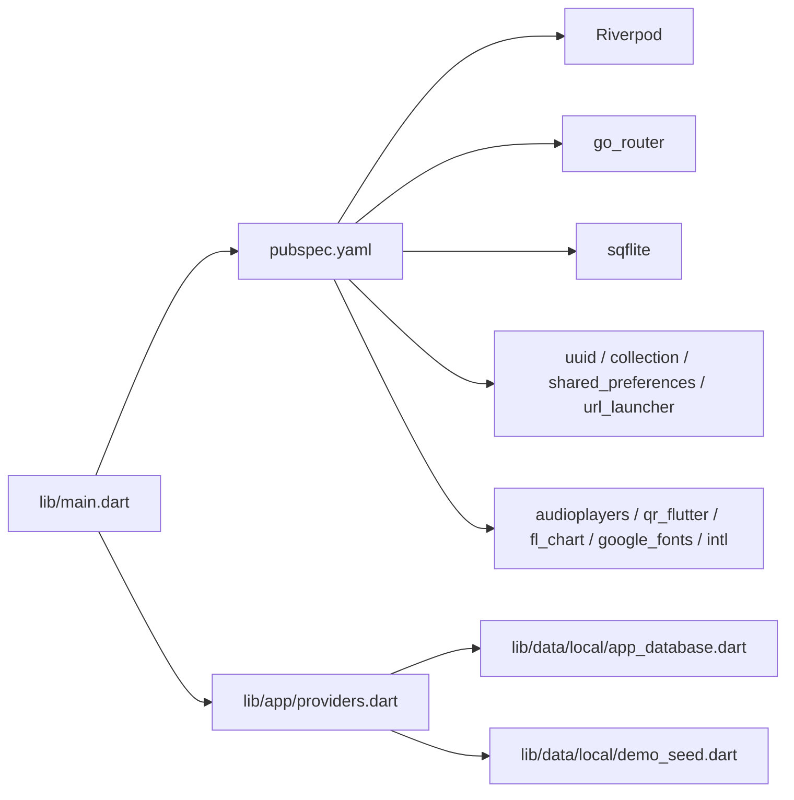

# Getting Started

<cite>
**Referenced Files in This Document**
- [pubspec.yaml](file://pubspec.yaml)
- [README.md](file://README.md)
- [lib/main.dart](file://lib/main.dart)
- [android/app/src/main/AndroidManifest.xml](file://android/app/src/main/AndroidManifest.xml)
- [android/app/build.gradle.kts](file://android/app/build.gradle.kts)
- [android/build.gradle.kts](file://android/build.gradle.kts)
- [android/local.properties](file://android/local.properties)
- [ios/Runner/Info.plist](file://ios/Runner/Info.plist)
- [analysis_options.yaml](file://analysis_options.yaml)
- [assets/audio/README.txt](file://assets/audio/README.txt)
- [assets/images/README.txt](file://assets/images/README.txt)
- [lib/data/local/demo_seed.dart](file://lib/data/local/demo_seed.dart)
- [lib/data/local/app_database.dart](file://lib/data/local/app_database.dart)
- [lib/app/providers.dart](file://lib/app/providers.dart)
</cite>

## Table of Contents
1. Introduction
2. Project Structure
3. Core Components
4. Architecture Overview
5. Detailed Component Analysis
6. Dependency Analysis
7. Performance Considerations
8. Troubleshooting Guide
9. Conclusion
10. Appendices

## Introduction
This guide helps you set up a complete development environment for CareBridge AI, an offline-first Flutter application designed for community health workers and caregivers. You will install required tools, configure Android and iOS platforms, run the app for the first time, and seed demo data to explore features immediately.

## Project Structure
CareBridge AI is a standard Flutter project with platform-specific configurations under android/ and ios/, Dart code under lib/, and static assets under assets/. The entry point initializes the app shell, routing, and theme, while database and demo seeding are handled lazily via providers.

**Diagram sources**
- [lib/main.dart:16-34](file://lib/main.dart#L16-L34)
- [lib/app/providers.dart:38-42](file://lib/app/providers.dart#L38-L42)
- [lib/data/local/app_database.dart:99-114](file://lib/data/local/app_database.dart#L99-L114)
- [lib/data/local/demo_seed.dart:60-66](file://lib/data/local/demo_seed.dart#L60-L66)
- [android/app/src/main/AndroidManifest.xml:1-46](file://android/app/src/main/AndroidManifest.xml#L1-L46)
- [ios/Runner/Info.plist:1-71](file://ios/Runner/Info.plist#L1-L71)
- [assets/audio/README.txt:1-19](file://assets/audio/README.txt#L1-L19)
- [assets/images/README.txt:1-3](file://assets/images/README.txt#L1-L3)

**Section sources**
- [README.md:1-18](file://README.md#L1-L18)
- [lib/main.dart:16-34](file://lib/main.dart#L16-L34)

## Core Components
- Environment and SDK constraints are declared in pubspec.yaml, requiring Dart SDK 3.10.0+.
- The app entry point wraps the app in a provider scope and configures routing and theme.
- Platform manifests define basic app metadata and permissions; no extra permissions are currently declared beyond defaults.
- Assets are registered in pubspec.yaml and include audio and images directories.

Key responsibilities:
- pubspec.yaml: declares dependencies, SDK constraints, and asset paths.
- lib/main.dart: bootstraps the app UI and routing.
- Android/iOS manifests: declare app identity and platform behavior.
- Providers: initialize database and seed demo data on first launch.

**Section sources**
- [pubspec.yaml:1-67](file://pubspec.yaml#L1-L67)
- [lib/main.dart:16-34](file://lib/main.dart#L16-L34)
- [android/app/src/main/AndroidManifest.xml:1-46](file://android/app/src/main/AndroidManifest.xml#L1-L46)
- [ios/Runner/Info.plist:1-71](file://ios/Runner/Info.plist#L1-L71)
- [lib/app/providers.dart:38-42](file://lib/app/providers.dart#L38-L42)

## Architecture Overview
At startup, the app initializes Riverpod, loads the router, and applies the theme. On first run, the bootstrap provider opens the local SQLite database and seeds demo accounts and records if none exist. The sync service is started afterward.

**Diagram sources**
- [lib/main.dart:16-34](file://lib/main.dart#L16-L34)
- [lib/app/providers.dart:38-42](file://lib/app/providers.dart#L38-L42)
- [lib/data/local/app_database.dart:99-114](file://lib/data/local/app_database.dart#L99-L114)
- [lib/data/local/demo_seed.dart:60-66](file://lib/data/local/demo_seed.dart#L60-L66)

## Detailed Component Analysis

### Environment Requirements and Prerequisites
- Flutter SDK 3.10.0+ and Dart SDK compatible with ^3.10.0.
- Android development tools: Android Studio or command-line tools, Java 17, NDK configured by Flutter.
- iOS development tools: Xcode and command-line tools installed and selected.
- Optional: physical devices or emulators/simulators for testing.

Verification steps:
- Confirm Flutter version meets minimum requirement.
- Run flutter doctor and resolve any reported issues before proceeding.

**Section sources**
- [pubspec.yaml:9-10](file://pubspec.yaml#L9-L10)
- [android/app/build.gradle.kts:12-15](file://android/app/build.gradle.kts#L12-L15)
- [android/app/build.gradle.kts:37-41](file://android/app/build.gradle.kts#L37-L41)

### Installation and First Run
Steps:
1. Open a terminal in the project root.
2. Install dependencies:
   - flutter pub get
3. Connect a device or start an emulator/simulator.
4. Run the app:
   - flutter run
5. On first launch, the app will:
   - Initialize the local database.
   - Seed demo accounts and sample records if none exist.
   - Start background services (e.g., sync status).

Expected outcome:
- The app launches with default theme and routing.
- Demo data is available for exploration without manual setup.

**Section sources**
- [pubspec.yaml:62-67](file://pubspec.yaml#L62-L67)
- [lib/app/providers.dart:38-42](file://lib/app/providers.dart#L38-L42)
- [lib/data/local/demo_seed.dart:60-66](file://lib/data/local/demo_seed.dart#L60-L66)

### Dependency Management with pubspec.yaml
- Dependencies include state management (Riverpod), routing (go_router), offline storage (sqflite), secure storage, connectivity, UI libraries, audio playback, QR utilities, and more.
- Assets are registered under flutter.assets for audio and images.
- Dev dependencies include test framework and linters.

Recommendations:
- Keep Flutter and Dart versions aligned with the SDK constraint.
- After modifying pubspec.yaml, always run flutter pub get.

**Section sources**
- [pubspec.yaml:12-55](file://pubspec.yaml#L12-L55)
- [pubspec.yaml:56-61](file://pubspec.yaml#L56-L61)
- [pubspec.yaml:62-67](file://pubspec.yaml#L62-L67)

### Android Setup
- Application ID and namespace are defined in the Gradle configuration.
- Java 17 and Kotlin JVM target 17 are enforced.
- AndroidManifest.xml includes the launcher activity and Flutter embedding metadata. No additional permissions are declared beyond defaults.

Actions:
- Ensure Android SDK path is set in android/local.properties.
- Verify compileSdk, minSdk, and targetSdk are resolved by Flutter tooling.
- If adding new permissions (e.g., camera, location), add them to AndroidManifest.xml and rebuild.

Verification:
- Build successfully with flutter build apk or flutter run on Android device/emulator.

**Section sources**
- [android/app/build.gradle.kts:7-26](file://android/app/build.gradle.kts#L7-L26)
- [android/app/build.gradle.kts:28-35](file://android/app/build.gradle.kts#L28-L35)
- [android/app/build.gradle.kts:37-41](file://android/app/build.gradle.kts#L37-L41)
- [android/app/src/main/AndroidManifest.xml:1-46](file://android/app/src/main/AndroidManifest.xml#L1-L46)
- [android/local.properties:1-2](file://android/local.properties#L1-L2)

### iOS Setup
- Info.plist defines display name, bundle identifiers, supported orientations, and scene configuration.
- Ensure Xcode command-line tools are installed and selected.

Actions:
- Open ios/Runner.xcworkspace in Xcode to verify signing settings if deploying to a device.
- For simulator runs, ensure the correct scheme and destination are selected.

Verification:
- Build and run from the command line or Xcode without errors.

**Section sources**
- [ios/Runner/Info.plist:1-71](file://ios/Runner/Info.plist#L1-L71)

### Demo Data Seeding
On first launch, the app checks whether any account exists. If not, it creates two demo accounts (frontline health worker and caregiver) along with realistic household, person, growth, barrier, visit, and contact records tailored to the brief scenarios.

Highlights:
- Idempotent seeding ensures existing field data is preserved.
- Fixed demo credentials allow consistent demos across devices.

How to use:
- Launch the app; demo data appears automatically when no prior accounts exist.
- To reset demo data, clear app data or use provided database clearing functionality during development.

**Section sources**
- [lib/data/local/demo_seed.dart:60-66](file://lib/data/local/demo_seed.dart#L60-L66)
- [lib/data/local/demo_seed.dart:75-89](file://lib/data/local/demo_seed.dart#L75-L89)
- [lib/data/local/app_database.dart:136-161](file://lib/data/local/app_database.dart#L136-L161)

### Initial Project Configuration
- analysis_options.yaml enables Flutter lints and allows customization of rules.
- Assets are referenced in pubspec.yaml; audio files follow naming conventions documented in assets/audio/README.txt.

Recommendations:
- Run flutter analyze to catch issues early.
- Add audio and image assets as needed, following the documented naming patterns.

**Section sources**
- [analysis_options.yaml:1-29](file://analysis_options.yaml#L1-L29)
- [assets/audio/README.txt:1-19](file://assets/audio/README.txt#L1-L19)
- [assets/images/README.txt:1-3](file://assets/images/README.txt#L1-L3)

## Dependency Analysis
The app depends on Flutter SDK, Riverpod for state, go_router for navigation, sqflite for offline storage, and various UI and utility packages. Android and iOS manifests provide platform integration points.

**Diagram sources**
- [pubspec.yaml:12-55](file://pubspec.yaml#L12-L55)
- [lib/main.dart:16-34](file://lib/main.dart#L16-L34)
- [lib/app/providers.dart:38-42](file://lib/app/providers.dart#L38-L42)
- [lib/data/local/app_database.dart:99-114](file://lib/data/local/app_database.dart#L99-L114)
- [lib/data/local/demo_seed.dart:60-66](file://lib/data/local/demo_seed.dart#L60-L66)

**Section sources**
- [pubspec.yaml:12-55](file://pubspec.yaml#L12-L55)

## Performance Considerations
- Offline-first design uses SQLite via sqflite; keep queries efficient and avoid unnecessary re-seeding.
- Asset loading should be minimal at startup; defer heavy resources until needed.
- Use Riverpod providers to manage state efficiently and avoid redundant computations.

[No sources needed since this section provides general guidance]

## Troubleshooting Guide
Common issues and resolutions:
- Flutter SDK mismatch:
  - Ensure your Flutter version satisfies the SDK constraint (^3.10.0).
- Android build failures:
  - Verify Java 17 and Kotlin JVM target 17 are configured.
  - Check android/local.properties points to a valid Android SDK path.
- iOS build failures:
  - Ensure Xcode command-line tools are installed and selected.
  - Validate signing settings in Xcode when targeting devices.
- Missing permissions:
  - If adding features that require permissions (camera, location), update AndroidManifest.xml and iOS Info.plist accordingly.
- Assets not found:
  - Confirm assets are listed under flutter.assets in pubspec.yaml and follow naming conventions.

Verification checklist:
- flutter pub get completes without errors.
- flutter analyze reports no critical issues.
- flutter run starts the app on device/emulator or simulator.

**Section sources**
- [pubspec.yaml:9-10](file://pubspec.yaml#L9-L10)
- [android/app/build.gradle.kts:12-15](file://android/app/build.gradle.kts#L12-L15)
- [android/app/build.gradle.kts:37-41](file://android/app/build.gradle.kts#L37-L41)
- [android/local.properties:1-2](file://android/local.properties#L1-L2)
- [android/app/src/main/AndroidManifest.xml:1-46](file://android/app/src/main/AndroidManifest.xml#L1-L46)
- [ios/Runner/Info.plist:1-71](file://ios/Runner/Info.plist#L1-L71)
- [pubspec.yaml:62-67](file://pubspec.yaml#L62-L67)

## Conclusion
You now have the prerequisites, installation steps, platform configurations, and first-run instructions to develop CareBridge AI effectively. Use the troubleshooting guide to resolve common setup issues and leverage demo data to explore the app’s capabilities quickly.

[No sources needed since this section summarizes without analyzing specific files]

## Appendices

### Quick Commands
- Install dependencies: flutter pub get
- Analyze code: flutter analyze
- Run on connected device: flutter run
- Build APK: flutter build apk
- Build iOS app: flutter build ios

[No sources needed since this section provides general guidance]