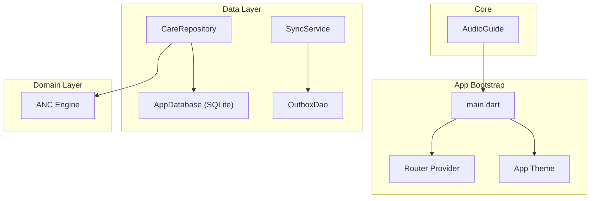
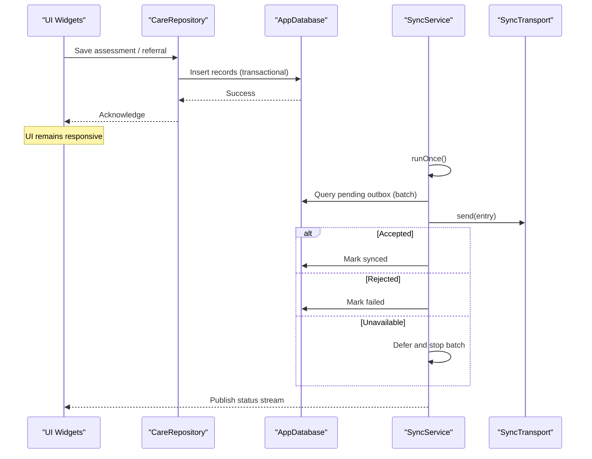
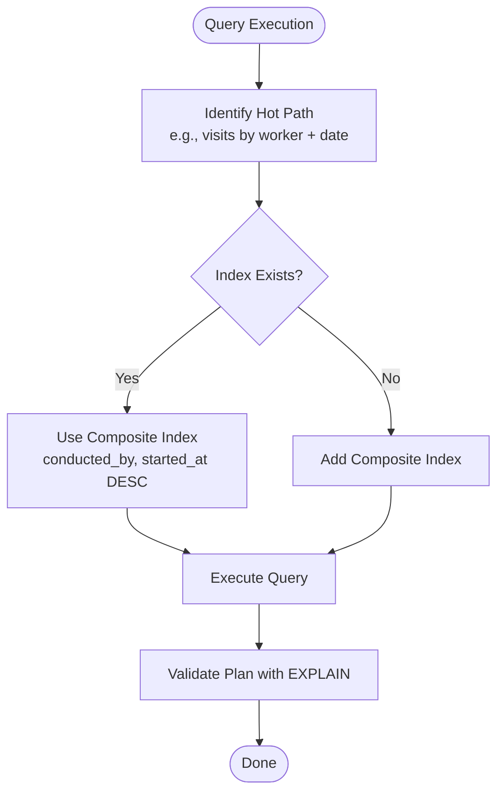
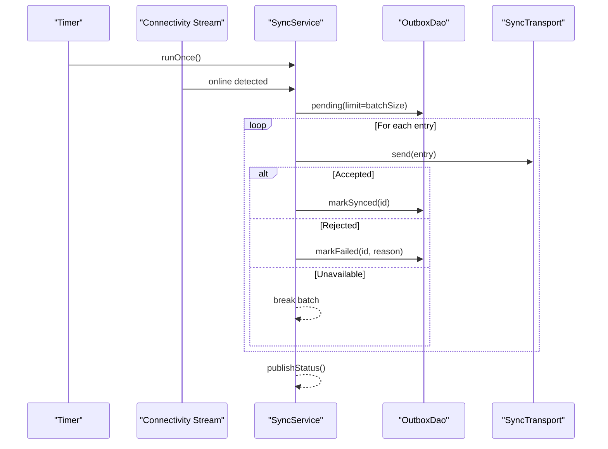
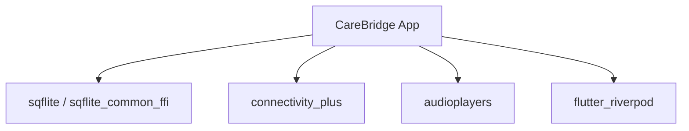

# Performance Optimization

<cite>
**Referenced Files in This Document**
- [README.md](file://README.md)
- [pubspec.yaml](file://pubspec.yaml)
- [main.dart](file://lib/main.dart)
- [app_database.dart](file://lib/data/local/app_database.dart)
- [sync_service.dart](file://lib/data/sync/sync_service.dart)
- [audio_guide.dart](file://lib/core/audio/audio_guide.dart)
- [care_repository.dart](file://lib/data/repositories/care_repository.dart)
</cite>

## Table of Contents
1. Introduction
2. Project Structure
3. Core Components
4. Architecture Overview
5. Detailed Component Analysis
6. Dependency Analysis
7. Performance Considerations
8. Troubleshooting Guide
9. Conclusion

## Introduction
This document provides a comprehensive performance optimization guide for CareBridge AI, tailored to resource-constrained mobile health environments. It focuses on database query optimization and indexing strategies for large datasets, memory management best practices, battery usage optimization for mobile devices, network efficiency for sync operations, and UI responsiveness improvements. It also covers profiling tools, performance monitoring, bottleneck identification, caching strategies, lazy loading patterns, and resource management.

The application is offline-first with SQLite as the source of truth, background opportunistic sync, and role-based access control at the data boundary. These design choices provide strong foundations for performance and reliability when connectivity is intermittent and device resources are limited.

## Project Structure
CareBridge AI follows a layered architecture:
- Presentation layer (Flutter widgets and routing)
- Domain layer (clinical engines and business rules)
- Data layer (SQLite DAOs, repositories, and sync service)
- Core utilities (audio guidance, theme, router)

Key entry points and runtime initialization:
- Application bootstrap initializes Riverpod scope and routes
- Database singleton manages lifecycle and schema
- Sync service runs opportunistically based on connectivity and timers
- Audio guidance uses asset playback with graceful fallback

**Diagram sources**
- [main.dart:16-35](file://lib/main.dart#L16-L35)
- [app_database.dart:43-103](file://lib/data/local/app_database.dart#L43-L103)
- [sync_service.dart:96-133](file://lib/data/sync/sync_service.dart#L96-L133)
- [care_repository.dart:55-110](file://lib/data/repositories/care_repository.dart#L55-L110)
- [anc_engine.dart:158-170](file://lib/domain/engines/anc_engine.dart#L158-L170)
- [audio_guide.dart:77-99](file://lib/core/audio/audio_guide.dart#L77-L99)

**Section sources**
- [README.md:1-18](file://README.md#L1-L18)
- [pubspec.yaml:1-67](file://pubspec.yaml#L1-L67)
- [main.dart:16-35](file://lib/main.dart#L16-L35)

## Core Components
- Offline-first SQLite database with explicit foreign keys and indexes
- Role-enforced repository that centralizes permission checks and audit logging
- Opportunistic background sync with priority batching and reentrancy guards
- Audio guidance with asset-based playback and script fallback
- Clinical engines implementing protocol-driven assessments

Performance-critical aspects:
- Database open concurrency guard prevents crashes under parallel provider initialization
- Indexes aligned to frequent queries (households by community, visits by worker/date, growth series by person/date)
- Sync batches small and committed individually to survive transient connectivity
- Audio playback avoids blocking UI and gracefully handles missing assets

**Section sources**
- [app_database.dart:62-103](file://lib/data/local/app_database.dart#L62-L103)
- [app_database.dart:194-556](file://lib/data/local/app_database.dart#L194-L556)
- [care_repository.dart:55-127](file://lib/data/repositories/care_repository.dart#L55-L127)
- [sync_service.dart:96-133](file://lib/data/sync/sync_service.dart#L96-L133)
- [audio_guide.dart:77-99](file://lib/core/audio/audio_guide.dart#L77-L99)

## Architecture Overview
The system emphasizes resilience and performance:
- SQLite is the authoritative store; writes commit locally immediately
- Sync outbox ensures eventual consistency without blocking user actions
- Repository enforces permissions and scopes at the data boundary
- Engines compute clinical decisions deterministically from inputs

**Diagram sources**
- [care_repository.dart:350-391](file://lib/data/repositories/care_repository.dart#L350-L391)
- [app_database.dart:90-103](file://lib/data/local/app_database.dart#L90-L103)
- [sync_service.dart:156-217](file://lib/data/sync/sync_service.dart#L156-L217)

## Detailed Component Analysis

### Database Performance and Indexing Strategy
- Foreign keys enabled to prevent orphaned rows and maintain referential integrity
- Explicit indexes align with hot paths:
  - Households by region/district/community and created_by
  - Persons by household_id and mother_id, plus client_type filters
  - Growth measurements by person_id and date descending
  - Visits by household_id and conducted_by with time ordering
  - Assessments by person_id/time and visit_id, plus overrides index
  - Referrals by reference_code unique, status/time, and person_id/time
  - Scheduled contacts by completed_at/due_date and person_id/due_date
  - Outbox by synced_at/priority/queued_at and entity_table/entity_id
  - Audit log by occurred_at and actor_id/time

Optimization recommendations:
- Use targeted SELECT columns to reduce payload
- Batch inserts where possible within transactions
- Avoid full table scans by leveraging composite indexes matching WHERE + ORDER BY
- Periodically analyze slow queries via EXPLAIN QUERY PLAN
- Keep indices minimal but sufficient to avoid write overhead

**Diagram sources**
- [app_database.dart:194-556](file://lib/data/local/app_database.dart#L194-L556)

**Section sources**
- [app_database.dart:90-103](file://lib/data/local/app_database.dart#L90-L103)
- [app_database.dart:194-556](file://lib/data/local/app_database.dart#L194-L556)

### Memory Management Best Practices
- Singleton database instance with guarded opening prevents multiple concurrent opens
- Completer-based async open ensures safe parallel initialization
- Close database explicitly during app shutdown or tests
- Prefer streaming updates rather than loading entire tables into memory
- Limit object lifetimes in long-running tasks; dispose streams and timers

Recommendations:
- Stream only necessary fields and pages results
- Use lightweight DTOs for UI-bound data
- Avoid holding large JSON payloads in memory; parse incrementally if needed
- Release audio player resources after playback

**Section sources**
- [app_database.dart:43-88](file://lib/data/local/app_database.dart#L43-L88)
- [app_database.dart:130-134](file://lib/data/local/app_database.dart#L130-L134)
- [audio_guide.dart:77-107](file://lib/core/audio/audio_guide.dart#L77-L107)

### Battery Usage Optimization for Mobile Devices
- Background sync runs opportunistically on connectivity changes and periodic timer
- Small batch sizes minimize radio wake-ups and power spikes
- Avoid synchronous network calls on UI thread
- Stop audio playback promptly when not needed
- Coalesce frequent state updates to reduce UI rebuilds

Recommendations:
- Increase sync interval during low-battery states
- Defer non-urgent sync until charging or Wi-Fi available
- Use platform background execution policies judiciously
- Monitor CPU and network usage via Flutter DevTools and platform profilers

**Section sources**
- [sync_service.dart:122-133](file://lib/data/sync/sync_service.dart#L122-L133)
- [sync_service.dart:156-217](file://lib/data/sync/sync_service.dart#L156-L217)
- [audio_guide.dart:90-99](file://lib/core/audio/audio_guide.dart#L90-L99)

### Network Efficiency for Sync Operations
- Priority queue ensures urgent referrals leave before routine registrations
- Batches of fixed size improve partial success under unstable networks
- Reentrancy guard prevents double-sending and duplicate counts
- Stuck items tracked with last error for human intervention

Recommendations:
- Implement exponential backoff for retries
- Compress payloads where feasible
- Cache remote metadata to reduce repeated fetches
- Use conditional requests (ETag/If-Modified-Since) when supported

**Diagram sources**
- [sync_service.dart:122-133](file://lib/data/sync/sync_service.dart#L122-L133)
- [sync_service.dart:156-217](file://lib/data/sync/sync_service.dart#L156-L217)

**Section sources**
- [sync_service.dart:96-133](file://lib/data/sync/sync_service.dart#L96-L133)
- [sync_service.dart:156-217](file://lib/data/sync/sync_service.dart#L156-L217)

### UI Responsiveness Improvements
- Keep heavy work off the main isolate; use isolates or microtasks for CPU-intensive tasks
- Debounce rapid UI events (search, scroll) to limit rebuilds
- Use Riverpod providers efficiently; watch only what you need
- Avoid layout thrashing by minimizing nested rebuilds and using const widgets

Recommendations:
- Precompute derived data in background and cache results
- Paginate lists and virtualize long lists
- Use skeleton loaders while fetching data
- Profile frame rendering with DevTools to identify jank

**Section sources**
- [main.dart:24-33](file://lib/main.dart#L24-L33)

### Caching Strategies and Lazy Loading Patterns
- Reference data can be cached locally and updated periodically
- Audio assets loaded on demand; fallback to script when unavailable
- Database queries should page results and cache frequently accessed entities
- Use in-memory caches for short-lived computations (e.g., classification outputs)

Recommendations:
- Implement LRU cache for expensive computations
- Lazy-load images and heavy assets
- Prefetch likely-needed data during idle periods

**Section sources**
- [audio_guide.dart:82-99](file://lib/core/audio/audio_guide.dart#L82-L99)

### Resource Management for Optimal Performance
- Ensure all streams and timers are disposed properly
- Close database connections on exit or when switching contexts
- Stop audio players and release resources when no longer needed
- Avoid global mutable state; prefer scoped providers

Recommendations:
- Centralize resource lifecycle management
- Use try-finally blocks to guarantee cleanup
- Monitor memory leaks with heap snapshots

**Section sources**
- [sync_service.dart:135-145](file://lib/data/sync/sync_service.dart#L135-L145)
- [app_database.dart:130-134](file://lib/data/local/app_database.dart#L130-L134)
- [audio_guide.dart:101-107](file://lib/core/audio/audio_guide.dart#L101-L107)

## Dependency Analysis
Key dependencies impacting performance:
- sqflite and sqflite_common_ffi for native SQLite access
- connectivity_plus for opportunistic sync triggers
- audioplayers for local audio playback
- flutter_riverpod for reactive state management

**Diagram sources**
- [pubspec.yaml:12-54](file://pubspec.yaml#L12-L54)

**Section sources**
- [pubspec.yaml:12-54](file://pubspec.yaml#L12-L54)

## Performance Considerations
- Database:
  - Maintain composite indexes matching common WHERE and ORDER BY clauses
  - Use transactions for batch writes to reduce disk I/O
  - Analyze query plans regularly and remove unused indexes
- Sync:
  - Keep batches small and prioritize urgent items
  - Implement retry with backoff and dead-letter handling for persistent failures
- Memory:
  - Stream data instead of loading entire tables
  - Dispose streams, timers, and players promptly
- UI:
  - Minimize rebuilds and avoid heavy computations on the main thread
  - Virtualize long lists and paginate results
- Battery:
  - Align sync intervals with connectivity and power state
  - Avoid unnecessary wake-ups and coalesce updates

[No sources needed since this section provides general guidance]

## Troubleshooting Guide
Common issues and resolutions:
- Database open crashes due to concurrent access:
  - Ensure single open path with Completer guard
  - Verify no duplicate openDatabase calls
- Sync loops or double-sends:
  - Confirm reentrancy guard prevents concurrent runs
  - Check outbox indices for correct ordering
- Missing audio assets:
  - Graceful fallback to script; verify asset paths and language slugs
- Permission errors:
  - Review repository guards and audit logs for denied actions

Monitoring and diagnostics:
- Use Flutter DevTools for CPU, memory, and network profiling
- Log sync outcomes and stuck items for manual review
- Track database query performance with EXPLAIN QUERY PLAN

**Section sources**
- [app_database.dart:62-88](file://lib/data/local/app_database.dart#L62-L88)
- [sync_service.dart:156-217](file://lib/data/sync/sync_service.dart#L156-L217)
- [audio_guide.dart:82-99](file://lib/core/audio/audio_guide.dart#L82-L99)
- [care_repository.dart:63-79](file://lib/data/repositories/care_repository.dart#L63-L79)

## Conclusion
CareBridge AI’s offline-first design, robust indexing strategy, and opportunistic sync model provide a strong foundation for performance in constrained environments. By continuing to refine database queries, manage memory and resources carefully, optimize battery usage, and ensure UI responsiveness, the application can deliver reliable care workflows even under challenging conditions. Profiling tools and monitoring should be integrated into development and production to sustain performance over time.

[No sources needed since this section summarizes without analyzing specific files]