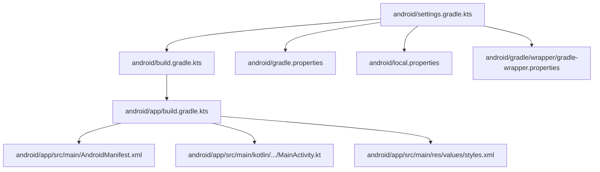
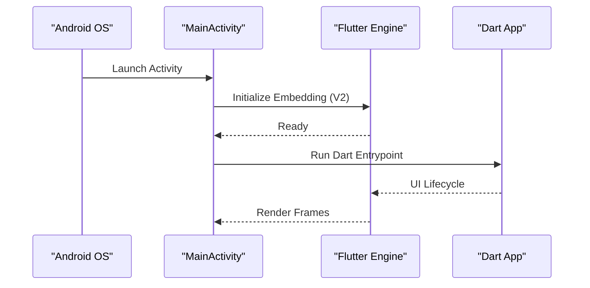
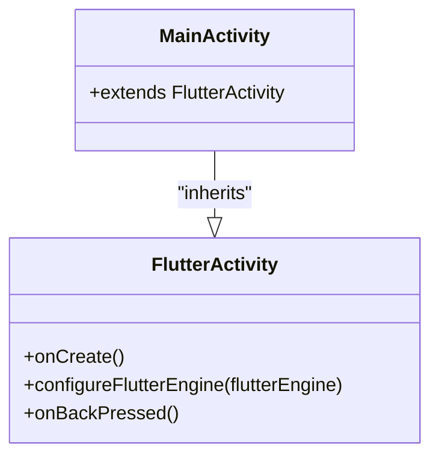
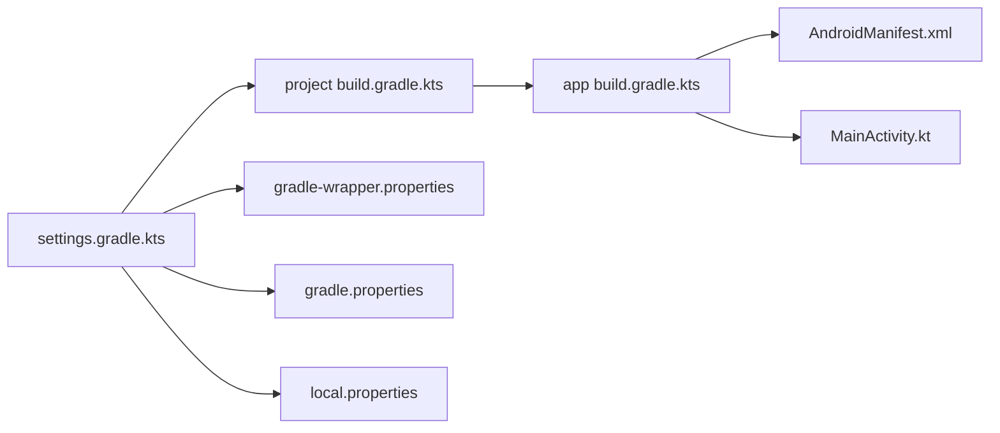

# Android Configuration

<cite>
**Referenced Files in This Document**
- [MainActivity.kt](file://android/app/src/main/kotlin/gh/carebridge/carebridge_ai/MainActivity.kt)
- [AndroidManifest.xml](file://android/app/src/main/AndroidManifest.xml)
- [debug AndroidManifest.xml](file://android/app/src/debug/AndroidManifest.xml)
- [profile AndroidManifest.xml](file://android/app/src/profile/AndroidManifest.xml)
- [app build.gradle.kts](file://android/app/build.gradle.kts)
- [project build.gradle.kts](file://android/build.gradle.kts)
- [settings.gradle.kts](file://android/settings.gradle.kts)
- [gradle.properties](file://android/gradle.properties)
- [local.properties](file://android/local.properties)
- [gradle-wrapper.properties](file://android/gradle/wrapper/gradle-wrapper.properties)
- [styles.xml](file://android/app/src/main/res/values/styles.xml)
</cite>

## Table of Contents
1. [Introduction](#introduction)
2. [Project Structure](#project-structure)
3. [Core Components](#core-components)
4. [Architecture Overview](#architecture-overview)
5. [Detailed Component Analysis](#detailed-component-analysis)
6. [Dependency Analysis](#dependency-analysis)
7. [Performance Considerations](#performance-considerations)
8. [Troubleshooting Guide](#troubleshooting-guide)
9. [Conclusion](#conclusion)
10. [Appendices](#appendices)

## Introduction
This document provides comprehensive Android configuration guidance for CareBridge AI, focusing on MainActivity customization and FlutterActivity integration, AndroidManifest permissions, Gradle build configuration, wrapper setup, local properties, and platform-specific optimizations. It also covers debugging techniques, crash reporting considerations, and production deployment steps tailored to the project’s current configuration.

## Project Structure
The Android layer is organized under the android directory with a standard Flutter layout:
- app module contains the application manifest, Kotlin entry point (MainActivity), resources, and build script.
- Root-level Gradle files configure repositories, build directories, plugin versions, and evaluation order.
- Wrapper and properties files manage Gradle distribution, JVM arguments, and SDK paths.

**Diagram sources**
- [settings.gradle.kts:1-27](file://android/settings.gradle.kts#L1-L27)
- [project build.gradle.kts:1-25](file://android/build.gradle.kts#L1-L25)
- [app build.gradle.kts:1-46](file://android/app/build.gradle.kts#L1-L46)
- [AndroidManifest.xml:1-46](file://android/app/src/main/AndroidManifest.xml#L1-L46)
- [MainActivity.kt:1-6](file://android/app/src/main/kotlin/gh/carebridge/carebridge_ai/MainActivity.kt#L1-L6)
- [styles.xml:1-19](file://android/app/src/main/res/values/styles.xml#L1-L19)
- [gradle.properties:1-7](file://android/gradle.properties#L1-L7)
- [local.properties:1-2](file://android/local.properties#L1-L2)
- [gradle-wrapper.properties:1-6](file://android/gradle/wrapper/gradle-wrapper.properties#L1-L6)

**Section sources**
- [settings.gradle.kts:1-27](file://android/settings.gradle.kts#L1-L27)
- [project build.gradle.kts:1-25](file://android/build.gradle.kts#L1-L25)
- [app build.gradle.kts:1-46](file://android/app/build.gradle.kts#L1-L46)

## Core Components
- MainActivity extends FlutterActivity and serves as the Android entry point that hosts the Flutter engine and UI.
- AndroidManifest defines the application metadata, activity configuration, and required queries for text processing.
- Build scripts configure compile/target SDKs, Java/Kotlin targets, application ID, versioning, and signing.
- Gradle wrapper and properties ensure consistent builds across environments.

Key responsibilities:
- MainActivity: minimal FlutterActivity subclass; can be extended to integrate native features or override lifecycle behaviors.
- Manifest: declares launcher activity, embedding version, and queries for text processing.
- Gradle: sets up Android application plugin, Flutter plugin, compile options, default config, and build types.

**Section sources**
- [MainActivity.kt:1-6](file://android/app/src/main/kotlin/gh/carebridge/carebridge_ai/MainActivity.kt#L1-L6)
- [AndroidManifest.xml:1-46](file://android/app/src/main/AndroidManifest.xml#L1-L46)
- [app build.gradle.kts:1-46](file://android/app/build.gradle.kts#L1-L46)

## Architecture Overview
The Android layer integrates with Flutter via the V2 embedding. The launcher Activity initializes the Flutter engine, which then renders the Dart UI.

**Diagram sources**
- [MainActivity.kt:1-6](file://android/app/src/main/kotlin/gh/carebridge/carebridge_ai/MainActivity.kt#L1-L6)
- [AndroidManifest.xml:1-46](file://android/app/src/main/AndroidManifest.xml#L1-L46)

## Detailed Component Analysis

### MainActivity Customization and FlutterActivity Integration
- MainActivity currently extends FlutterActivity without overrides, providing a clean integration point.
- To customize behavior, you can override methods such as onCreate, configureFlutterEngine, or handle system back navigation.
- Ensure any native integrations are thread-safe and respect Flutter’s lifecycle.

**Diagram sources**
- [MainActivity.kt:1-6](file://android/app/src/main/kotlin/gh/carebridge/carebridge_ai/MainActivity.kt#L1-L6)

**Section sources**
- [MainActivity.kt:1-6](file://android/app/src/main/kotlin/gh/carebridge/carebridge_ai/MainActivity.kt#L1-L6)

### AndroidManifest Permissions and Queries
- The main manifest declares the launcher activity, theme, and Flutter embedding version.
- Internet permission is added in debug and profile manifests to support development tooling.
- For production, add only the permissions your app truly needs. Common categories include storage, network, camera, location, and device-specific permissions.

Recommended additions (add only what you need):
- Network: INTERNET, ACCESS_NETWORK_STATE
- Storage: READ_EXTERNAL_STORAGE, WRITE_EXTERNAL_STORAGE (or scoped storage APIs for newer API levels)
- Camera/Microphone: CAMERA, RECORD_AUDIO
- Location: ACCESS_FINE_LOCATION, ACCESS_COARSE_LOCATION
- Device info: READ_PHONE_STATE (only if necessary)

Note: The current manifests do not declare these additional permissions; add them explicitly where needed.

**Section sources**
- [AndroidManifest.xml:1-46](file://android/app/src/main/AndroidManifest.xml#L1-L46)
- [debug AndroidManifest.xml:1-8](file://android/app/src/debug/AndroidManifest.xml#L1-L8)
- [profile AndroidManifest.xml:1-8](file://android/app/src/profile/AndroidManifest.xml#L1-L8)

### Build Configuration (app/build.gradle.kts)
- Plugins: Android application and Flutter Gradle plugin are applied.
- Compile options: Java 17 compatibility set for both source and target.
- DefaultConfig: Application ID, minSdk, targetSdk, versionCode, and versionName sourced from Flutter tooling.
- BuildTypes: Release type currently uses debug signing; replace with a proper release keystore for production.
- Kotlin: JVM target set to 17.
- Flutter source path points to the root project.

Signing configuration:
- Create a release keystore and define signingConfigs in the app build script.
- Reference the release signing config in the release buildType.

Build variants:
- Use debug, profile, and release variants for different optimization and instrumentation levels.

**Section sources**
- [app build.gradle.kts:1-46](file://android/app/build.gradle.kts#L1-L46)

### Project-Level Gradle Settings
- Repositories: Google and Maven Central configured at project level.
- Build directories: Centralized build output under root build directory with subproject folders.
- Evaluation: Subprojects evaluate dependencies on the app module.
- Clean task: Registered to delete the root build directory.

**Section sources**
- [project build.gradle.kts:1-25](file://android/build.gradle.kts#L1-L25)

### Gradle Wrapper and Properties
- Wrapper distribution URL specifies Gradle version used for reproducible builds.
- gradle.properties configures JVM memory settings and flags for AndroidX and DSL behavior.
- local.properties holds absolute paths for Android SDK and Flutter SDK.

Best practices:
- Pin Gradle version via wrapper to avoid environment drift.
- Keep local.properties out of version control; use CI variables instead.
- Tune JVM args based on machine capabilities to prevent OOM during large builds.

**Section sources**
- [gradle-wrapper.properties:1-6](file://android/gradle/wrapper/gradle-wrapper.properties#L1-L6)
- [gradle.properties:1-7](file://android/gradle.properties#L1-L7)
- [local.properties:1-2](file://android/local.properties#L1-L2)

### Settings and Plugin Versions
- Plugin management includes Flutter tools Gradle build, Google, Maven Central, and Gradle Plugin Portal.
- Declared plugins: Flutter plugin loader, Android application, and Kotlin Android with specific versions.
- Includes the app module.

Ensure versions align with your Flutter toolchain and Android Gradle Plugin compatibility matrix.

**Section sources**
- [settings.gradle.kts:1-27](file://android/settings.gradle.kts#L1-L27)

### Themes and Splash Screen
- Styles define launch and normal themes for light mode.
- Night mode styles exist; ensure consistency across themes.
- Splash background drawable referenced by launch theme.

Consider adding dark mode support and ensuring splash assets scale correctly across densities.

**Section sources**
- [styles.xml:1-19](file://android/app/src/main/res/values/styles.xml#L1-L19)

## Dependency Analysis
The Android layer depends on:
- Android Gradle Plugin and Kotlin Android plugin declared in settings.
- Flutter Gradle plugin integrated via settings and app build script.
- Repositories for resolving dependencies.

**Diagram sources**
- [settings.gradle.kts:1-27](file://android/settings.gradle.kts#L1-L27)
- [project build.gradle.kts:1-25](file://android/build.gradle.kts#L1-L25)
- [app build.gradle.kts:1-46](file://android/app/build.gradle.kts#L1-L46)
- [AndroidManifest.xml:1-46](file://android/app/src/main/AndroidManifest.xml#L1-L46)
- [MainActivity.kt:1-6](file://android/app/src/main/kotlin/gh/carebridge/carebridge_ai/MainActivity.kt#L1-L6)
- [gradle-wrapper.properties:1-6](file://android/gradle/wrapper/gradle-wrapper.properties#L1-L6)
- [gradle.properties:1-7](file://android/gradle.properties#L1-L7)
- [local.properties:1-2](file://android/local.properties#L1-L2)

**Section sources**
- [settings.gradle.kts:1-27](file://android/settings.gradle.kts#L1-L27)
- [project build.gradle.kts:1-25](file://android/build.gradle.kts#L1-L25)
- [app build.gradle.kts:1-46](file://android/app/build.gradle.kts#L1-L46)

## Performance Considerations
- Memory and build performance:
  - Adjust gradle.properties JVM args to match available RAM; current settings allocate significant heap and metaspace.
  - Enable parallel builds and daemon usage in CI environments.
- Runtime performance:
  - Use profile builds to measure CPU, memory, and GPU usage.
  - Avoid heavy work on the UI thread; offload to background isolates or coroutines.
  - Minimize view inflation overhead and reuse layouts where possible.
- ProGuard/R8:
  - Enable shrinking and obfuscation in release builds to reduce APK size and improve startup time.
- Native code:
  - If using native libraries, ensure ABI filters are configured to reduce binary size.

[No sources needed since this section provides general guidance]

## Troubleshooting Guide
Common issues and resolutions:
- Missing INTERNET permission in debug/profile:
  - Already present in debug and profile manifests; ensure it remains when testing network-dependent features.
- Signing errors in release builds:
  - Replace debug signing with a release keystore; verify alias and password configuration.
- Permission denied at runtime:
  - Add required permissions to the main manifest and request at runtime for dangerous permissions.
- Build failures due to SDK paths:
  - Verify local.properties contains correct sdk.dir and flutter.sdk paths; update if moved.
- Gradle version mismatch:
  - Align wrapper Gradle version with Android Gradle Plugin requirements; update wrapper if needed.

**Section sources**
- [debug AndroidManifest.xml:1-8](file://android/app/src/debug/AndroidManifest.xml#L1-L8)
- [profile AndroidManifest.xml:1-8](file://android/app/src/profile/AndroidManifest.xml#L1-L8)
- [app build.gradle.kts:1-46](file://android/app/build.gradle.kts#L1-L46)
- [local.properties:1-2](file://android/local.properties#L1-L2)
- [gradle-wrapper.properties:1-6](file://android/gradle/wrapper/gradle-wrapper.properties#L1-L6)

## Conclusion
CareBridge AI’s Android configuration follows Flutter best practices with a minimal MainActivity, clear manifest structure, and robust Gradle setup. Extend MainActivity for native integrations, add only necessary permissions, configure secure signing for release, and tune Gradle and runtime settings for optimal performance. Follow the troubleshooting tips to resolve common issues and ensure smooth development and production deployments.

## Appendices

### Recommended Production Checklist
- Replace debug signing with a release keystore and configure signingConfigs.
- Add only required permissions to the main manifest; remove unnecessary ones.
- Enable R8/shrinking and obfuscation for release builds.
- Validate network and storage permissions at runtime where applicable.
- Test on multiple devices and API levels; verify memory and CPU profiles.
- Integrate crash reporting (e.g., Firebase Crashlytics) and enable symbol upload for stack traces.

[No sources needed since this section provides general guidance]