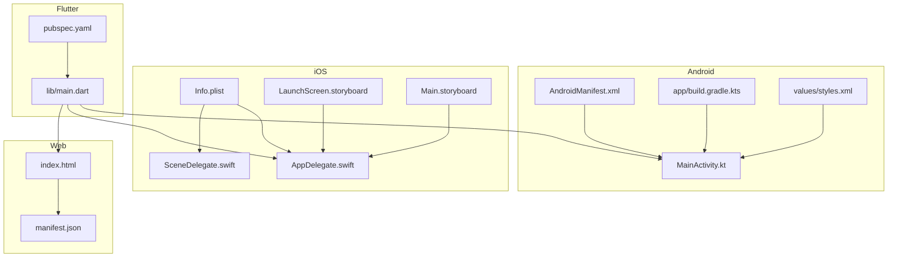
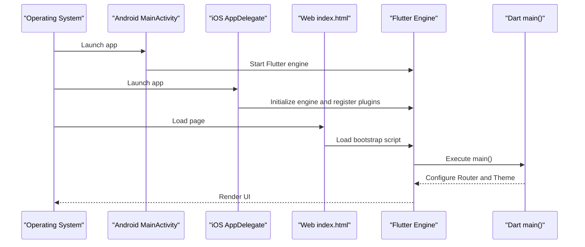
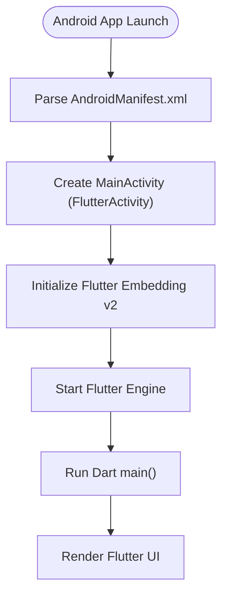
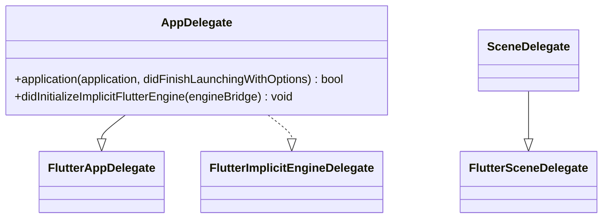
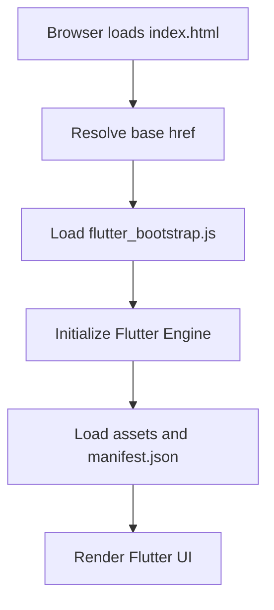
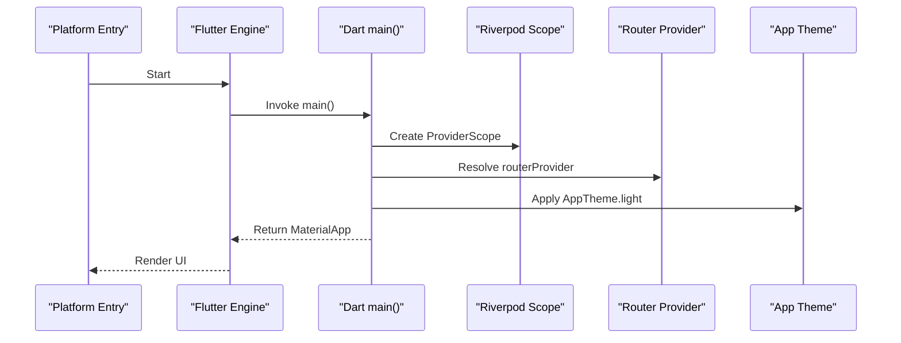
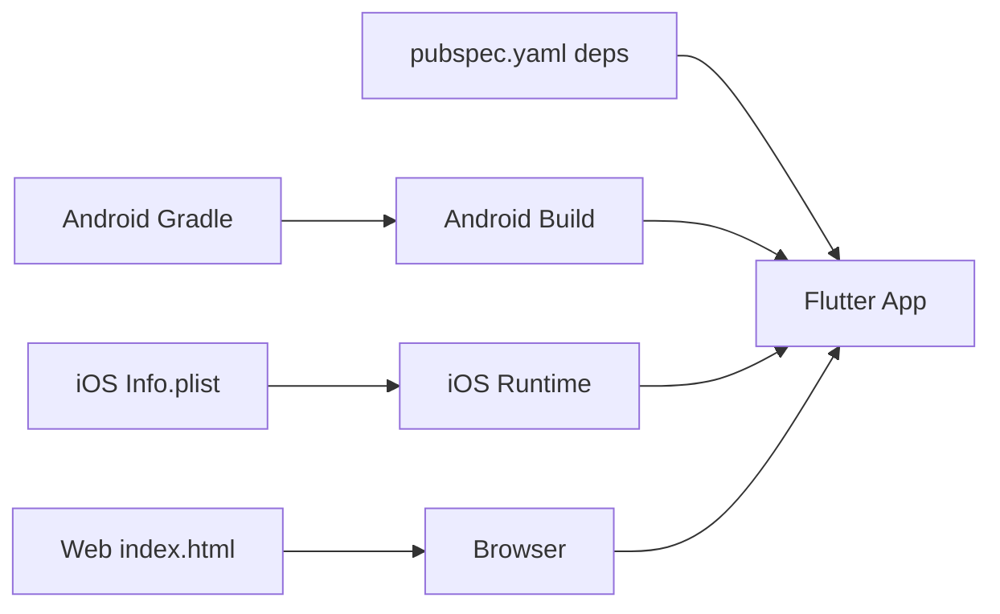

# Platform Integration

<cite>
**Referenced Files in This Document**
- [AndroidManifest.xml](file://android/app/src/main/AndroidManifest.xml)
- [MainActivity.kt](file://android/app/src/main/kotlin/gh/carebridge/carebridge_ai/MainActivity.kt)
- [build.gradle.kts (app)](file://android/app/build.gradle.kts)
- [styles.xml](file://android/app/src/main/res/values/styles.xml)
- [AppDelegate.swift](file://ios/Runner/AppDelegate.swift)
- [SceneDelegate.swift](file://ios/Runner/SceneDelegate.swift)
- [Info.plist](file://ios/Runner/Info.plist)
- [LaunchScreen.storyboard](file://ios/Runner/Base.lproj/LaunchScreen.storyboard)
- [Main.storyboard](file://ios/Runner/Base.lproj/Main.storyboard)
- [index.html](file://web/index.html)
- [manifest.json](file://web/manifest.json)
- [pubspec.yaml](file://pubspec.yaml)
- [main.dart](file://lib/main.dart)
</cite>

## Table of Contents
1. Introduction
2. Project Structure
3. Core Components
4. Architecture Overview
5. Detailed Component Analysis
6. Dependency Analysis
7. Performance Considerations
8. Troubleshooting Guide
9. Conclusion

## Introduction
This document provides comprehensive platform integration guidance for CareBridge AI across Android, iOS, and Web. It covers native setup, permissions, build configurations, privacy settings, App Store preparation, web deployment basics, manifest configuration, browser compatibility considerations, platform-specific optimizations, native feature integrations, and deployment preparation. The goal is to enable developers to configure, optimize, and ship the app on each target platform with confidence.

## Project Structure
CareBridge AI is a Flutter application with standard platform folders:
- android: Android native entry points, manifest, themes, and Gradle build configuration
- ios: iOS native entry points, Info.plist, storyboards, and scene delegates
- web: HTML bootstrap, PWA manifest, and icons
- lib: Dart application entry point and core modules
- pubspec.yaml: Dependencies and asset declarations

**Diagram sources**
- [AndroidManifest.xml](file://android/app/src/main/AndroidManifest.xml)
- [MainActivity.kt](file://android/app/src/main/kotlin/gh/carebridge/carebridge_ai/MainActivity.kt)
- [build.gradle.kts (app)](file://android/app/build.gradle.kts)
- [styles.xml](file://android/app/src/main/res/values/styles.xml)
- [AppDelegate.swift](file://ios/Runner/AppDelegate.swift)
- [SceneDelegate.swift](file://ios/Runner/SceneDelegate.swift)
- [Info.plist](file://ios/Runner/Info.plist)
- [LaunchScreen.storyboard](file://ios/Runner/Base.lproj/LaunchScreen.storyboard)
- [Main.storyboard](file://ios/Runner/Base.lproj/Main.storyboard)
- [index.html](file://web/index.html)
- [manifest.json](file://web/manifest.json)
- [pubspec.yaml](file://pubspec.yaml)
- [main.dart](file://lib/main.dart)

**Section sources**
- [AndroidManifest.xml](file://android/app/src/main/AndroidManifest.xml)
- [MainActivity.kt](file://android/app/src/main/kotlin/gh/carebridge/carebridge_ai/MainActivity.kt)
- [build.gradle.kts (app)](file://android/app/build.gradle.kts)
- [styles.xml](file://android/app/src/main/res/values/styles.xml)
- [AppDelegate.swift](file://ios/Runner/AppDelegate.swift)
- [SceneDelegate.swift](file://ios/Runner/SceneDelegate.swift)
- [Info.plist](file://ios/Runner/Info.plist)
- [LaunchScreen.storyboard](file://ios/Runner/Base.lproj/LaunchScreen.storyboard)
- [Main.storyboard](file://ios/Runner/Base.lproj/Main.storyboard)
- [index.html](file://web/index.html)
- [manifest.json](file://web/manifest.json)
- [pubspec.yaml](file://pubspec.yaml)
- [main.dart](file://lib/main.dart)

## Core Components
- Android
  - MainActivity extends FlutterActivity and serves as the native entry point.
  - AndroidManifest defines the launcher activity, embedding version, and queries for text processing.
  - Build configuration sets compile/target SDK, Java/Kotlin versions, and signing behavior.
  - Themes define launch and normal window backgrounds.
- iOS
  - AppDelegate initializes Flutter and registers plugins via an implicit engine delegate.
  - SceneDelegate participates in iOS scene lifecycle.
  - Info.plist configures bundle metadata, supported orientations, scenes, and UI behaviors.
  - Storyboards define launch and main view controllers.
- Web
  - index.html bootstraps Flutter and links the PWA manifest and icons.
  - manifest.json defines PWA metadata, display mode, colors, and icons.
- Flutter
  - main.dart initializes Riverpod scope and configures MaterialApp with routing and theme.
  - pubspec.yaml declares dependencies and assets used by the app.

**Section sources**
- [MainActivity.kt](file://android/app/src/main/kotlin/gh/carebridge/carebridge_ai/MainActivity.kt)
- [AndroidManifest.xml](file://android/app/src/main/AndroidManifest.xml)
- [build.gradle.kts (app)](file://android/app/build.gradle.kts)
- [styles.xml](file://android/app/src/main/res/values/styles.xml)
- [AppDelegate.swift](file://ios/Runner/AppDelegate.swift)
- [SceneDelegate.swift](file://ios/Runner/SceneDelegate.swift)
- [Info.plist](file://ios/Runner/Info.plist)
- [LaunchScreen.storyboard](file://ios/Runner/Base.lproj/LaunchScreen.storyboard)
- [Main.storyboard](file://ios/Runner/Base.lproj/Main.storyboard)
- [index.html](file://web/index.html)
- [manifest.json](file://web/manifest.json)
- [main.dart](file://lib/main.dart)
- [pubspec.yaml](file://pubspec.yaml)

## Architecture Overview
The runtime flow begins at the platform’s native entry point, which hands control to Flutter. On Android, MainActivity starts the Flutter engine; on iOS, AppDelegate initializes the engine and registers plugins; on Web, index.html loads the Flutter bootstrap. Flutter then runs main.dart to set up providers, routing, and the Material app.

**Diagram sources**
- [MainActivity.kt](file://android/app/src/main/kotlin/gh/carebridge/carebridge_ai/MainActivity.kt)
- [AppDelegate.swift](file://ios/Runner/AppDelegate.swift)
- [index.html](file://web/index.html)
- [main.dart](file://lib/main.dart)

## Detailed Component Analysis

### Android Setup
- MainActivity customization
  - Extends FlutterActivity to integrate with the Flutter engine.
  - No additional overrides are present by default; extend or override methods to customize lifecycle or plugin registration if needed.
- Permissions and capabilities
  - The manifest declares the launcher activity and Flutter embedding version.
  - Queries are declared for text processing intents required by Flutter’s text plugin.
  - Add runtime permissions (e.g., camera, storage, location) in code and declare them in the manifest when your features require them.
- Build settings
  - Compile and target SDKs are sourced from Flutter tooling.
  - Java and Kotlin targets are set to JVM 17.
  - Release signing uses debug keys by default; configure proper release signing before production builds.
- Themes and launch screen
  - LaunchTheme and NormalTheme define window backgrounds during startup and after Flutter draws its first frame.
  - Ensure splash assets are provided and consistent across densities.

**Diagram sources**
- [AndroidManifest.xml](file://android/app/src/main/AndroidManifest.xml)
- [MainActivity.kt](file://android/app/src/main/kotlin/gh/carebridge/carebridge_ai/MainActivity.kt)
- [build.gradle.kts (app)](file://android/app/build.gradle.kts)
- [styles.xml](file://android/app/src/main/res/values/styles.xml)

**Section sources**
- [MainActivity.kt](file://android/app/src/main/kotlin/gh/carebridge/carebridge_ai/MainActivity.kt)
- [AndroidManifest.xml](file://android/app/src/main/AndroidManifest.xml)
- [build.gradle.kts (app)](file://android/app/build.gradle.kts)
- [styles.xml](file://android/app/src/main/res/values/styles.xml)

### iOS Configuration
- AppDelegate setup
  - Implements FlutterAppDelegate and FlutterImplicitEngineDelegate.
  - Overrides application(_:didFinishLaunchingWithOptions:) to initialize Flutter.
  - Registers plugins via didInitializeImplicitFlutterEngine using GeneratedPluginRegistrant.
- SceneDelegate
  - Inherits FlutterSceneDelegate to participate in iOS scene lifecycle.
- Privacy and App Store preparation
  - Info.plist contains bundle identifiers, versioning, supported interface orientations, and scene configuration.
  - Add usage descriptions for any restricted APIs (camera, microphone, photos, location) in Info.plist and request permissions at runtime.
  - Prepare App Store metadata, icons, and screenshots per Apple guidelines.
- Launch and main screens
  - LaunchScreen.storyboard displays the initial splash image.
  - Main.storyboard hosts the FlutterViewController that renders Flutter UI.

**Diagram sources**
- [AppDelegate.swift](file://ios/Runner/AppDelegate.swift)
- [SceneDelegate.swift](file://ios/Runner/SceneDelegate.swift)

**Section sources**
- [AppDelegate.swift](file://ios/Runner/AppDelegate.swift)
- [SceneDelegate.swift](file://ios/Runner/SceneDelegate.swift)
- [Info.plist](file://ios/Runner/Info.plist)
- [LaunchScreen.storyboard](file://ios/Runner/Base.lproj/LaunchScreen.storyboard)
- [Main.storyboard](file://ios/Runner/Base.lproj/Main.storyboard)

### Web Deployment Basics
- Bootstrap and base href
  - index.html includes the Flutter bootstrap script and sets the base href placeholder replaced by flutter build.
  - Adjust base href if serving under a non-root path.
- PWA manifest
  - manifest.json defines name, short_name, start_url, display mode, background/theme colors, orientation, and icons.
  - Ensure icons exist at the specified paths and sizes.
- Browser compatibility
  - Use modern browsers; ensure polyfills and fallbacks if targeting older environments.
  - Validate service worker behavior and caching strategies for offline-first scenarios.

**Diagram sources**
- [index.html](file://web/index.html)
- [manifest.json](file://web/manifest.json)

**Section sources**
- [index.html](file://web/index.html)
- [manifest.json](file://web/manifest.json)

### Flutter Application Entry
- main.dart
  - Initializes Riverpod ProviderScope and launches CareBridgeApp.
  - Configures MaterialApp with title, theme, and router configuration.
- pubspec.yaml
  - Declares dependencies such as state management, routing, local storage, secure storage, connectivity, device info, UI libraries, audio, QR generation, utilities, and localization.
  - Declares assets for audio and images.

**Diagram sources**
- [main.dart](file://lib/main.dart)
- [pubspec.yaml](file://pubspec.yaml)

**Section sources**
- [main.dart](file://lib/main.dart)
- [pubspec.yaml](file://pubspec.yaml)

## Dependency Analysis
Key platform dependencies and their roles:
- Android
  - Android Gradle Plugin and Flutter Gradle plugin orchestrate compilation and packaging.
  - Java 17 and Kotlin JVM 17 targets align with modern Android toolchains.
- iOS
  - Flutter framework and UIKit integration via AppDelegate and SceneDelegate.
  - Info.plist controls bundle metadata and runtime behaviors.
- Web
  - HTML bootstrap and PWA manifest drive browser-based execution and installability.
- Flutter
  - Dependencies include Riverpod for state, GoRouter for navigation, sqflite for local DB, secure storage, connectivity/device info, UI components, audio playback, QR generation, and utilities.

**Diagram sources**
- [build.gradle.kts (app)](file://android/app/build.gradle.kts)
- [Info.plist](file://ios/Runner/Info.plist)
- [index.html](file://web/index.html)
- [pubspec.yaml](file://pubspec.yaml)

**Section sources**
- [build.gradle.kts (app)](file://android/app/build.gradle.kts)
- [Info.plist](file://ios/Runner/Info.plist)
- [index.html](file://web/index.html)
- [pubspec.yaml](file://pubspec.yaml)

## Performance Considerations
- Android
  - Keep minSdk aligned with target audience while ensuring compatibility.
  - Use hardware acceleration and appropriate windowSoftInputMode for responsive UI.
  - Optimize splash assets and avoid heavy initialization in onCreate.
- iOS
  - Minimize launch time by deferring heavy work off the main thread.
  - Ensure correct supported orientations and avoid unnecessary storyboard complexity.
- Web
  - Preload critical assets and use efficient icon sizes.
  - Leverage service workers for caching and offline resilience where applicable.
- Flutter
  - Use Riverpod efficiently to avoid unnecessary rebuilds.
  - Cache network responses and leverage local storage for offline-first workflows.

[No sources needed since this section provides general guidance]

## Troubleshooting Guide
- Android
  - If the app fails to launch, verify MainActivity extends FlutterActivity and the manifest declares the correct Flutter embedding version.
  - For text-processing features, ensure the queries for PROCESS_TEXT intent are present.
  - Confirm Java/Kotlin targets match the configured JVM versions.
- iOS
  - If plugins do not register, confirm didInitializeImplicitFlutterEngine calls GeneratedPluginRegistrant.register.
  - Check Info.plist for correct bundle identifiers and supported orientations.
  - Validate storyboards reference the correct Flutter view controller.
- Web
  - If assets fail to load, verify manifest.json paths and icon files exist.
  - Ensure base href is correctly set for non-root deployments.
- Flutter
  - Verify pubspec.yaml dependencies and assets are declared.
  - Ensure main.dart initializes ProviderScope and routes properly.

**Section sources**
- [AndroidManifest.xml](file://android/app/src/main/AndroidManifest.xml)
- [MainActivity.kt](file://android/app/src/main/kotlin/gh/carebridge/carebridge_ai/MainActivity.kt)
- [build.gradle.kts (app)](file://android/app/build.gradle.kts)
- [AppDelegate.swift](file://ios/Runner/AppDelegate.swift)
- [Info.plist](file://ios/Runner/Info.plist)
- [index.html](file://web/index.html)
- [manifest.json](file://web/manifest.json)
- [pubspec.yaml](file://pubspec.yaml)
- [main.dart](file://lib/main.dart)

## Conclusion
CareBridge AI’s platform integrations follow Flutter best practices across Android, iOS, and Web. By configuring MainActivity and AndroidManifest, setting up AppDelegate and Info.plist, and preparing web assets and manifest, you can build, optimize, and deploy confidently. Adhere to platform-specific permissions, privacy requirements, and performance tips to deliver a robust experience for community health workers and caregivers.

[No sources needed since this section summarizes without analyzing specific files]