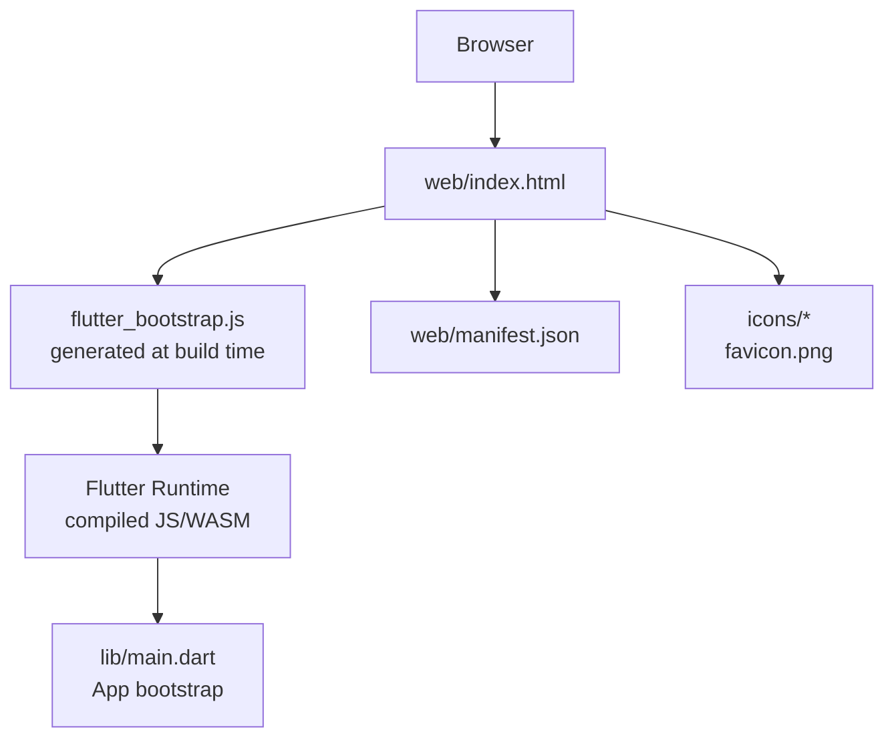
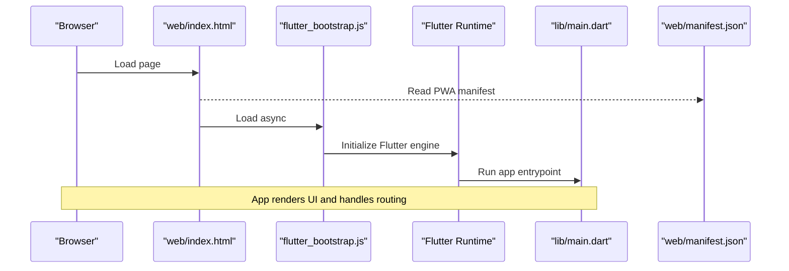
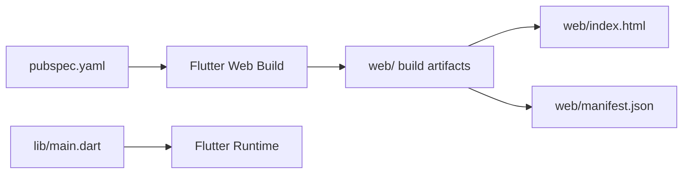

# Web Deployment

<cite>
**Referenced Files in This Document**
- [web/index.html](file://web/index.html)
- [web/manifest.json](file://web/manifest.json)
- [pubspec.yaml](file://pubspec.yaml)
- [lib/main.dart](file://lib/main.dart)
</cite>

## Table of Contents
1. [Introduction](#introduction)
2. [Project Structure](#project-structure)
3. [Core Components](#core-components)
4. [Architecture Overview](#architecture-overview)
5. [Detailed Component Analysis](#detailed-component-analysis)
6. [Dependency Analysis](#dependency-analysis)
7. [Performance Considerations](#performance-considerations)
8. [Troubleshooting Guide](#troubleshooting-guide)
9. [Conclusion](#conclusion)
10. [Appendices](#appendices)

## Introduction
This document provides web deployment guidance for the CareBridge AI Flutter application, focusing on the web entry point (index.html), PWA manifest configuration, service worker considerations, icon and favicon setup, browser compatibility, and deployment strategies for static hosting platforms such as Firebase Hosting, GitHub Pages, and Netlify. It also outlines performance optimization techniques, caching strategies, and progressive enhancement approaches suitable for a mobile-first Flutter web app.

## Project Structure
The web layer is minimal and follows Flutter’s default web template:
- web/index.html: The HTML shell that bootstraps the Flutter web runtime and includes meta tags, icons, and the PWA manifest link.
- web/manifest.json: The PWA manifest defining app metadata, theme colors, display mode, orientation, and icons.
- lib/main.dart: The Flutter application entry point that initializes the UI and routing.
- pubspec.yaml: Declares dependencies and assets used by the Flutter build pipeline.

**Diagram sources**
- [web/index.html:17-44](file://web/index.html#L17-L44)
- [web/manifest.json:1-36](file://web/manifest.json#L1-L36)
- [lib/main.dart:16-34](file://lib/main.dart#L16-L34)

**Section sources**
- [web/index.html:1-46](file://web/index.html#L1-L46)
- [web/manifest.json:1-36](file://web/manifest.json#L1-L36)
- [lib/main.dart:16-34](file://lib/main.dart#L16-L34)
- [pubspec.yaml:1-67](file://pubspec.yaml#L1-L67)

## Core Components
- index.html: Defines the base href placeholder, character encoding, compatibility, description, iOS-specific meta tags, apple-touch-icon, favicon, title, and links to the PWA manifest. It loads flutter_bootstrap.js asynchronously to initialize the Flutter engine.
- manifest.json: Specifies the app name, short name, start URL, display mode, background/theme colors, orientation, and a set of PNG icons including maskable variants.
- main.dart: Bootstraps the Flutter app with a ProviderScope and MaterialApp configured with a router and theme.

Key responsibilities:
- Mobile-first responsive design via Flutter’s rendering and meta tags.
- PWA capabilities through manifest.json and optional service worker integration.
- Icon and favicon management for consistent branding across devices and browsers.

**Section sources**
- [web/index.html:17-44](file://web/index.html#L17-L44)
- [web/manifest.json:1-36](file://web/manifest.json#L1-L36)
- [lib/main.dart:16-34](file://lib/main.dart#L16-L34)

## Architecture Overview
At runtime, the browser loads index.html, which references the PWA manifest and the Flutter bootstrap script. The Flutter runtime compiles Dart code into JavaScript or WebAssembly and renders the UI defined in main.dart. For offline support and advanced caching, a service worker can be registered either by Flutter’s web build tooling or via a custom implementation.

**Diagram sources**
- [web/index.html:17-44](file://web/index.html#L17-L44)
- [web/manifest.json:1-36](file://web/manifest.json#L1-L36)
- [lib/main.dart:16-34](file://lib/main.dart#L16-L34)

## Detailed Component Analysis

### index.html: Meta Configuration and Mobile-First Setup
- Base href placeholder supports non-root deployments; Flutter build injects the correct value based on the provided argument.
- Character set and IE compatibility meta ensure broad browser support.
- iOS-specific meta tags enable full-screen mode, status bar styling, and app title when added to the home screen.
- Apple touch icon and favicon provide visual identity across platforms.
- PWA manifest link enables installability and app-like behavior on supported browsers.
- Asynchronous loading of flutter_bootstrap.js improves perceived performance during initialization.

Recommendations:
- Ensure favicon.png exists at the web root and matches the expected path.
- Update the description and title to reflect the CareBridge AI branding.
- Verify base href behavior when deploying under subpaths.

**Section sources**
- [web/index.html:17-33](file://web/index.html#L17-L33)
- [web/index.html:36-44](file://web/index.html#L36-L44)

### manifest.json: PWA Capabilities and Icons
- App names and start_url define how the app appears and where it launches from.
- display set to standalone provides an app-like experience without browser chrome.
- background_color and theme_color control splash and toolbar colors.
- orientation locked to portrait-primary aligns with mobile-first usage.
- icons array includes standard and maskable PNGs at 192x192 and 512x512 for various device densities and OS requirements.

Recommendations:
- Provide additional icon sizes if targeting specific platforms.
- Validate maskable icons using platform guidelines to avoid cropping issues.
- Keep start_url relative to the deployment root unless otherwise required.

**Section sources**
- [web/manifest.json:1-36](file://web/manifest.json#L1-L36)

### Service Worker Registration and Offline Support
- No explicit service worker file is present in the repository. Flutter’s web build can generate a service worker depending on configuration and plugins.
- If offline caching is required, register a service worker that caches critical assets (index.html, manifest.json, core JS/WASM bundles, fonts, and images).
- Use cache-first strategies for static assets and network-first for dynamic data.

Implementation notes:
- Add a service worker file and register it from flutter_bootstrap.js or a custom loader.
- Implement versioned cache keys to force updates when assets change.
- Provide fallback pages for offline scenarios.

[No sources needed since this section provides general guidance]

### Icon Management and Favicon Configuration
- Apple touch icon referenced in index.html should exist at the specified path.
- Favicon linked in index.html must be present at the web root.
- Manifest icons include both regular and maskable variants for modern Android launchers.

Best practices:
- Use high-resolution PNGs for crisp rendering on high-DPI screens.
- Ensure maskable icons have sufficient padding to avoid clipping.
- Test icons on multiple devices and operating systems.

**Section sources**
- [web/index.html:24-30](file://web/index.html#L24-L30)
- [web/manifest.json:11-34](file://web/manifest.json#L11-L34)

### Browser Compatibility Considerations
- Meta tags ensure compatibility with older Internet Explorer versions and enforce Edge mode.
- Modern browsers will honor the PWA manifest and allow installation.
- iOS Safari requires apple-touch-icon and appropriate meta tags for full-screen behavior.

Compatibility checklist:
- Validate HTML5 features used by Flutter runtime.
- Confirm service worker support if implemented.
- Test PWA install prompts on Android Chrome and iOS Safari.

**Section sources**
- [web/index.html:19-21](file://web/index.html#L19-L21)
- [web/index.html:24-33](file://web/index.html#L24-L33)

## Dependency Analysis
The Flutter web build depends on SDK and packages declared in pubspec.yaml. Assets are included via the assets section, ensuring they are bundled with the web output. The main entrypoint initializes the app and routing.

**Diagram sources**
- [pubspec.yaml:1-67](file://pubspec.yaml#L1-L67)
- [lib/main.dart:16-34](file://lib/main.dart#L16-L34)

**Section sources**
- [pubspec.yaml:1-67](file://pubspec.yaml#L1-L67)
- [lib/main.dart:16-34](file://lib/main.dart#L16-L34)

## Performance Considerations
- Asset optimization: Compress images and use appropriate formats (e.g., WebP where supported).
- Code splitting: Rely on Flutter’s build to split bundles; avoid large third-party libraries.
- Caching strategy: Use long-lived cache headers for immutable assets; implement cache busting via filenames.
- Progressive enhancement: Ensure core content loads even if JavaScript fails; provide meaningful titles and descriptions.
- Network efficiency: Minimize payload size; defer non-critical resources.

[No sources needed since this section provides general guidance]

## Troubleshooting Guide
Common issues and resolutions:
- Missing favicon or icons: Ensure paths in index.html and manifest.json match actual files.
- Incorrect base href: When deploying under subpaths, verify the base href injected by Flutter build.
- PWA not installing: Check manifest validity, HTTPS requirement, and service worker registration.
- Offline not working: Confirm service worker caching rules and asset availability.

Validation steps:
- Use browser DevTools to inspect network requests and cache behavior.
- Validate manifest.json with online tools.
- Test on target devices and browsers for responsiveness and install prompts.

[No sources needed since this section provides general guidance]

## Conclusion
CareBridge AI’s web deployment centers around a clean Flutter web template with a well-configured index.html and manifest.json. While no service worker is present by default, adding one enables robust offline support and caching. Proper icon management, meta configuration, and adherence to PWA best practices ensure a reliable, installable, and performant web experience across devices and browsers.

[No sources needed since this section summarizes without analyzing specific files]

## Appendices

### Deployment Strategies for Static Hosting Platforms
- Firebase Hosting:
  - Build the Flutter web app and deploy the generated web build directory.
  - Configure redirects and rewrites if using client-side routing.
  - Enable HTTPS and CDN caching policies.
- GitHub Pages:
  - Push the built web artifacts to a gh-pages branch or configure Actions to deploy.
  - Set the correct base path if deploying under a project subpath.
  - Ensure all assets are accessible via relative URLs.
- Netlify:
  - Connect the repository and specify the build command and publish directory.
  - Configure redirects and environment variables as needed.
  - Leverage Netlify’s CDN and caching defaults.

[No sources needed since this section provides general guidance]

### Progressive Enhancement Approaches
- Graceful degradation: Ensure core functionality works without JavaScript where feasible.
- Semantic HTML: Maintain meaningful structure for accessibility and SEO.
- Incremental features: Add PWA features progressively based on browser support.
- Fallbacks: Provide alternative experiences for unsupported environments.

[No sources needed since this section provides general guidance]