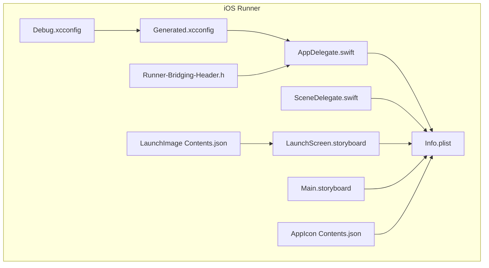
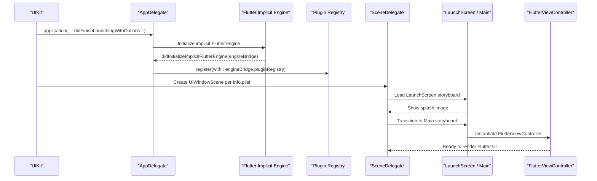
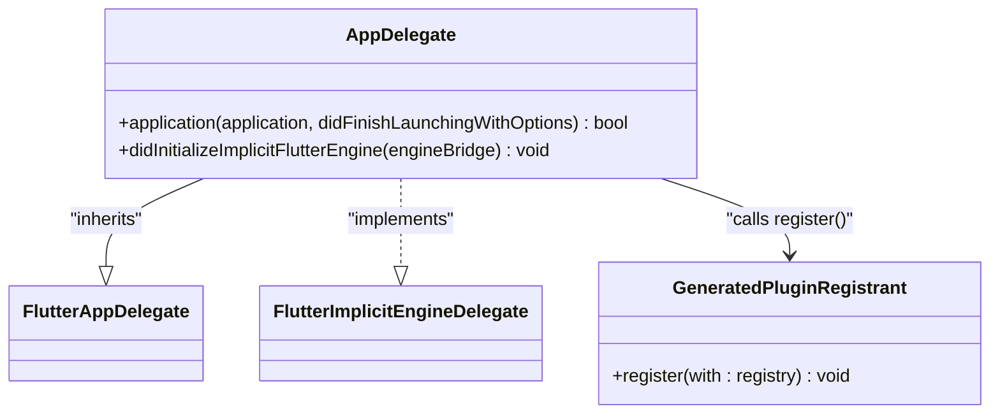
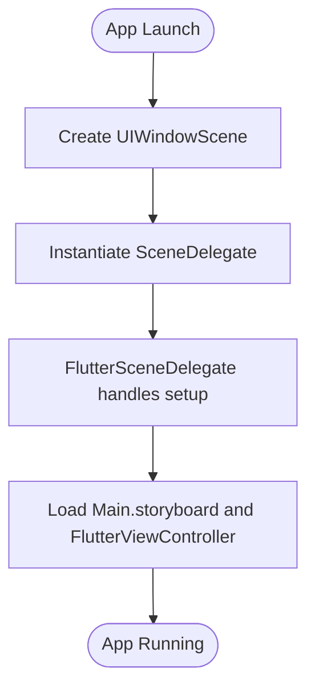
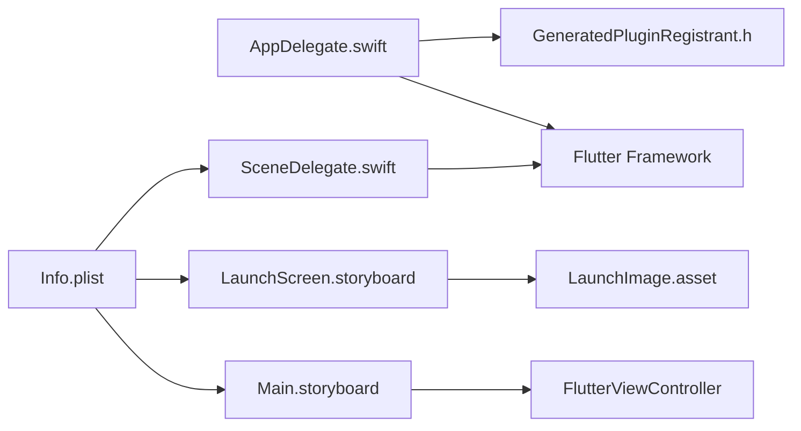

# iOS Configuration

<cite>
**Referenced Files in This Document**
- [AppDelegate.swift](file://ios/Runner/AppDelegate.swift)
- [SceneDelegate.swift](file://ios/Runner/SceneDelegate.swift)
- [Info.plist](file://ios/Runner/Info.plist)
- [LaunchScreen.storyboard](file://ios/Runner/Base.lproj/LaunchScreen.storyboard)
- [Main.storyboard](file://ios/Runner/Base.lproj/Main.storyboard)
- [AppIcon Contents.json](file://ios/Runner/Assets.xcassets/AppIcon.appiconset/Contents.json)
- [LaunchImage Contents.json](file://ios/Runner/Assets.xcassets/LaunchImage.imageset/Contents.json)
- [Generated.xcconfig](file://ios/Flutter/Generated.xcconfig)
- [Debug.xcconfig](file://ios/Flutter/Debug.xcconfig)
- [Runner-Bridging-Header.h](file://ios/Runner/Runner-Bridging-Header.h)
</cite>

## Table of Contents
1. [Introduction](#introduction)
2. [Project Structure](#project-structure)
3. [Core Components](#core-components)
4. [Architecture Overview](#architecture-overview)
5. [Detailed Component Analysis](#detailed-component-analysis)
6. [Dependency Analysis](#dependency-analysis)
7. [Performance Considerations](#performance-considerations)
8. [Troubleshooting Guide](#troubleshooting-guide)
9. [Conclusion](#conclusion)
10. [Appendices](#appendices)

## Introduction
This document provides a comprehensive iOS configuration guide for CareBridge AI, focusing on the native iOS layer that bootstraps and manages the Flutter application. It covers AppDelegate setup, Scene lifecycle management, Info.plist settings (bundle identifiers, display names, launch screens, supported orientations), storyboard configuration for launch and main UI, Xcode workspace and signing prerequisites, iOS-specific optimizations, memory considerations, App Store submission requirements, debugging with Instruments, crash log analysis, and TestFlight distribution.

## Project Structure
The iOS project follows the standard Flutter Runner structure:
- Native entry points: AppDelegate.swift and SceneDelegate.swift
- App metadata and capabilities: Info.plist
- Launch and main interfaces: LaunchScreen.storyboard and Main.storyboard
- Assets: App icons and launch images
- Build configuration: Generated.xcconfig and Debug.xcconfig
- Swift/Objective-C bridging header for plugin registration

**Diagram sources**
- [AppDelegate.swift:1-17](file://ios/Runner/AppDelegate.swift#L1-L17)
- [SceneDelegate.swift:1-7](file://ios/Runner/SceneDelegate.swift#L1-L7)
- [Info.plist:1-71](file://ios/Runner/Info.plist#L1-L71)
- [LaunchScreen.storyboard:1-38](file://ios/Runner/Base.lproj/LaunchScreen.storyboard#L1-L38)
- [Main.storyboard:1-27](file://ios/Runner/Base.lproj/Main.storyboard#L1-L27)
- [AppIcon Contents.json:1-123](file://ios/Runner/Assets.xcassets/AppIcon.appiconset/Contents.json#L1-L123)
- [LaunchImage Contents.json:1-24](file://ios/Runner/Assets.xcassets/LaunchImage.imageset/Contents.json#L1-L24)
- [Generated.xcconfig:1-16](file://ios/Flutter/Generated.xcconfig#L1-L16)
- [Debug.xcconfig:1-2](file://ios/Flutter/Debug.xcconfig#L1-L2)
- [Runner-Bridging-Header.h:1-2](file://ios/Runner/Runner-Bridging-Header.h#L1-L2)

**Section sources**
- [AppDelegate.swift:1-17](file://ios/Runner/AppDelegate.swift#L1-L17)
- [SceneDelegate.swift:1-7](file://ios/Runner/SceneDelegate.swift#L1-L7)
- [Info.plist:1-71](file://ios/Runner/Info.plist#L1-L71)
- [LaunchScreen.storyboard:1-38](file://ios/Runner/Base.lproj/LaunchScreen.storyboard#L1-L38)
- [Main.storyboard:1-27](file://ios/Runner/Base.lproj/Main.storyboard#L1-L27)
- [AppIcon Contents.json:1-123](file://ios/Runner/Assets.xcassets/AppIcon.appiconset/Contents.json#L1-L123)
- [LaunchImage Contents.json:1-24](file://ios/Runner/Assets.xcassets/LaunchImage.imageset/Contents.json#L1-L24)
- [Generated.xcconfig:1-16](file://ios/Flutter/Generated.xcconfig#L1-L16)
- [Debug.xcconfig:1-2](file://ios/Flutter/Debug.xcconfig#L1-L2)
- [Runner-Bridging-Header.h:1-2](file://ios/Runner/Runner-Bridging-Header.h#L1-L2)

## Core Components
- AppDelegate: Initializes the Flutter engine implicitly and registers plugins via the implicit engine delegate callback.
- SceneDelegate: Manages the app’s window scene lifecycle; currently minimal as Flutter handles most UI initialization.
- Info.plist: Defines bundle metadata, launch screen, main storyboard, supported interface orientations, and scene configuration.
- Storyboards: LaunchScreen displays the initial splash image; Main hosts the Flutter view controller.
- Assets: App icons and launch images are referenced by their asset catalogs and storyboards.
- Build Configs: Generated.xcconfig sets Flutter build variables; Debug.xcconfig includes generated config.

Key responsibilities:
- Bootstrapping Flutter runtime and plugin registration
- Declaring app capabilities and permissions through Info.plist
- Managing scenes and launching the Flutter UI
- Ensuring correct assets and branding across devices

**Section sources**
- [AppDelegate.swift:1-17](file://ios/Runner/AppDelegate.swift#L1-L17)
- [SceneDelegate.swift:1-7](file://ios/Runner/SceneDelegate.swift#L1-L7)
- [Info.plist:1-71](file://ios/Runner/Info.plist#L1-L71)
- [LaunchScreen.storyboard:1-38](file://ios/Runner/Base.lproj/LaunchScreen.storyboard#L1-L38)
- [Main.storyboard:1-27](file://ios/Runner/Base.lproj/Main.storyboard#L1-L27)
- [AppIcon Contents.json:1-123](file://ios/Runner/Assets.xcassets/AppIcon.appiconset/Contents.json#L1-L123)
- [LaunchImage Contents.json:1-24](file://ios/Runner/Assets.xcassets/LaunchImage.imageset/Contents.json#L1-L24)
- [Generated.xcconfig:1-16](file://ios/Flutter/Generated.xcconfig#L1-L16)
- [Debug.xcconfig:1-2](file://ios/Flutter/Debug.xcconfig#L1-L2)

## Architecture Overview
At launch, UIKit initializes the app via AppDelegate, which delegates to Flutter’s implicit engine initialization. The SceneDelegate is configured in Info.plist to manage the single UIWindowScene. The LaunchScreen storyboard shows the splash image while Flutter loads, then transitions to Main.storyboard hosting the FlutterViewController.

**Diagram sources**
- [AppDelegate.swift:1-17](file://ios/Runner/AppDelegate.swift#L1-L17)
- [SceneDelegate.swift:1-7](file://ios/Runner/SceneDelegate.swift#L1-L7)
- [Info.plist:29-49](file://ios/Runner/Info.plist#L29-L49)
- [LaunchScreen.storyboard:1-38](file://ios/Runner/Base.lproj/LaunchScreen.storyboard#L1-L38)
- [Main.storyboard:1-27](file://ios/Runner/Base.lproj/Main.storyboard#L1-L27)

## Detailed Component Analysis

### AppDelegate Setup
- Purpose: Bootstrap Flutter’s implicit engine and ensure plugins are registered before Flutter UI starts.
- Key behaviors:
  - Overrides application(_:didFinishLaunchingWithOptions:) to call super and continue normal startup.
  - Implements didInitializeImplicitFlutterEngine to register plugins using the provided engine bridge.
- Integration points:
  - Relies on GeneratedPluginRegistrant for plugin registration.
  - Uses FlutterAppDelegate base class for default behavior.

**Diagram sources**
- [AppDelegate.swift:1-17](file://ios/Runner/AppDelegate.swift#L1-L17)
- [Runner-Bridging-Header.h:1-2](file://ios/Runner/Runner-Bridging-Header.h#L1-L2)

**Section sources**
- [AppDelegate.swift:1-17](file://ios/Runner/AppDelegate.swift#L1-L17)
- [Runner-Bridging-Header.h:1-2](file://ios/Runner/Runner-Bridging-Header.h#L1-L2)

### SceneDelegate Lifecycle Management
- Purpose: Manage the app’s window scene lifecycle. In this project, it extends FlutterSceneDelegate without custom overrides, letting Flutter handle scene setup.
- Behavior:
  - No custom lifecycle methods implemented; relies on Flutter’s defaults.
  - Scene configuration is declared in Info.plist, pointing to the SceneDelegate class and Main storyboard.

**Diagram sources**
- [SceneDelegate.swift:1-7](file://ios/Runner/SceneDelegate.swift#L1-L7)
- [Info.plist:29-49](file://ios/Runner/Info.plist#L29-L49)

**Section sources**
- [SceneDelegate.swift:1-7](file://ios/Runner/SceneDelegate.swift#L1-L7)
- [Info.plist:29-49](file://ios/Runner/Info.plist#L29-L49)

### Info.plist Configuration
- Bundle settings:
  - Display name, bundle identifier, short version string, build number, executable name, package type.
- Launch and UI:
  - Launch storyboard name and main storyboard file.
  - Supported interface orientations for iPhone and iPad.
- Scene manifest:
  - Single scene configuration with scene class name, configuration name, scene delegate class, and storyboard file.
- Privacy permissions:
  - Not present in current Info.plist; add required keys when integrating features like camera, microphone, photos, location, etc.

Common privacy keys to consider (add only what you use):
- Camera: NSCameraUsageDescription
- Microphone: NSMicrophoneUsageDescription
- Photos: NSPhotoLibraryUsageDescription or NSPhotoLibraryAddUsageDescription
- Location: NSLocationWhenInUseUsageDescription or NSLocationAlwaysUsageDescription
- Bluetooth: NSBluetoothPeripheralUsageDescription
- Motion: NSMotionUsageDescription

Orientation support:
- iPhone supports portrait and both landscape orientations.
- iPad supports all orientations including upside-down portrait.

**Section sources**
- [Info.plist:1-71](file://ios/Runner/Info.plist#L1-L71)

### Storyboard Configuration
- LaunchScreen.storyboard:
  - Displays a centered launch image with white background.
  - References LaunchImage from the asset catalog.
- Main.storyboard:
  - Hosts a FlutterViewController instance as the root view controller.
  - Background color set to white.

Asset references:
- LaunchImage is defined in the asset catalog and used by LaunchScreen.
- App icons are defined in the AppIcon asset catalog for all device sizes and scales.

**Section sources**
- [LaunchScreen.storyboard:1-38](file://ios/Runner/Base.lproj/LaunchScreen.storyboard#L1-L38)
- [Main.storyboard:1-27](file://ios/Runner/Base.lproj/Main.storyboard#L1-L27)
- [LaunchImage Contents.json:1-24](file://ios/Runner/Assets.xcassets/LaunchImage.imageset/Contents.json#L1-L24)
- [AppIcon Contents.json:1-123](file://ios/Runner/Assets.xcassets/AppIcon.appiconset/Contents.json#L1-L123)

### Xcode Workspace Setup, Signing, and Provisioning
- Workspace:
  - Open ios/Runner.xcworkspace in Xcode.
  - Ensure the Runner target is selected for builds and runs.
- Signing and Team:
  - Set Bundle Identifier under Signing & Capabilities.
  - Choose your Apple Developer Team and configure automatic signing or manual provisioning profiles.
  - Verify code signing identities and provisioning profiles for both Debug and Release schemes.
- Deployment Target:
  - Confirm minimum deployment target aligns with Flutter’s requirements.
- Capabilities:
  - Add required capabilities (e.g., Push Notifications, Background Modes) via Signing & Capabilities if needed.

Note: These steps are general Xcode practices applied to the Runner target.

[No sources needed since this section provides general guidance]

### iOS-Specific Optimizations and Memory Management
- Performance flags:
  - CADisableMinimumFrameDurationOnPhone is enabled to improve frame pacing on phones.
- Widget tracking:
  - TRACK_WIDGET_CREATION is enabled in Generated.xcconfig for development diagnostics.
- Obfuscation and tree shaking:
  - Dart obfuscation is disabled in debug builds; enable for release builds when appropriate.
- Memory considerations:
  - Avoid heavy work on the main thread; use isolates for CPU-bound tasks in Dart.
  - Use weak references where necessary to prevent retain cycles in native bridges.
- Asset optimization:
  - Ensure launch images and icons are appropriately sized to avoid unnecessary scaling.

**Section sources**
- [Info.plist:5-6](file://ios/Runner/Info.plist#L5-L6)
- [Generated.xcconfig:1-16](file://ios/Flutter/Generated.xcconfig#L1-L16)

### App Store Submission Requirements
- Versioning:
  - CFBundleShortVersionString and CFBundleVersion must be correctly set for each submission.
- Metadata:
  - Ensure CFBundleDisplayName and other metadata are accurate.
- Privacy manifests:
  - If using third-party SDKs, include required privacy manifests and usage descriptions in Info.plist.
- Code signing:
  - Use App Store Distribution profile and valid certificates.
- Testing:
  - Validate on real devices and run automated tests prior to submission.

**Section sources**
- [Info.plist:1-71](file://ios/Runner/Info.plist#L1-L71)

## Dependency Analysis
The iOS layer has minimal direct dependencies beyond Flutter and UIKit. Plugin registration is handled via the generated bridging header and plugin registry.

**Diagram sources**
- [AppDelegate.swift:1-17](file://ios/Runner/AppDelegate.swift#L1-L17)
- [SceneDelegate.swift:1-7](file://ios/Runner/SceneDelegate.swift#L1-L7)
- [Info.plist:1-71](file://ios/Runner/Info.plist#L1-L71)
- [LaunchScreen.storyboard:1-38](file://ios/Runner/Base.lproj/LaunchScreen.storyboard#L1-L38)
- [Main.storyboard:1-27](file://ios/Runner/Base.lproj/Main.storyboard#L1-L27)
- [Runner-Bridging-Header.h:1-2](file://ios/Runner/Runner-Bridging-Header.h#L1-L2)

**Section sources**
- [AppDelegate.swift:1-17](file://ios/Runner/AppDelegate.swift#L1-L17)
- [SceneDelegate.swift:1-7](file://ios/Runner/SceneDelegate.swift#L1-L7)
- [Info.plist:1-71](file://ios/Runner/Info.plist#L1-L71)
- [Runner-Bridging-Header.h:1-2](file://ios/Runner/Runner-Bridging-Header.h#L1-L2)

## Performance Considerations
- Frame pacing: CADisableMinimumFrameDurationOnPhone improves responsiveness on iPhones.
- Development diagnostics: TRACK_WIDGET_CREATION helps identify widget creation patterns during development.
- Build flags: Adjust DART_OBFUSCATION and TREE_SHAKE_ICONS for release builds to reduce size and enhance security.
- Asset sizing: Provide correctly scaled launch images and icons to minimize memory overhead.

[No sources needed since this section provides general guidance]

## Troubleshooting Guide
- Launch issues:
  - Verify LaunchScreen.storyboard references a valid LaunchImage asset.
  - Ensure Main.storyboard contains a FlutterViewController.
- Plugin registration failures:
  - Confirm Runner-Bridging-Header.h imports GeneratedPluginRegistrant.h.
  - Check that didInitializeImplicitFlutterEngine calls plugin registration.
- Orientation problems:
  - Review UISupportedInterfaceOrientations entries for iPhone and iPad.
- Signing errors:
  - Re-check team selection, certificate validity, and provisioning profiles.
- Crash logs:
  - Use Xcode Organizer to view device logs and symbolicate crash reports.
- Instruments profiling:
  - Use Time Profiler, Allocations, Leaks, and Energy Log to identify performance bottlenecks and memory issues.

**Section sources**
- [LaunchScreen.storyboard:1-38](file://ios/Runner/Base.lproj/LaunchScreen.storyboard#L1-L38)
- [Main.storyboard:1-27](file://ios/Runner/Base.lproj/Main.storyboard#L1-L27)
- [Runner-Bridging-Header.h:1-2](file://ios/Runner/Runner-Bridging-Header.h#L1-L2)
- [Info.plist:56-68](file://ios/Runner/Info.plist#L56-L68)

## Conclusion
CareBridge AI’s iOS configuration centers around a minimal AppDelegate and SceneDelegate that bootstrap Flutter and manage scenes, with Info.plist defining bundle metadata, launch screens, and orientation support. Proper asset configuration, signing, and adherence to App Store requirements ensure smooth development, testing, and distribution. Use Instruments and crash logs to optimize performance and reliability, and leverage TestFlight for beta distribution.

[No sources needed since this section summarizes without analyzing specific files]

## Appendices

### Privacy Permissions Checklist
Add only the keys relevant to your features:
- Camera: NSCameraUsageDescription
- Microphone: NSMicrophoneUsageDescription
- Photos: NSPhotoLibraryUsageDescription or NSPhotoLibraryAddUsageDescription
- Location: NSLocationWhenInUseUsageDescription or NSLocationAlwaysUsageDescription
- Bluetooth: NSBluetoothPeripheralUsageDescription
- Motion: NSMotionUsageDescription

[No sources needed since this section provides general guidance]

### Signing and Provisioning Profiles
- Select your Apple Developer Team in Xcode.
- Configure Automatic Signing for development; switch to Manual for production.
- Ensure valid certificates and provisioning profiles for Debug and Release.

[No sources needed since this section provides general guidance]

### TestFlight Distribution
- Archive the app in Xcode using the App Store Connect scheme.
- Upload via Xcode Organizer or Transporter.
- Distribute to internal or external testers through App Store Connect.

[No sources needed since this section provides general guidance]