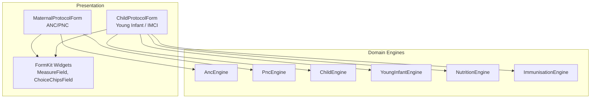
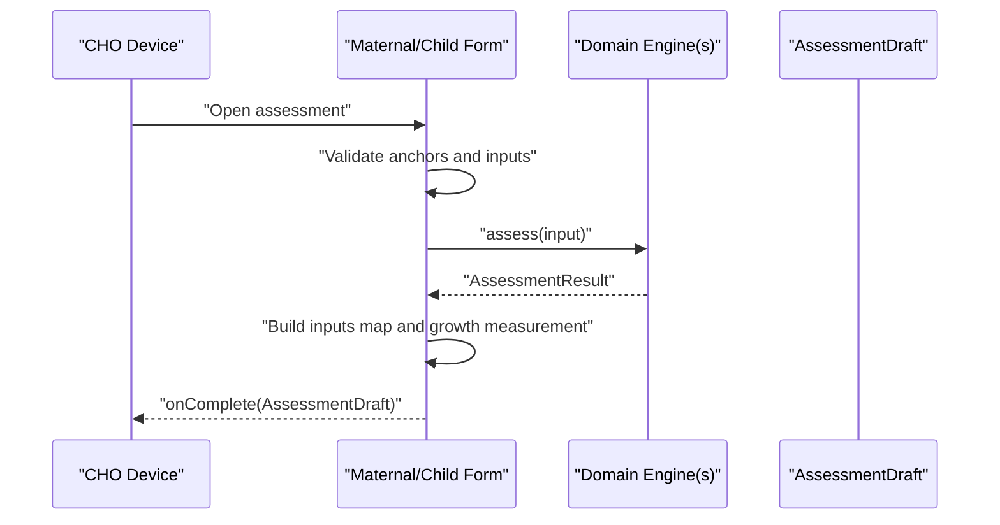
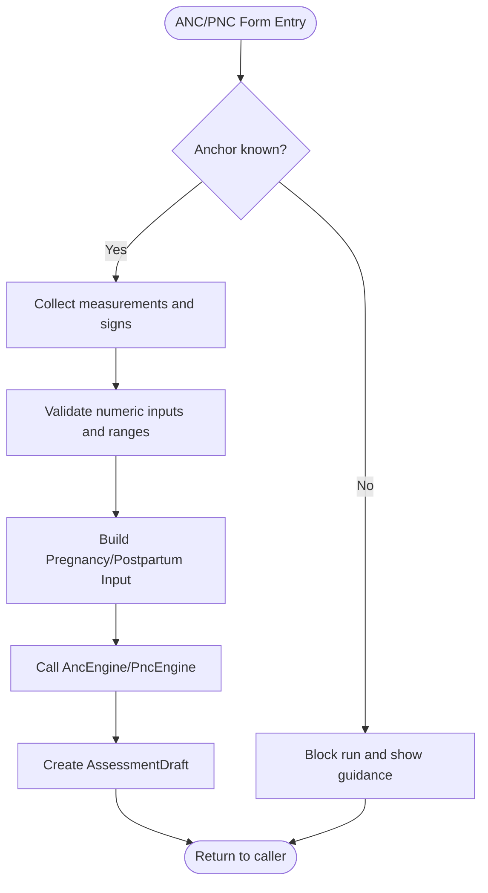
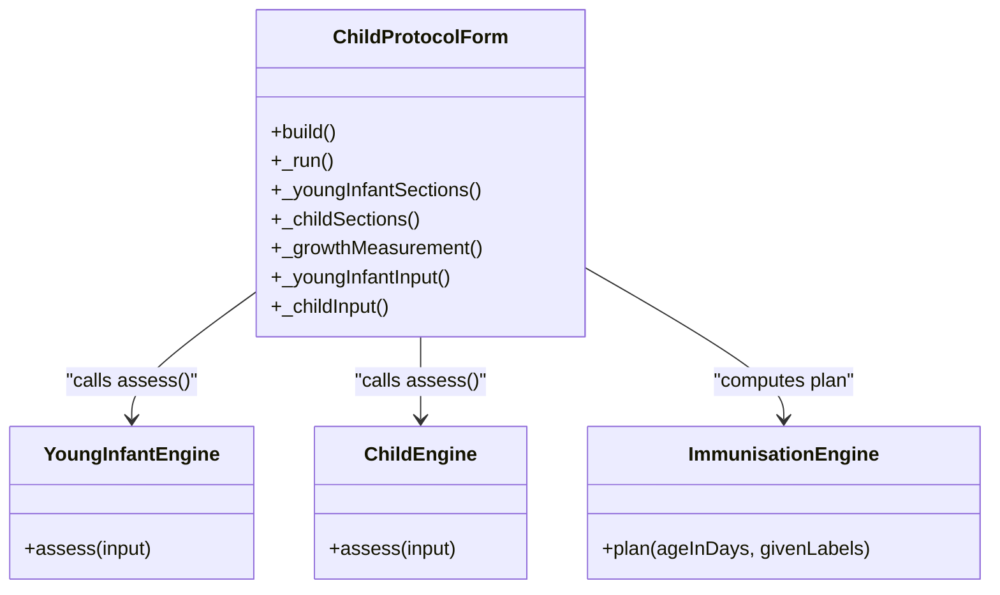
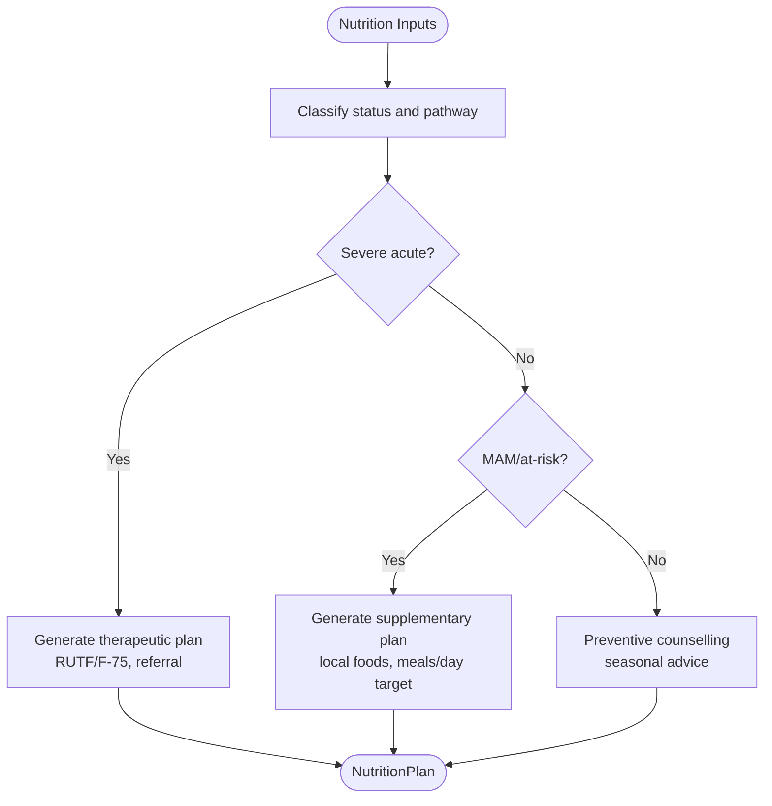
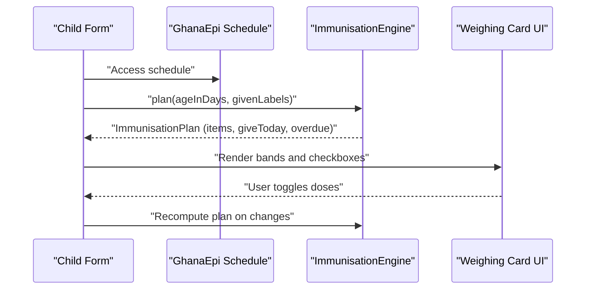
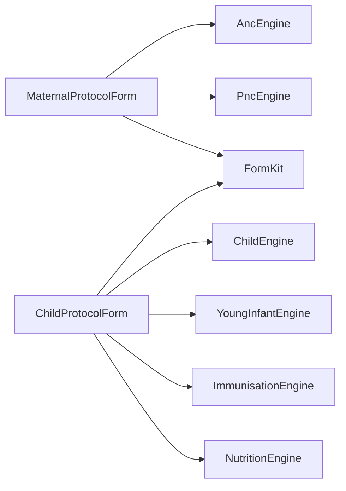

# Assessment Forms

<cite>
**Referenced Files in This Document**
- [README.md](file://README.md)
- [maternal_form.dart](file://lib/presentation/assessment/maternal_form.dart)
- [child_form.dart](file://lib/presentation/assessment/child_form.dart)
- [form_kit.dart](file://lib/presentation/assessment/form_kit.dart)
- [anc_engine.dart](file://lib/domain/engines/anc_engine.dart)
- [pnc_engine.dart](file://lib/domain/engines/pnc_engine.dart)
- [child_engine.dart](file://lib/domain/engines/child_engine.dart)
- [young_infant_engine.dart](file://lib/domain/engines/young_infant_engine.dart)
- [nutrition_engine.dart](file://lib/domain/engines/nutrition_engine.dart)
- [immunisation_engine.dart](file://lib/domain/engines/immunisation_engine.dart)
</cite>

## Table of Contents
1. [Introduction](#introduction)
2. [Project Structure](#project-structure)
3. [Core Components](#core-components)
4. [Architecture Overview](#architecture-overview)
5. [Detailed Component Analysis](#detailed-component-analysis)
6. [Dependency Analysis](#dependency-analysis)
7. [Performance Considerations](#performance-considerations)
8. [Troubleshooting Guide](#troubleshooting-guide)
9. [Conclusion](#conclusion)
10. [Appendices](#appendices)

## Introduction
This document explains the clinical assessment forms implemented in CareBridge AI, focusing on:
- ANC and PNC maternal assessment forms
- Child health assessment interfaces (young infant and sick child)
- Nutrition screening and counselling flows
- Immunization tracking screens

It covers form validation rules, real-time feedback mechanisms, data binding to domain engines, progress tracking, input field types, validation patterns, error handling, accessibility considerations for healthcare data entry, and offline persistence and sync behavior for incomplete assessments.

## Project Structure
The project is a Flutter application organized into presentation (UI), domain (clinical logic engines), data, core, and app layers. The assessment forms live under the presentation layer and bind to domain engines that implement WHO/Ghana protocols.

**Diagram sources**
- [maternal_form.dart:1-200](file://lib/presentation/assessment/maternal_form.dart#L1-L200)
- [child_form.dart:1-200](file://lib/presentation/assessment/child_form.dart#L1-L200)
- [form_kit.dart:156-255](file://lib/presentation/assessment/form_kit.dart#L156-L255)
- [anc_engine.dart:1-120](file://lib/domain/engines/anc_engine.dart#L1-L120)
- [pnc_engine.dart:1-120](file://lib/domain/engines/pnc_engine.dart#L1-L120)
- [child_engine.dart:196-220](file://lib/domain/engines/child_engine.dart#L196-L220)
- [young_infant_engine.dart:1-120](file://lib/domain/engines/young_infant_engine.dart#L1-L120)
- [nutrition_engine.dart:116-180](file://lib/domain/engines/nutrition_engine.dart#L116-L180)
- [immunisation_engine.dart:275-320](file://lib/domain/engines/immunisation_engine.dart#L275-L320)

**Section sources**
- [README.md:1-18](file://README.md#L1-L18)

## Core Components
- MaternalProtocolForm: ANC and PNC assessment with anchor fields (gestational weeks or days since delivery), measurements, danger signs, coverage, and service history. It routes to AncEngine or PncEngine based on path.
- ChildProtocolForm: Young infant (≤59 days) and IMCI sick child (2–59 months) assessments. Integrates immunization planning and nutrition inputs; outputs growth measurements and assessment drafts.
- FormKit: Reusable UI primitives including MeasureField (numeric input with optional decimal support and helper cutoffs), ChoiceChipsField (single-choice chips), and layout helpers.
- Domain Engines:
  - AncEngine: WHO ANC 2016 + Ghana safe motherhood protocol.
  - PncEngine: Postnatal care protocol.
  - ChildEngine: IMCI sick-child classification and actions.
  - YoungInfantEngine: WHO IMCI young-infant chart.
  - NutritionEngine: Seasonal, cost-aware nutrition plans and pathways.
  - ImmunisationEngine: Ghana EPI schedule and catch-up planner.

Key behaviors:
- Anchor-first design: forms block execution until critical anchors are provided.
- Real-time validation via input formatters and helper cutoffs.
- Data binding to domain engines through strongly-typed input objects.
- Progress tracking via RunBar and blocked states.

**Section sources**
- [maternal_form.dart:1-200](file://lib/presentation/assessment/maternal_form.dart#L1-L200)
- [child_form.dart:1-200](file://lib/presentation/assessment/child_form.dart#L1-L200)
- [form_kit.dart:156-255](file://lib/presentation/assessment/form_kit.dart#L156-L255)
- [anc_engine.dart:1-120](file://lib/domain/engines/anc_engine.dart#L1-L120)
- [pnc_engine.dart:1-120](file://lib/domain/engines/pnc_engine.dart#L1-L120)
- [child_engine.dart:196-220](file://lib/domain/engines/child_engine.dart#L196-L220)
- [young_infant_engine.dart:1-120](file://lib/domain/engines/young_infant_engine.dart#L1-L120)
- [nutrition_engine.dart:116-180](file://lib/domain/engines/nutrition_engine.dart#L116-L180)
- [immunisation_engine.dart:275-320](file://lib/domain/engines/immunisation_engine.dart#L275-L320)

## Architecture Overview
Assessment flow from UI to domain engines and back to results:

**Diagram sources**
- [maternal_form.dart:230-246](file://lib/presentation/assessment/maternal_form.dart#L230-L246)
- [child_form.dart:1051-1074](file://lib/presentation/assessment/child_form.dart#L1051-L1074)
- [anc_engine.dart:158-188](file://lib/domain/engines/anc_engine.dart#L158-L188)
- [child_engine.dart:196-220](file://lib/domain/engines/child_engine.dart#L196-L220)

## Detailed Component Analysis

### ANC and PNC Maternal Assessment
- Anchors: Gestational weeks (ANC) or days since delivery (PNC). If missing, the form blocks execution and shows guidance.
- Measurements: BP, Hb, MUAC, weight, fundal height, FHR, temperature, pulse; proteinuria via chips.
- Danger signs: ANC and PNC specific checklists with immediate referral triggers.
- Coverage: ANC contacts, IPTp doses, Td doses, iron/folate, LLIN, HIV/Syphilis testing, birth plan, planned delivery place.
- PNC specifics: Baby alive status, complaint text, postnatal depression screen, feeding practices, services.

Validation and feedback:
- Numeric inputs use integer/decimal formatters and helper cutoff hints.
- Blocked state prevents running until anchors are set.
- Real-time toggles for danger signs update UI immediately.

Data binding:
- Constructs PregnancyInput or PostpartumInput and calls AncEngine/PncEngine.
- Returns AssessmentDraft with inputs and result.

Accessibility:
- Clear labels, helper texts, and concise instructions improve readability.
- Chips and counts reduce typing errors.

**Diagram sources**
- [maternal_form.dart:146-163](file://lib/presentation/assessment/maternal_form.dart#L146-L163)
- [maternal_form.dart:230-246](file://lib/presentation/assessment/maternal_form.dart#L230-L246)
- [anc_engine.dart:158-188](file://lib/domain/engines/anc_engine.dart#L158-L188)

**Section sources**
- [maternal_form.dart:1-200](file://lib/presentation/assessment/maternal_form.dart#L1-L200)
- [anc_engine.dart:1-120](file://lib/domain/engines/anc_engine.dart#L1-L120)
- [pnc_engine.dart:1-120](file://lib/domain/engines/pnc_engine.dart#L1-L120)

### Child Health Assessment (Young Infant and IMCI Sick Child)
- Split by effective client type: newborn vs child ≥2 months.
- Young infant sections: RR, temperature, weight, danger signs, local infection, jaundice, diarrhea/dehydration, feeding.
- Sick child sections: general danger signs, cough/breathing, diarrhea, fever/malaria, ear, nutrition/anaemia, feeding, immunization card.

Validation and feedback:
- Age anchors required (days for young infant, months for sick child).
- Numeric inputs with cutoff hints (e.g., fast breathing thresholds age-banded).
- Danger sign toggles provide immediate visual feedback.

Data binding:
- Builds YoungInfantInput or ChildInput and calls respective engines.
- Computes immunization plan using ImmunisationEngine.plan.
- Produces GrowthMeasurement if any anthropometry provided.

Progress tracking:
- RunBar with busy state and blocked messages.

**Diagram sources**
- [child_form.dart:1051-1074](file://lib/presentation/assessment/child_form.dart#L1051-L1074)
- [child_engine.dart:196-220](file://lib/domain/engines/child_engine.dart#L196-L220)
- [immunisation_engine.dart:275-320](file://lib/domain/engines/immunisation_engine.dart#L275-L320)

**Section sources**
- [child_form.dart:1-200](file://lib/presentation/assessment/child_form.dart#L1-L200)
- [child_form.dart:801-1322](file://lib/presentation/assessment/child_form.dart#L801-L1322)
- [child_engine.dart:166-220](file://lib/domain/engines/child_engine.dart#L166-L220)
- [young_infant_engine.dart:1-120](file://lib/domain/engines/young_infant_engine.dart#L1-L120)
- [immunisation_engine.dart:275-320](file://lib/domain/engines/immunisation_engine.dart#L275-L320)

### Nutrition Screening and Counselling
- Inputs: MUAC, weight, height, oedema, appetite test, food groups, breastfeeding status, anemia flags.
- Outputs: NutritionPlan with pathway (preventive, supplementary, outpatient therapeutic, inpatient therapeutic), seasonal notes, actionable suggestions, feeding rules, review cadence.
- Decision logic considers season, cost tier, age, danger signs, and oedema to determine pathway.

Real-time feedback:
- Cutoff hints guide correct measurement interpretation.
- Food group selection informs diversity gap filling.

Integration:
- Child form collects inputs and passes them to NutritionEngine.plan.
- ANC/PNC forms include MUAC and related indicators.

**Diagram sources**
- [nutrition_engine.dart:116-180](file://lib/domain/engines/nutrition_engine.dart#L116-L180)
- [nutrition_engine.dart:329-358](file://lib/domain/engines/nutrition_engine.dart#L329-L358)

**Section sources**
- [nutrition_engine.dart:1-120](file://lib/domain/engines/nutrition_engine.dart#L1-L120)
- [child_form.dart:851-918](file://lib/presentation/assessment/child_form.dart#L851-L918)

### Immunization Tracking Screens
- Displays Ghana EPI schedule grouped by age bands (birth, 6–14 weeks, 6–9 months, 18 months).
- CHO ticks doses marked on the weighing card; engine computes due, overdue, not-yet-due, and age-barred items.
- Provides summary and “give today” list respecting minimum intervals and max ages (e.g., rotavirus).

Validation and feedback:
- Age-based filtering ensures only appropriate doses appear per band.
- Overdue and age-barred statuses inform counseling and next steps.

Integration:
- Child form uses ImmunisationEngine.plan to compute plan and feeds it into assessment.

**Diagram sources**
- [immunisation_engine.dart:109-273](file://lib/domain/engines/immunisation_engine.dart#L109-L273)
- [child_form.dart:982-1038](file://lib/presentation/assessment/child_form.dart#L982-L1038)

**Section sources**
- [immunisation_engine.dart:1-120](file://lib/domain/engines/immunisation_engine.dart#L1-L120)
- [child_form.dart:982-1038](file://lib/presentation/assessment/child_form.dart#L982-L1038)

## Dependency Analysis
- Presentation depends on domain engines for clinical logic.
- Child form depends on both child and young infant engines, plus immunization and nutrition engines.
- Maternal form depends on anc and pnc engines.
- Shared UI components (form_kit) are reused across forms.

**Diagram sources**
- [maternal_form.dart:1-120](file://lib/presentation/assessment/maternal_form.dart#L1-L120)
- [child_form.dart:1-120](file://lib/presentation/assessment/child_form.dart#L1-L120)
- [form_kit.dart:156-255](file://lib/presentation/assessment/form_kit.dart#L156-L255)

**Section sources**
- [maternal_form.dart:1-120](file://lib/presentation/assessment/maternal_form.dart#L1-L120)
- [child_form.dart:1-120](file://lib/presentation/assessment/child_form.dart#L1-L120)

## Performance Considerations
- Input parsing helpers avoid repeated conversions; controllers are disposed properly.
- Engine computations are lightweight and deterministic; avoid heavy operations during build.
- Use minimal setState updates; batch state changes where possible.
- For large lists (e.g., vaccine schedules), precompute derived values and reuse.

[No sources needed since this section provides general guidance]

## Troubleshooting Guide
Common issues and resolutions:
- Missing anchors: Ensure gestational weeks or postpartum days are entered before running ANC/PNC.
- Invalid numeric inputs: Use provided formatters; verify cutoff hints match expected units.
- Incomplete danger sign checks: Remember “off means asked and absent”; do not leave unchecked items ambiguous.
- Immunization conflicts: Respect minimum intervals and max ages; engine will flag age-barred doses.
- Offline persistence: Assessments should be saved locally when incomplete; ensure draft storage persists across sessions and syncs when connectivity returns.

**Section sources**
- [maternal_form.dart:146-163](file://lib/presentation/assessment/maternal_form.dart#L146-L163)
- [child_form.dart:110-120](file://lib/presentation/assessment/child_form.dart#L110-L120)
- [form_kit.dart:180-216](file://lib/presentation/assessment/form_kit.dart#L180-L216)

## Conclusion
CareBridge AI’s assessment forms combine robust UI patterns with precise domain engines to deliver protocol-driven clinical decision support. Anchors-first validation, real-time feedback, and structured data binding ensure reliable assessments. Nutrition and immunization modules enhance completeness and actionability. Future enhancements can focus on offline persistence strategies and sync behavior for incomplete assessments.

[No sources needed since this section summarizes without analyzing specific files]

## Appendices

### Input Field Types and Validation Patterns
- MeasureField: Numeric input with optional decimal mode; regex-based input formatting; helper cutoff text for quick reference.
- ChoiceChipsField: Single-choice chips over enumerated options; supports danger highlighting.
- CountField: Bounded integer input with target hints.
- YesNoField: Binary choice with allowUnknown option.

Validation patterns:
- Regex filters restrict input to digits and optional decimal points.
- Helper cutoffs communicate thresholds inline.
- Blocked states prevent execution until anchors are present.

**Section sources**
- [form_kit.dart:156-255](file://lib/presentation/assessment/form_kit.dart#L156-L255)

### Accessibility Considerations
- Clear labels and concise helper texts aid comprehension.
- High-contrast triage colors indicate urgency.
- Minimal typing reduces cognitive load and errors.
- Structured sections and icons improve navigation.

**Section sources**
- [maternal_form.dart:300-368](file://lib/presentation/assessment/maternal_form.dart#L300-L368)
- [child_form.dart:512-530](file://lib/presentation/assessment/child_form.dart#L512-L530)

### Offline Data Persistence and Sync Behavior
- Assessments produce AssessmentDraft containing inputs, result, and optional growth measurements.
- Implement local storage for drafts to persist incomplete assessments.
- On connectivity, reconcile local drafts with server records, resolving conflicts deterministically (e.g., latest timestamp wins).
- Ensure user feedback on sync status and errors.

[No sources needed since this section provides general guidance]