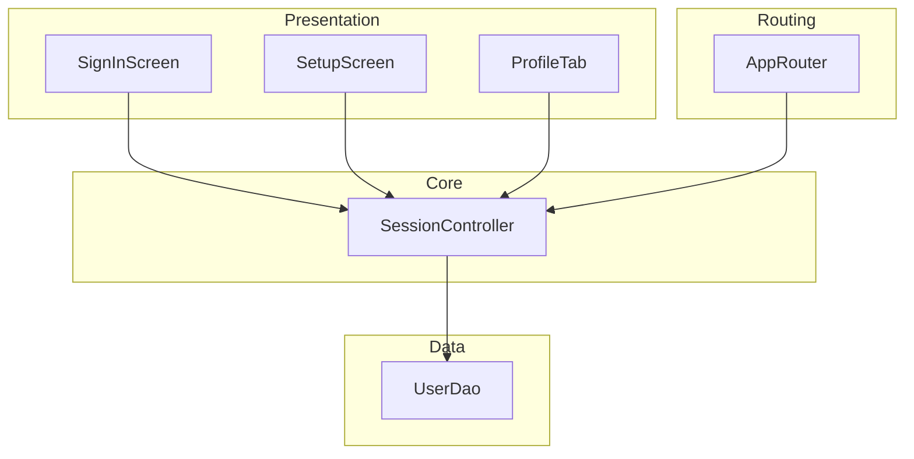
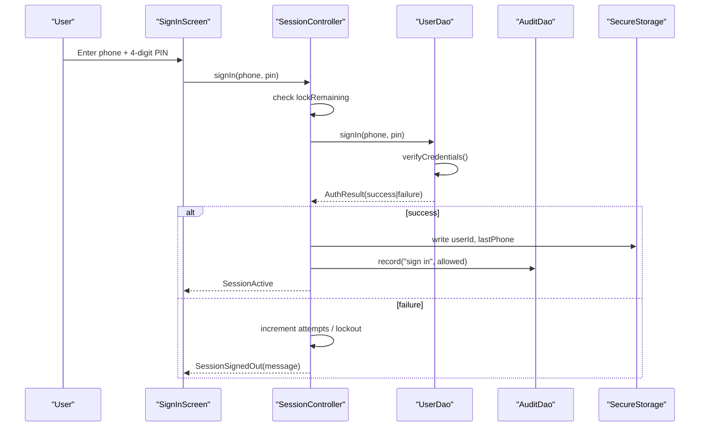
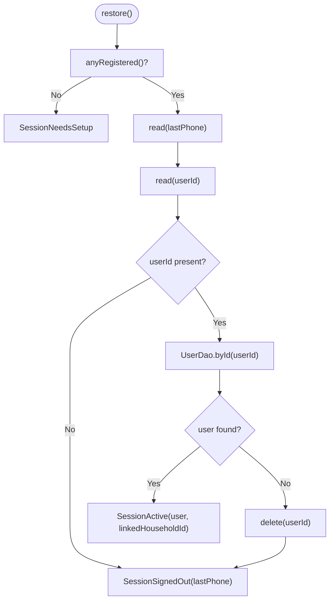
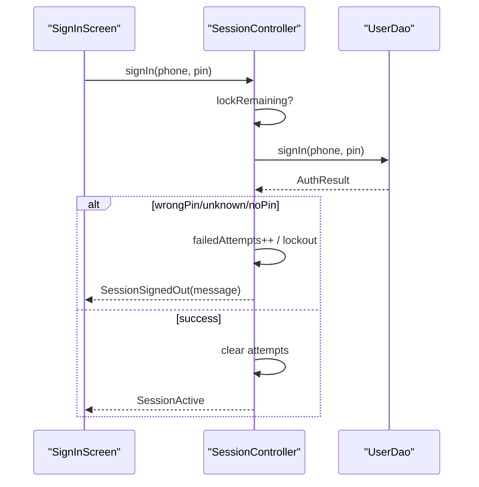
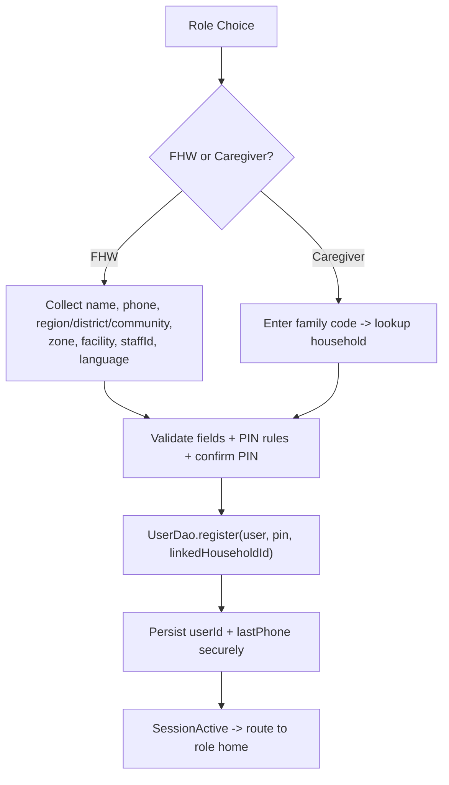
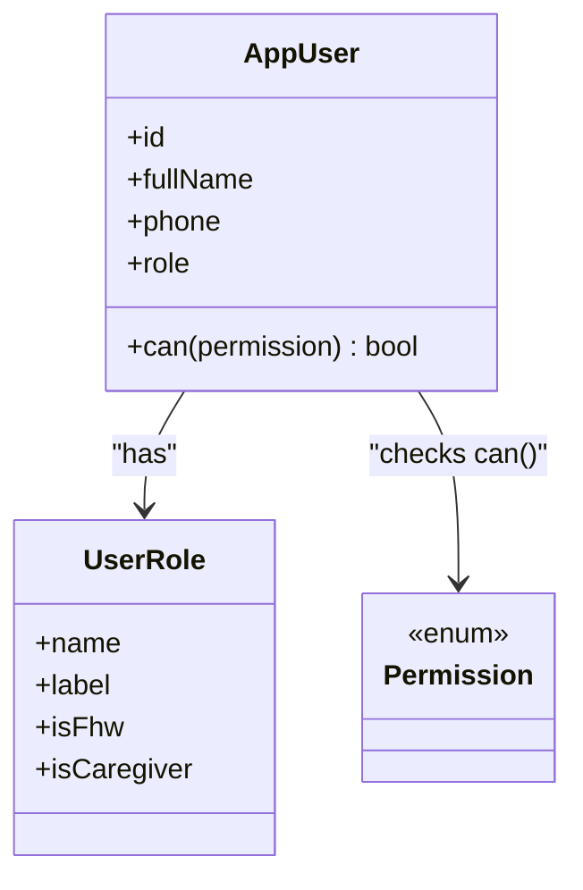
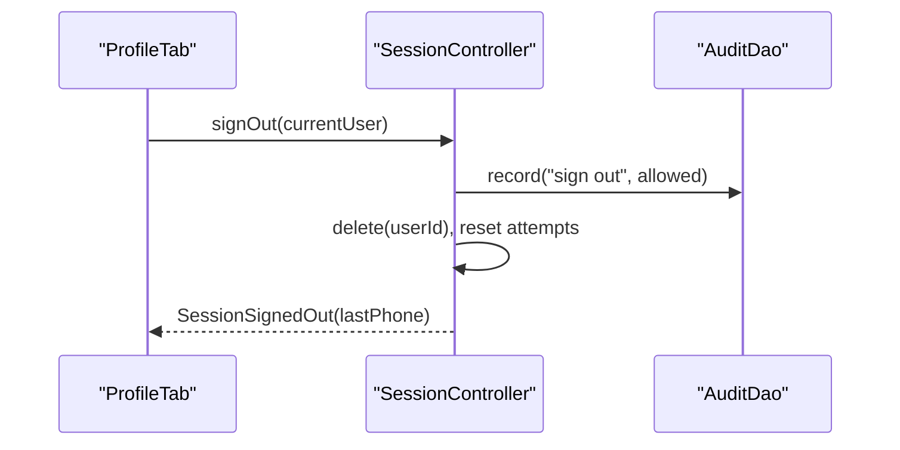
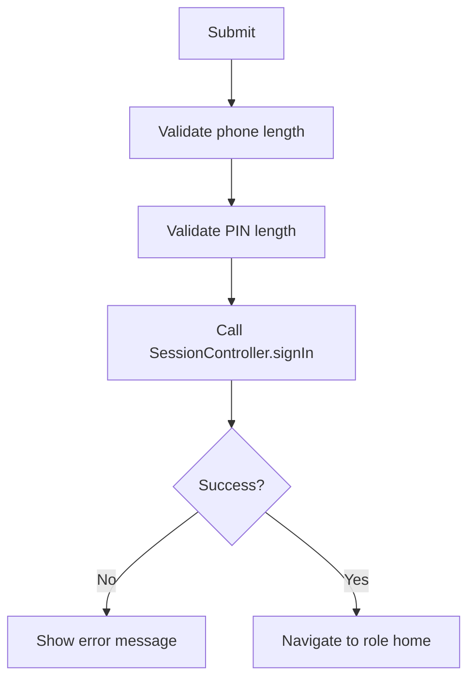
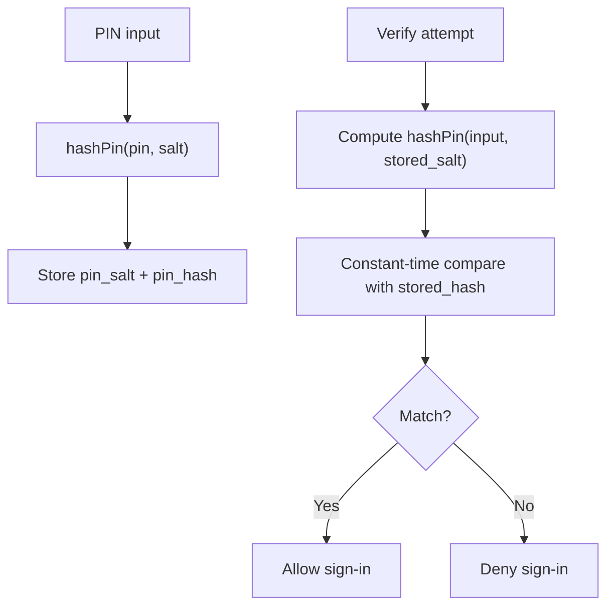
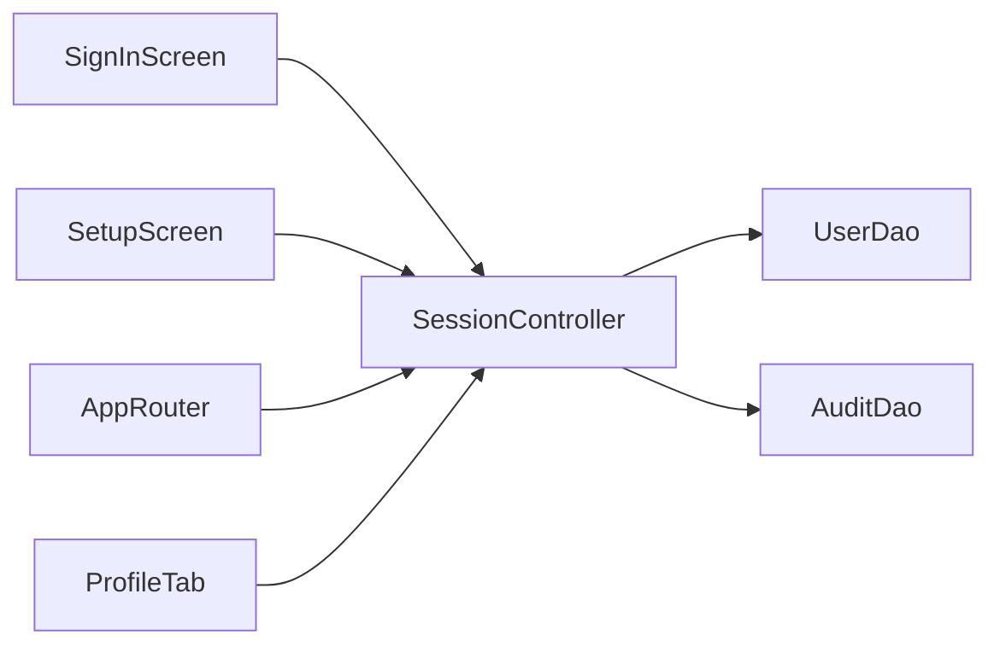

# Authentication Flows

<cite>
**Referenced Files in This Document**
- [session.dart](file://lib/core/auth/session.dart)
- [user_dao.dart](file://lib/data/local/user_dao.dart)
- [sign_in_screen.dart](file://lib/presentation/auth/sign_in_screen.dart)
- [setup_screen.dart](file://lib/presentation/auth/setup_screen.dart)
- [app_router.dart](file://lib/core/router/app_router.dart)
- [profile_tab.dart](file://lib/presentation/fhw/profile_tab.dart)
- [rbac_test.dart](file://test/rbac_test.dart)
</cite>

## Table of Contents
1. [Introduction](#introduction)
2. [Project Structure](#project-structure)
3. [Core Components](#core-components)
4. [Architecture Overview](#architecture-overview)
5. [Detailed Component Analysis](#detailed-component-analysis)
6. [Dependency Analysis](#dependency-analysis)
7. [Performance Considerations](#performance-considerations)
8. [Troubleshooting Guide](#troubleshooting-guide)
9. [Conclusion](#conclusion)

## Introduction
This document explains CareBridge AI’s authentication system with a focus on:
- Onboarding for new users (role selection, account creation, PIN setup)
- PIN-based sign-in flow and lockout behavior
- Session management and secure storage usage
- Role-based access control (RBAC) enforcement
- Error handling strategies and user experience flows
- Security considerations for PIN storage and session persistence
- Logout procedures and notes on password recovery and session timeout

The design targets shared handsets in community health settings, prioritizing simplicity, resilience, and privacy.

## Project Structure
Authentication spans presentation screens, a session controller, and local data access:
- Presentation: Sign-in and Setup screens handle user input and UX
- Core: SessionController manages state transitions, secure storage, and audit logging
- Data: UserDao handles registration, sign-in, PIN hashing/validation, and audit entries
- Router: Guards routes based on permissions and directs users to role-appropriate homes
- Tests: RBAC tests enforce permission boundaries between roles

**Diagram sources**
- [sign_in_screen.dart:1-120](file://lib/presentation/auth/sign_in_screen.dart#L1-L120)
- [setup_screen.dart:1-120](file://lib/presentation/auth/setup_screen.dart#L1-L120)
- [session.dart:1-120](file://lib/core/auth/session.dart#L1-L120)
- [user_dao.dart:1-120](file://lib/data/local/user_dao.dart#L1-L120)
- [app_router.dart:176-221](file://lib/core/router/app_router.dart#L176-L221)
- [profile_tab.dart:75-119](file://lib/presentation/fhw/profile_tab.dart#L75-L119)

**Section sources**
- [sign_in_screen.dart:1-120](file://lib/presentation/auth/sign_in_screen.dart#L1-L120)
- [setup_screen.dart:1-120](file://lib/presentation/auth/setup_screen.dart#L1-L120)
- [session.dart:1-120](file://lib/core/auth/session.dart#L1-L120)
- [user_dao.dart:1-120](file://lib/data/local/user_dao.dart#L1-L120)
- [app_router.dart:176-221](file://lib/core/router/app_router.dart#L176-L221)
- [profile_tab.dart:75-119](file://lib/presentation/fhw/profile_tab.dart#L75-L119)

## Core Components
- SessionController: Orchestrates restore, sign-in, register-and-sign-in, sign-out; enforces per-device in-memory lockout; persists only the signed-in user id and last phone number via secure storage; records audit events.
- UserDao: Implements PIN hashing/validation, registration, sign-in verification, and audit logging; stores salted hashes locally; excludes credentials from sync payloads.
- SignInScreen: Custom keypad PIN entry, pre-fills last phone, validates inputs, shows errors, triggers sign-in.
- SetupScreen: Role choice, FHW vs caregiver forms, family code linking, PIN validation and confirmation, immediate registration and sign-in.
- AppRouter: Permission-gated navigation; displays “Not available” when insufficient permissions; routes to role-specific home.
- ProfileTab: Provides explicit sign-out action and device reset for demo scenarios.

**Section sources**
- [session.dart:69-245](file://lib/core/auth/session.dart#L69-L245)
- [user_dao.dart:44-167](file://lib/data/local/user_dao.dart#L44-L167)
- [sign_in_screen.dart:30-120](file://lib/presentation/auth/sign_in_screen.dart#L30-L120)
- [setup_screen.dart:276-405](file://lib/presentation/auth/setup_screen.dart#L276-L405)
- [app_router.dart:176-196](file://lib/core/router/app_router.dart#L176-L196)
- [profile_tab.dart:75-119](file://lib/presentation/fhw/profile_tab.dart#L75-L119)

## Architecture Overview
The authentication architecture separates UI, state, and data:
- UI screens call SessionController methods
- SessionController delegates to UserDao for credential operations
- Secure storage is used for minimal session identifiers
- AuditDao logs all auth-related actions
- Router enforces RBAC at navigation time

**Diagram sources**
- [sign_in_screen.dart:43-74](file://lib/presentation/auth/sign_in_screen.dart#L43-L74)
- [session.dart:114-162](file://lib/core/auth/session.dart#L114-L162)
- [user_dao.dart:169-216](file://lib/data/local/user_dao.dart#L169-L216)

## Detailed Component Analysis

### Session Management and Lockout
- Restore determines initial state: needs setup, signed out, or active
- Sign-in enforces in-memory lockout after repeated failures
- Successful sign-in persists only user id and last phone number
- Sign-out clears persisted identifiers and resets lock counters

**Diagram sources**
- [session.dart:96-112](file://lib/core/auth/session.dart#L96-L112)

**Section sources**
- [session.dart:96-112](file://lib/core/auth/session.dart#L96-L112)
- [session.dart:114-162](file://lib/core/auth/session.dart#L114-L162)
- [session.dart:193-206](file://lib/core/auth/session.dart#L193-L206)

### PIN-Based Sign-In Flow
- Input validation occurs in the screen layer
- SessionController checks lockout before calling DAO
- UserDao verifies credentials using constant-time comparison
- Audit entries recorded for both success and denial

**Diagram sources**
- [sign_in_screen.dart:43-74](file://lib/presentation/auth/sign_in_screen.dart#L43-L74)
- [session.dart:114-162](file://lib/core/auth/session.dart#L114-L162)
- [user_dao.dart:169-216](file://lib/data/local/user_dao.dart#L169-L216)

**Section sources**
- [sign_in_screen.dart:43-74](file://lib/presentation/auth/sign_in_screen.dart#L43-L74)
- [session.dart:114-162](file://lib/core/auth/session.dart#L114-L162)
- [user_dao.dart:169-216](file://lib/data/local/user_dao.dart#L169-L216)

### Onboarding and Account Setup
- Role selection drives form fields and scoping
- FHW collects professional context; caregiver binds to household via family code
- PIN validated against weak-sequence rules and confirmation match
- Registration immediately signs in and persists session identifiers

**Diagram sources**
- [setup_screen.dart:276-405](file://lib/presentation/auth/setup_screen.dart#L276-L405)
- [user_dao.dart:125-167](file://lib/data/local/user_dao.dart#L125-L167)
- [session.dart:169-191](file://lib/core/auth/session.dart#L169-L191)

**Section sources**
- [setup_screen.dart:276-405](file://lib/presentation/auth/setup_screen.dart#L276-L405)
- [user_dao.dart:125-167](file://lib/data/local/user_dao.dart#L125-L167)
- [session.dart:169-191](file://lib/core/auth/session.dart#L169-L191)

### Role-Based Access Control (RBAC)
- Roles define sets of permissions enforced by the app
- Router guards routes and shows “Not available” if insufficient permissions
- Tests assert exact permission sets for each role

**Diagram sources**
- [rbac_test.dart:1-90](file://test/rbac_test.dart#L1-L90)
- [app_router.dart:176-196](file://lib/core/router/app_router.dart#L176-L196)

**Section sources**
- [rbac_test.dart:1-90](file://test/rbac_test.dart#L1-L90)
- [app_router.dart:176-196](file://lib/core/router/app_router.dart#L176-L196)

### Secure Logout Procedures
- Explicit sign-out clears session identifiers and resets lock state
- Audit event recorded for accountability
- Profile tab provides a clear sign-out action

**Diagram sources**
- [profile_tab.dart:75-119](file://lib/presentation/fhw/profile_tab.dart#L75-L119)
- [session.dart:193-206](file://lib/core/auth/session.dart#L193-L206)

**Section sources**
- [profile_tab.dart:75-119](file://lib/presentation/fhw/profile_tab.dart#L75-L119)
- [session.dart:193-206](file://lib/core/auth/session.dart#L193-L206)

### Form Validation Patterns
- Sign-in screen validates phone length and PIN length, then calls session
- Setup screen validates required fields, role-specific constraints, PIN strength, and confirmation
- Errors are surfaced inline with consistent UI patterns

**Diagram sources**
- [sign_in_screen.dart:43-74](file://lib/presentation/auth/sign_in_screen.dart#L43-L74)
- [setup_screen.dart:343-405](file://lib/presentation/auth/setup_screen.dart#L343-L405)

**Section sources**
- [sign_in_screen.dart:43-74](file://lib/presentation/auth/sign_in_screen.dart#L43-L74)
- [setup_screen.dart:343-405](file://lib/presentation/auth/setup_screen.dart#L343-L405)

### Security Considerations for PIN Storage
- PINs are never stored in plaintext; only salted hashes persist
- Per-user salt and iterative HMAC-SHA256 stretching mitigate offline attacks
- Constant-time comparison avoids timing side channels
- Credentials are excluded from sync payloads; they remain device-local

**Diagram sources**
- [user_dao.dart:44-93](file://lib/data/local/user_dao.dart#L44-L93)
- [user_dao.dart:169-216](file://lib/data/local/user_dao.dart#L169-L216)

**Section sources**
- [user_dao.dart:44-93](file://lib/data/local/user_dao.dart#L44-L93)
- [user_dao.dart:169-216](file://lib/data/local/user_dao.dart#L169-L216)

### Password Recovery
- There is no built-in password/PIN recovery flow in the analyzed code.
- Device reset functionality exists for demonstration purposes and returns the device to first-launch setup.

**Section sources**
- [profile_tab.dart:85-115](file://lib/presentation/fhw/profile_tab.dart#L85-L115)

### Session Timeout Handling
- No automatic session timeout is implemented in the analyzed files.
- Session persistence relies on secure storage; sign-out explicitly clears it.
- Lockout is temporary and in-memory to prevent idle guessing.

**Section sources**
- [session.dart:78-94](file://lib/core/auth/session.dart#L78-L94)
- [session.dart:193-206](file://lib/core/auth/session.dart#L193-L206)

## Dependency Analysis
Key dependencies and relationships:
- SignInScreen depends on SessionController for authentication
- SetupScreen depends on SessionController for registration and immediate sign-in
- SessionController depends on UserDao for credential operations and AuditDao for logging
- AppRouter depends on current user permissions to guard routes
- ProfileTab triggers sign-out through SessionController

**Diagram sources**
- [sign_in_screen.dart:1-120](file://lib/presentation/auth/sign_in_screen.dart#L1-L120)
- [setup_screen.dart:1-120](file://lib/presentation/auth/setup_screen.dart#L1-L120)
- [session.dart:1-120](file://lib/core/auth/session.dart#L1-L120)
- [user_dao.dart:1-120](file://lib/data/local/user_dao.dart#L1-L120)
- [app_router.dart:176-221](file://lib/core/router/app_router.dart#L176-L221)
- [profile_tab.dart:75-119](file://lib/presentation/fhw/profile_tab.dart#L75-L119)

**Section sources**
- [sign_in_screen.dart:1-120](file://lib/presentation/auth/sign_in_screen.dart#L1-L120)
- [setup_screen.dart:1-120](file://lib/presentation/auth/setup_screen.dart#L1-L120)
- [session.dart:1-120](file://lib/core/auth/session.dart#L1-L120)
- [user_dao.dart:1-120](file://lib/data/local/user_dao.dart#L1-L120)
- [app_router.dart:176-221](file://lib/core/router/app_router.dart#L176-L221)
- [profile_tab.dart:75-119](file://lib/presentation/fhw/profile_tab.dart#L75-L119)

## Performance Considerations
- PIN hashing uses iterative HMAC-SHA256; chosen to balance security and low-end device performance
- Secure storage reads/writes are wrapped in try/catch to avoid crashes on unavailable keystore
- In-memory lockout avoids persistent counters that could complicate recovery
- Minimal secure storage payload reduces I/O overhead

[No sources needed since this section provides general guidance]

## Troubleshooting Guide
Common issues and resolutions:
- Wrong PIN or unknown phone: The UI displays specific messages; ensure correct phone number and PIN
- Too many attempts: Wait for the in-memory lockout period to expire
- Missing PIN set: Complete PIN setup during registration
- Sign-in not remembered: Secure storage may be unavailable; re-enter credentials
- Not enough permissions: Ensure you are logged in with the appropriate role; router will show “Not available”

**Section sources**
- [user_dao.dart:95-115](file://lib/data/local/user_dao.dart#L95-L115)
- [session.dart:114-162](file://lib/core/auth/session.dart#L114-L162)
- [app_router.dart:176-196](file://lib/core/router/app_router.dart#L176-L196)

## Conclusion
CareBridge AI’s authentication system emphasizes practicality and security for shared devices:
- Simple PIN-based sign-in with robust validation and lockout
- Secure, minimal session persistence
- Clear onboarding paths for two distinct roles
- Strong RBAC enforcement at navigation boundaries
- Comprehensive audit logging for accountability

For environments requiring password recovery or automatic session timeouts, additional features would need to be implemented beyond the current scope.