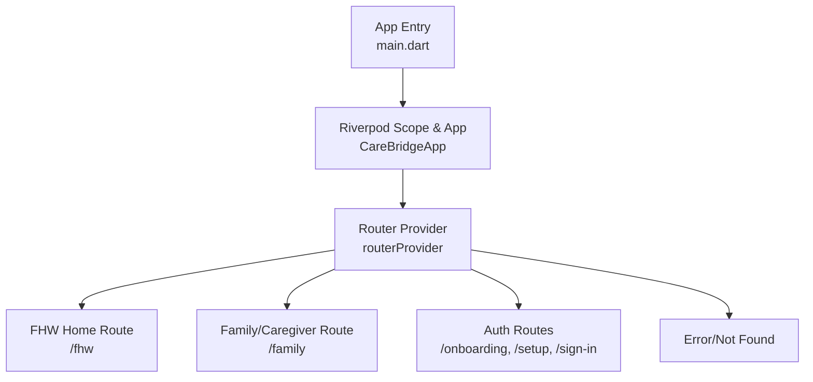
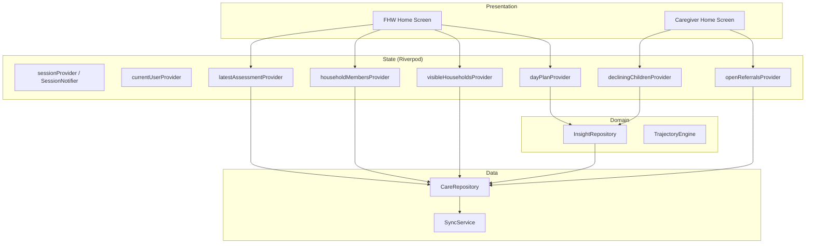
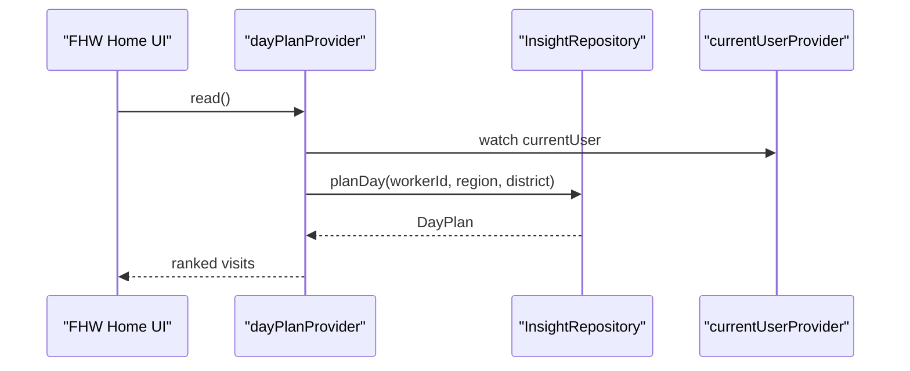
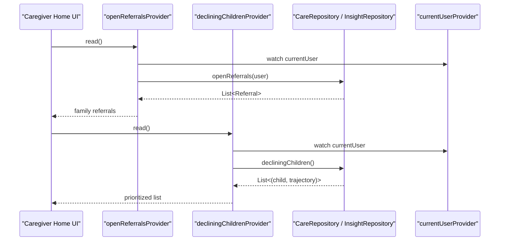
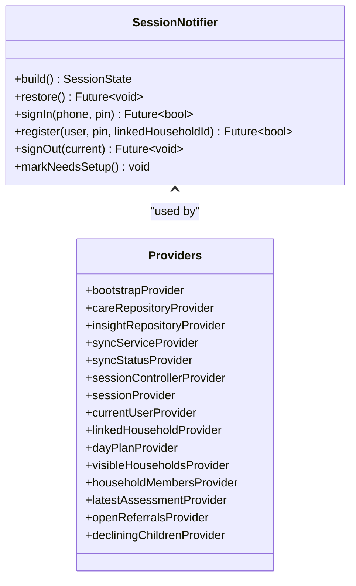
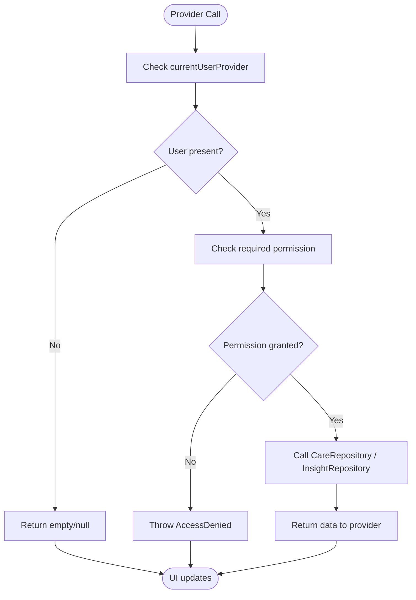
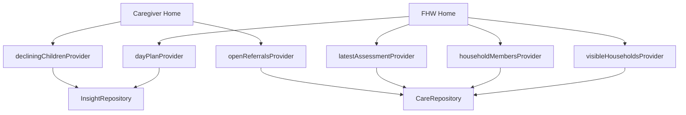

# Home Screens

<cite>
**Referenced Files in This Document**
- [main.dart](file://lib/main.dart)
- [providers.dart](file://lib/app/providers.dart)
- [app_router.dart](file://lib/core/router/app_router.dart)
</cite>

## Table of Contents
1. [Introduction](#introduction)
2. [Project Structure](#project-structure)
3. [Core Components](#core-components)
4. [Architecture Overview](#architecture-overview)
5. [Detailed Component Analysis](#detailed-component-analysis)
6. [Dependency Analysis](#dependency-analysis)
7. [Performance Considerations](#performance-considerations)
8. [Troubleshooting Guide](#troubleshooting-guide)
9. [Conclusion](#conclusion)

## Introduction
This document explains CareBridge AI’s role-specific home screens: the Community Health Worker (CHO/FHW) dashboard and the caregiver home screen. It covers visit planning, patient management, assessment shortcuts, family health records, appointment reminders, and health education content. It also documents widget composition patterns, state management with Riverpod providers, data binding to repositories, responsive design implementation, user interaction flows, navigation patterns, and accessibility features tailored to each role.

## Project Structure
The application is a Flutter app that bootstraps a Riverpod scope and delegates routing to a GoRouter-based router. The entry point initializes the theme and router, while all feature logic is wired through a single providers file. Routing enforces role-based access at the route level and redirects users to their appropriate home screen based on their role.

**Diagram sources**
- [main.dart:16-34](file://lib/main.dart#L16-L34)
- [app_router.dart:63-159](file://lib/core/router/app_router.dart#L63-L159)

**Section sources**
- [main.dart:16-34](file://lib/main.dart#L16-L34)
- [app_router.dart:63-159](file://lib/core/router/app_router.dart#L63-L159)

## Core Components
- Application bootstrap and theme setup
- Session and authentication state via Riverpod
- Role-aware routing and permission guards
- Feature providers for day plan, households, assessments, referrals, and insights

Key responsibilities:
- main.dart: Initializes the provider scope and configures MaterialApp with the router and theme.
- app_router.dart: Defines routes, redirects based on session state, and enforces permissions per route.
- providers.dart: Wires repositories, sync service, session controller, and all feature providers used by screens.

**Section sources**
- [main.dart:16-34](file://lib/main.dart#L16-L34)
- [app_router.dart:63-159](file://lib/core/router/app_router.dart#L63-L159)
- [providers.dart:38-42](file://lib/app/providers.dart#L38-L42)
- [providers.dart:68-122](file://lib/app/providers.dart#L68-L122)
- [providers.dart:145-156](file://lib/app/providers.dart#L145-L156)

## Architecture Overview
The system follows a layered architecture:
- Presentation: Flutter widgets (home screens) consume Riverpod providers.
- State: Riverpod Notifier and Future/Stream providers manage session, permissions, and feature data.
- Domain: Engines compute insights (e.g., vulnerability, trajectory).
- Data: Repositories enforce RBAC and aggregate DAOs; SyncService handles offline-first synchronization.

**Diagram sources**
- [providers.dart:145-156](file://lib/app/providers.dart#L145-L156)
- [providers.dart:160-176](file://lib/app/providers.dart#L160-L176)
- [providers.dart:207-212](file://lib/app/providers.dart#L207-L212)
- [providers.dart:300-305](file://lib/app/providers.dart#L300-L305)
- [providers.dart:310-320](file://lib/app/providers.dart#L310-L320)
- [providers.dart:256-260](file://lib/app/providers.dart#L256-L260)

## Detailed Component Analysis

### CHO (FHW) Dashboard
Responsibilities:
- Visit planning: Ranked day plan for the worker’s zone.
- Patient management: Visible households and ordered members (mother, newborns, under-fives).
- Assessment shortcuts: Latest assessment badges per person to prioritize follow-ups.

Providers and data flow:
- Day plan: Computed from InsightRepository using the current user’s region/district.
- Households: Scoped by role via CareRepository.visibleHouseholds.
- Household members: Ordered by care delivery sequence.
- Latest assessment: Per-person snapshot driving UI badges.

**Diagram sources**
- [providers.dart:145-156](file://lib/app/providers.dart#L145-L156)
- [providers.dart:125-128](file://lib/app/providers.dart#L125-L128)

Widget composition patterns:
- Use ConsumerWidget or ConsumerStatefulWidget to subscribe to providers.
- Wrap async reads with loading/error states.
- Compose small reusable tiles for households and members.
- Provide quick actions (e.g., “Start assessment”) bound to latestAssessmentProvider(personId).

Responsive design:
- Use adaptive layouts for lists and grids across phone/tablet.
- Ensure touch targets meet minimum sizes and contrast ratios.

Accessibility:
- Add semantic labels and descriptions for tiles and actions.
- Support dynamic text scaling and high-contrast themes.
- Provide keyboard focus order and screen reader announcements for key actions.

Navigation patterns:
- From FHW home, navigate to household details and person assessments.
- Deep links are guarded by RequirePermission and role checks.

**Section sources**
- [providers.dart:145-156](file://lib/app/providers.dart#L145-L156)
- [providers.dart:160-176](file://lib/app/providers.dart#L160-L176)
- [providers.dart:207-212](file://lib/app/providers.dart#L207-L212)
- [app_router.dart:126-132](file://lib/core/router/app_router.dart#L126-L132)

### Caregiver Home
Responsibilities:
- Family health records: Access to open referrals and community insights relevant to the caregiver’s family.
- Appointment reminders: Due contacts scoped to the linked household.
- Health education content: Insights such as declining children indicators and barrier patterns.

Providers and data flow:
- Open referrals: Filtered to the caregiver’s family via CareRepository.openReferrals.
- Declining children: Aggregated insight for community awareness.
- Barrier patterns: Zone-wide patterns surfaced for education and awareness.

**Diagram sources**
- [providers.dart:300-305](file://lib/app/providers.dart#L300-L305)
- [providers.dart:310-320](file://lib/app/providers.dart#L310-L320)
- [providers.dart:125-128](file://lib/app/providers.dart#L125-L128)

Widget composition patterns:
- Card-based layout for referrals and insights.
- Reusable reminder cards for due contacts.
- Educational panels with clear calls to action.

Responsive design:
- Stack cards vertically on small screens; use two-column grid on larger devices.
- Ensure readability with adequate spacing and typography scale.

Accessibility:
- Announce referral status changes and educational tips.
- Provide descriptive labels for icons and images.
- Support voice control and switch control where applicable.

Navigation patterns:
- From caregiver home, navigate to detailed referral views and educational resources.
- Role enforcement prevents caregivers from accessing FHW-only routes.

**Section sources**
- [providers.dart:300-305](file://lib/app/providers.dart#L300-L305)
- [providers.dart:310-320](file://lib/app/providers.dart#L310-L320)
- [app_router.dart:133-139](file://lib/core/router/app_router.dart#L133-L139)

### Widget Composition Patterns
- Consumer-based widgets: Subscribe to providers with ref.watch/ref.read.
- Async providers: Handle loading, error, and data states consistently.
- Composability: Build small, testable widgets (tiles, cards, banners) and compose them into screens.
- Error handling: Centralize error messages and retry actions.

**Section sources**
- [providers.dart:145-156](file://lib/app/providers.dart#L145-L156)
- [providers.dart:160-176](file://lib/app/providers.dart#L160-L176)
- [providers.dart:300-305](file://lib/app/providers.dart#L300-L305)

### State Management with Riverpod Providers
- Session state: NotifierProvider manages sign-in, registration, sign-out, and restoration.
- Current user: Derived provider exposes the signed-in user or null.
- Feature providers: FutureProvider and FutureProvider.family encapsulate repository calls with permission checks.
- Sync status: StreamProvider exposes offline/online banner state.

**Diagram sources**
- [providers.dart:68-122](file://lib/app/providers.dart#L68-L122)
- [providers.dart:38-42](file://lib/app/providers.dart#L38-L42)
- [providers.dart:125-128](file://lib/app/providers.dart#L125-L128)
- [providers.dart:145-156](file://lib/app/providers.dart#L145-L156)

**Section sources**
- [providers.dart:68-122](file://lib/app/providers.dart#L68-L122)
- [providers.dart:125-128](file://lib/app/providers.dart#L125-L128)
- [providers.dart:145-156](file://lib/app/providers.dart#L145-L156)

### Data Binding to Repositories
- CareRepository: Encapsulates household, member, assessment, and referral queries with RBAC.
- InsightRepository: Computes rankings, scores, and aggregated insights.
- Permission checks: Occur in providers before calling repositories, ensuring consistent security.

**Diagram sources**
- [providers.dart:145-156](file://lib/app/providers.dart#L145-L156)
- [providers.dart:160-176](file://lib/app/providers.dart#L160-L176)
- [providers.dart:300-305](file://lib/app/providers.dart#L300-L305)

**Section sources**
- [providers.dart:145-156](file://lib/app/providers.dart#L145-L156)
- [providers.dart:160-176](file://lib/app/providers.dart#L160-L176)
- [providers.dart:300-305](file://lib/app/providers.dart#L300-L305)

### Responsive Design Implementation
- Adaptive layouts: Use flexible row/column structures and media queries to adapt to screen size.
- Touch-friendly interactions: Ensure minimum tap target sizes and spacing.
- Typography scaling: Respect dynamic type settings and maintain readability.
- Contrast and color: Follow accessible color guidelines and provide sufficient contrast.

[No sources needed since this section provides general guidance]

### Accessibility Features
- Semantic labeling: Provide meaningful labels for buttons, tiles, and icons.
- Screen reader support: Announce state changes and important updates.
- Keyboard navigation: Ensure logical focus order and operability without touch.
- High contrast and large text: Support system-level accessibility preferences.

[No sources needed since this section provides general guidance]

## Dependency Analysis
The following diagram shows how presentation components depend on Riverpod providers, which in turn depend on repositories and domain engines.

**Diagram sources**
- [providers.dart:145-156](file://lib/app/providers.dart#L145-L156)
- [providers.dart:160-176](file://lib/app/providers.dart#L160-L176)
- [providers.dart:207-212](file://lib/app/providers.dart#L207-L212)
- [providers.dart:300-305](file://lib/app/providers.dart#L300-L305)
- [providers.dart:310-320](file://lib/app/providers.dart#L310-L320)

**Section sources**
- [providers.dart:145-156](file://lib/app/providers.dart#L145-L156)
- [providers.dart:160-176](file://lib/app/providers.dart#L160-L176)
- [providers.dart:207-212](file://lib/app/providers.dart#L207-L212)
- [providers.dart:300-305](file://lib/app/providers.dart#L300-L305)
- [providers.dart:310-320](file://lib/app/providers.dart#L310-L320)

## Performance Considerations
- Prefer FutureProvider.family for scoped data to avoid redundant fetches.
- Cache results at the provider level; rely on Riverpod’s caching semantics.
- Debounce heavy computations; offload to domain engines where possible.
- Minimize rebuilds by subscribing only to necessary providers.
- Use streams for real-time sync status to update banners efficiently.

[No sources needed since this section provides general guidance]

## Troubleshooting Guide
Common issues and resolutions:
- Access denied errors: Ensure the current user has the required permission; check RequirePermission usage and repository checks.
- Empty data on load: Verify bootstrapProvider completes before reading feature providers; ensure session is active.
- Navigation loops: Confirm redirect logic in routerProvider aligns with session states and roles.
- Offline behavior: Inspect syncStatusProvider and handle offline banners appropriately.

**Section sources**
- [app_router.dart:167-196](file://lib/core/router/app_router.dart#L167-L196)
- [providers.dart:38-42](file://lib/app/providers.dart#L38-L42)
- [providers.dart:60-64](file://lib/app/providers.dart#L60-L64)

## Conclusion
CareBridge AI’s home screens are built around a robust Riverpod-driven state layer and role-aware routing. The CHO dashboard focuses on visit planning, household management, and assessment shortcuts, while the caregiver home emphasizes family records, reminders, and educational insights. Clear widget composition, disciplined data binding to repositories, and thoughtful accessibility and responsiveness ensure a reliable, inclusive experience for both roles.