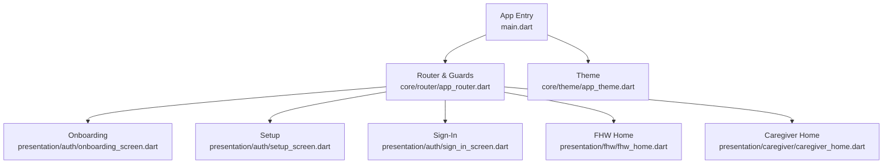
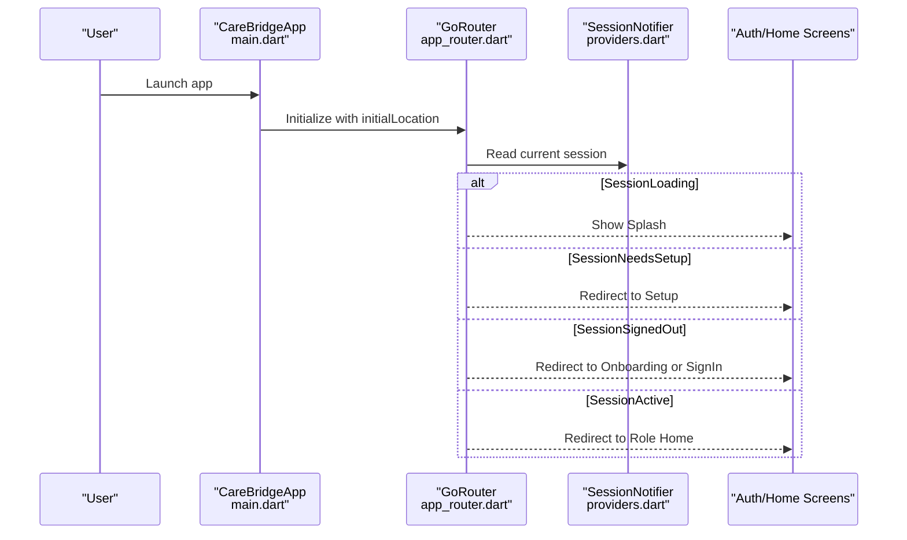
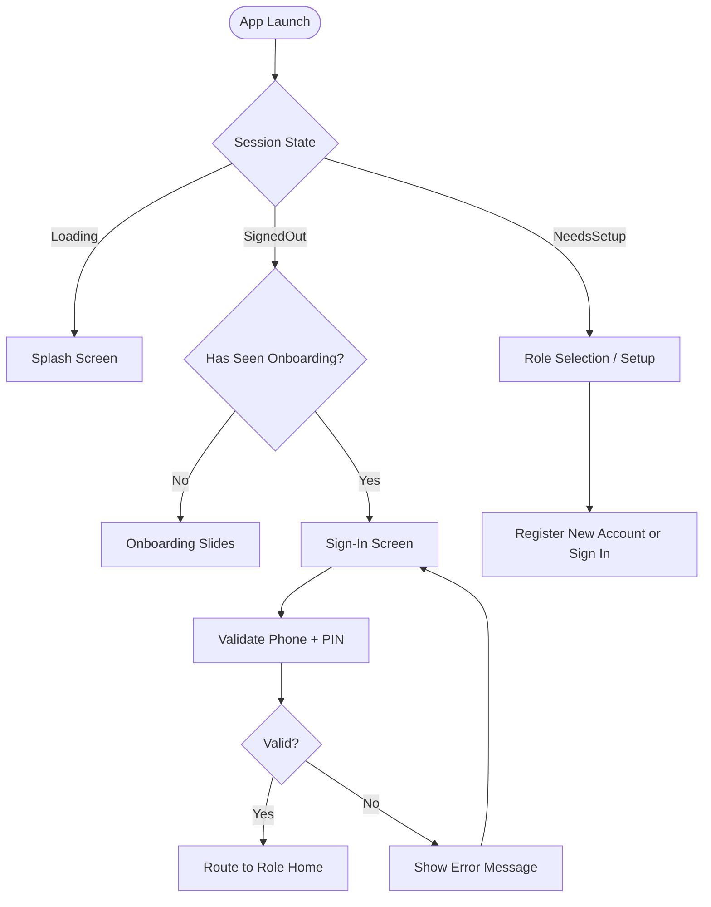
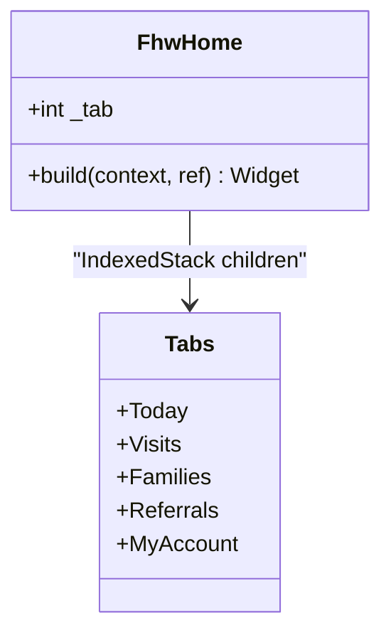
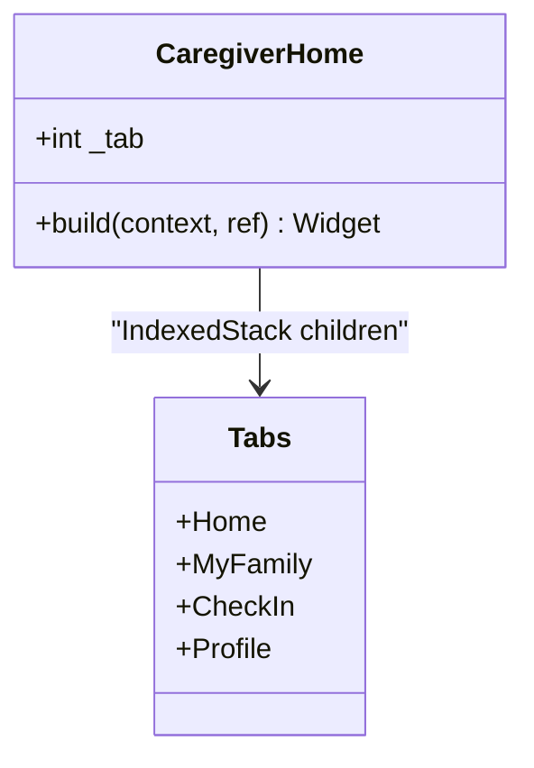
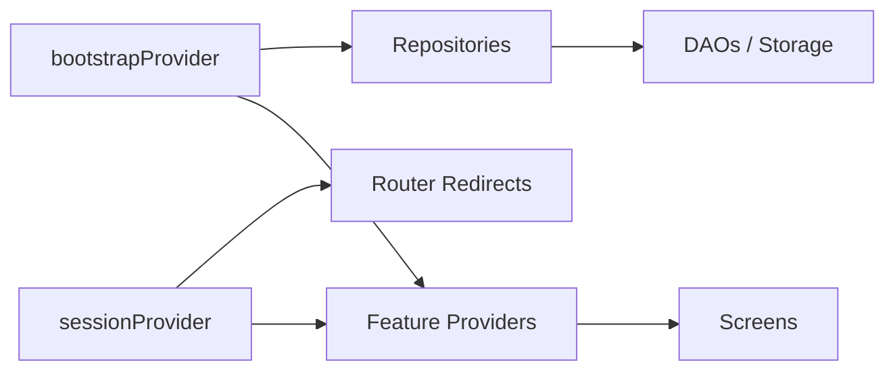
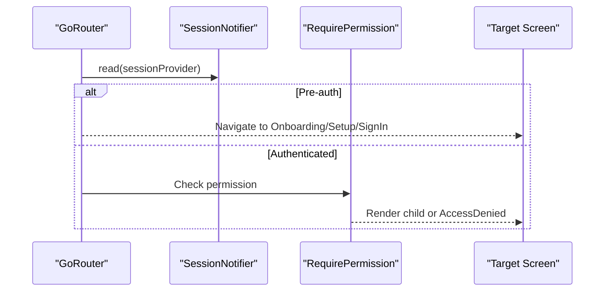
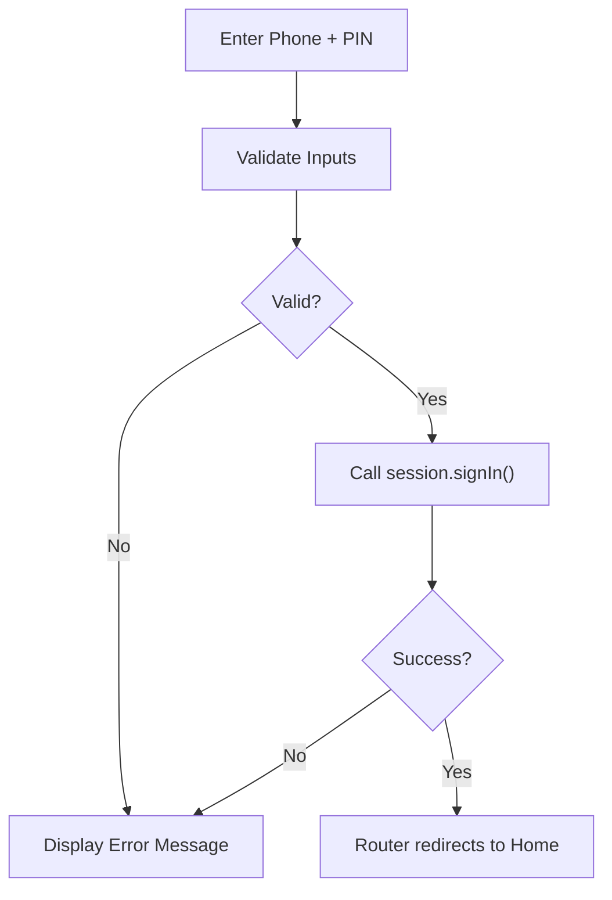
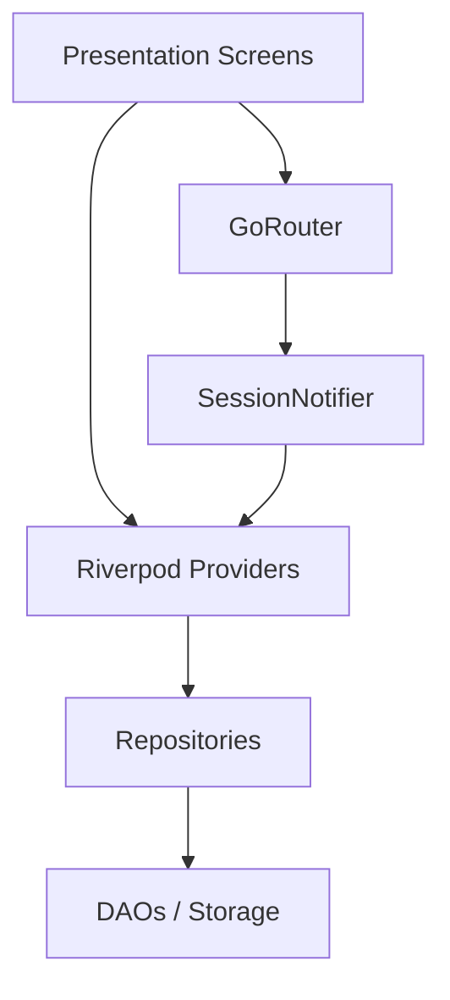

# Presentation Layer

<cite>
**Referenced Files in This Document**
- [main.dart](file://lib/main.dart)
- [pubspec.yaml](file://pubspec.yaml)
- [app_router.dart](file://lib/core/router/app_router.dart)
- [session.dart](file://lib/core/auth/session.dart)
- [providers.dart](file://lib/app/providers.dart)
- [onboarding_screen.dart](file://lib/presentation/auth/onboarding_screen.dart)
- [setup_screen.dart](file://lib/presentation/auth/setup_screen.dart)
- [sign_in_screen.dart](file://lib/presentation/auth/sign_in_screen.dart)
- [fhw_home.dart](file://lib/presentation/fhw/fhw_home.dart)
- [caregiver_home.dart](file://lib/presentation/caregiver/caregiver_home.dart)
</cite>

## Table of Contents
1. Introduction
2. Project Structure
3. Core Components
4. Architecture Overview
5. Detailed Component Analysis
6. Dependency Analysis
7. Performance Considerations
8. Troubleshooting Guide
9. Conclusion

## Introduction
This document describes the presentation layer of CareBridge AI with a focus on user interface components, role-specific home screens for Community Health Workers (CHO/FHW) and caregivers, authentication flows (onboarding, setup, sign-in), shared UI patterns, widget composition, state management via Riverpod providers, responsive design, user interactions, form handling, data binding, accessibility considerations, navigation patterns, screen transitions, and UX considerations across roles and contexts.

## Project Structure
The Flutter application entry point initializes the app shell, configures routing, and applies theming. The presentation layer is organized by feature areas:
- Authentication: Onboarding, Setup (role selection), Sign-in
- Role-based homes: FHW Home (CHO) and Caregiver Home
- Shared UI utilities used across screens

**Diagram sources**
- [main.dart:16-34](file://lib/main.dart#L16-L34)
- [app_router.dart:67-158](file://lib/core/router/app_router.dart#L67-L158)
- [onboarding_screen.dart:21-82](file://lib/presentation/auth/onboarding_screen.dart#L21-L82)
- [setup_screen.dart:101-129](file://lib/presentation/auth/setup_screen.dart#L101-L129)
- [sign_in_screen.dart:23-74](file://lib/presentation/auth/sign_in_screen.dart#L23-L74)
- [fhw_home.dart:35-132](file://lib/presentation/fhw/fhw_home.dart#L35-L132)
- [caregiver_home.dart:98-186](file://lib/presentation/caregiver/caregiver_home.dart#L98-L186)

**Section sources**
- [main.dart:16-34](file://lib/main.dart#L16-L34)
- [pubspec.yaml:12-55](file://pubspec.yaml#L12-L55)

## Core Components
- App Shell and Routing: MaterialApp.router with GoRouter configuration, session-aware redirects, and role-based route guards.
- Session State: Sealed session states drive splash, setup, sign-in, and authenticated home routing.
- Riverpod Providers: Centralized provider graph for bootstrap, repositories, sync status, session control, and feature-scoped data reads.
- Role-Specific Homes: FHW Home (five tabs) and Caregiver Home (four tabs) implement distinct workflows and permissions.
- Authentication Screens: Onboarding (first-run slides), Setup (role selection and account creation), Sign-In (phone + PIN).

Key responsibilities:
- Routing enforces coarse role boundaries and pre-auth flow; fine-grained permissions are enforced at repository and screen levels.
- Session state drives UI transitions without manual navigation logic scattered across widgets.
- Providers encapsulate async data loading, caching, and permission checks before data access.

**Section sources**
- [app_router.dart:67-158](file://lib/core/router/app_router.dart#L67-L158)
- [session.dart:27-68](file://lib/core/auth/session.dart#L27-L68)
- [providers.dart:38-122](file://lib/app/providers.dart#L38-L122)
- [fhw_home.dart:35-132](file://lib/presentation/fhw/fhw_home.dart#L35-L132)
- [caregiver_home.dart:98-186](file://lib/presentation/caregiver/caregiver_home.dart#L98-L186)

## Architecture Overview
The presentation layer composes screens around a session-driven router and Riverpod-managed state. The app bootstraps offline storage and demo seeding, then exposes providers that screens consume to render role-appropriate content.

**Diagram sources**
- [main.dart:16-34](file://lib/main.dart#L16-L34)
- [app_router.dart:67-114](file://lib/core/router/app_router.dart#L67-L114)
- [providers.dart:77-122](file://lib/app/providers.dart#L77-L122)

## Detailed Component Analysis

### Authentication Flows
- Onboarding: First-launch slides explaining offline-first behavior and value proposition. Completing onboarding marks it as seen and navigates back to the previous screen (typically sign-in).
- Setup: Role selection (FHW vs Caregiver) with capability descriptions. Offers sign-in if an existing account exists; otherwise proceeds to registration flow.
- Sign-In: Phone number + 4-digit PIN with custom keypad, error messaging, and demo accounts for quick login. Prefills last phone when available.

**Diagram sources**
- [app_router.dart:67-114](file://lib/core/router/app_router.dart#L67-L114)
- [onboarding_screen.dart:21-82](file://lib/presentation/auth/onboarding_screen.dart#L21-L82)
- [setup_screen.dart:101-129](file://lib/presentation/auth/setup_screen.dart#L101-L129)
- [sign_in_screen.dart:23-74](file://lib/presentation/auth/sign_in_screen.dart#L23-L74)

**Section sources**
- [onboarding_screen.dart:21-82](file://lib/presentation/auth/onboarding_screen.dart#L21-L82)
- [setup_screen.dart:101-129](file://lib/presentation/auth/setup_screen.dart#L101-L129)
- [sign_in_screen.dart:23-74](file://lib/presentation/auth/sign_in_screen.dart#L23-L74)

### FHW Home (Community Health Worker)
- Five-tab layout: Today, Visits, Families, Referrals, My account.
- Uses IndexedStack to preserve state and avoid recomputation when switching tabs.
- Provides refresh actions to invalidate key providers (day plan, visible households, insights).
- Displays zone/community context in the app bar.

**Diagram sources**
- [fhw_home.dart:35-132](file://lib/presentation/fhw/fhw_home.dart#L35-L132)

**Section sources**
- [fhw_home.dart:35-132](file://lib/presentation/fhw/fhw_home.dart#L35-L132)

### Caregiver Home
- Four-tab layout: Home, My Family, Check-In, Profile.
- Enforces caregiver-only scope: no clinical write forms; triage is guidance only.
- Prominent “Check Someone Now” action for danger-sign triage.
- Integrates audio guidance and barrier reporting.

**Diagram sources**
- [caregiver_home.dart:98-186](file://lib/presentation/caregiver/caregiver_home.dart#L98-L186)

**Section sources**
- [caregiver_home.dart:98-186](file://lib/presentation/caregiver/caregiver_home.dart#L98-L186)

### Shared UI and Widget Composition Patterns
- SectionCard and EmptyState provide consistent content blocks and empty/error states.
- TriageBadge visualizes last assessment outcomes.
- AudioGuide integration supports local-language voice guidance.
- Consistent spacing and typography via theme tokens (Gap, AppColors).

These patterns ensure reusable, accessible, and maintainable UI across roles.

**Section sources**
- [caregiver_home.dart:255-307](file://lib/presentation/caregiver/caregiver_home.dart#L255-L307)
- [caregiver_home.dart:309-371](file://lib/presentation/caregiver/caregiver_home.dart#L309-L371)

### State Management with Riverpod Providers
- Bootstrap Provider: Opens database, seeds demo data, starts sync service.
- Session Provider: Notifier managing SessionState (Loading, NeedsSetup, SignedOut, Active).
- Feature Providers: Day plan, visible households, household members, scores, assessments, growth series, trajectory analysis, visit history, barriers, referrals, declining children, barrier patterns, referral completion.
- Permission Checks: Providers guard data access based on currentUser and permissions.

**Diagram sources**
- [providers.dart:38-122](file://lib/app/providers.dart#L38-L122)
- [providers.dart:145-339](file://lib/app/providers.dart#L145-L339)

**Section sources**
- [providers.dart:38-122](file://lib/app/providers.dart#L38-L122)
- [providers.dart:145-339](file://lib/app/providers.dart#L145-L339)

### Responsive Design Implementation
- Material Scaffold with SafeArea ensures safe insets on various devices.
- BottomNavigationBar adapts to small screens; tab labels remain readable.
- Flexible layouts using ListView and Column/Row with appropriate padding and spacing tokens.
- Large touch targets and clear CTAs optimized for field use.

[No sources needed since this section provides general guidance]

### Accessibility Features
- Clear, high-contrast colors and large text sizes improve readability.
- Descriptive icons and labels support screen readers.
- Voice guidance via audio assets aids users with low literacy or visual impairments.
- Explicit error messages and confirmations reduce cognitive load.

[No sources needed since this section provides general guidance]

### Navigation Patterns and Screen Transitions
- GoRouter manages deep links and role-based redirects.
- RequirePermission wraps screens to enforce capability-based access.
- Splash holds until session resolves to avoid flashing auth screens.
- Role separation enforced at route level; fine-grained checks inside repositories.

**Diagram sources**
- [app_router.dart:67-158](file://lib/core/router/app_router.dart#L67-L158)

**Section sources**
- [app_router.dart:67-158](file://lib/core/router/app_router.dart#L67-L158)

### Form Handling and Data Binding
- Sign-In screen validates phone length and PIN format, shows inline errors, and disables submit while busy.
- Demo accounts auto-fill credentials for rapid testing.
- Last phone prefilled from session state to reduce input effort.

**Diagram sources**
- [sign_in_screen.dart:23-74](file://lib/presentation/auth/sign_in_screen.dart#L23-L74)

**Section sources**
- [sign_in_screen.dart:23-74](file://lib/presentation/auth/sign_in_screen.dart#L23-L74)

### User Interaction Flows
- FHW Home: Refresh invalidates providers to update day plan and lists; tabs preserve state for performance.
- Caregiver Home: Quick triage flow with person selection, danger-sign checklist, and verdict display; audio guidance available.
- Onboarding: Swipe through slides, mark as seen, return to previous screen.

**Section sources**
- [fhw_home.dart:74-88](file://lib/presentation/fhw/fhw_home.dart#L74-L88)
- [caregiver_home.dart:531-800](file://lib/presentation/caregiver/caregiver_home.dart#L531-L800)
- [onboarding_screen.dart:67-82](file://lib/presentation/auth/onboarding_screen.dart#L67-L82)

## Dependency Analysis
The presentation layer depends on core routing, session state, and Riverpod providers. Screens do not directly access DAOs; they rely on repositories exposed via providers, ensuring RBAC and auditability.

**Diagram sources**
- [providers.dart:38-122](file://lib/app/providers.dart#L38-L122)
- [app_router.dart:67-158](file://lib/core/router/app_router.dart#L67-L158)

**Section sources**
- [providers.dart:38-122](file://lib/app/providers.dart#L38-L122)
- [app_router.dart:67-158](file://lib/core/router/app_router.dart#L67-L158)

## Performance Considerations
- IndexedStack preserves tab state and avoids re-executing expensive queries when switching tabs.
- Provider invalidation is explicit (refresh button) to control recomputation.
- FutureProvider.family caches per-key results, reducing redundant network/DB calls.
- Splash waits for session resolution to prevent unnecessary UI churn.

[No sources needed since this section provides general guidance]

## Troubleshooting Guide
- If the app loops between splash and sign-in, verify session restoration and bootstrap provider completion.
- Access denied screens indicate missing permissions; check RequirePermission usage and repository-level checks.
- Empty states or missing data often stem from unlinked caregiver household; ensure linkage by health worker.

**Section sources**
- [app_router.dart:167-196](file://lib/core/router/app_router.dart#L167-L196)
- [caregiver_home.dart:114-130](file://lib/presentation/caregiver/caregiver_home.dart#L114-L130)

## Conclusion
The presentation layer delivers role-tailored experiences for CHOs and caregivers through a robust routing system, session-driven navigation, and centralized state management with Riverpod. Shared UI patterns, accessible design, and careful performance considerations ensure a reliable, user-friendly experience in resource-constrained environments.

[No sources needed since this section summarizes without analyzing specific files]