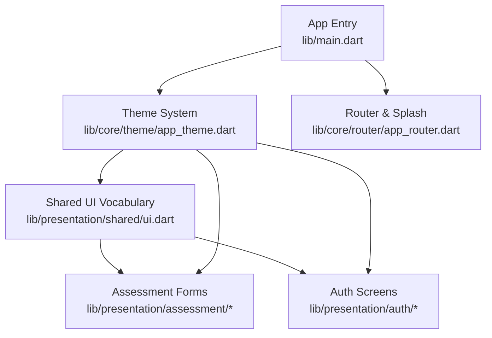
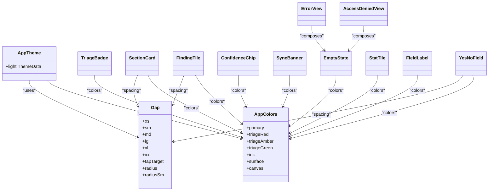
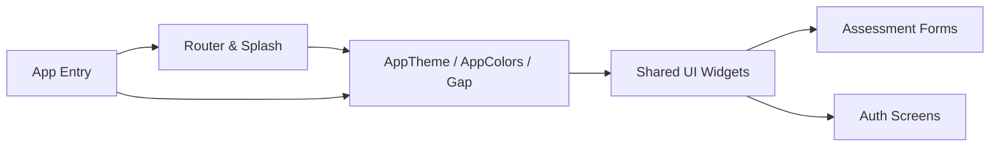

# Shared Components

<cite>
**Referenced Files in This Document**
- [main.dart](file://lib/main.dart)
- [app_theme.dart](file://lib/core/theme/app_theme.dart)
- [ui.dart](file://lib/presentation/shared/ui.dart)
- [form_kit.dart](file://lib/presentation/assessment/form_kit.dart)
- [child_form.dart](file://lib/presentation/assessment/child_form.dart)
- [result_screen.dart](file://lib/presentation/assessment/result_screen.dart)
- [onboarding_screen.dart](file://lib/presentation/auth/onboarding_screen.dart)
- [setup_screen.dart](file://lib/presentation/auth/setup_screen.dart)
- [app_router.dart](file://lib/core/router/app_router.dart)
</cite>

## Table of Contents
1. [Introduction](#introduction)
2. [Project Structure](#project-structure)
3. [Core Components](#core-components)
4. [Architecture Overview](#architecture-overview)
5. [Detailed Component Analysis](#detailed-component-analysis)
6. [Dependency Analysis](#dependency-analysis)
7. [Performance Considerations](#performance-considerations)
8. [Troubleshooting Guide](#troubleshooting-guide)
9. [Conclusion](#conclusion)
10. [Appendices](#appendices)

## Introduction
This document describes the shared UI components used across CareBridge AI. It focuses on reusable widgets for text fields, data display, loading indicators, and common UI patterns. You will find component props, customization options, styling approaches, integration with the theme system, usage examples, best practices for composition, accessibility guidance, and responsive design patterns. The goal is to help developers build consistent, accessible, and field-friendly interfaces that align with the application’s clinical context and visual language.

## Project Structure
CareBridge AI organizes UI assets under lib/presentation and core theming under lib/core/theme. The app entry point wires up routing and applies the global theme. Shared presentation components live in a dedicated shared module and are consumed by feature screens such as assessments and authentication flows.

**Diagram sources**
- [main.dart:17-34](file://lib/main.dart#L17-L34)
- [app_theme.dart:56-176](file://lib/core/theme/app_theme.dart#L56-L176)
- [ui.dart:1-693](file://lib/presentation/shared/ui.dart#L1-L693)
- [app_router.dart:215-272](file://lib/core/router/app_router.dart#L215-L272)

**Section sources**
- [main.dart:17-34](file://lib/main.dart#L17-L34)
- [app_theme.dart:56-176](file://lib/core/theme/app_theme.dart#L56-L176)

## Core Components
The shared vocabulary provides a cohesive set of building blocks designed for clarity, trust, and field usability.

- TriageBadge: Displays triage level with color-coded background and icon. Supports compact mode and custom labels.
- SectionCard: A titled card with optional subtitle, icon, trailing widget, and accent color. Enforces consistent header weight and padding.
- FindingTile: Presents a clinical finding with severity, detail, and contextual chips (measured value, threshold, source).
- ConfidenceChip: Shows recommendation confidence with an icon and label; can indicate missing measurements.
- SyncBanner: Non-blocking banner indicating offline state or sync issues; supports tap-to-action.
- EmptyState: Centered empty-state layout with icon, title, message, and optional action button.
- StatTile: Labelled metric tile with optional icon and color.
- FieldLabel: Form label with optional explanatory “why we ask” text and required indicator.
- YesNoField: Large, thumb-friendly yes/no selector with optional “Not sure” option and danger highlighting for yes.
- AccessDeniedView: User-facing access-denied screen built on EmptyState.
- ErrorView: Standardized error presentation with retry action.

Props and customization highlights:
- Colors and semantics come from AppColors and Gap constants; avoid re-purposing triage colors for decoration.
- Spacing and radii use Gap scale; interactive targets meet or exceed minimum tap targets.
- Text styles follow theme typography; components respect theme-level input decoration and chip themes.

Accessibility notes:
- Use semantic labels via Flutter’s accessibility APIs when wrapping these widgets in custom interactions.
- Ensure sufficient contrast using provided triage and neutral palettes.
- Provide meaningful labels for buttons and actions (e.g., “Try again”, “Go back”).

Responsive behavior:
- Components rely on flexible layouts (Row/Column/Expanded/Wrap) to adapt to narrow screens.
- Tap targets and spacing are sized for one-handed use while holding an infant.

Usage examples:
- Compose SectionCard around lists of FindingTile items to present assessment results.
- Wrap form inputs with FieldLabel and pair with YesNoField for binary questions.
- Show SyncBanner at the top of screens where offline persistence occurs.
- Present EmptyState or ErrorView when data is unavailable or operations fail.

**Section sources**
- [ui.dart:20-693](file://lib/presentation/shared/ui.dart#L20-L693)
- [app_theme.dart:40-54](file://lib/core/theme/app_theme.dart#L40-L54)

## Architecture Overview
The theme system centralizes colors, spacing, and Material theme overrides. Shared components consume these tokens to ensure consistency. Feature screens compose shared components to implement domain-specific UIs.

**Diagram sources**
- [app_theme.dart:11-54](file://lib/core/theme/app_theme.dart#L11-L54)
- [app_theme.dart:56-176](file://lib/core/theme/app_theme.dart#L56-L176)
- [ui.dart:41-693](file://lib/presentation/shared/ui.dart#L41-L693)

## Detailed Component Analysis

### Theme System Integration
The theme defines the color palette, spacing scale, and Material theme overrides. Components reference these tokens directly to maintain consistency.

Key aspects:
- Color system: brand, triage bands, neutrals, and semantic colors.
- Spacing and radii: xs through xxl, tap target sizing, border radii.
- Material overrides: AppBar, Card, Buttons, InputDecoration, Chips, Dividers, ListTiles, BottomNavigationBar.

Best practices:
- Always use AppColors and Gap instead of ad-hoc values.
- Do not repurpose triade colors for decorative accents.
- Rely on theme-provided input decoration for consistent fields.

**Section sources**
- [app_theme.dart:11-54](file://lib/core/theme/app_theme.dart#L11-L54)
- [app_theme.dart:56-176](file://lib/core/theme/app_theme.dart#L56-L176)

### Shared UI Vocabulary
This module encapsulates reusable widgets aligned with the theme and clinical messaging principles.

Highlights:
- TriageBadge: Compact or standard badges with icon and label.
- SectionCard: Consistent section container with header and optional trailing content.
- FindingTile: Clinical finding with severity, detail, and metadata chips.
- ConfidenceChip: Confidence indicator with optional missing measurement count.
- SyncBanner: Offline/sync status banner with optional action.
- EmptyState: Generic empty state with icon, title, message, and action.
- StatTile: Metric tile with label and optional icon/color.
- FieldLabel: Descriptive label with optional explanation and required marker.
- YesNoField: Large, accessible yes/no selection with optional unknown and danger highlight.
- AccessDeniedView and ErrorView: User-friendly error states with actions.

Props and customization:
- Labels, icons, colors, and sizes are exposed via constructor parameters.
- Optional features like allowUnknown and dangerOnYes tailor behavior for specific contexts.

Composition patterns:
- Nest FindingTile within SectionCard for structured result views.
- Pair FieldLabel with YesNoField for binary inputs.
- Wrap lists with SyncBanner to communicate offline state.

Accessibility:
- Ensure all interactive elements have clear labels and sufficient contrast.
- Use semantic roles when extending these widgets.

**Section sources**
- [ui.dart:20-693](file://lib/presentation/shared/ui.dart#L20-L693)

### Assessment Form Kit Components
Assessment forms leverage specialized components for measurement capture and protocol-driven flows.

Components:
- DangerSign: Highlights critical signs.
- SignChecklist and _SignRow: Checklist rows for sign validation.
- MeasureField and MeasurePair: Numeric measurement inputs with units and pairing logic.
- ChoiceChipsField<T>: Selectable chips for categorical choices.
- CountField: Numeric counter with increment/decrement controls.
- _StepButton: Navigation step control within multi-step flows.
- ProtocolHeader: Header for protocol sections.
- RunBar: Progress or execution bar for running protocols.

Props and customization:
- Inputs expose validators, formatting, and unit handling.
- Chips support selection states and styling via theme.
- Step navigation integrates with form state management.

Best practices:
- Keep labels descriptive and include “why we ask” context where helpful.
- Validate inputs early and provide immediate feedback.
- Use consistent spacing and tap targets for one-handed operation.

**Section sources**
- [form_kit.dart:29-478](file://lib/presentation/assessment/form_kit.dart#L29-L478)

### Child Assessment Screen Patterns
Child assessment screens demonstrate composition of shared components and form kit elements into domain-specific workflows.

Patterns:
- Reuse SectionCard for grouping related findings and inputs.
- Employ YesNoField for binary decisions and MeasureField for numeric inputs.
- Display results using FindingTile and ConfidenceChip to explain reasoning.

Integration points:
- Connect to Riverpod providers for state management.
- Respect theme and spacing tokens throughout.

**Section sources**
- [child_form.dart:43-1289](file://lib/presentation/assessment/child_form.dart#L43-L1289)

### Result Screen Patterns
Result screens present recommendations, nutrition insights, immunization guidance, and referrals.

Patterns:
- Use ConfidenceChip to communicate certainty levels.
- Group related actions and information in SectionCard containers.
- Provide clear next steps and explanations for each recommendation.

**Section sources**
- [result_screen.dart:38-936](file://lib/presentation/assessment/result_screen.dart#L38-L936)

### Authentication Screens
Authentication flows use consistent headers, cards, and instructional layouts.

Patterns:
- Onboarding slides use large icons and concise copy.
- Setup screens present options with icons, titles, and subtitles.
- Maintain high contrast and readable typography for low-light conditions.

**Section sources**
- [onboarding_screen.dart:21-229](file://lib/presentation/auth/onboarding_screen.dart#L21-L229)
- [setup_screen.dart:174-210](file://lib/presentation/auth/setup_screen.dart#L174-L210)

### Loading Indicators and Splash
Loading states are minimal and non-blocking. The splash screen shows branding and a small progress indicator while initialization completes.

Guidelines:
- Avoid blocking user interaction during short waits.
- Keep loaders subtle and aligned with brand colors.

**Section sources**
- [app_router.dart:215-272](file://lib/core/router/app_router.dart#L215-L272)

## Dependency Analysis
Shared components depend on the theme system for colors, spacing, and Material overrides. Feature screens compose these components to implement domain logic.

**Diagram sources**
- [app_theme.dart:56-176](file://lib/core/theme/app_theme.dart#L56-L176)
- [ui.dart:1-693](file://lib/presentation/shared/ui.dart#L1-L693)
- [app_router.dart:215-272](file://lib/core/router/app_router.dart#L215-L272)
- [main.dart:17-34](file://lib/main.dart#L17-L34)

**Section sources**
- [app_theme.dart:56-176](file://lib/core/theme/app_theme.dart#L56-L176)
- [ui.dart:1-693](file://lib/presentation/shared/ui.dart#L1-L693)

## Performance Considerations
- Prefer StatelessWidget for pure UI components to minimize rebuilds.
- Use const constructors where possible to optimize widget tree construction.
- Avoid heavy computations inside build methods; offload to providers or precomputed values.
- Leverage theme-provided defaults to reduce redundant style definitions.
- Keep lists virtualized and paginate data to prevent memory pressure on low-end devices.

[No sources needed since this section provides general guidance]

## Troubleshooting Guide
Common issues and resolutions:
- Incorrect colors or contrast: Verify usage of AppColors and ensure triage colors are reserved for their intended semantics.
- Inconsistent spacing: Use Gap constants consistently across components and screens.
- Accessibility failures: Add semantic labels and ensure focus order is logical for interactive elements.
- Offline state confusion: Use SyncBanner to clearly communicate pending or failing records without alarming users.
- Error handling: Present ErrorView with actionable retry options and clear messages.

**Section sources**
- [ui.dart:356-415](file://lib/presentation/shared/ui.dart#L356-L415)
- [ui.dart:677-693](file://lib/presentation/shared/ui.dart#L677-L693)

## Conclusion
CareBridge AI’s shared components provide a robust, accessible, and field-tested foundation for building consistent user interfaces. By adhering to the theme system, following composition guidelines, and prioritizing clarity and trust, developers can create experiences that empower community health workers and caregivers. Maintain consistency by reusing shared widgets, respecting triage semantics, and ensuring accessibility and responsiveness across devices.

[No sources needed since this section summarizes without analyzing specific files]

## Appendices

### Component Props Reference
- TriageBadge: level, label, compact
- SectionCard: child, title, subtitle, icon, trailing, accent, padding
- FindingTile: label, detail, severity, source, measured, threshold
- ConfidenceChip: confidence, missingCount
- SyncBanner: pending, failing, detail, onTap
- EmptyState: icon, title, message, action
- StatTile: value, label, colour, icon
- FieldLabel: label, why, required
- YesNoField: value, onChanged, yesLabel, noLabel, allowUnknown, dangerOnYes
- AccessDeniedView: message, onBack
- ErrorView: error, onRetry

**Section sources**
- [ui.dart:41-693](file://lib/presentation/shared/ui.dart#L41-L693)

### Best Practices for Composition
- Group related content in SectionCard to establish visual hierarchy.
- Use FindingTile and ConfidenceChip together to explain findings and confidence.
- Pair FieldLabel with YesNoField or MeasureField for clear, contextual inputs.
- Surface SyncBanner prominently when offline persistence is relevant.
- Present EmptyState or ErrorView with actionable next steps.

**Section sources**
- [ui.dart:80-149](file://lib/presentation/shared/ui.dart#L80-L149)
- [ui.dart:157-237](file://lib/presentation/shared/ui.dart#L157-L237)
- [ui.dart:297-350](file://lib/presentation/shared/ui.dart#L297-L350)
- [ui.dart:417-467](file://lib/presentation/shared/ui.dart#L417-L467)
- [ui.dart:531-575](file://lib/presentation/shared/ui.dart#L531-L575)
- [ui.dart:583-652](file://lib/presentation/shared/ui.dart#L583-L652)
- [ui.dart:658-673](file://lib/presentation/shared/ui.dart#L658-L673)
- [ui.dart:677-693](file://lib/presentation/shared/ui.dart#L677-L693)

### Accessibility and Responsive Design Guidelines
- Ensure sufficient color contrast using AppColors.
- Provide descriptive labels for all interactive elements.
- Maintain minimum tap targets per Gap.tapTarget.
- Use flexible layouts to adapt to various screen sizes.
- Offer “why we ask” explanations to improve comprehension and accuracy.

**Section sources**
- [app_theme.dart:40-54](file://lib/core/theme/app_theme.dart#L40-L54)
- [ui.dart:531-575](file://lib/presentation/shared/ui.dart#L531-L575)