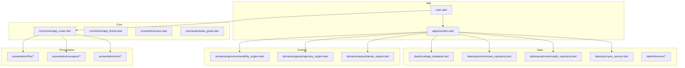
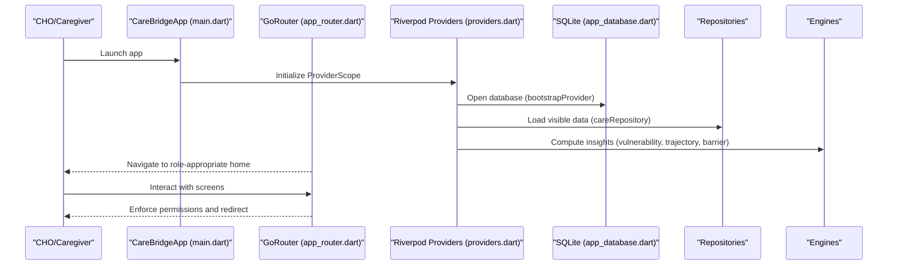
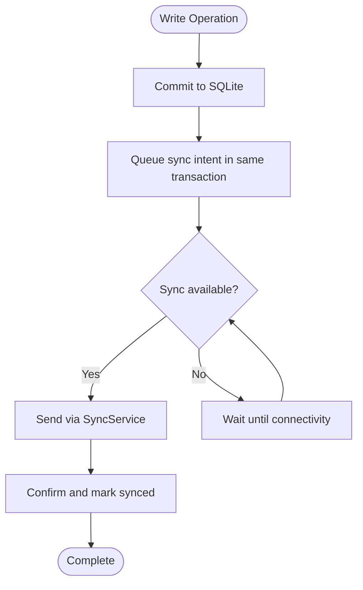
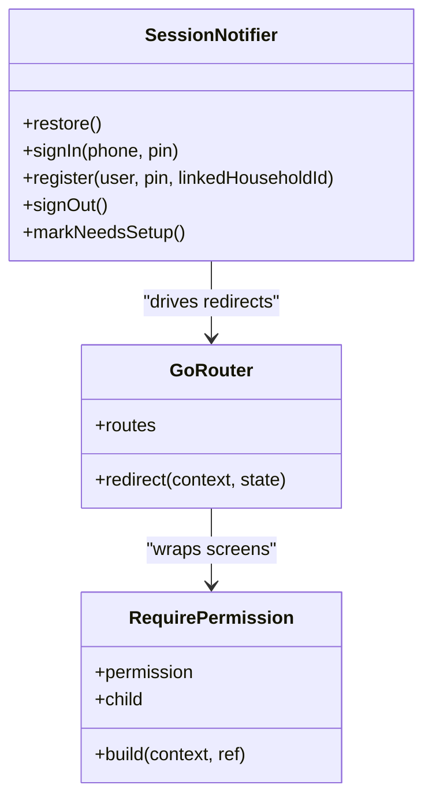
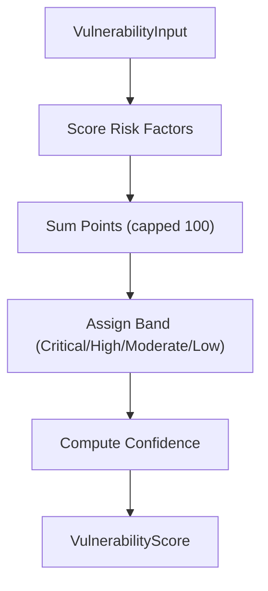
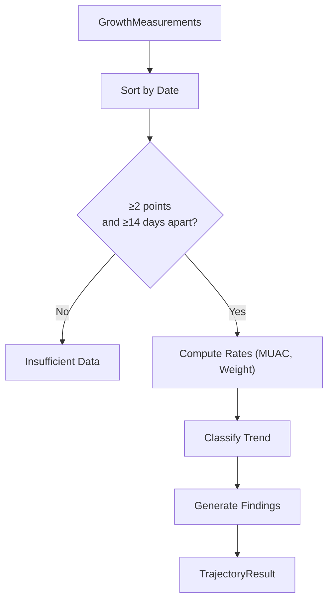
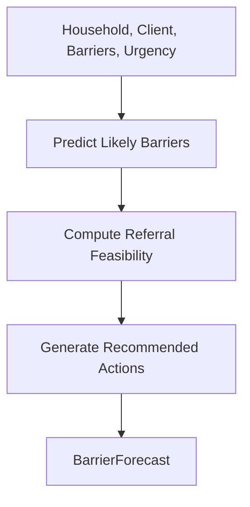
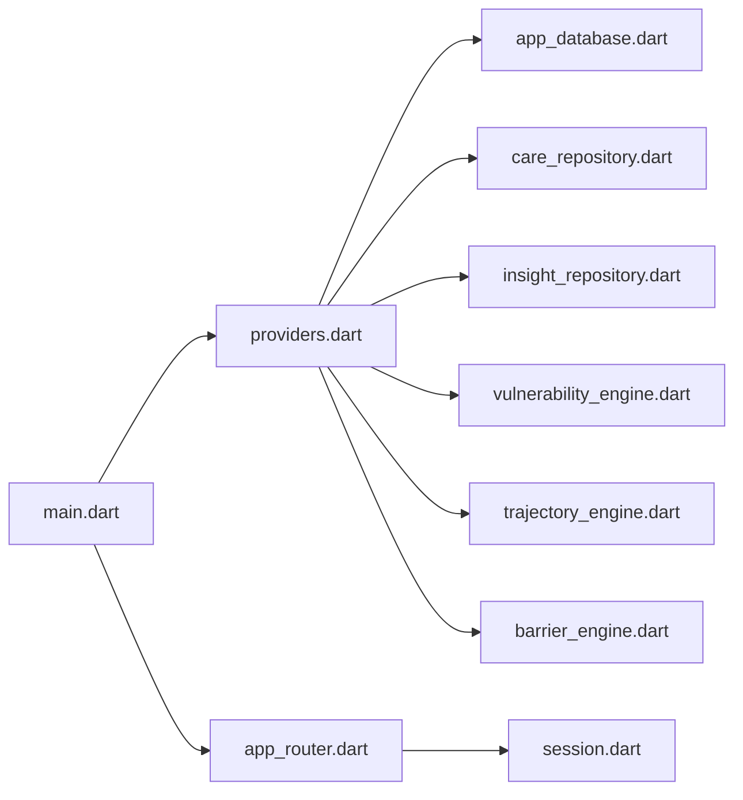

# Project Overview

<cite>
**Referenced Files in This Document**
- [README.md](file://README.md)
- [pubspec.yaml](file://pubspec.yaml)
- [main.dart](file://lib/main.dart)
- [providers.dart](file://lib/app/providers.dart)
- [app_router.dart](file://lib/core/router/app_router.dart)
- [app_database.dart](file://lib/data/local/app_database.dart)
- [barrier_engine.dart](file://lib/domain/engines/barrier_engine.dart)
- [trajectory_engine.dart](file://lib/domain/engines/trajectory_engine.dart)
- [vulnerability_engine.dart](file://lib/domain/engines/vulnerability_engine.dart)
</cite>

## Table of Contents
1. Introduction
2. Project Structure
3. Core Components
4. Architecture Overview
5. Detailed Component Analysis
6. Dependency Analysis
7. Performance Considerations
8. Troubleshooting Guide
9. Conclusion

## Introduction
CareBridge AI is an offline-first, AI-assisted community health companion designed for frontline health workers (Community Health Officers, CHOs) and caregivers in Northern Ghana. It helps CHO teams plan daily visits, assess maternal and child health risks, track referrals, and understand hidden barriers to care — all without relying on continuous internet connectivity. The project was built for the UNICEF Start-Up Lab “AI for Nurturing Care” Hackathon 2026.

Key objectives:
- Enable CHO teams to prioritize households by risk and act before crises occur
- Provide AI-powered clinical assessments grounded in local data and protocols
- Ensure reliable offline operation with robust local storage and sync
- Support both CHO workflows and caregiver self-management where appropriate

Target audience:
- Frontline health workers (CHOs) managing zones and households
- Caregivers linked to a household who can view family-focused insights and actions

Technical highlights:
- Flutter-based cross-platform app with Riverpod state management
- SQLite offline storage as the source of truth with an outbox for eventual sync
- Deterministic, explainable AI engines for vulnerability scoring, growth trajectory analysis, and barrier prediction
- Role-aware routing and permission guards for secure access control

Practical value examples:
- A CHO opens the app offline, sees a ranked day plan highlighting the most vulnerable households, and completes assessments that generate actionable findings and scheduled follow-ups
- A caregiver views their family’s visit history, upcoming contacts, and simple guidance in local language audio

**Section sources**
- [pubspec.yaml:1-6](file://pubspec.yaml#L1-L6)
- [README.md:1-18](file://README.md#L1-L18)

## Project Structure
The application follows a layered architecture:
- Presentation layer: screens and UI components
- Domain layer: clinical and operational engines (risk scoring, trajectory analysis, barrier prediction)
- Data layer: repositories, DAOs, reference data, and sync service
- Core layer: routing, theme, auth session, and shared utilities
- App wiring: providers that compose dependencies and expose state to the UI

**Diagram sources**
- [main.dart:16-34](file://lib/main.dart#L16-L34)
- [providers.dart:38-56](file://lib/app/providers.dart#L38-L56)
- [app_database.dart:43-103](file://lib/data/local/app_database.dart#L43-L103)
- [app_router.dart:63-159](file://lib/core/router/app_router.dart#L63-L159)

**Section sources**
- [main.dart:16-34](file://lib/main.dart#L16-L34)
- [providers.dart:1-339](file://lib/app/providers.dart#L1-L339)
- [app_database.dart:1-173](file://lib/data/local/app_database.dart#L1-L173)
- [app_router.dart:1-159](file://lib/core/router/app_router.dart#L1-L159)

## Core Components
- Application bootstrap and dependency wiring:
  - ProviderScope initialization and router configuration
  - Bootstrap provider ensures database open, demo seed, and sync start
- Routing and role enforcement:
  - GoRouter setup with session-driven redirects and capability-based guards
- Offline-first database:
  - SQLite schema, foreign keys, indexes, soft deletes, append-only clinical history
  - Outbox table for reliable sync with priority ordering
- State management with Riverpod:
  - Session state, current user, feature-specific future/stream providers
  - Permission checks at repository level; screens never see DAOs directly
- Clinical and operational engines:
  - Vulnerability scoring for household prioritization
  - Growth trajectory analysis for early detection of malnutrition trends
  - Barrier prediction and pattern detection for systemic issues

**Section sources**
- [providers.dart:38-56](file://lib/app/providers.dart#L38-L56)
- [app_router.dart:63-159](file://lib/core/router/app_router.dart#L63-L159)
- [app_database.dart:175-556](file://lib/data/local/app_database.dart#L175-L556)
- [providers.dart:124-339](file://lib/app/providers.dart#L124-L339)

## Architecture Overview
The system centers around an offline-first SQLite database, with Riverpod providers exposing domain services and repositories to the UI. Routing enforces role-based access, while clinical engines compute actionable insights from stored records.

**Diagram sources**
- [main.dart:16-34](file://lib/main.dart#L16-L34)
- [providers.dart:38-56](file://lib/app/providers.dart#L38-L56)
- [app_database.dart:67-103](file://lib/data/local/app_database.dart#L67-L103)
- [app_router.dart:63-159](file://lib/core/router/app_router.dart#L63-L159)

## Detailed Component Analysis

### Offline Database Layer
Design principles:
- SQLite is the source of truth, not a cache
- Writes commit locally immediately; sync intent queued atomically
- Append-only clinical history preserves series for trend analysis
- Hand-written SQL for clarity and reliability under hackathon constraints

Key features:
- Foreign key enforcement and strategic indexes
- Soft deletes and audit logging
- Outbox table with priority ordering for urgent items
- In-memory mode for tests and desktop runs

**Diagram sources**
- [app_database.dart:105-173](file://lib/data/local/app_database.dart#L105-L173)
- [app_database.dart:508-533](file://lib/data/local/app_database.dart#L508-L533)

**Section sources**
- [app_database.dart:1-173](file://lib/data/local/app_database.dart#L1-L173)
- [app_database.dart:175-556](file://lib/data/local/app_database.dart#L175-L556)

### State Management and Routing
- Riverpod manages session state, current user, and feature data
- GoRouter handles navigation with role-based redirects and capability guards
- Screens request data through repositories, which enforce permissions

**Diagram sources**
- [providers.dart:73-122](file://lib/app/providers.dart#L73-L122)
- [app_router.dart:63-159](file://lib/core/router/app_router.dart#L63-L159)
- [app_router.dart:167-196](file://lib/core/router/app_router.dart#L167-L196)

**Section sources**
- [providers.dart:68-135](file://lib/app/providers.dart#L68-L135)
- [app_router.dart:34-159](file://lib/core/router/app_router.dart#L34-L159)

### Vulnerability Scoring Engine
Purpose:
- Rank households by risk to guide CHO daily planning
- Separate modifiable vs non-modifiable factors
- Provide transparent, auditable scoring with confidence levels

Key outputs:
- Score (0–100), band (critical/high/moderate/low)
- List of risk factors with points and suggested actions
- Confidence based on data completeness and hard signals

**Diagram sources**
- [vulnerability_engine.dart:196-765](file://lib/domain/engines/vulnerability_engine.dart#L196-L765)

**Section sources**
- [vulnerability_engine.dart:1-798](file://lib/domain/engines/vulnerability_engine.dart#L1-L798)

### Growth Trajectory Engine
Purpose:
- Detect declining growth trends before thresholds are crossed
- Project time to severe acute malnutrition (SAM) threshold
- Provide explainable findings with arithmetic transparency

Key logic:
- Least-squares slope for MUAC and weight per month
- Noise floor to avoid false positives from measurement variation
- Oedema detection as hard flag for immediate action

**Diagram sources**
- [trajectory_engine.dart:80-264](file://lib/domain/engines/trajectory_engine.dart#L80-L264)

**Section sources**
- [trajectory_engine.dart:1-335](file://lib/domain/engines/trajectory_engine.dart#L1-L335)

### Barrier Prediction Engine
Purpose:
- Predict barriers that may prevent referral completion
- Aggregate zone-wide patterns to identify systemic issues
- Provide preemptive actions to address barriers before families leave

Key features:
- Historical barriers as strong predictors
- Seasonal and contextual factors (rainy season, harvest, night travel)
- Feasibility score combining multiple barrier likelihoods

**Diagram sources**
- [barrier_engine.dart:110-396](file://lib/domain/engines/barrier_engine.dart#L110-L396)

**Section sources**
- [barrier_engine.dart:1-534](file://lib/domain/engines/barrier_engine.dart#L1-L534)

## Dependency Analysis
The application uses a clear separation of concerns with minimal coupling:
- Providers orchestrate dependencies between repositories, databases, and engines
- Repositories enforce permissions and abstract data access
- Engines are pure functions operating on domain entities
- Routing depends only on session state and permissions

**Diagram sources**
- [providers.dart:1-339](file://lib/app/providers.dart#L1-L339)
- [app_router.dart:1-159](file://lib/core/router/app_router.dart#L1-L159)

**Section sources**
- [providers.dart:1-339](file://lib/app/providers.dart#L1-L339)
- [app_router.dart:1-159](file://lib/core/router/app_router.dart#L1-L159)

## Performance Considerations
- SQLite indexing strategy optimizes common queries (households by community, visits by worker/date, growth measurements by person/date)
- Outbox prioritization ensures urgent referrals sync first
- Riverpod providers cache results and rebuild only when dependencies change
- Lazy loading of heavy operations (database open, demo seed, sync service) improves startup time
- Append-only design avoids expensive updates and preserves clinical integrity

[No sources needed since this section provides general guidance]

## Troubleshooting Guide
Common issues and solutions:
- Database opening failures: Check platform-specific initialization for desktop/tests
- Sync failures: Review outbox attempts and last_error fields
- Permission denied errors: Verify user role and required permissions
- Missing data: Use unknowns list from vulnerability scoring to identify gaps
- Navigation loops: Ensure session state transitions are correct in router redirect

Debugging utilities:
- Audit log tracks permission denials and clinical overrides
- Demo seed allows resetting data for testing
- In-memory database for isolated test scenarios

**Section sources**
- [app_database.dart:116-128](file://lib/data/local/app_database.dart#L116-L128)
- [app_database.dart:535-556](file://lib/data/local/app_database.dart#L535-L556)
- [app_router.dart:167-196](file://lib/core/router/app_router.dart#L167-L196)

## Conclusion
CareBridge AI delivers a practical, offline-first solution for community health workers in resource-constrained settings. By combining robust local storage, explainable AI engines, and role-aware workflows, it enables proactive care delivery and better outcomes for mothers and children in Northern Ghana. The architecture supports rapid iteration while maintaining clinical safety and data integrity.

[No sources needed since this section summarizes without analyzing specific files]