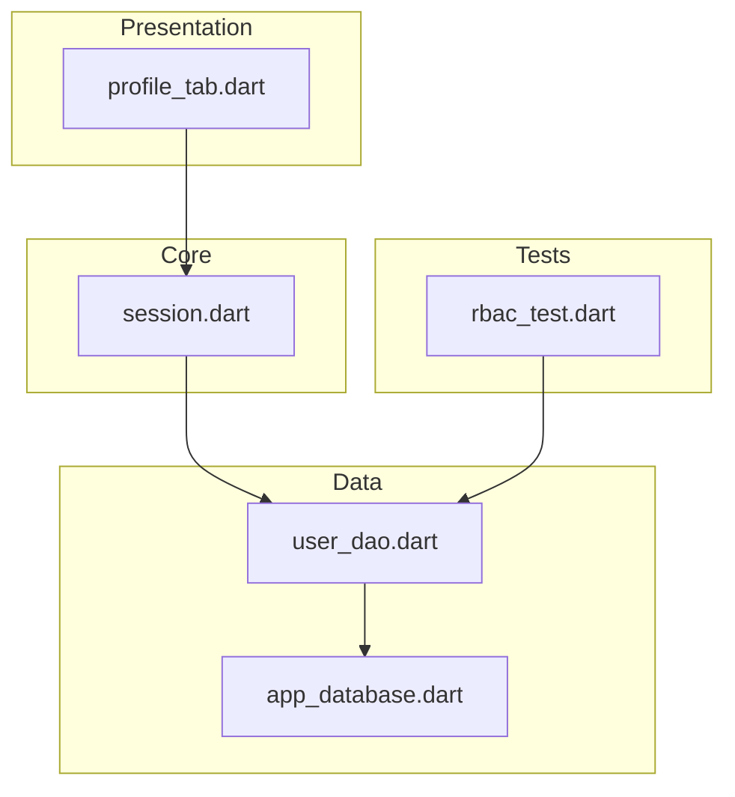
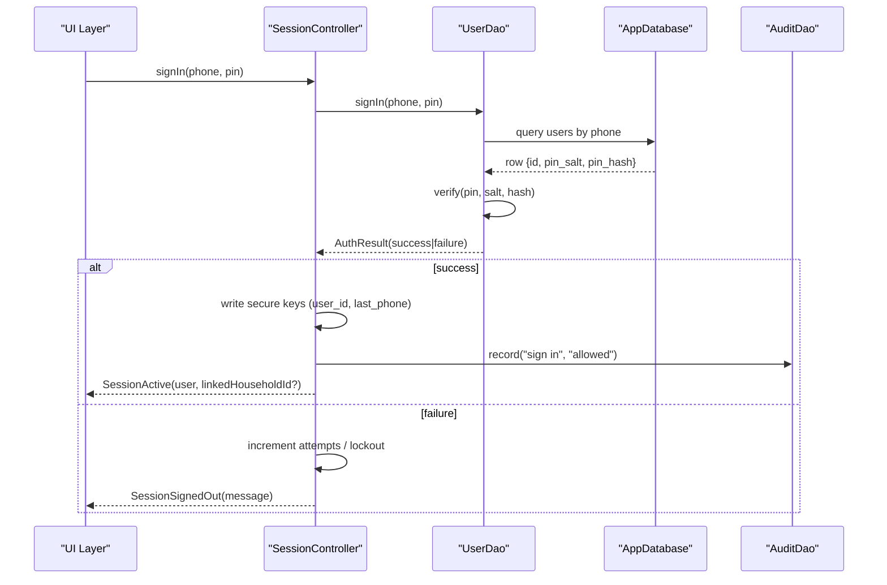
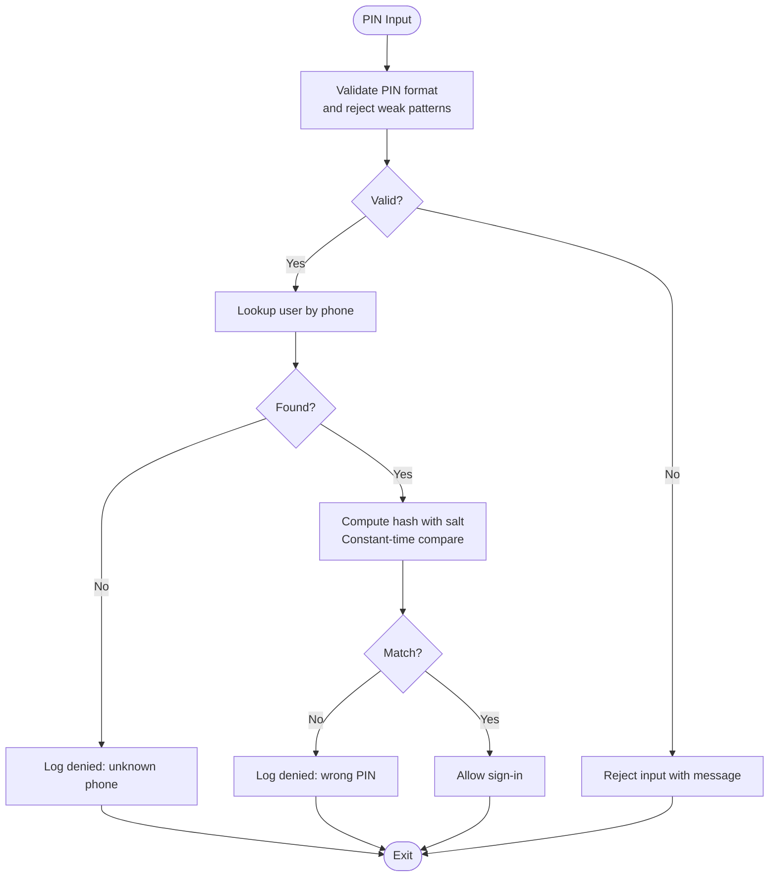
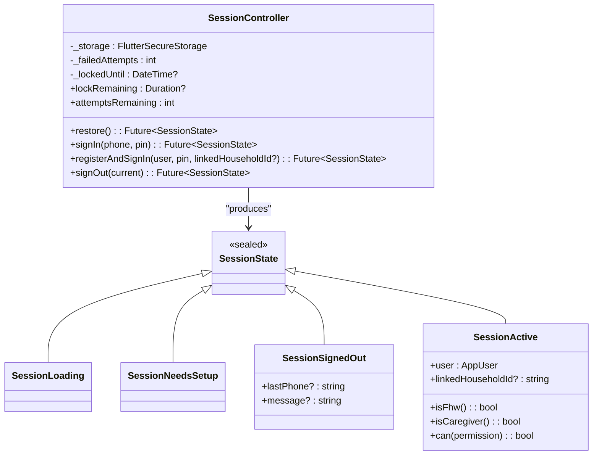
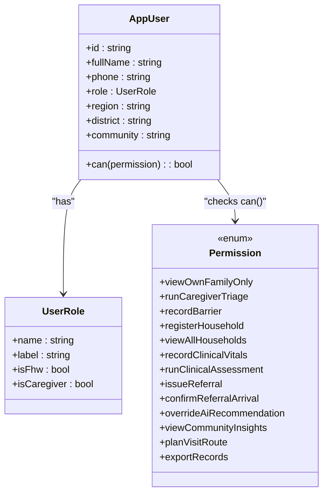
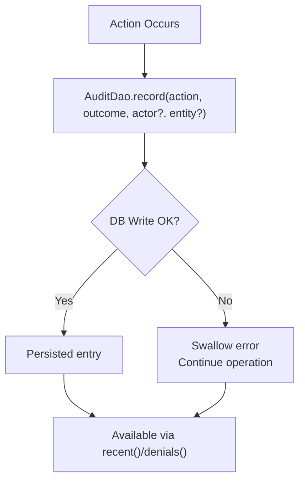
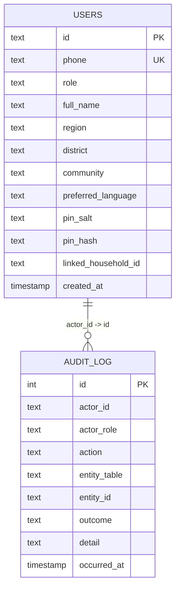
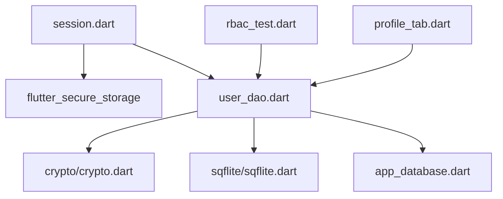

# Security Considerations

<cite>
**Referenced Files in This Document**
- [README.md](file://README.md)
- [pubspec.yaml](file://pubspec.yaml)
- [session.dart](file://lib/core/auth/session.dart)
- [user_dao.dart](file://lib/data/local/user_dao.dart)
- [app_database.dart](file://lib/data/local/app_database.dart)
- [rbac_test.dart](file://test/rbac_test.dart)
- [profile_tab.dart](file://lib/presentation/fhw/profile_tab.dart)
</cite>

## Table of Contents
1. [Introduction](#introduction)
2. [Project Structure](#project-structure)
3. [Core Components](#core-components)
4. [Architecture Overview](#architecture-overview)
5. [Detailed Component Analysis](#detailed-component-analysis)
6. [Dependency Analysis](#dependency-analysis)
7. [Performance Considerations](#performance-considerations)
8. [Troubleshooting Guide](#troubleshooting-guide)
9. [Conclusion](#conclusion)
10. [Appendices](#appendices)

## Introduction
This document provides comprehensive security documentation for CareBridge AI’s implementation, focusing on PIN-based authentication, secure session management, role-based access control (RBAC), data encryption strategies, secure database practices, credential management, audit logging, and privacy considerations tailored for healthcare applications. It also outlines best practices, vulnerability mitigation, and compliance guidance relevant to protecting sensitive health information on mobile devices.

## Project Structure
CareBridge AI is a Flutter application with a modular structure:
- Presentation layer includes UI components that enforce permissions visually and functionally.
- Core services include session management and authentication flows.
- Data layer implements local storage using SQLite with secure credential handling and audit logging.
- Domain layer defines entities and enums used across the app.

**Diagram sources**
- [profile_tab.dart](file://lib/presentation/fhw/profile_tab.dart)
- [session.dart](file://lib/core/auth/session.dart)
- [user_dao.dart](file://lib/data/local/user_dao.dart)
- [app_database.dart](file://lib/data/local/app_database.dart)
- [rbac_test.dart](file://test/rbac_test.dart)

**Section sources**
- [README.md](file://README.md)
- [pubspec.yaml](file://pubspec.yaml)

## Core Components
- Session Management: The session controller manages sign-in, registration, sign-out, and lockout behavior while persisting only non-sensitive identifiers securely.
- PIN Authentication: A 4-digit PIN is validated using salted hashing with iterative HMAC-SHA256, constant-time comparison, and strict validation rules.
- RBAC Enforcement: Roles define explicit permission sets; tests ensure caregivers cannot perform clinical writes, while frontline health workers have full clinical scope.
- Audit Logging: All critical actions (sign-ins, denials, registrations) are recorded locally with actor identity and outcome.
- Secure Storage: Sensitive credentials never leave the device; user identifiers are stored via secure storage with graceful degradation.

**Section sources**
- [session.dart](file://lib/core/auth/session.dart)
- [user_dao.dart](file://lib/data/local/user_dao.dart)
- [app_database.dart](file://lib/data/local/app_database.dart)
- [rbac_test.dart](file://test/rbac_test.dart)
- [profile_tab.dart](file://lib/presentation/fhw/profile_tab.dart)

## Architecture Overview
The security architecture centers around a shared-device threat model where the next person to pick up the handset is the primary risk. Authentication uses a PIN, sessions remember the signed-in user ID securely, and RBAC enforces strict boundaries between roles. Audit logs capture all significant events locally.

**Diagram sources**
- [session.dart](file://lib/core/auth/session.dart)
- [user_dao.dart](file://lib/data/local/user_dao.dart)
- [app_database.dart](file://lib/data/local/app_database.dart)

## Detailed Component Analysis

### PIN-Based Authentication
- Hashing: Iterated HMAC-SHA256 with per-user salt and 20,000 iterations to resist offline attacks.
- Validation: Enforces exactly 4 digits, rejects repetitive or sequential PINs.
- Verification: Constant-time comparison prevents timing side channels.
- Storage: Only salt and hash are persisted; PIN itself never leaves the verification path.

**Diagram sources**
- [user_dao.dart](file://lib/data/local/user_dao.dart)

**Section sources**
- [user_dao.dart](file://lib/data/local/user_dao.dart)

### Session Management and Secure Storage
- State Model: Sealed states represent loading, setup, signed out, and active sessions.
- Persistence: Only user ID and last phone number are stored via secure storage; PIN is never persisted.
- Lockout: In-memory lockout after five failed attempts for thirty seconds; not persisted to avoid operational risks.
- Sign-out: Explicit action clears session state and audit logs the event.

**Diagram sources**
- [session.dart](file://lib/core/auth/session.dart)

**Section sources**
- [session.dart](file://lib/core/auth/session.dart)

### Role-Based Access Control (RBAC)
- Roles: Caregiver and Frontline Health Worker (FHW).
- Permissions: Caregivers limited to family-scoped capabilities; FHWs have full clinical scope.
- Enforcement: Tests assert exact permission sets and deny clinical writes for caregivers.
- UI Indicators: Permission labels map to human-readable descriptions for clarity.

**Diagram sources**
- [rbac_test.dart](file://test/rbac_test.dart)
- [profile_tab.dart](file://lib/presentation/fhw/profile_tab.dart)

**Section sources**
- [rbac_test.dart](file://test/rbac_test.dart)
- [profile_tab.dart](file://lib/presentation/fhw/profile_tab.dart)

### Audit Logging
- Scope: Sign-ins, denials, registrations, and other critical actions are logged.
- Design: Local-first, resilient to failures so care delivery is never blocked by audit writes.
- Queries: Recent entries and denial-focused queries support oversight and incident response.

**Diagram sources**
- [user_dao.dart](file://lib/data/local/user_dao.dart)
- [app_database.dart](file://lib/data/local/app_database.dart)

**Section sources**
- [user_dao.dart](file://lib/data/local/user_dao.dart)
- [app_database.dart](file://lib/data/local/app_database.dart)

### Secure Database Practices
- Schema: Users table stores id, role, contact info, and PIN-related fields (salt/hash); audit log table captures actor, action, outcome, timestamps, and optional entity references.
- Indexes: Optimized queries on audit log by time and actor.
- Transactions: Registration wraps user creation, sync enqueue, and audit insertion atomically.

**Diagram sources**
- [app_database.dart](file://lib/data/local/app_database.dart)
- [user_dao.dart](file://lib/data/local/user_dao.dart)

**Section sources**
- [app_database.dart](file://lib/data/local/app_database.dart)
- [user_dao.dart](file://lib/data/local/user_dao.dart)

## Dependency Analysis
Security-critical dependencies include secure storage, cryptographic primitives, and local database access. The session controller depends on secure storage and DAOs; DAOs depend on crypto and sqflite; tests validate RBAC constraints.

**Diagram sources**
- [session.dart](file://lib/core/auth/session.dart)
- [user_dao.dart](file://lib/data/local/user_dao.dart)
- [app_database.dart](file://lib/data/local/app_database.dart)
- [rbac_test.dart](file://test/rbac_test.dart)
- [profile_tab.dart](file://lib/presentation/fhw/profile_tab.dart)

**Section sources**
- [pubspec.yaml](file://pubspec.yaml)

## Performance Considerations
- PIN Hashing: 20,000 iterations balance usability and security on low-end Android devices.
- Lockout Strategy: In-memory lockout avoids persistence overhead and reduces attack surface without blocking emergency workflows.
- Audit Writes: Non-blocking design ensures operations proceed even if audit logging fails.
- Secure Storage: Graceful degradation when keystore is unavailable prevents crashes.

[No sources needed since this section provides general guidance]

## Troubleshooting Guide
- Wrong PIN Repeatedly: After five failures, keypad locks for thirty seconds; clear attempts on successful sign-in.
- Unknown Phone Number: Sign-in denied; audit records “unknown phone number”.
- No PIN Set: Sign-in denied; instruct user to set PIN during registration.
- Secure Storage Errors: If keystore fails, session is not remembered but app continues functioning.

**Section sources**
- [session.dart](file://lib/core/auth/session.dart)
- [user_dao.dart](file://lib/data/local/user_dao.dart)

## Conclusion
CareBridge AI implements a robust, context-aware security model suited for shared-device environments in healthcare settings. PIN-based authentication with strong hashing, secure session management, strict RBAC enforcement, and comprehensive audit logging protect sensitive health data while maintaining usability. Adhering to these practices supports compliance with health data protection standards and mitigates common vulnerabilities in mobile applications.

[No sources needed since this section summarizes without analyzing specific files]

## Appendices

### Compliance and Privacy Guidance
- Data Minimization: Store only necessary identifiers securely; avoid persisting secrets beyond what is required.
- Encryption at Rest: Use platform-provided secure storage for sensitive keys; encrypt local databases where feasible.
- Access Controls: Enforce RBAC consistently across UI and backend logic; test permission boundaries rigorously.
- Auditability: Maintain tamper-resistant logs with actor attribution and outcomes for accountability.
- Incident Response: Monitor denials and anomalies; provide mechanisms for rapid review and remediation.

[No sources needed since this section provides general guidance]