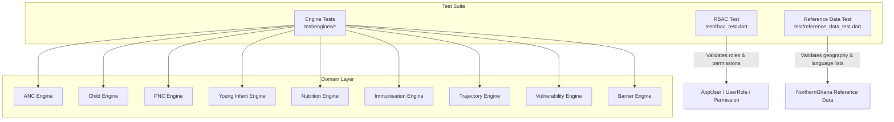
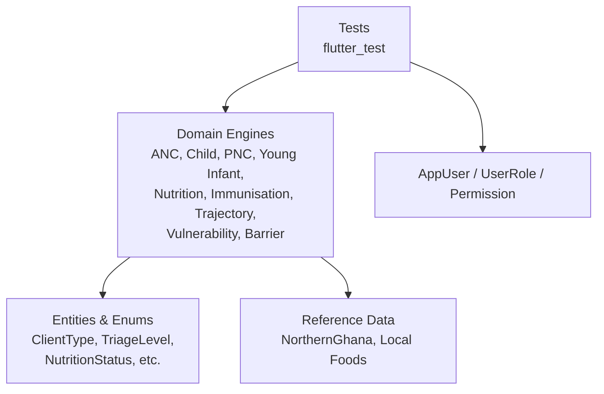
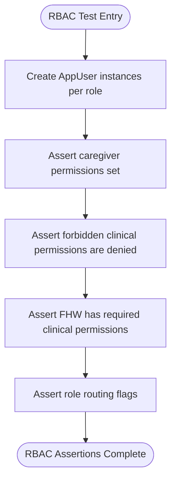
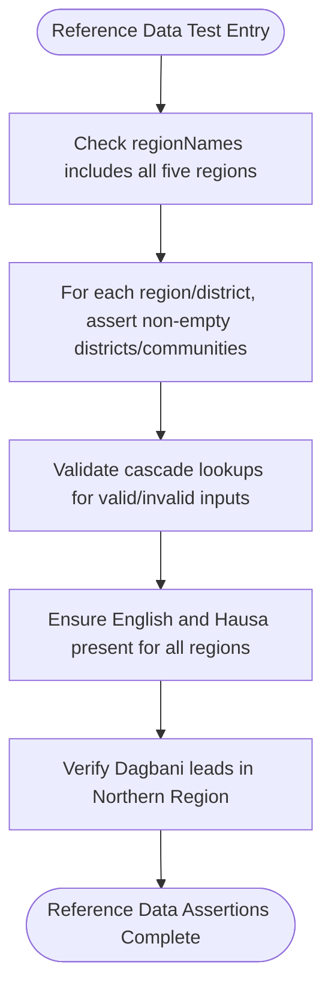
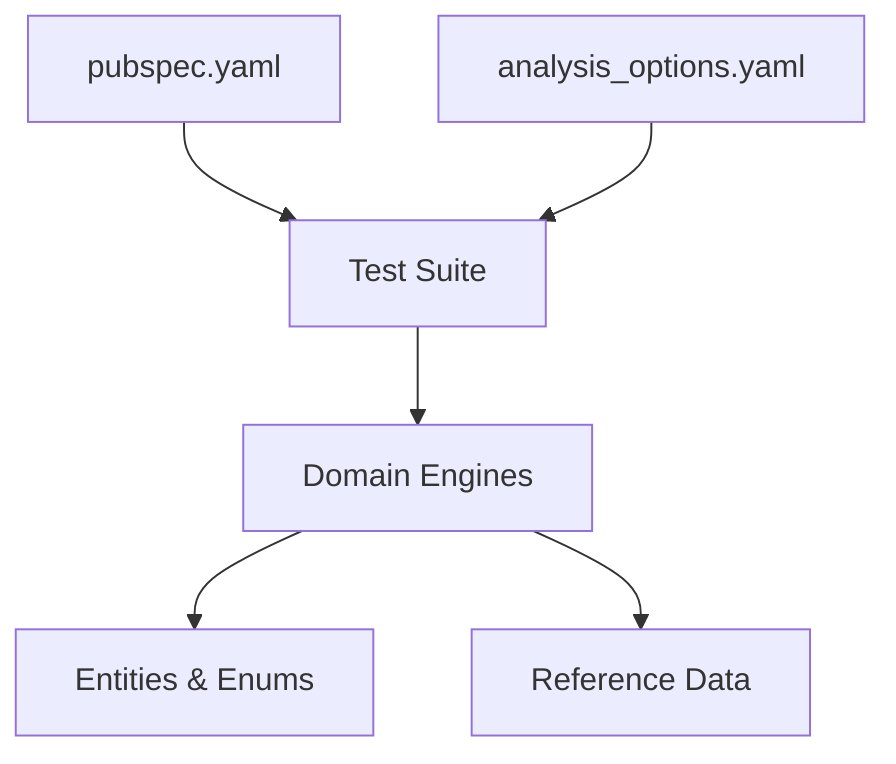

# Testing Strategy

<cite>
**Referenced Files in This Document**
- [pubspec.yaml](file://pubspec.yaml)
- [analysis_options.yaml](file://analysis_options.yaml)
- [README.md](file://README.md)
- [anc_engine_test.dart](file://test/engines/anc_engine_test.dart)
- [barrier_engine_test.dart](file://test/engines/barrier_engine_test.dart)
- [child_engine_test.dart](file://test/engines/child_engine_test.dart)
- [immunisation_engine_test.dart](file://test/engines/immunisation_engine_test.dart)
- [nutrition_engine_test.dart](file://test/engines/nutrition_engine_test.dart)
- [pnc_engine_test.dart](file://test/engines/pnc_engine_test.dart)
- [trajectory_engine_test.dart](file://test/engines/trajectory_engine_test.dart)
- [vulnerability_engine_test.dart](file://test/engines/vulnerability_engine_test.dart)
- [young_infant_engine_test.dart](file://test/engines/young_infant_engine_test.dart)
- [rbac_test.dart](file://test/rbac_test.dart)
- [reference_data_test.dart](file://test/reference_data_test.dart)
</cite>

## Table of Contents
1. Introduction
2. Project Structure
3. Core Components
4. Architecture Overview
5. Detailed Component Analysis
6. Dependency Analysis
7. Performance Considerations
8. Troubleshooting Guide
9. Conclusion

## Introduction
This document describes CareBridge AI’s multi-layered testing strategy with a focus on unit tests for clinical engines, business logic validation, role-based access control (RBAC), and reference data integrity. It also outlines integration testing approaches for database operations and synchronization, UI and accessibility testing strategies, test data management, mocking practices, continuous integration setup, performance testing, memory profiling, and debugging techniques tailored to mobile applications.

The project is a Flutter application built for offline-first operation with local storage and device capabilities. The existing test suite concentrates on deterministic, safety-critical domain logic implemented as pure or side-effect-free functions within the domain layer.

**Section sources**
- [README.md:1-18](file://README.md#L1-L18)
- [pubspec.yaml:1-67](file://pubspec.yaml#L1-L67)

## Project Structure
CareBridge AI organizes tests under the test directory with a clear separation:
- Engine tests under test/engines validate clinical algorithms and decision rules.
- Cross-cutting concerns such as RBAC and reference data are tested at the root of test/.



**Diagram sources**
- [anc_engine_test.dart:1-122](file://test/engines/anc_engine_test.dart#L1-L122)
- [child_engine_test.dart:1-184](file://test/engines/child_engine_test.dart#L1-L184)
- [pnc_engine_test.dart:1-109](file://test/engines/pnc_engine_test.dart#L1-L109)
- [young_infant_engine_test.dart:1-115](file://test/engines/young_infant_engine_test.dart#L1-L115)
- [nutrition_engine_test.dart:1-152](file://test/engines/nutrition_engine_test.dart#L1-L152)
- [immunisation_engine_test.dart:1-72](file://test/engines/immunisation_engine_test.dart#L1-L72)
- [trajectory_engine_test.dart:1-98](file://test/engines/trajectory_engine_test.dart#L1-L98)
- [vulnerability_engine_test.dart:1-108](file://test/engines/vulnerability_engine_test.dart#L1-L108)
- [barrier_engine_test.dart:1-91](file://test/engines/barrier_engine_test.dart#L1-L91)
- [rbac_test.dart:1-91](file://test/rbac_test.dart#L1-L91)
- [reference_data_test.dart:1-59](file://test/reference_data_test.dart#L1-L59)

**Section sources**
- [pubspec.yaml:56-67](file://pubspec.yaml#L56-L67)
- [analysis_options.yaml:1-29](file://analysis_options.yaml#L1-L29)

## Core Components
The core of the test suite focuses on deterministic clinical engines that implement protocol-driven triage, classification, and care pathways. Each engine exposes a static assessment or planning function that takes strongly-typed inputs and returns structured results including triage level, findings, confidence, and actions.

Key patterns observed across engine tests:
- Deterministic assertions on triage levels and referral decisions.
- Explicit coverage of danger signs and escalation thresholds.
- Validation of missing data handling and confidence degradation.
- Verification of actionable outputs (findings, suggestions, plans).
- Boundary conditions for age bands, thresholds, and seasonal filters.

Examples of engine-specific validations:
- ANC: urgent referral for convulsions, severe hypertension, third-trimester bleeding; non-urgent for straightforward second-trimester pregnancy.
- Child: age-banded fast-breathing thresholds; MUAC-driven nutrition pathway; dysentery and meningitis escalation.
- Nutrition: SAM requires therapeutic food; MAM gets supplementary feeding; preventive counselling for adequate nutrition; season-aware advice.
- Immunisation: Ghana EPI schedule adherence; age-barred vaccines; overdue detection.
- Trajectory: trend detection from serial measurements; falling MUAC flagged even if individual points are acceptable.
- Vulnerability: household risk scoring; open urgent referrals dominate ranking; modifiable factors surfaced.
- Barrier: pattern detection across households; forecast feasibility considering past barriers and season.
- Young Infant: pink-row rule enforcement; fast breathing and inability to feed escalate urgently.

These tests pin safety-critical behavior and ensure protocol compliance.

**Section sources**
- [anc_engine_test.dart:15-120](file://test/engines/anc_engine_test.dart#L15-L120)
- [child_engine_test.dart:14-182](file://test/engines/child_engine_test.dart#L14-L182)
- [nutrition_engine_test.dart:16-150](file://test/engines/nutrition_engine_test.dart#L16-L150)
- [immunisation_engine_test.dart:9-70](file://test/engines/immunisation_engine_test.dart#L9-L70)
- [trajectory_engine_test.dart:22-95](file://test/engines/trajectory_engine_test.dart#L22-L95)
- [vulnerability_engine_test.dart:14-106](file://test/engines/vulnerability_engine_test.dart#L14-L106)
- [barrier_engine_test.dart:19-89](file://test/engines/barrier_engine_test.dart#L19-L89)
- [young_infant_engine_test.dart:13-113](file://test/engines/young_infant_engine_test.dart#L13-L113)

## Architecture Overview
At a high level, tests exercise domain logic without UI or platform dependencies. The architecture separates:
- Domain engines (pure or minimal-side-effect functions)
- Entities and enums used by engines
- Reference data modules for geography and languages
- Presentation and infrastructure layers not included in these tests



[No diagram sources needed since this diagram shows conceptual relationships without mapping to specific source files]

## Detailed Component Analysis

### Clinical Engine Unit Testing
Each engine test validates protocol-aligned triage and care decisions using structured inputs and expectations on triage levels, findings, and actions.

```mermaid
classDiagram
class AncEngine {
+assess(input) Result
}
class ChildEngine {
+assess(input) Result
}
class PncEngine {
+assess(input) Result
}
class YoungInfantEngine {
+assess(input) Result
}
class NutritionEngine {
+plan(subject,status,month,ageMonths,...) Plan
}
class ImmunisationEngine {
+plan(ageInDays,givenLabels) Plan
}
class TrajectoryEngine {
+analyse(measurements) Analysis
}
class VulnerabilityEngine {
+score(input) Score
}
class BarrierEngine {
+detectPatterns(reports) Patterns
+forecast(previouslyReported,missedContactsCount,month) Forecast
}
AncEngine -->|"uses"| ClientType
ChildEngine -->|"uses"| TriageLevel
PncEngine -->|"uses"| DeliveryMode
NutritionEngine -->|"uses"| NutritionStatus
ImmunisationEngine -->|"uses"| GhanaEpi
TrajectoryEngine -->|"uses"| GrowthMeasurement
VulnerabilityEngine -->|"uses"| VulnerabilityInput
BarrierEngine -->|"uses"| CareBarrier
```

**Diagram sources**
- [anc_engine_test.dart:15-120](file://test/engines/anc_engine_test.dart#L15-L120)
- [child_engine_test.dart:14-182](file://test/engines/child_engine_test.dart#L14-L182)
- [pnc_engine_test.dart:10-108](file://test/engines/pnc_engine_test.dart#L10-L108)
- [young_infant_engine_test.dart:13-113](file://test/engines/young_infant_engine_test.dart#L13-L113)
- [nutrition_engine_test.dart:16-150](file://test/engines/nutrition_engine_test.dart#L16-L150)
- [immunisation_engine_test.dart:9-70](file://test/engines/immunisation_engine_test.dart#L9-L70)
- [trajectory_engine_test.dart:22-95](file://test/engines/trajectory_engine_test.dart#L22-L95)
- [vulnerability_engine_test.dart:14-106](file://test/engines/vulnerability_engine_test.dart#L14-L106)
- [barrier_engine_test.dart:19-89](file://test/engines/barrier_engine_test.dart#L19-L89)

**Section sources**
- [anc_engine_test.dart:15-120](file://test/engines/anc_engine_test.dart#L15-L120)
- [child_engine_test.dart:14-182](file://test/engines/child_engine_test.dart#L14-L182)
- [pnc_engine_test.dart:10-108](file://test/engines/pnc_engine_test.dart#L10-L108)
- [young_infant_engine_test.dart:13-113](file://test/engines/young_infant_engine_test.dart#L13-L113)
- [nutrition_engine_test.dart:16-150](file://test/engines/nutrition_engine_test.dart#L16-L150)
- [immunisation_engine_test.dart:9-70](file://test/engines/immunisation_engine_test.dart#L9-L70)
- [trajectory_engine_test.dart:22-95](file://test/engines/trajectory_engine_test.dart#L22-L95)
- [vulnerability_engine_test.dart:14-106](file://test/engines/vulnerability_engine_test.dart#L14-L106)
- [barrier_engine_test.dart:19-89](file://test/engines/barrier_engine_test.dart#L19-L89)

### Business Logic Validation: RBAC
RBAC tests enforce strict permission boundaries between caregiver and frontline health worker roles. They assert:
- Caregiver permissions are limited to family-scoped capabilities and never include clinical write access.
- Frontline health workers have full clinical scope but do not hold the caregiver-only family scope flag.
- Role routing flags are correct per role.



**Diagram sources**
- [rbac_test.dart:10-90](file://test/rbac_test.dart#L10-L90)

**Section sources**
- [rbac_test.dart:21-90](file://test/rbac_test.dart#L21-L90)

### Reference Data Integrity
Reference data tests validate Northern Ghana administrative geography and language lists:
- Coverage of five northern regions.
- Every region has districts; every district has communities.
- Cascade lookups behave correctly for valid and invalid inputs.
- Language lists always include English and Hausa; Dagbani leads in Northern Region.



**Diagram sources**
- [reference_data_test.dart:9-58](file://test/reference_data_test.dart#L9-L58)

**Section sources**
- [reference_data_test.dart:9-58](file://test/reference_data_test.dart#L9-L58)

### Integration Testing Strategy
While current tests focus on domain logic, integration tests should cover:
- Database operations using sqflite: schema migrations, CRUD correctness, transactional integrity, and offline persistence.
- Sync functionality: conflict resolution, idempotency, partial sync, and network error handling.
- Cross-layer scenarios: presentation to domain to data layers, ensuring state consistency and error propagation.

Recommended approach:
- Use flutter_test and mockito/isolates where appropriate to isolate external dependencies.
- Employ in-memory SQLite databases for deterministic integration tests.
- Simulate connectivity states via connectivity_plus mocks.
- Validate data transformations and caching behaviors.

[No section sources needed since this section provides general guidance]

### UI and Accessibility Testing Strategy
UI tests should verify user flows and accessibility:
- Widget tests for critical screens: intake forms, triage results, referral flows.
- Golden tests for visual regression on key screens.
- Accessibility checks: semantic labels, contrast ratios, keyboard navigation, screen reader compatibility.
- Localization tests: ensure strings render correctly in supported languages.

Recommended approach:
- Use flutter_driver/integration_test for end-to-end flows.
- Leverage accessibility tools and automated checks.
- Mock platform channels and services to keep tests deterministic.

[No section sources needed since this section provides general guidance]

### Test Data Management and Mocking Strategies
- Engine tests use structured input objects and expect deterministic outputs.
- For integration tests, seed deterministic datasets for users, households, visits, and measurements.
- Mock external services (storage, connectivity, secure storage) to avoid flakiness.
- Use fixtures for common scenarios (e.g., SAM child, postpartum hemorrhage, immunisation schedules).

[No section sources needed since this section provides general guidance]

### Continuous Integration Setup
- Add CI steps to run flutter analyze, unit tests, widget tests, and integration tests.
- Cache dependencies to speed up builds.
- Publish test reports and code coverage metrics.
- Enforce linting and formatting checks via analysis_options.yaml.

[No section sources needed since this section provides general guidance]

## Dependency Analysis
The test suite depends on Flutter testing SDK and domain modules. Dev dependencies include flutter_test, flutter_lints, and test.



**Diagram sources**
- [pubspec.yaml:56-67](file://pubspec.yaml#L56-L67)
- [analysis_options.yaml:1-29](file://analysis_options.yaml#L1-L29)

**Section sources**
- [pubspec.yaml:56-67](file://pubspec.yaml#L56-L67)
- [analysis_options.yaml:1-29](file://analysis_options.yaml#L1-L29)

## Performance Considerations
- Engine tests are lightweight and deterministic; they validate algorithmic correctness rather than performance.
- For performance testing, consider:
  - Benchmarking trajectory calculations over large measurement series.
  - Profiling memory usage during long-running assessments and sync operations.
  - Measuring cold start times and UI responsiveness under load.
- Use Dart Observatory and Flutter DevTools for profiling and debugging.

[No section sources needed since this section provides general guidance]

## Troubleshooting Guide
Common issues and resolutions:
- Flaky tests due to time-sensitive logic: use fixed clocks or deterministic timestamps in tests.
- Missing data assertions failing: ensure inputs declare missing fields explicitly and confidence reflects uncertainty.
- RBAC failures: verify permission sets and role flags match expected boundaries.
- Reference data mismatches: confirm geographic and language lists are updated consistently.

Debugging techniques:
- Print intermediate results in isolated test contexts.
- Use golden tests to detect unintended UI changes.
- Inspect logs from storage and connectivity layers in integration tests.

[No section sources needed since this section provides general guidance]

## Conclusion
CareBridge AI’s test suite centers on rigorous unit testing of clinical engines and business logic, ensuring protocol compliance and safety-critical behavior. RBAC and reference data tests reinforce governance and localization integrity. Extending the suite with integration, UI, accessibility, performance, and CI tests will provide comprehensive coverage across the application stack while maintaining determinism and reliability.

[No section sources needed since this section summarizes without analyzing specific files]